# 058：Python数据分析 第3课 - 组合图表 📊

## 概述

在本节课中，我们将要学习如何将多个图表组合在一起，无论是叠加在同一坐标系中还是并排展示。我们将探索如何结合使用 Seaborn 和 Matplotlib 来创建互补的图表组合，例如在直方图上叠加地毯图，或在箱线图上叠加带状图，以及如何在同一坐标系中叠加多个直方图以比较分布。

---

## 导入模块与数据准备

首先，在一个新的笔记本中导入必要的模块：Pandas、Matplotlib、Seaborn 和 NumPy。

```python
import pandas as pd
import matplotlib.pyplot as plt
import seaborn as sns
import numpy as np
```

上一节我们介绍了如何创建美观的可视化图表，本节中我们来看看如何将它们组合起来。

---

## 叠加互补图表：直方图与地毯图


回想一下之前创建的展示贷款金额特征分布的直方图。直方图的一个局限性在于它聚合了箱内的数据，因此我们无法看到单个数据点的具体值。

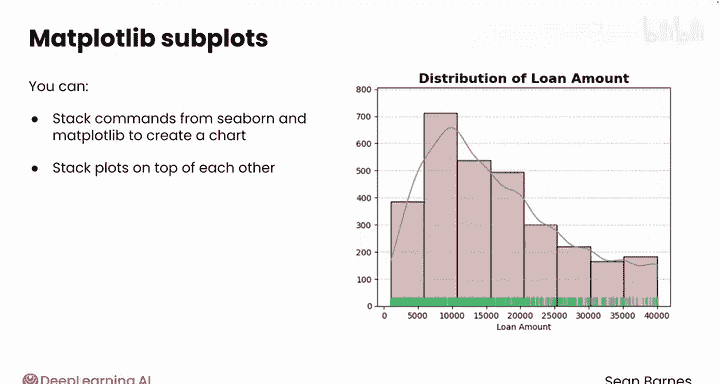

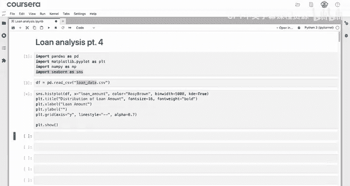

直方图是一种聚合图，它与一种能展示所有单个数据点的非聚合图互补性很好。地毯图就是这样一个选项。

以下是创建叠加了地毯图的直方图的步骤：

1.  首先，使用 Seaborn 的 `histplot` 函数创建基础直方图。
2.  然后，在同一个坐标系中，使用 Seaborn 的 `rugplot` 函数叠加地毯图。地毯图会在指定的轴（通常是直方图底部）上显示所有单个数据点。

这样，你就能同时获得分布的整体形状和单个数据点位置的信息。

```python
# 假设 df 是你的数据框，其中包含 ‘loan_amount’ 列
sns.histplot(data=df, x='loan_amount')
sns.rugplot(data=df, x='loan_amount')
plt.show()
```

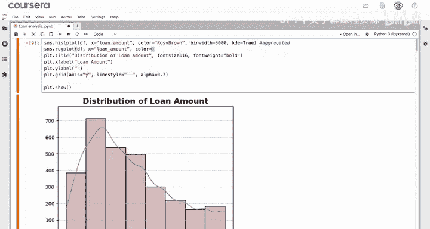


你可以为地毯图的数据点指定颜色。如果不确定哪种颜色与直方图颜色搭配更协调，可以尝试向大型语言模型寻求建议。例如，它可能会建议使用“中海绿色”。


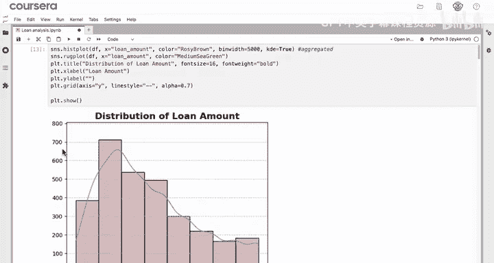

```python
sns.histplot(data=df, x='loan_amount')
sns.rugplot(data=df, x='loan_amount', color='mediumseagreen')
plt.show()
```


---

## 另一种组合：箱线图与带状图

类似的效果也可以用于箱线图，方法是结合使用带状图。

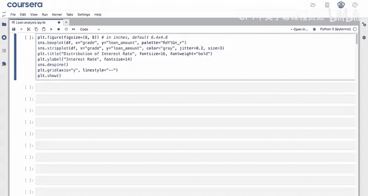

以下是使用之前视频中按贷款等级分段的贷款金额箱线图的一个简要示例。不同的点代表单个数值，就像地毯图中的刻度线一样。

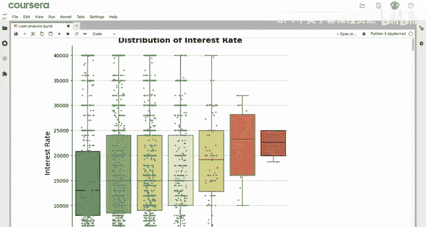

这种组合图让你在观察聚合的箱线图时，也能看到单个数据点的分布情况。例如，从下图中可以明显看出，A到D等级的数据观测值更多，而E到G等级的观测值较少。

```python
# 假设已有一个按‘grade’分组的箱线图
sns.boxplot(data=df, x='grade', y='loan_amount')
sns.stripplot(data=df, x='grade', y='loan_amount', color='black', alpha=0.5)
plt.show()
```


---

## 在同一坐标系中叠加多个分布

你可以将许多不同类型的图表叠加在一起。例如，你可能希望在同一坐标系中绘制多个直方图来比较分布。

假设你想比较A等级和D等级贷款的金额分布。

以下是具体步骤：

1.  首先，将数据过滤成两个独立的数据框。
2.  然后，重复使用直方图代码，为第一个数据框（A等级）创建直方图。
3.  接着，叠加第二个直方图，这次使用第二个数据框（D等级）。你可以保持所有参数相同，但为了区分，可以将第二个直方图的颜色改为默认的蓝色。

```python
# 过滤数据
df_A = df[df['grade'] == 'A']
df_D = df[df['grade'] == 'D']

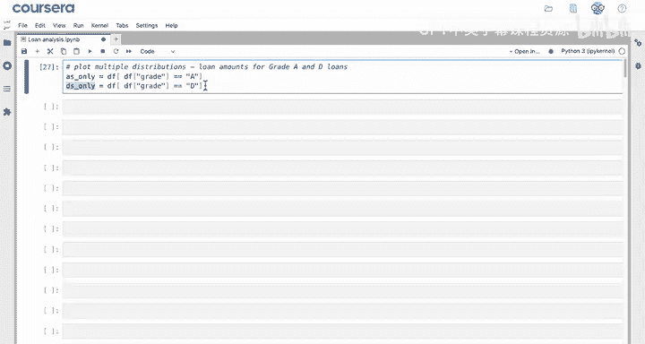

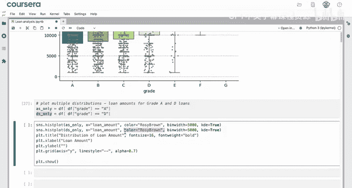

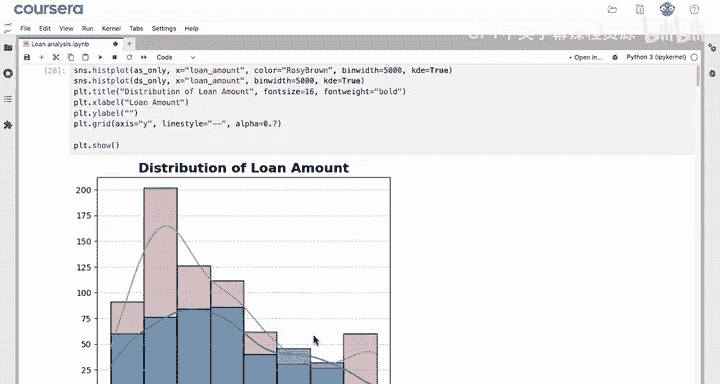

# 叠加绘制两个直方图
sns.histplot(data=df_A, x='loan_amount', color='orange', label='Grade A')
sns.histplot(data=df_D, x='loan_amount', color='blue', alpha=0.5, label='Grade D')
plt.legend()
plt.show()
```

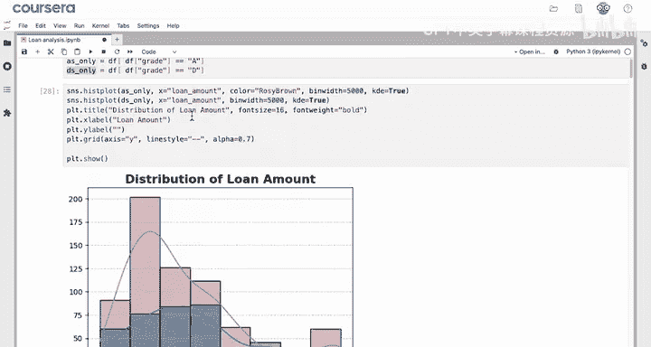


通过观察叠加后的图表，可以看出D级贷款的分布偏斜程度较小。并且，在大部分区间内，A级贷款似乎更常见，只有在20,000到30,000的少数几个箱中，D级贷款的数量超过了A级。

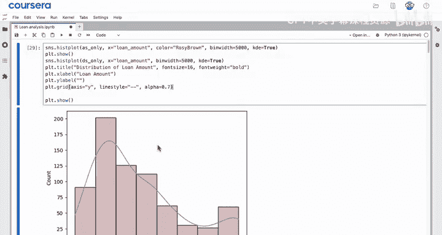

> **注意**：在叠加多个图表时，需要注意坐标轴范围、标题、标签等设置的一致性，否则可能会使图表难以比较。例如，如果两个直方图的Y轴范围不同，比较就会变得困难。

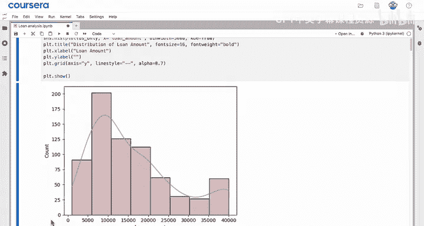

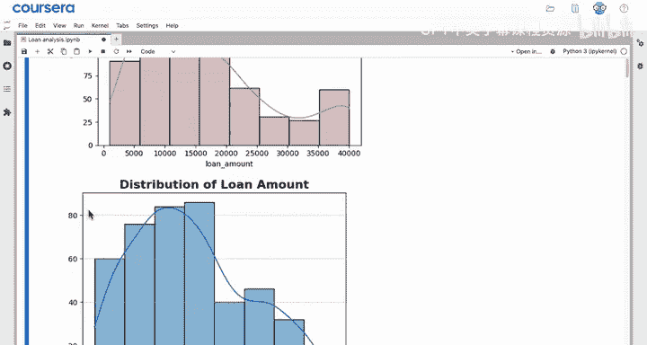

---

## 总结

本节课中我们一起学习了组合图表的技术。

你看到了如何创建地毯图并将其叠加到现有的直方图上。地毯图是一种非聚合图，它能让你洞察单个数值在直方图所展示的聚合分布中的具体位置。

你也学习了如何将带状图与箱线图结合以达到类似的效果。

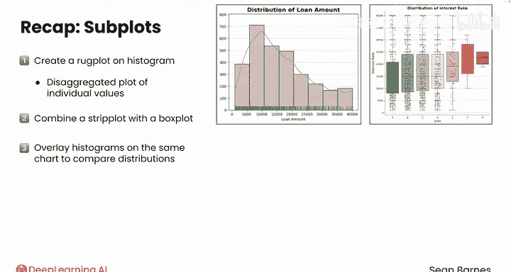

最后，你学会了如何在同一图表上叠加多个直方图以比较不同的分布。这种叠加效果只需在同一图形中创建两个图表即可实现。

你可以使用 Seaborn 和 Matplotlib 将两个、三个甚至更多图表叠加在一起，但要注意保持克制，避免让观众感到信息过载。

在下一个视频中，你将学习如何将许多单独的图表组合到同一个图形或图像中。