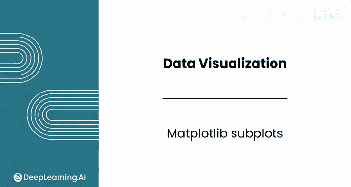
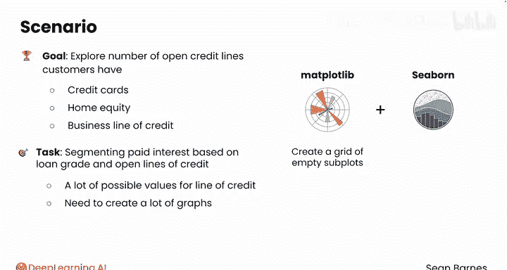
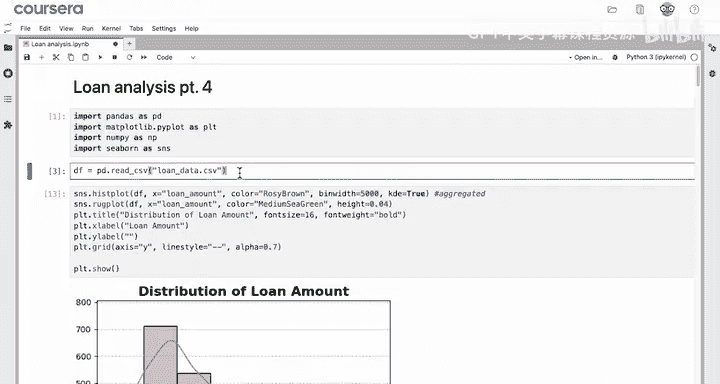
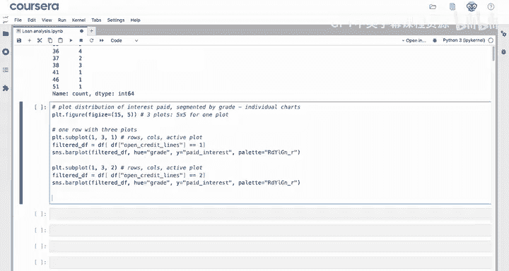
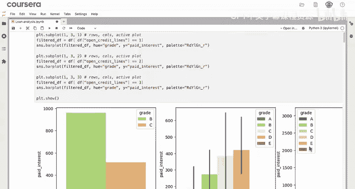
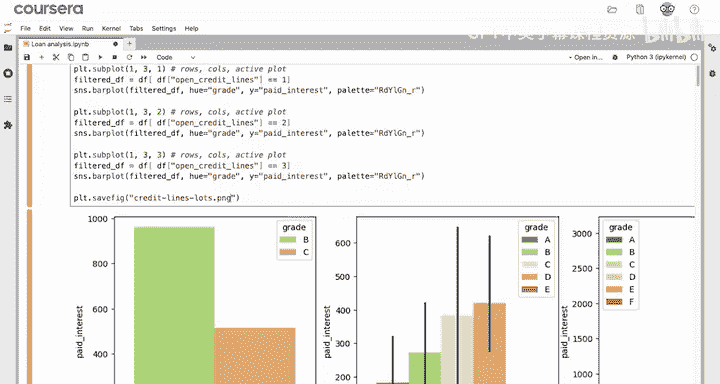
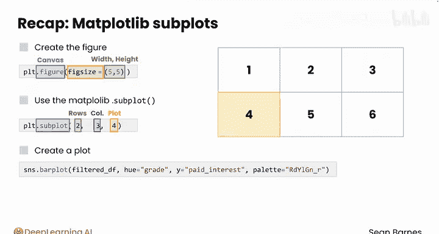

# 059：Matplotlib子图 📊



在本节课中，我们将要学习如何使用Matplotlib库创建子图。当单个图表不足以展示数据时，子图功能允许我们在一个图像中并排排列多个图表，这对于按不同特征（例如，客户拥有的不同信贷额度数量）进行数据分段分析非常有用。

---

## 概述

通常，一个图表并不够用。例如，当你需要根据一个具有多个可能值的特征进行数据分段时，你可能希望为每个值创建单独的图表。为了实现这一点，你可以使用Matplotlib的`subplot`函数。它非常快速且灵活。

为了更好地理解潜在客户群中不同分段的盈利能力，你正在研究客户拥有的未结信贷额度数量。信贷额度允许你在一定限额内反复借款。信用卡是最常见的信贷额度类型，但其他类型包括房屋净值信贷额度或商业信贷额度。你感兴趣的是根据贷款等级和未结信贷额度来分段分析已支付的利息。

关键在于，信贷额度有许多不同的可能值。因此，你需要创建大量图表。你将希望结合Matplotlib和Seaborn的优势来完成此操作。首先，你需要使用Matplotlib创建一个空的子图网格，然后用美观的Seaborn图表填充它。

回顾一下，你已经导入了模块并将数据加载到`df`变量中。现在，让我们查看一下“未结信贷额度”这一特征。直观地看一下它的分布情况。

尽管这个特征是数值型的，你仍然可以使用`value_counts`方法来理解不同值的频率。运行此代码单元后，你会发现存在许多不同的可能值。



记住，你可以使用`sort_index`方法将这些值从1排序到最大值。结果显示，大多数客户拥有5到15条信贷额度。



现在，你可以在每个单独的图表中，按等级分段绘制已支付利息的分布情况。为了在一个图像中创建多个图表，你可以使用Matplotlib的`subplot`函数。

---

## 创建子图网格

首先，手动设置图形大小。图形就像画布，你需要确保画布足够大，能够绘制所有这些单独的图表。

假设你想创建三个图表，分别对应前三个信贷额度数量。你希望如何排列它们？一种选择是一行三个图表。

从`plt.figure()`开始。然后，你需要指定`figsize`参数，即图形的高度和宽度。记住，这些值的单位是英寸。对于一个图表，通常`5x5`英寸是一个不错的尺寸，你可以根据需要调整。由于你只有一行，宽度可以是15英寸（即3个图表乘以5英寸），高度保持为5英寸。

接下来，你将使用`plt.subplot()`函数，它接受三个参数：行数、列数以及你当前正在创建的图表序号。这里只有一行，三列，并且你正在创建第一个图表。

现在，你可以过滤你的数据框。例如，过滤出`df[‘open_credit_lines’] == 1`的数据。然后，你可以使用这个过滤后的数据框作为第一个参数来创建Seaborn条形图。记住，总是从数据框开始。设置`x=‘grade’`，`y=‘paid_interest’`，对于调色板，你可以使用之前用过的`‘red_yellow_green’`反转色板来映射到不同的等级。

你可以复制这段代码，并基本上重复相同的操作。你只需要改变两处：你现在正在创建第二个子图，并且需要将过滤条件改为`df[‘open_credit_lines’] == 2`。再次复制代码，现在创建第三个图表，对应`df[‘open_credit_lines’] == 3`。

运行此代码单元，你将得到这三个并排排列的条形图，它们都在同一个图形中。

如果你想将它们一起保存，可以使用`plt.savefig(‘credit_lines_plots.png’)`。现在，你实际上已经将这三个图表放在了同一个图形中，这非常方便。

---

## 核心概念与代码

以下是创建子图的核心步骤和代码示例：

1.  **导入必要的库并加载数据**：
    ```python
    import matplotlib.pyplot as plt
    import seaborn as sns
    import pandas as pd

    # 假设df是你的数据框
    df = pd.read_csv(‘your_data.csv’)
    ```





2.  **设置图形（画布）大小**：
    ```python
    plt.figure(figsize=(15, 5))  # 宽度15英寸，高度5英寸
    ```



3.  **创建第一个子图并绘图**：
    ```python
    plt.subplot(1, 3, 1)  # 1行，3列，第1个图
    filtered_df = df[df[‘open_credit_lines’] == 1]
    sns.barplot(data=filtered_df, x=‘grade’, y=‘paid_interest’, palette=‘red_yellow_green_r’)
    ```

4.  **创建第二个子图**：
    ```python
    plt.subplot(1, 3, 2)  # 1行，3列，第2个图
    filtered_df = df[df[‘open_credit_lines’] == 2]
    sns.barplot(data=filtered_df, x=‘grade’, y=‘paid_interest’, palette=‘red_yellow_green_r’)
    ```

5.  **创建第三个子图并保存图形**：
    ```python
    plt.subplot(1, 3, 3)  # 1行，3列，第3个图
    filtered_df = df[df[‘open_credit_lines’] == 3]
    sns.barplot(data=filtered_df, x=‘grade’, y=‘paid_interest’, palette=‘red_yellow_green_r’)

    plt.savefig(‘credit_lines_plots.png’)
    plt.show()
    ```

---

## 总结与进阶

回顾一下，当你想要在一个图形中组合多个图表，尤其是这些图表相似时，子图非常有用。你需要使用`figsize`参数显式创建作为画布的图形，指定整个图形的宽度和高度。你看到每个图表大约`5x5`英寸效果很好，但也可以尝试其他尺寸。

然后，你了解到需要使用带有三个参数的Matplotlib `subplot`函数：行数、列数和当前正在创建的图表序号。在创建图表之前调用此函数，会将其定位在图像中的正确位置。例如，`plt.subplot(2, 3, 4)`会将下一个图表定位为第二行的第一个图表（假设每行有三个图表）。

调用`plt.subplot`函数后，你可以像往常一样创建图表。你可以结合使用Seaborn和Matplotlib的函数。请注意，还有一个单独的`subplots`（复数）函数，它提供了更多创建子图的选项。如果你愿意，可以通过你的LLM（大语言模型）来研究那个函数。

你可能已经注意到本视频演示中的一些重复代码。子图可以像你刚才看到的那样单独创建，但当与循环结合使用时，它们会更加强大。在下一个视频中，跟随我看看如何用几行代码创建数十个图表。



---

本节课中，我们一起学习了Matplotlib子图的创建方法，包括如何设置图形大小、使用`subplot`函数定位图表，以及结合Seaborn绘制美观的分段分析图。这为高效地进行多维度数据可视化提供了强大的工具。