# 060：Python数据分析 第3课 - 使用循环绘制子图 📊

## 概述

在本节课中，我们将学习如何使用循环来高效地创建多个子图。通过将重复的绘图代码转换为循环结构，可以显著减少代码量，提高效率，并使代码更易于维护。我们将从手动创建三个子图开始，逐步将其重构为使用`for`循环，并最终扩展至创建九个子图。

---

## 从手动绘图到循环

与Python中的大多数任务一样，创建子图有多种方法。Matplotlib允许你编写循环来快速生成数十个子图，这可以节省大量复制粘贴代码的时间。

承接之前的内容，假设你已经将数据读入变量`Df`，并基于信用等级和已开通信用额度线，手动创建了三个用于展示已支付利息分布的子图。在创建这些图形时，你可能会注意到代码的重复。

如果你发现自己像这里一样复制粘贴代码，通常可以使用循环来替代。

让我们开始将这段代码转换为使用循环。首先，保持图形尺寸不变。

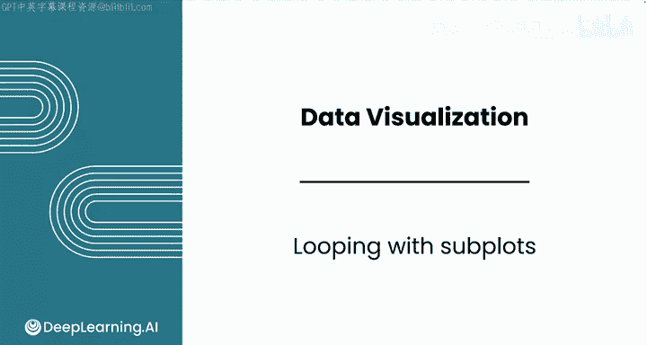

现在，你只需要一个循环来遍历数字1、2和3，这对应着你正在调查的信用额度线数量。

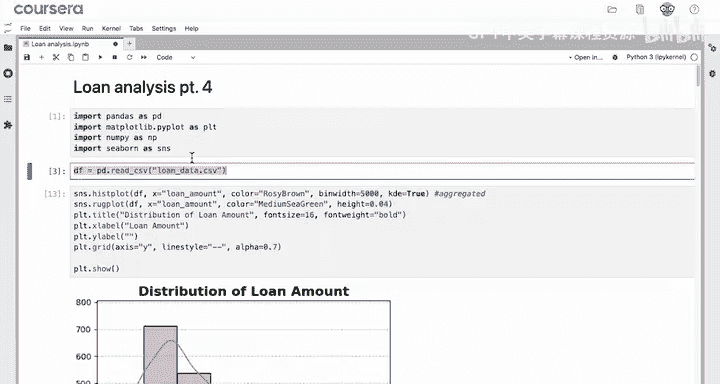

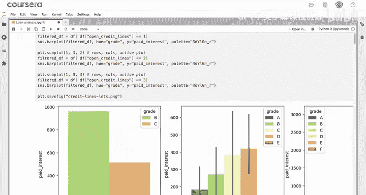

以下是初始的手动绘图代码示例：

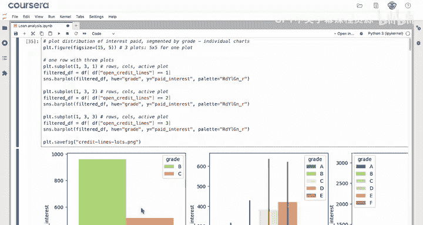

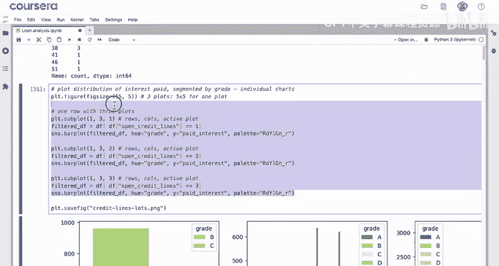

```python
# 假设的初始手动绘图代码（三个子图）
plt.figure(figsize=(15, 5))
plt.subplot(1, 3, 1)
# 绘制信用额度线为1的图表...
plt.subplot(1, 3, 2)
# 绘制信用额度线为2的图表...
plt.subplot(1, 3, 3)
# 绘制信用额度线为3的图表...
```

---

## 理解循环与`range`函数

你可以使用`range`函数来生成需要遍历的数字序列。`range`可以接受一个参数，即结束值，这将创建一个从0到该值（不包含）的范围。或者，你可以添加两个值：起始值和结束值。

需要记住的是，结束值不包含在范围内，范围只到`结束值 - 1`。

因此，你可以使用`range(1, 4)`来获取从1到3的范围。所以，循环可以写为：`for i in range(1, 4):`。

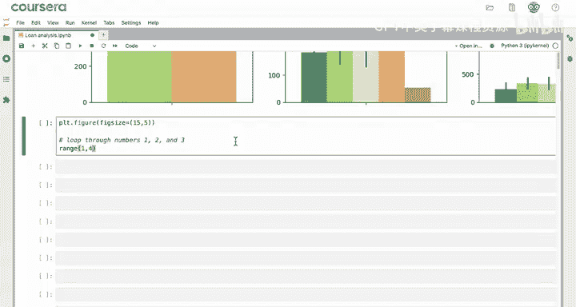

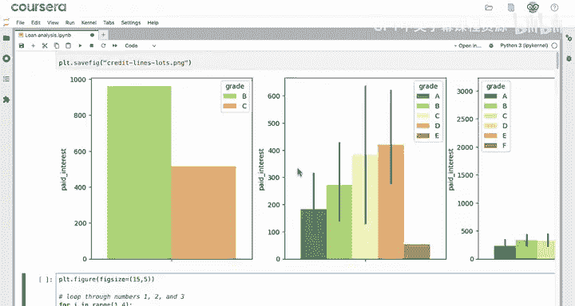

现在，回顾上一视频中的绘图代码，对于每个子图，哪些值发生了变化？

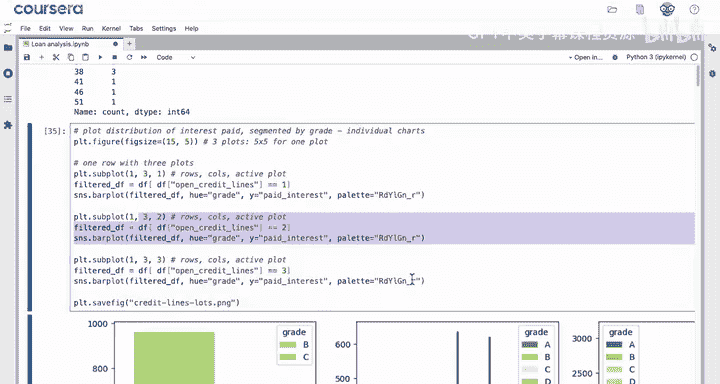

---

## 识别变化点并构建循环

变化的只有两个值：你正在创建的子图索引，以及用于筛选数据的“已开通信用额度线”的数值。

因此，在循环内部，你可以复制绘图代码，并在任何该值发生变化的地方，用循环变量`i`来替代。

以下是转换后的循环代码示例：

```python
plt.figure(figsize=(15, 5))
for i in range(1, 4):
    plt.subplot(1, 3, i)
    # 使用变量 i 筛选数据框，只包含信用额度线数为 i 的行
    # df_filtered = Df[Df['open_credit_lines'] == i]
    # 然后绘制条形图...
```

这段代码的运行逻辑是：`for`循环将为`i`等于1、2和3各运行一次。每次循环都会选择相应的子图位置，并筛选数据框以仅包含具有`i`条信用额度线的行，然后绘制出与之前完全相同的图形。

编写这段代码后，你应该看到什么？输出与之前完全相同，但你将代码从10行减少到了5行。

---

## 扩展循环以绘制更多子图

现在，你可以用这个循环绘制大量图表。它对任何有效的信用额度线数值都适用。

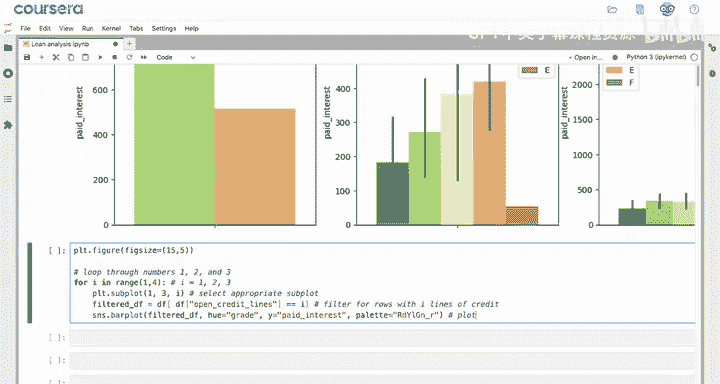

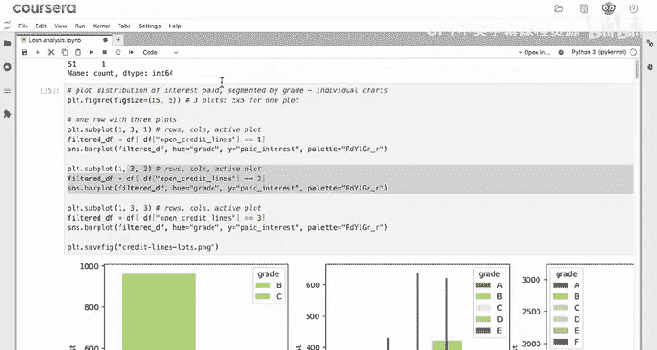

例如，你可能想绘制信用额度线从1到9的分布图。你需要确保图形尺寸更大，比如15x15以容纳9个子图。然后，复制粘贴之前的代码。

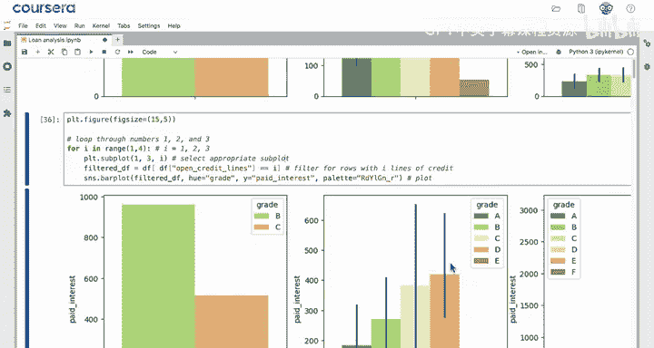

你需要改变什么？需要改变`i`的范围和子图的布局维度。

以下是绘制九个子图的代码调整：

```python
plt.figure(figsize=(15, 15))
for i in range(1, 10):
    plt.subplot(3, 3, i)  # 3行3列布局
    # 筛选和绘图代码...
```

`plt.subplot(3, 3, i)`这行代码给出了每行三个、每列三个的子图布局。运行这个单元格，你将得到这九个漂亮的图表。

---

## 增强循环功能

你还可以在循环中添加更多功能。例如，你可以使用`i`作为每个子图的标题，这增加了必要的标签。

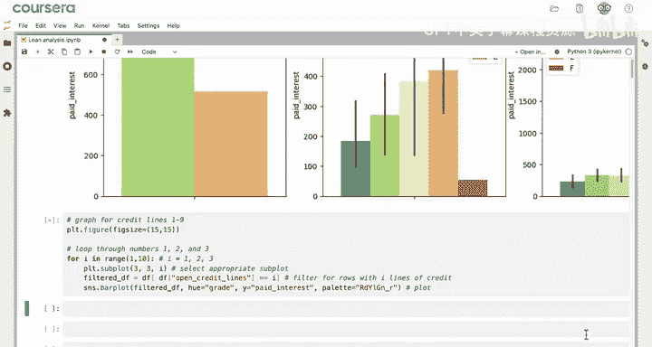

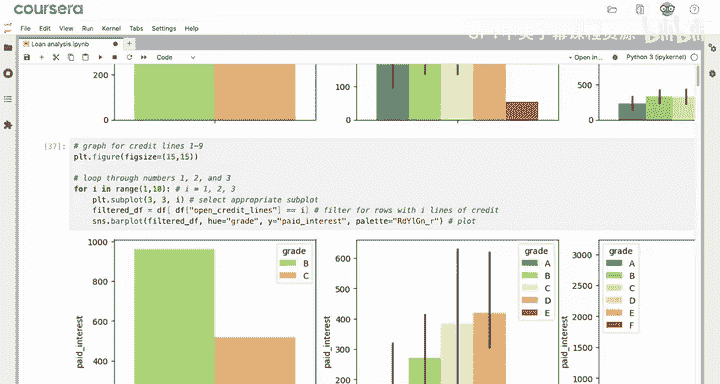

此外，如果你使用`plt.savefig()`，比如以“nine_graphs”为文件名，现在这九个图表就会被一起保存下来。

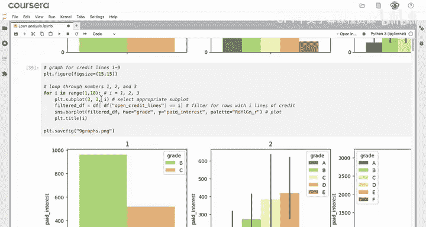

以下是增强后的代码示例：

```python
plt.figure(figsize=(15, 15))
for i in range(1, 10):
    plt.subplot(3, 3, i)
    # 筛选和绘图代码...
    plt.title(f‘Credit Lines: {i}’)  # 添加标题
plt.tight_layout()
plt.savefig(‘nine_graphs.png’)
```

---

## 总结

在本视频中，你学习了可以使用`for`循环来遍历和创建子图。你使用了一个从1开始、到感兴趣的最后数字加1结束的`range`循环。因此，你使用代码`range(1, 10)`绘制了信用额度线1到9的图表。

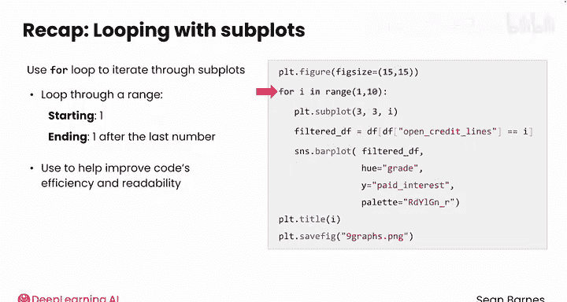

每当你注意到自己在复制粘贴代码时，这通常是一个信号，表明你可以使用像循环这样的控制结构来提高代码的效率和可读性。

Matplotlib的`subplot`函数对于一次性创建多个图形非常强大。在接下来的视频中，我们将学习Seaborn库中另一个用于创建组合图形的关键功能：`pairplot`。

---

**核心概念公式/代码总结：**
*   **循环结构：** `for i in range(start, end):`
*   **子图定位：** `plt.subplot(n_rows, n_cols, index)`
*   **数据筛选（示例）：** `df_filtered = df[df[‘column_name’] == i]`