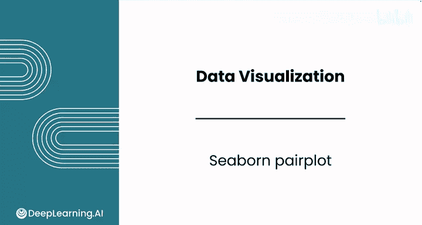
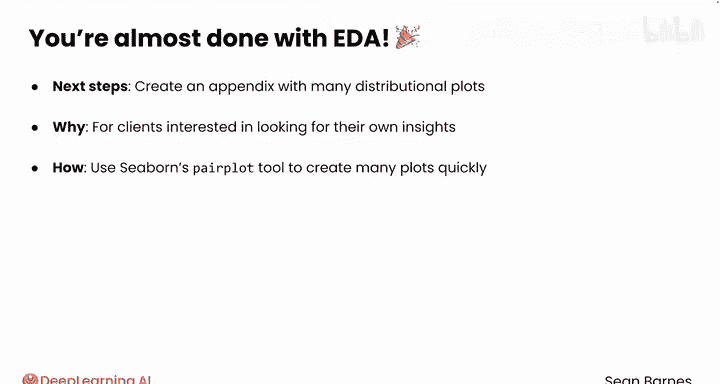
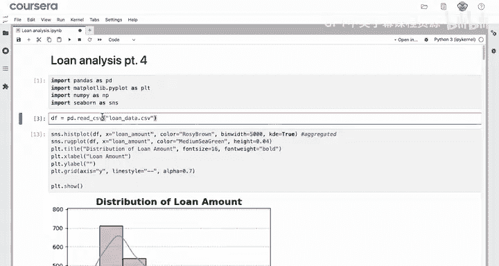
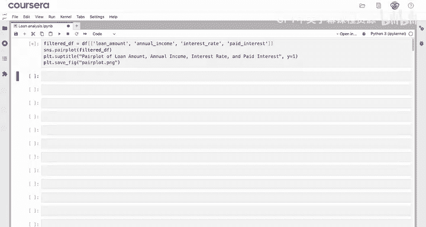
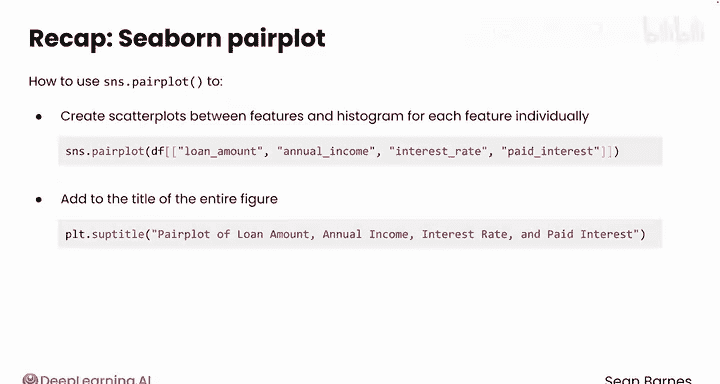

# 061：Python数据分析（第3课）｜Python for Data Analytics
## 课程编号：P61 - Seaborn配对图 📊

在本节课中，我们将要学习如何使用Seaborn库中的`pairplot`函数，来快速创建基于数据特征的多个图表，以探索特征间的关系。

---

### 探索性数据分析的收尾工作

上一节我们介绍了数据可视化的多种工具。本节中我们来看看如何为你的探索性数据分析创建一个附录，其中包含多个分布图，以便客户能自行寻找洞察。



你可以使用Seaborn的`pairplot`工具来快速创建大量图表。首先，需要导入必要的模块并将数据加载到变量中。





以下是导入模块和加载数据的示例代码：
```python
import seaborn as sns
import pandas as pd
import matplotlib.pyplot as plt

# 假设数据已加载到变量 df 中
# df = pd.read_csv('your_data.csv')
```

---

### 使用Seaborn的Pairplot

`pairplot`对于探索特征之间的关系非常有用。假设你想查看数据集中预测贷款盈利性的几个关键特征：贷款金额、年收入、利率和已付利息。

以下是操作步骤：
1.  首先，选择你感兴趣的列子集。
2.  然后，使用`sns.pairplot`函数，并传入筛选后的数据框。
3.  调用`plt.show()`，你将得到展示所有特征之间关系的散点图，以及对角线上每个特征的直方图。

例如，你之前见过贷款金额的直方图，现在你还可以看到它与年收入、利率和已付利息的关系。

---

### 为图表添加标题

你可以使用`plt.suptitle`为整个图形添加标题，而不仅仅是单个坐标轴。这是“supertitle”的简写。

例如，添加标题“贷款金额、年收入、利率和已付利息的配对图”。你可能需要使用`y`参数将这个总标题调整到比图中所有子图稍高的位置，值设为1或略高即可。

以下是添加总标题的代码示例：
```python
plt.suptitle('Pairplot of Loan Amount, Annual Income, Interest Rate, and Paid Interest', y=1.02)
```

---

### 自定义与保存图表



由于`pairplot`包含多种图表类型和多个子图，你无法像平常自定义单个图表那样（如颜色、线条样式等）进行统一设置。但你始终可以与你的LLM（大语言模型）协作，探索更多格式化选项。

为了完成你的探索并创建附录，你可以使用`plt.savefig`并指定文件名来保存图表。

以下是保存图表的代码示例：
```python
plt.savefig('Pairplot.png')
```
现在，你拥有了所有这些组合在一起的图表。



---

### 课程总结

本节课中我们一起学习了如何使用`sns.pairplot`在一个数据框上创建一组图表，包括特征间的散点图以及每个特征的单独直方图。我们还看到了使用`plt.suptitle`为整个图形添加标题的选项，并探讨了如何与LLM协作来自定义配对图的外观。

---

### Python可视化部分总结

至此，Python数据可视化部分的学习告一段落。你已经学会了创建美观且功能强大的可视化所需的所有核心工具，从Pandas到Matplotlib，再到Seaborn。这三个库构成了Python数据可视化的支柱，你很少需要寻找其他工具。

接下来，你将完成本模块的评分作业和实验。完成后，请跟随我进入本课程的下一模块，该模块将全部关于推断统计学，包括置信区间、假设检验和一种新技术——线性回归。期待在那里与你相见！