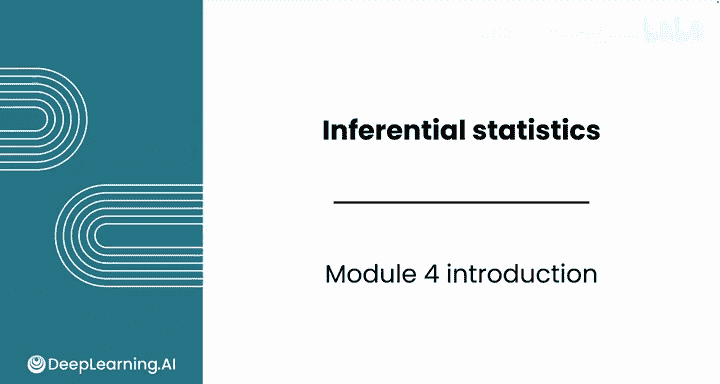
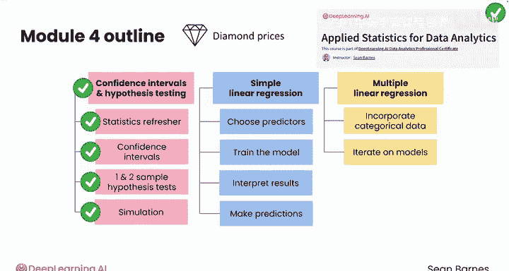

# 062：推断统计学简介 📊

在本课程中，我们将学习如何利用Python中的强大统计技术，从数据中做出预测并得出有意义的结论。我们将探索置信区间、假设检验以及线性回归等核心概念，最终目标是能够应用这些推断统计方法来分析数据并构建预测模型。

---

## 模块4：推断统计学

欢迎来到模块4：推断统计学。

在本模块中，你将学习如何利用Python中的强大统计技术，从数据中做出预测并得出有意义的结论。

---

## 第一课：置信区间与假设检验

上一节我们介绍了本模块的整体目标，本节中我们来看看第一课的具体内容。

在第一课中，你将使用一个真实的钻石数据集，探索均值的置信区间和假设检验。你将重温标准误差和P值的概念，并学习如何用一行代码计算置信区间。

以下是第一课你将进行的主要操作：
*   执行单样本和双样本假设检验。
*   探索从不同分布中模拟数千个数据点的技术。

---

## 第二课：简单线性回归

在掌握了假设检验之后，我们将进入第二课，学习一种强大的预测工具。

第二课的重点是简单线性回归。你将了解什么是线性回归，以及它为何对数据中的关系建模非常有用。

以下是第二课的核心学习目标：
*   学习如何为模型选择最强的预测因子。
*   训练模型、解释结果，并利用模型进行预测。

---

## 第三课：多元线性回归

上一节我们介绍了只有一个预测因子的简单线性回归，本节中我们将扩展建模能力，纳入多个特征。

在第三课中，你将通过纳入多个特征作为预测因子来扩展建模能力。你将学习如何将分类数据整合到模型中，以及如何迭代优化模型以提高准确性。

---

## 预备知识要求 😊

除了线性回归，如果你学习过《数据分析应用统计学》课程，那么你应该对本模块中的统计概念有所了解。

不记得每个术语和计算也没关系，但如果“置信区间”和“假设检验”这些术语对你来说是全新的，你应该确保在继续之前回头学习那门课程。

本模块将简要回顾该课程中涵盖的关键概念，但不会深入教授。

---

## 总结

本节课中，我们一起学习了推断统计学模块的总体框架。我们了解到，通过本模块的学习，你将能够掌握置信区间、假设检验以及简单和多元线性回归。最终，你将具备应用推断统计方法在Python中分析数据和构建预测模型的能力。