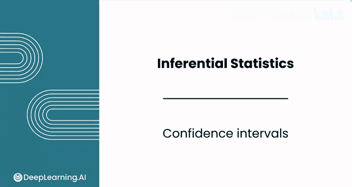
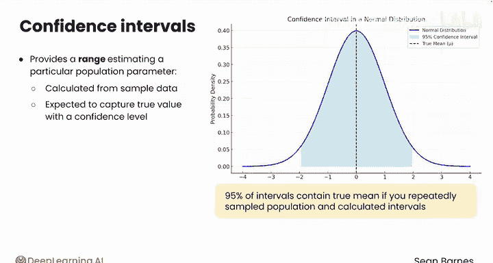
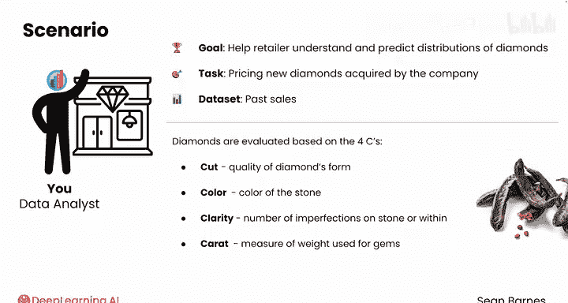
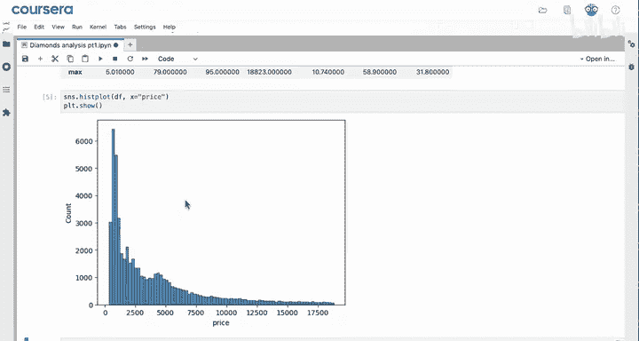
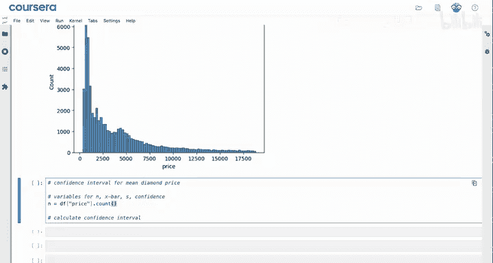
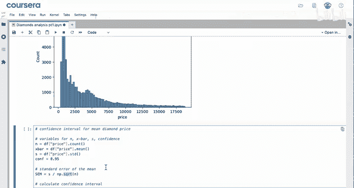
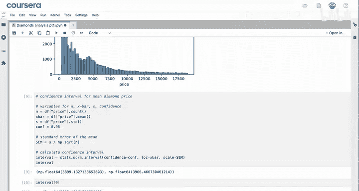
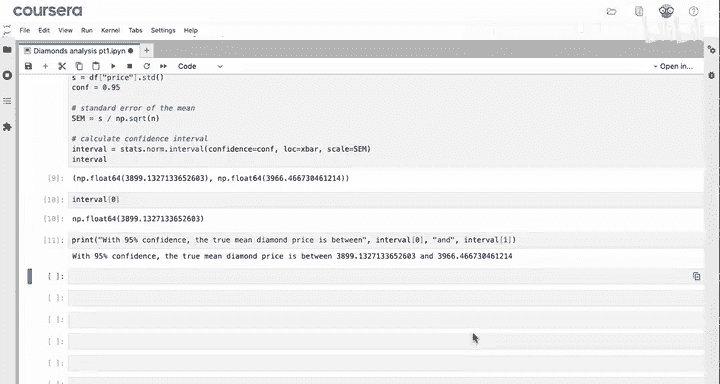
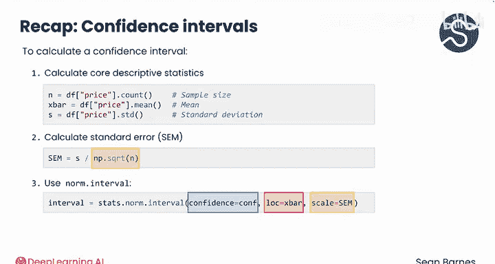

# 063：置信区间 📊

在本节课中，我们将要学习推断统计中的一个核心概念——置信区间。我们将了解其定义、计算所需的关键要素，并学习如何使用Python的`scipy`库来计算数据集的均值置信区间。

推断统计是数据分析师进行严谨分析的基础。置信区间提供了一个范围，用于估计特定的总体参数（如均值或比例）。该区间根据样本数据计算得出，并以一定的置信水平预期包含真实的总体值。

## 理解置信区间

上一节我们介绍了置信区间的基本概念，本节中我们来看看其具体含义。

置信区间是从样本数据计算出的一个范围，用于估计总体参数。例如，在95%的置信水平下，如果你重复多次从总体中抽样并计算置信区间，那么你预期有95%的区间会包含真实的总体均值。



计算置信区间需要四个关键值：
*   **样本统计量**：你感兴趣的统计量，例如样本均值。
*   **样本大小**：样本中包含的观测数量。
*   **样本标准差**：衡量样本数据的离散程度。
*   **置信水平**：例如0.95对应95%的置信区间。



样本标准差和样本大小用于计算**标准误**，它衡量的是样本统计量（如均值）的抽样变异性。

> **提示**：如果这些统计概念对你来说是新的，建议回顾之前的课程《数据分析应用统计》，该课程详细讲解了推断统计的细微差别。本模块仅对每个概念进行简要回顾。即使你对某些术语感到模糊也不必担心，我们将一起完成计算步骤。

## 项目实战：估算钻石价格 💎

假设你是一名在线珠宝零售商的数据分析师，任务是帮助公司为新收购的钻石定价。你将使用历史销售数据集来理解和预测钻石价格的分布。

钻石价格基于四个核心特征（4C标准）进行评估：
*   **切工**：指钻石的切割质量。切工良好的钻石对称且反光好，外观闪耀。
*   **颜色**：指钻石的颜色。钻石越清澈，颜色等级越高。偏黄的钻石价值较低。
*   **净度**：指钻石表面或内部的瑕疵数量。越清澈的钻石价值越高。
*   **克拉**：用于宝石的重量单位。一克拉的圆形钻石大约有一颗绿豆大小。“克拉”一词实际上来源于角豆树的种子，历史上曾用于称量宝石。

你的首要任务是估算客户（零售商）所售钻石的平均价格。

### 第一步：导入模块与加载数据

首先，导入所有需要的模块。`scipy`模块通常用于推断统计，它提供了`pandas`和`numpy`之外的功能。

```python
import pandas as pd
import numpy as np
import scipy.stats as stats
```

接着，加载存储在`diamonds.csv`文件中的数据。

```python
df = pd.read_csv('diamonds.csv')
```

> **注意**：这行代码仅在CSV文件与你的笔记本文件位于同一文件夹时才有效。本课程的实验环境中已配置好，你无需进行文件管理，但了解其工作原理是有益的。



查看数据的前几行和基本描述：

```python
df.head()
df.describe()
```

数据集中有近4000行数据，这是进行准确总体估计的绝佳数据量。钻石的平均价格约为4000美元，最大的钻石约5克拉（相当大），猜测那可能是价值18000美元的钻石。

### 第二步：数据可视化与观察

使用`seaborn`绘制价格分布直方图：

```python
import seaborn as sns
sns.histplot(df['price'])
```

价格分布是右偏的。这符合常理，更昂贵的钻石应该更稀有。请记住，即使总体分布是偏态的，**样本均值的抽样分布也预期是正态的**，因此在此处使用置信区间仍然是合适的。

### 第三步：计算置信区间

现在，开始计算钻石平均价格的置信区间。首先，声明计算所需的关键变量。





以下是计算步骤：
1.  **计算样本大小、样本均值和样本标准差**。
2.  **设定置信水平**为0.95（95%）。
3.  **计算标准误**，公式为：`样本标准差 / sqrt(样本大小)`。
4.  **使用`scipy.stats.norm.interval`函数计算置信区间**。



```python
# 1. 声明关键变量
n = df['price'].count()        # 样本大小
x_bar = df['price'].mean()     # 样本均值
s = df['price'].std()          # 样本标准差
conf_level = 0.95              # 置信水平

# 2. 计算标准误
sem = s / np.sqrt(n)

# 3. 计算置信区间
interval = stats.norm.interval(confidence=conf_level, loc=x_bar, scale=sem)

# 4. 格式化输出结果
print(f"以 {conf_level*100}% 的置信度，真实钻石平均价格介于 ${interval[0]:.2f} 和 ${interval[1]:.2f} 之间。")
```

运行代码后，你将得到一个区间，例如（3899, 3966）。由于样本量很大，标准误很小（约17美元），这使得估计范围非常窄，结果精确。

> **说明**：我们使用了`norm.interval`函数（基于正态分布）。虽然也可以使用t分布，但由于样本量很大，两种分布的结果几乎相同。函数参数中，`loc`代表位置（即样本均值`x_bar`），`scale`代表尺度（即标准误`sem`）。

## 总结与回顾 🎯

本节课中我们一起学习了如何用Python计算置信区间。





我们来总结一下关键步骤：
*   首先，计算核心描述性统计量：**样本大小 `n`**、**样本均值 `x_bar`** 和**样本标准差 `s`**。
*   接着，使用公式 **`sem = s / np.sqrt(n)`** 计算**标准误**。
*   最后，利用`scipy.stats`模块中的 **`stats.norm.interval()`** 函数，传入`confidence`（置信水平）、`loc`（样本均值）和`scale`（标准误）参数，即可得到置信区间。



根据计算结果，你可以相当有信心地认为，真实的钻石平均价格在3900美元左右。置信区间的概念可能正在你脑海中变得清晰。如果对某些概念还有些生疏，不必过于担心，在接下来的实践练习中你将有机会进行复习。

现在，让我们跟随课程进入下一个视频，学习如何在Python中进行单样本t检验。