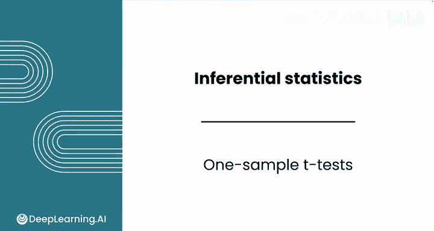
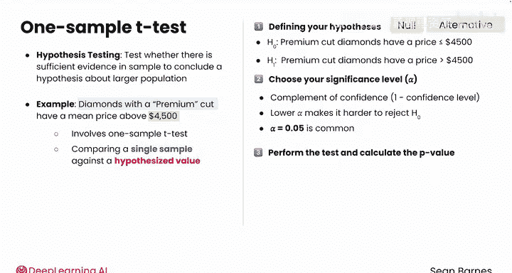
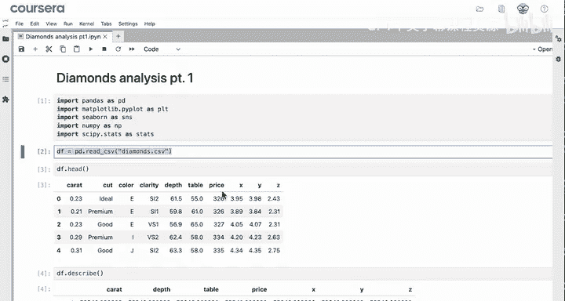
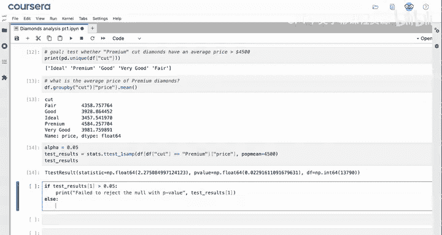
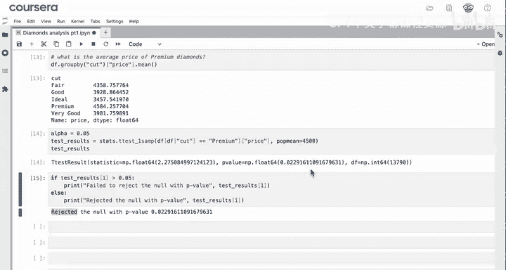
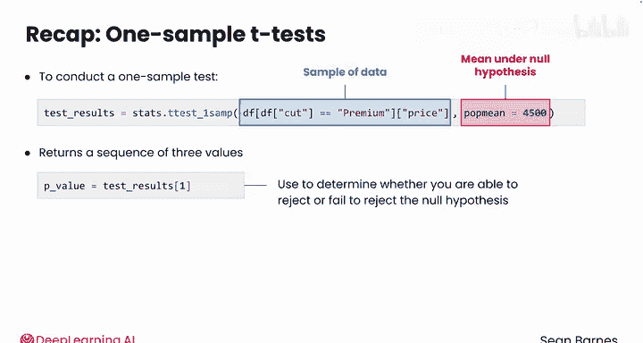

# 064：单样本t检验 🧪



在本节课中，我们将学习如何使用Python进行单样本t检验。这是一种假设检验方法，用于判断一个样本的平均值是否与某个已知的理论值存在显著差异。

上一节我们介绍了置信区间，本节中我们来看看假设检验。假设检验用于根据样本数据，推断关于更大总体的某个假设是否有足够证据支持。

## 假设检验步骤回顾

以下是进行假设检验的基本步骤：

1.  **定义假设**：
    *   **零假设 (H₀)**：代表现状或基线。例如，高级切工钻石的平均价格等于或低于4500美元。
    *   **备择假设 (H₁)**：代表你想要检验的条件。例如，高级切工钻石的平均价格高于4500美元。

2.  **选择显著性水平 (α)**：这是置信水平的补数（1 - 置信度）。它代表你拒绝零假设的容易程度。高置信度意味着较低的α值，使得更难找到证据拒绝零假设。α = 0.05 是一个常用值。

3.  **执行检验并计算P值**：P值是在零假设为真的前提下，观察到当前样本数据或更极端数据的概率。
    *   如果 **P值 < α**，则可以拒绝零假设。
    *   如果 **P值 ≥ α**，则无法拒绝零假设。

## 实战：检验钻石价格

假设我们正在为一家在线珠宝零售商做分析，我们想检验“高级切工钻石的平均价格是否高于4500美元”。这是一个单样本t检验问题，因为我们是将一个样本（高级切工钻石）与一个假设值（4500美元）进行比较，而不是比较两个样本。

首先，我们导入必要的库并加载数据。

```python
import pandas as pd
import scipy.stats as stats

# 假设数据已加载到变量 df 中
# df = pd.read_csv('diamonds.csv')
```



接着，我们查看钻石切工的类型，以便准确筛选“Premium”等级的数据。



```python
print(df['cut'].unique())
```

输出显示有五个等级，其中“Premium”是大写的。现在，我们可以先查看样本中Premium钻石的平均价格。

```python
avg_price_by_cut = df.groupby('cut')['price'].mean()
print(avg_price_by_cut)
```

我们发现Premium切工钻石的样本平均价格是4584美元。那么，这个价格是否显著高于4500美元呢？让我们通过检验来确认。

以下是执行单样本t检验的完整代码：

```python
# 1. 定义显著性水平
alpha = 0.05

# 2. 执行单样本t检验
# 参数：样本数据（筛选Premium切工的钻石价格），零假设下的总体均值（popmean）
test_results = stats.ttest_1samp(df[df['cut'] == 'Premium']['price'], popmean=4500)

# 3. 输出检验结果（包含统计量、P值和自由度）
print("T检验结果:", test_results)

# 4. 根据P值做出决策
p_value = test_results.pvalue # 或 test_results[1]
if p_value > alpha:
    print(f"无法拒绝零假设 (P值 = {p_value:.3f})")
else:
    print(f"拒绝零假设 (P值 = {p_value:.3f})")
```

运行代码后，我们得到了一个P值（例如0.023）。由于这个P值小于我们设定的α（0.05），因此我们**拒绝零假设**。这意味着我们有显著的统计证据表明，高级切工钻石的平均价格高于4500美元。



## 核心函数与概念

在本例中，我们使用了 `scipy.stats.ttest_1samp` 函数来执行单样本t检验。
*   **第一个参数**是你的样本数据（一个数组或序列）。
*   **`popmean` 参数**是零假设中假定的总体均值。
*   函数返回一个对象，其 `.pvalue` 属性（或索引 `[1]`）就是我们需要用于决策的P值。

决策逻辑可以用以下公式表示：
**如果 P值 < α，则拒绝 H₀；否则，无法拒绝 H₀。**

---





本节课中我们一起学习了单样本t检验。我们回顾了假设检验的步骤，并使用Python的SciPy库对一个具体的商业问题（钻石价格检验）进行了分析。通过计算P值并与显著性水平比较，我们能够对关于总体均值的假设做出统计推断。

现在你已经掌握了在Python中进行单样本t检验的方法，接下来可以准备学习双样本检验了，你会发现两者有很多相似之处。