# 065：Python数据分析 - P65 双样本t检验 📊

在本节课中，我们将学习如何在Python中执行双样本t检验。我们将直接比较两个组，而不是将一个组与假设值进行比较。具体来说，我们将分析不同切割等级的钻石的平均价格是否存在显著差异。

---

## 概述

假设检验中，我们经常需要直接比较两个组。本节将介绍如何在Python中进行双样本t检验。我们将以钻石数据集为例，比较“良好”和“非常好”两种切割等级的钻石的平均价格，以帮助在线零售商制定定价和营销策略。

---

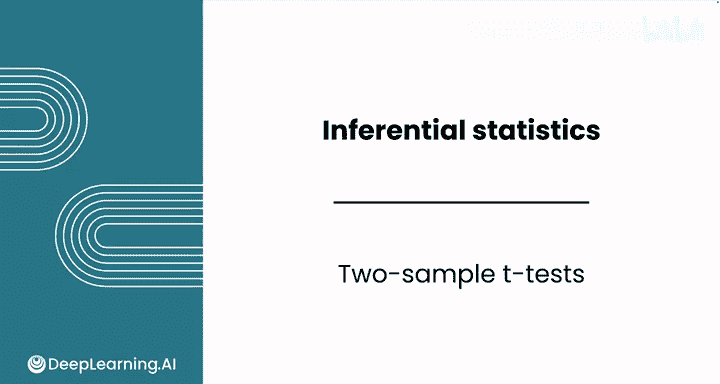

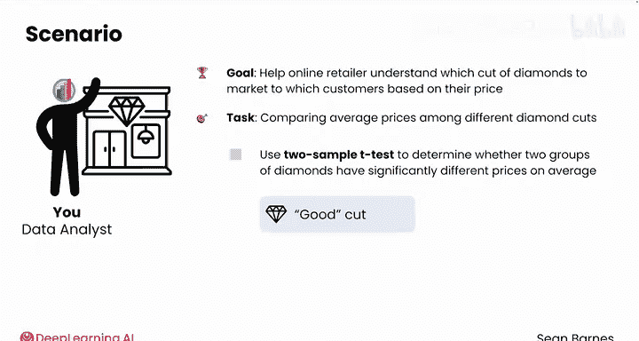

## 数据准备与可视化

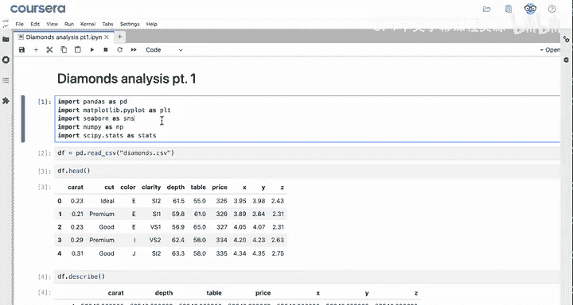

首先，我们需要导入必要的模块并将数据加载到变量`df`中。为了直观展示数据，我们将按切割等级分组，选择价格列，计算平均值，排序结果，并使用条形图进行可视化。

以下是数据准备和可视化的步骤：


```python
import pandas as pd
import seaborn as sns
import matplotlib.pyplot as plt
from scipy import stats

# 假设数据已加载到变量df中
# df = pd.read_csv('diamonds.csv')

# 按切割等级分组并计算平均价格
avg_price_by_cut = df.groupby('cut')['price'].mean().sort_values()

# 绘制条形图
avg_price_by_cut.plot(kind='bar')
plt.show()
```

运行上述代码后，我们可能会发现一个有趣的现象：“一般”切割等级的钻石平均价格高于“理想”切割等级。此外，“良好”和“非常好”切割等级的钻石价格看起来非常接近。

为了进一步探索，我们可以使用箱线图查看基于切割等级的价格分布。Seaborn库可以轻松实现这一点。

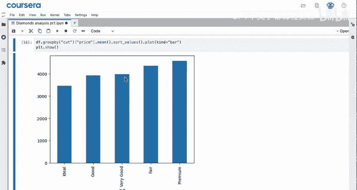


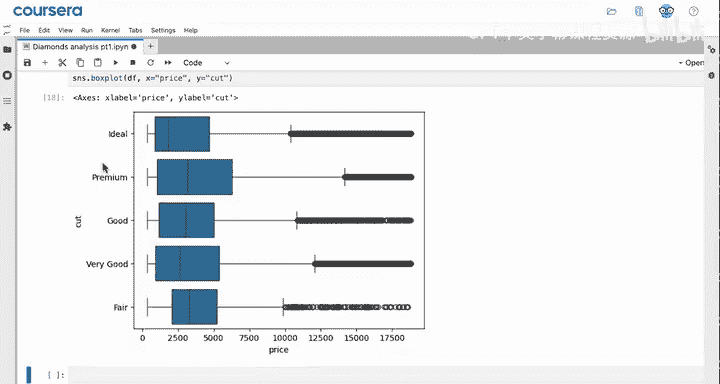

```python
# 设置切割等级的显示顺序
cut_order = ['Fair', 'Good', 'Very Good', 'Premium', 'Ideal']

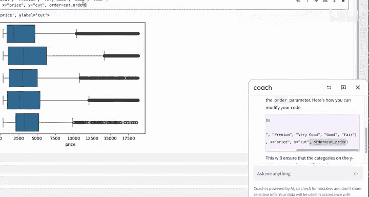

# 绘制箱线图
sns.boxplot(data=df, x='price', y='cut', order=cut_order, palette='Blues_r')
plt.show()
```

从箱线图中，我们可以看到“良好”和“非常好”切割等级的钻石中位数不同，且“非常好”切割等级的钻石具有更大的四分位距，表明其价格变异性可能更高。然而，从图中无法明确判断这两个类别的平均价格是否存在显著差异。

---

## 执行双样本t检验

为了检验“良好”和“非常好”切割等级的钻石平均价格是否存在显著差异，我们将使用`scipy.stats`模块中的`ttest_ind`函数进行双样本t检验。我们假设这两个样本是独立的，即数据集中“非常好”切割的钻石与“良好”切割的钻石没有关联。

以下是执行双样本t检验的步骤：

首先，从数据框中筛选出“非常好”和“良好”切割等级的钻石价格数据：

```python
# 筛选数据
very_good_prices = df[df['cut'] == 'Very Good']['price']
good_prices = df[df['cut'] == 'Good']['price']
```

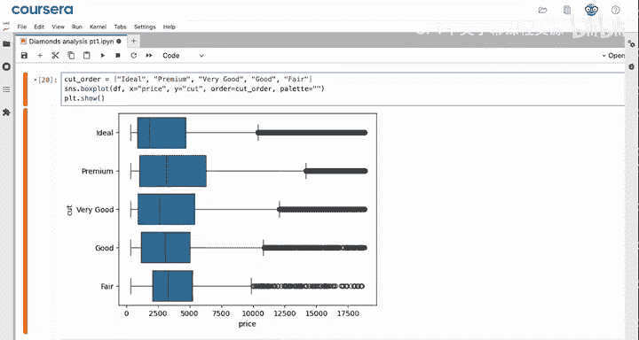

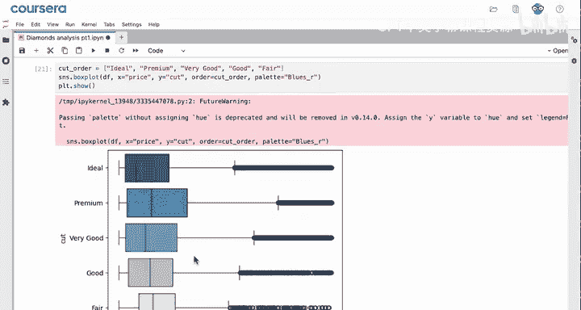

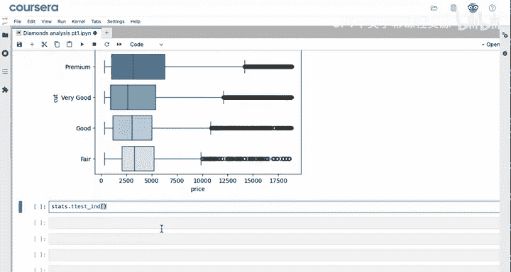

接下来，使用`ttest_ind`函数进行检验。与单样本t检验不同，这里不需要指定`popmean`参数，因为我们的目标是直接比较两个组的均值。

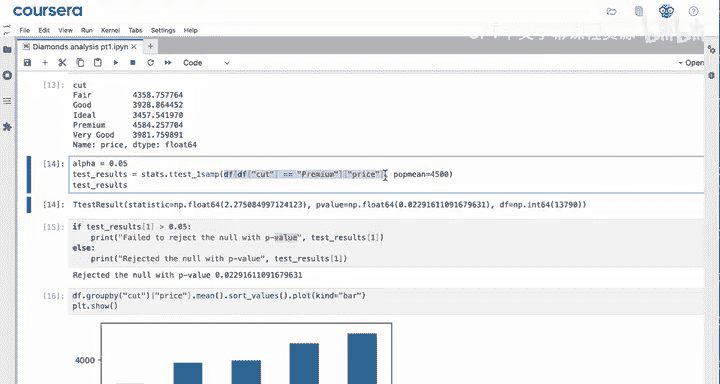

```python
# 执行双样本t检验
test_results = stats.ttest_ind(very_good_prices, good_prices)

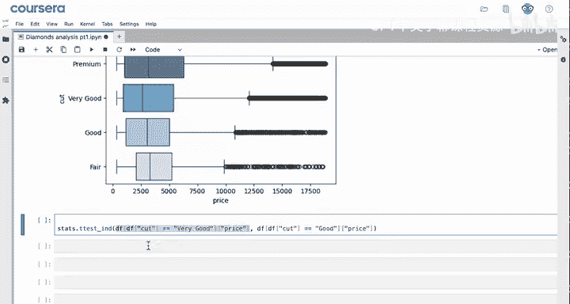

# 输出检验结果
print(test_results)
```

检验结果将包含t统计量和p值。我们可以通过`test_results.pvalue`访问p值。

---

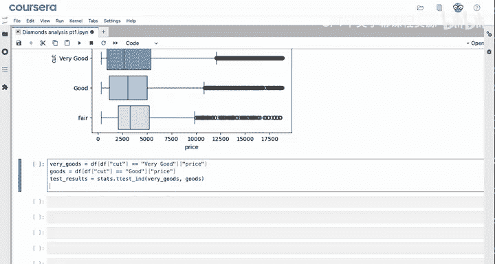

## 结果解读

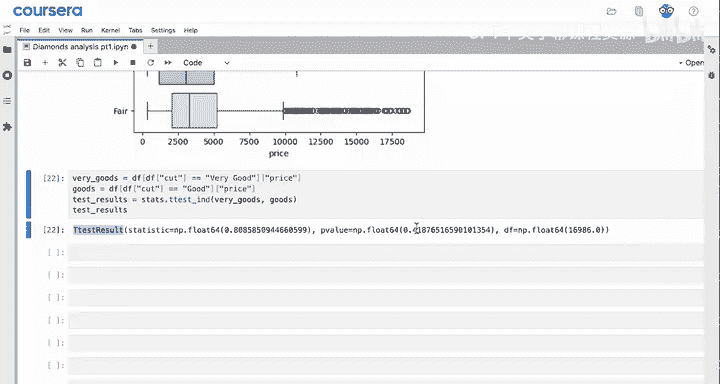

假设我们设定的显著性水平为0.05。我们可以编写一个简单的if语句来解读检验结果：

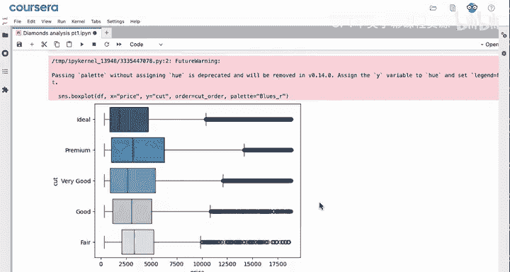

```python
alpha = 0.05

if test_results.pvalue < alpha:
    print("拒绝原假设：两个组的平均价格存在显著差异。")
else:
    print("未能拒绝原假设：两个组的平均价格没有显著差异。")
```

如果p值小于0.05，我们拒绝原假设，认为两个组的平均价格存在显著差异；否则，我们未能拒绝原假设。

在我们的例子中，p值为0.41，大于0.05，因此我们未能拒绝原假设。这意味着“良好”和“非常好”切割等级的钻石平均价格没有显著差异。这一结论可以帮助客户为这两种切割等级的钻石制定相似的定价和营销策略。

---

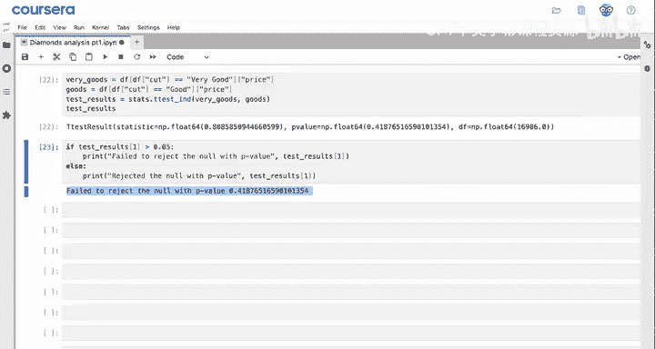

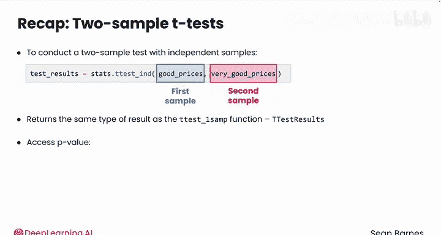

## 总结

本节课中，我们一起学习了如何在Python中执行双样本t检验。我们首先通过数据可视化初步探索了数据，然后使用`scipy.stats.ttest_ind`函数比较了两个独立样本的均值。最后，我们根据p值解读了检验结果，并得出了统计结论。

通过掌握单样本和双样本t检验，你现在能够使用Python进行基本的假设检验，并编写代码帮助解读结果。在数据有限的情况下，我们还可以通过模拟样本来进行检验，这将在下一节课中介绍。