# 066：Python数据分析 - P66 均匀分布模拟 📊

在本节课中，我们将要学习如何使用模拟（Simulation）来解决数据分析中的实际问题。模拟是一种强大的工具，尤其当数据收集存在限制时，它可以帮助我们通过生成随机样本来探索数据在现实世界中的可能行为。

上一节我们介绍了推断统计学的基础知识，本节中我们来看看如何利用模拟来应对数据稀缺的挑战。

## 概述：为什么需要模拟？🤔

在现实场景中，由于时间、成本或物流限制，收集大型数据集通常很困难。例如，你合作的一家在线珠宝零售商想要测试一个新的定价策略。直接采访大量客户或从实验中收集足够数据来做出精确估计往往不切实际。对于珠宝这类高价值、低交易量的商品尤其如此。

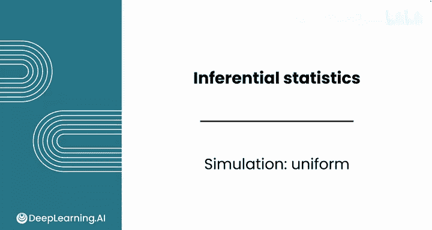

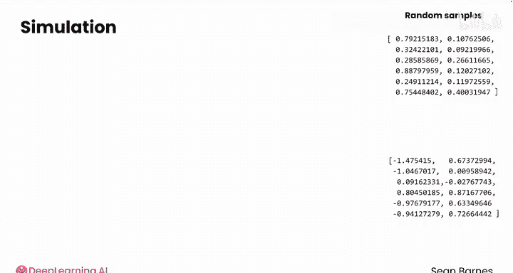

模拟可以帮助我们克服这些限制。我们无需完全依赖有限的数据，而是可以通过估计数据的参数（如均值和标准差）来近似其潜在分布。然后，利用这些参数生成随机样本，模拟基于我们对数据行为假设的各种可能场景。

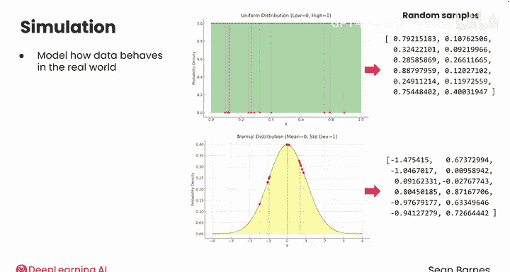

## 开始模拟：生成均匀分布折扣 💎

假设你正在与珠宝零售商合作，评估新定价策略的潜在影响。你的任务是开发一个模拟，在固定范围内（例如钻石折扣从0%到10%）生成随机折扣价格。零售商计划将此模拟作为评估对客户购买习惯影响的第一步。

我们将在同一个Jupyter Notebook中继续。首先，导入必要的模块并开始对潜在折扣进行建模。

以下是建模步骤：

1.  **定义样本大小**：我们计划生成一个包含1000个折扣的样本。
    ```python
    n = 1000
    ```
2.  **生成均匀分布样本**：使用NumPy的`random.uniform`函数，在0到0.1（即0%到10%）之间生成随机数。
    ```python
    sample = np.random.uniform(low=0, high=0.1, size=n)
    ```
3.  **计算样本统计量**：计算生成样本的均值（`x_bar`）和标准差（`s`）。
    ```python
    x_bar = sample.mean()
    s = sample.std()
    ```
4.  **可视化分布**：使用Seaborn的`histplot`函数绘制样本的直方图，以观察其分布。
    ```python
    sns.histplot(sample)
    plt.show()
    ```

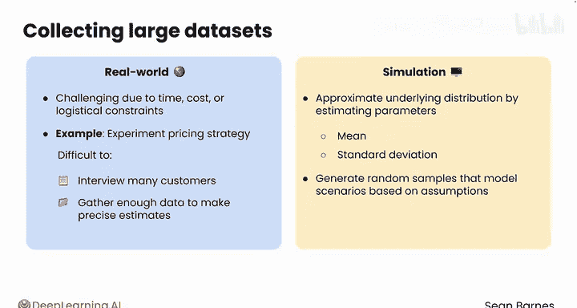

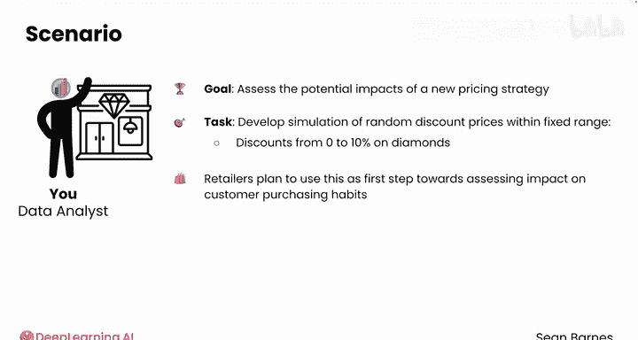

运行代码后，你会得到一个均值约为0.05、标准差约为0.029的样本，其直方图大致呈均匀分布。由于`np.random`每次产生随机输出，重新运行单元格会得到略有不同的结果，这体现了自然随机变异。

## 构建置信区间 📐

接下来，我们可以基于模拟数据为均值构建一个置信区间。我们将复用之前课程中的置信区间代码。

以下是构建95%置信区间的步骤：

1.  **设置置信水平**：例如，`confidence = 0.95`。
2.  **计算标准误差**：公式为 `s / np.sqrt(n)`。
3.  **计算置信区间上下限**：使用`scipy.stats.norm.ppf`函数找到临界z值，然后计算区间。
    ```python
    import scipy.stats as st
    z_critical = st.norm.ppf((1 + confidence) / 2)
    margin_of_error = z_critical * (s / np.sqrt(n))
    confidence_interval = (x_bar - margin_of_error, x_bar + margin_of_error)
    ```

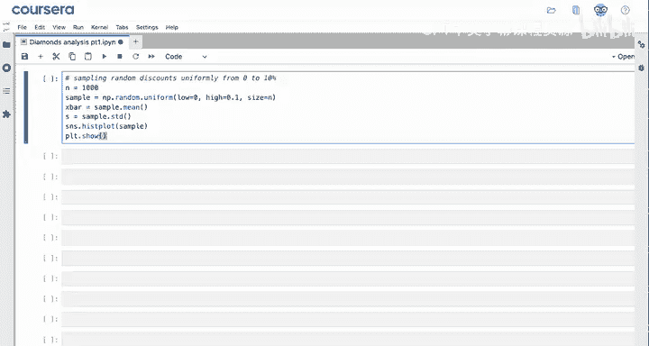

以95%的置信度运行，得到的区间可能类似于(0.0487, 0.0524)。我们知道这个均匀分布的**真实总体均值是0.05**。这个置信区间成功捕获了该真实值。

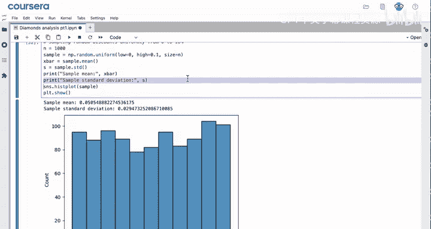

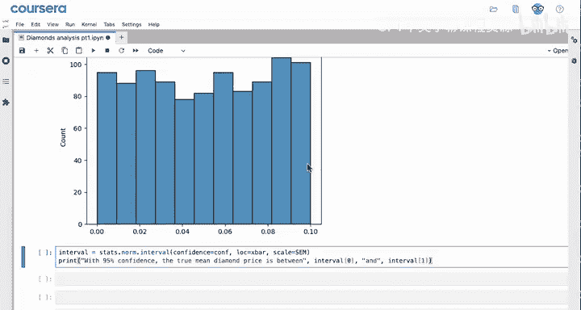

## 重复模拟以验证理论 🔁

根据理论，95%的置信区间应包含真实总体均值。我们可以通过多次重复模拟来验证这一点。你可以请求大语言模型（LLM）协助编写代码，运行模拟100次，并统计有多少个置信区间包含了0.05。

以下是LLM可能提供的代码框架：

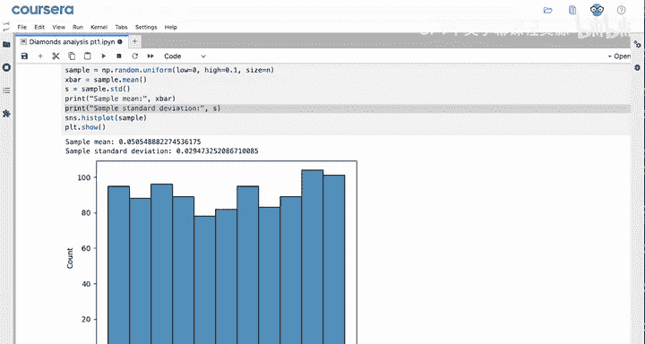

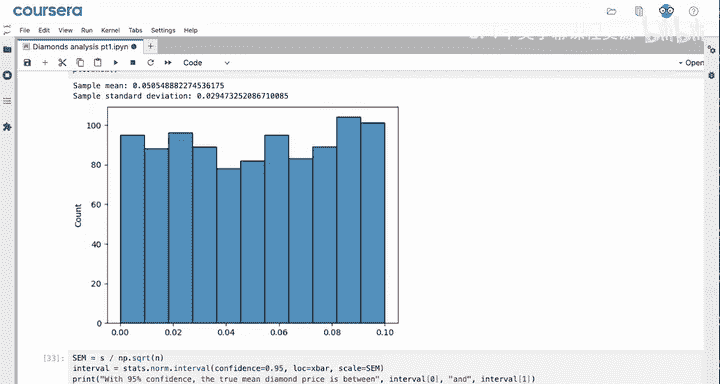

```python
contain_true_mean = 0
num_simulations = 100

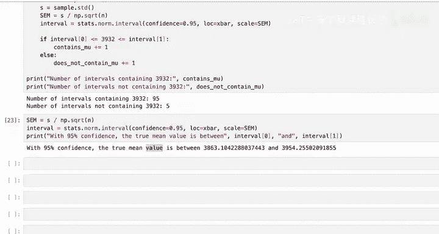

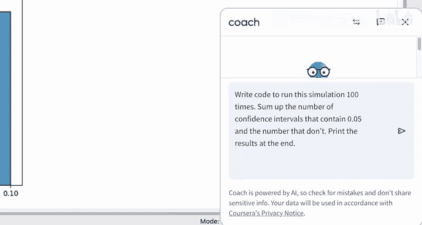

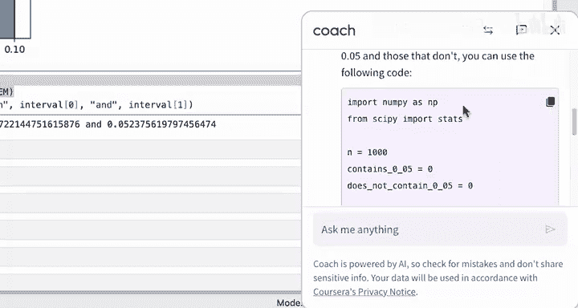

for _ in range(num_simulations):
    # 1. 生成新样本
    sample = np.random.uniform(low=0, high=0.1, size=n)
    x_bar = sample.mean()
    s = sample.std()
    
    # 2. 计算置信区间
    z_critical = st.norm.ppf((1 + confidence) / 2)
    margin_of_error = z_critical * (s / np.sqrt(n))
    ci_low = x_bar - margin_of_error
    ci_high = x_bar + margin_of_error
    
    # 3. 检查是否包含0.05
    if ci_low <= 0.05 <= ci_high:
        contain_true_mean += 1

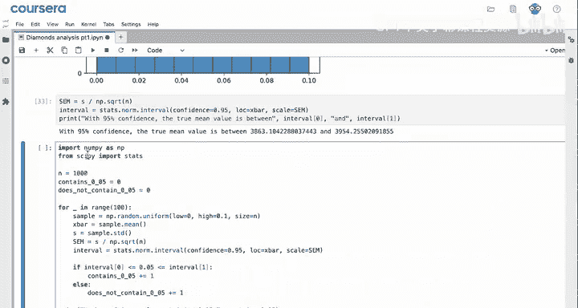

print(f"{contain_true_mean}个区间包含了真实均值0.05。")
print(f"{num_simulations - contain_true_mean}个区间没有包含真实均值0.05。")
```

运行这段代码，你可能会得到类似“93个区间包含0.07，7个不包含”的结果。这与95%置信区间的预期行为基本吻合。

## 总结与应用 🎯

本节课中我们一起学习了如何使用模拟解决数据分析中的实际问题。

我们主要完成了以下工作：
*   使用`np.random.uniform`函数从均匀分布中生成了大随机样本。
*   通过`low`、`high`和`size`参数指定了模拟的条件。
*   基于生成的随机样本，在代码中构建了置信区间。
*   利用大语言模型辅助编写代码，重复了多次模拟以验证置信区间的统计特性。

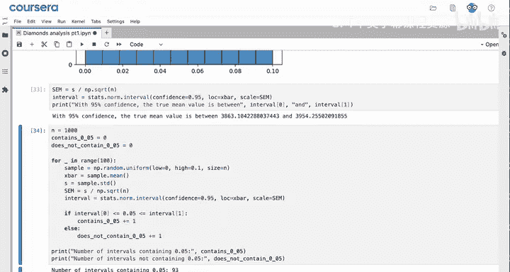

你可以将这份模拟演示提交给珠宝零售商的客户，帮助他们理解折扣可能如何分配给客户，以及如果向客户推出此类折扣实验，他们应该为哪些不同场景做好准备。例如，零售商可能担心理解对收入的**最大潜在影响**，如果许多折扣集中在较高端，他们可以使用你的模拟作为起点，来了解达到此阈值的可能性。

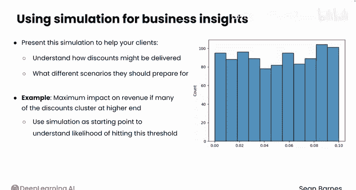

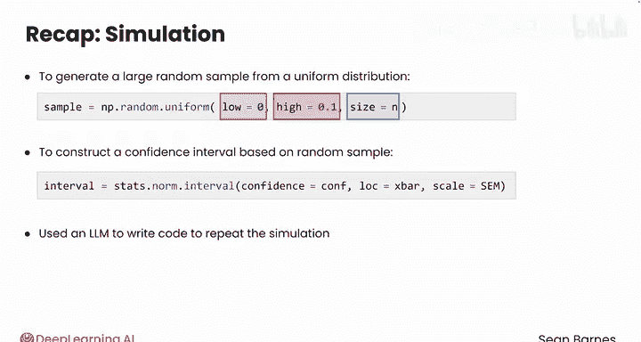

模拟虽然强大，但其**有效性完全取决于所做假设的合理性**。在下一节视频中，我们将学习如何在Python中从正态分布进行抽样。