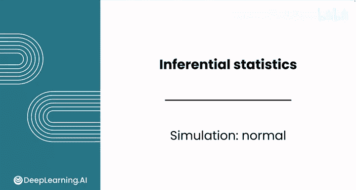
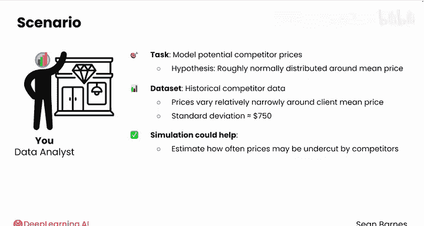
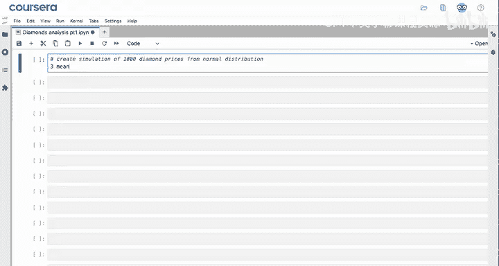
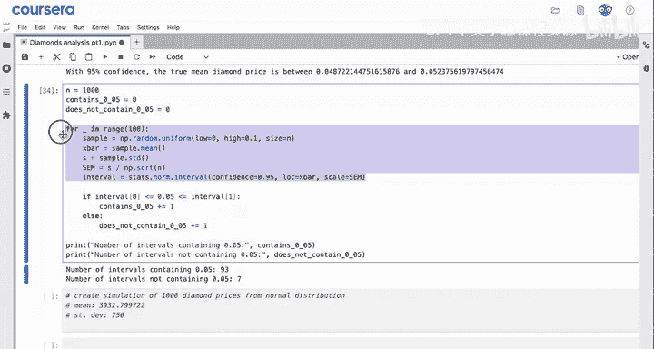
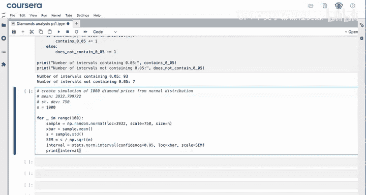
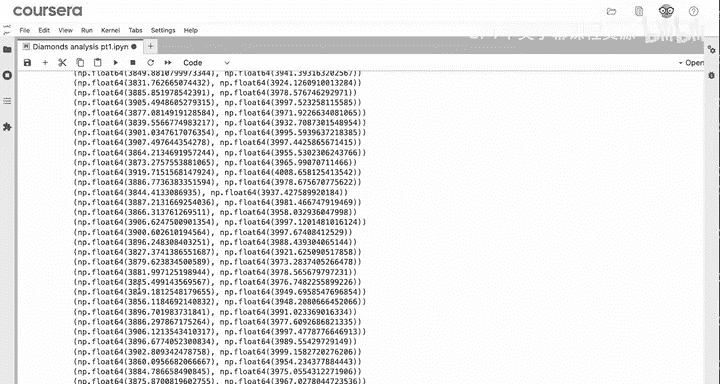
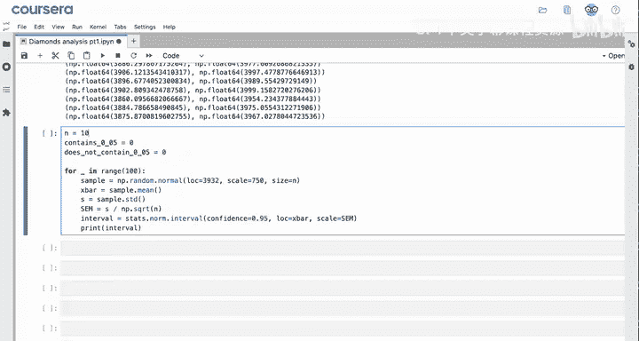
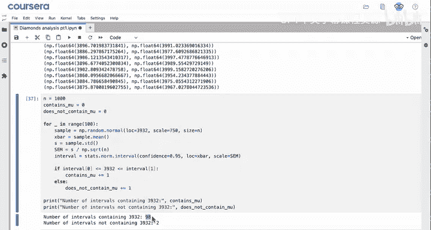
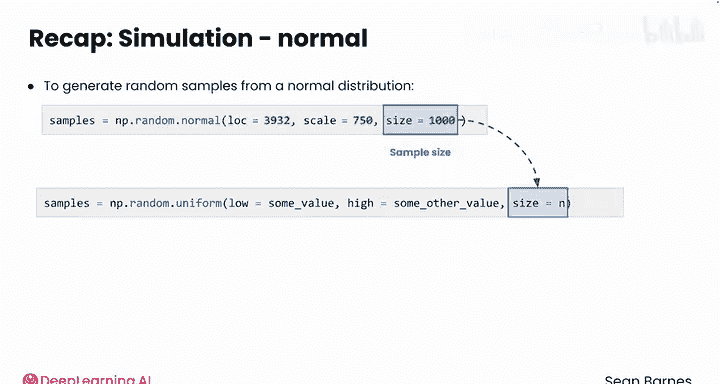

# 067：正态分布模拟 📊

在本节课中，我们将学习如何使用Python从正态分布中生成随机样本，并利用这些样本来模拟现实世界中的商业场景，例如竞争对手的定价策略。我们将通过一个珠宝零售商的案例，演示如何基于历史数据模拟竞争对手的钻石价格分布。

---

## 概述

上一节我们介绍了如何从均匀分布中进行抽样。本节中，我们来看看如何从正态分布中生成随机样本。正态分布是一种常见的概率分布，适用于描述许多自然和社会现象，例如价格波动、测试成绩等。我们将使用NumPy库中的`random.normal`函数来生成这些样本，并计算置信区间以评估模拟结果的可靠性。

## 正态分布模拟步骤

以下是模拟正态分布样本并计算置信区间的具体步骤。

### 1. 设定参数

首先，我们需要设定正态分布的参数。根据历史数据，我们得知竞争对手的钻石价格大致围绕一个均值波动，且标准差已知。





- **均值（Mean）**：$3932
- **标准差（Standard Deviation）**：$750
- **样本大小（Sample Size）**：100
- **置信水平（Confidence Level）**：95%

### 2. 生成随机样本



使用NumPy的`random.normal`函数从正态分布中生成随机样本。该函数需要三个主要参数：`loc`（均值）、`scale`（标准差）和`size`（样本大小）。

```python
import numpy as np



mean_price = 3932
std_dev = 750
sample_size = 100

sample = np.random.normal(loc=mean_price, scale=std_dev, size=sample_size)
```

### 3. 计算置信区间

接下来，我们计算每个样本的置信区间。置信区间表示我们对总体参数（如均值）的估计范围。对于正态分布，我们可以使用以下公式计算95%的置信区间：

\[
\text{置信区间} = \bar{x} \pm z \times \frac{\sigma}{\sqrt{n}}
\]

其中，\(\bar{x}\) 是样本均值，\(z\) 是标准正态分布的临界值（对于95%的置信水平，\(z \approx 1.96\)），\(\sigma\) 是标准差，\(n\) 是样本大小。

```python
confidence_level = 0.95
z_value = 1.96  # 对应95%的置信水平

sample_mean = np.mean(sample)
margin_of_error = z_value * (std_dev / np.sqrt(sample_size))
confidence_interval = (sample_mean - margin_of_error, sample_mean + margin_of_error)
```



### 4. 重复模拟





为了获得更可靠的结果，我们可以重复上述过程多次，例如1000次，并统计有多少次置信区间包含了真实的均值。

```python
num_simulations = 1000
contains_mean = 0

for _ in range(num_simulations):
    sample = np.random.normal(loc=mean_price, scale=std_dev, size=sample_size)
    sample_mean = np.mean(sample)
    margin_of_error = z_value * (std_dev / np.sqrt(sample_size))
    confidence_interval = (sample_mean - margin_of_error, sample_mean + margin_of_error)
    
    if confidence_interval[0] <= mean_price <= confidence_interval[1]:
        contains_mean += 1

print(f"包含真实均值的区间数量: {contains_mean}")
print(f"不包含真实均值的区间数量: {num_simulations - contains_mean}")
```





### 5. 结果分析

运行上述代码后，我们得到了包含真实均值的区间数量和不包含真实均值的区间数量。在95%的置信水平下，我们期望大约有95%的区间包含真实均值。例如，如果模拟1000次，大约有950个区间包含真实均值。

## 总结

本节课中，我们一起学习了如何使用Python从正态分布中生成随机样本，并利用这些样本模拟竞争对手的定价策略。我们通过设定参数、生成样本、计算置信区间以及重复模拟来评估结果的可靠性。正态分布模拟是数据分析中常用的技术，能够帮助我们更好地理解现实世界中的不确定性。

接下来，我们将完成本课的练习作业和实践实验室，探索伦敦的房价数据。完成后，请加入下一节课，学习一种全新的推断技术——线性回归。

期待与您在下一节课再见！😊