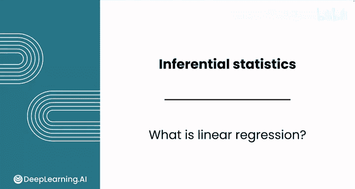
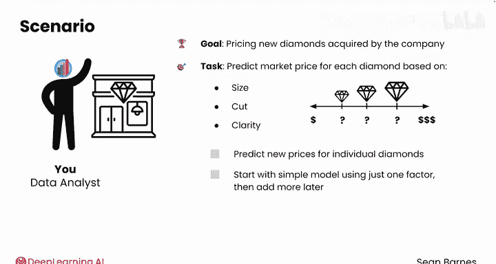
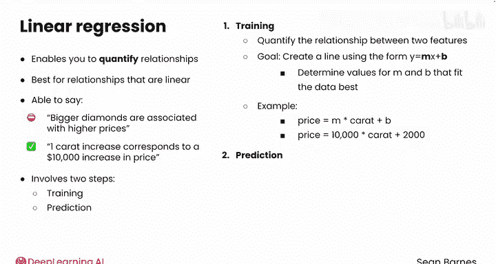
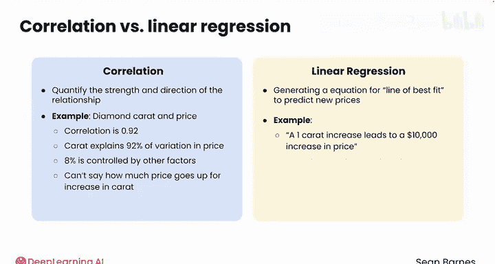
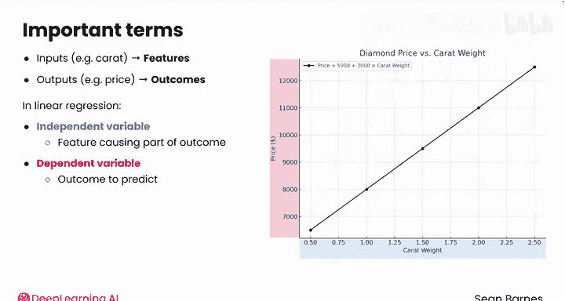
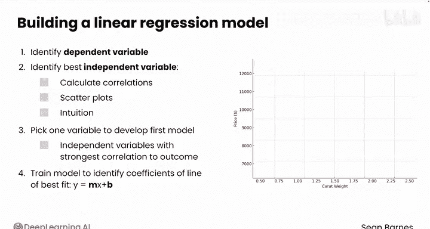

# 068：线性回归基础 📊

## 概述

在本节课中，我们将要学习线性回归的基础知识。这是一种强大的推断方法，用于建模特征之间的关系。我们将从理解线性回归的核心概念开始，逐步学习如何构建和使用线性回归模型进行预测。

## 从置信区间与假设检验到线性回归

上一节我们介绍了置信区间和假设检验。本节中，我们来看看如何扩展你的推断工具箱，学习线性回归。

线性回归是一种强大的推断方法，用于建模特征之间的关系。考虑以下场景：你在一家在线珠宝零售商担任数据分析师，公司要求你为新收购的钻石定价。每天有成千上万的钻石需要定价，而合格的专家并不总是有空来确定最准确的价格。零售商希望开发一个更具成本效益的钻石定价模型。他们要求你根据钻石的特征（如大小、切工和净度）预测合理的市场价格。然后，专家将使用你的预测价格作为起点，更快地完成最终定价。

对于这个任务，置信区间或假设检验都不合适。你需要预测单个钻石的新价格，而不仅仅是对所有钻石的某些特征进行推断。当然，你知道更大的钻石更有价值，但具体价值多少？切工和净度哪个更重要？你的计划是从一个简单的模型开始，只使用一个因素来预测钻石价格，然后再添加更多因素。

## 什么是线性回归？📈

线性回归使你能够量化数据中的关系，最适合非常线性的关系。使用回归，你不仅能说“更大的钻石与更高的价格相关”，还能说“一克拉的增加对应着价格增加10000美元”。

线性回归涉及两个步骤：训练和预测。

首先，训练是分析你现有的数据，以量化两个特征（如克拉和价格）之间的关系。你希望创建一条线来建模这种关系，使用形式为 `y = Mx + B` 的方程。你可能在高中数学课上见过这个方程，它被称为斜截式。M和B在数学中被称为系数。线性回归背后的统计方法将根据你的数据，确定最适合数据的M和B的值。

例如，你可能在寻找方程：`price = m * carat + b`。这个方程量化了价格和克拉之间的关系。假设你运行线性回归，发现最适合数据的方程是 `price = $10000 * carat + $2000`。

## 从训练到预测

现在你已经建立了模型。下一步是预测，使用这个训练好的模型，根据输入X来预测y。在这个例子中，意味着根据输入的克拉来预测价格。

想象你刚刚收到一颗新钻石，你的工作是根据其克拉给出合适的价格。如果你知道钻石是0.5克拉，你可以将其代入你的方程：`10000 * 0.5 = 5000`，再加上2000，最终价格为7000美元。

## 线性回归与相关性的区别

线性回归听起来可能很像相关性，相关性也能量化两个特征之间的关系。它们确实是相关的技术。然而，相关性只能量化关系的强度和方向。例如，钻石克拉和价格之间的相关性是0.92。使用这个统计量，你可以得出结论：钻石的克拉解释了其价格变异的92%，另外8%由其他因素（如切工、颜色和净度）控制。然而，你无法准确说出价格随克拉增加而上涨的具体金额。

线性回归更进一步，它生成最佳拟合线的方程，使你能够预测新价格。使用线性回归，你可以得出结论：“一克拉的增加导致价格增加10000美元”，或者“一颗半克拉的钻石估计价值7000美元”。然而，相关性通常在回归分析开始时使用，以识别最具预测性的特征。如果你使用一个自变量，选择与结果变量相关性最强的那个，以开发最准确的线性回归模型。

## 理解变量：自变量与因变量

到目前为止，你已将输入（如克拉）称为特征，将输出（如价格）称为结果。因此，你可能将这个问题描述为使用特征（克拉）来预测结果（价格）。在线性回归术语中，特征和结果通常都称为变量。变量本质上是特征的另一个术语。

自变量对应于你的输入。它是你认为导致结果的特征，并绘制在x轴上。在这个例子中，它是克拉。因变量是你试图预测的结果，这里是钻石的价格。价格的值取决于自变量克拉。

当你在数据中试图确定哪个变量是哪个时，请考虑因果关系。钻石价格标签的改变不会神奇地使钻石变大，但钻石的克拉直接影响其价格。因此，克拉是自变量，价格是因变量。

## 构建回归模型的步骤

要构建回归模型并使用它进行预测，请遵循以下步骤。

以下是构建线性回归模型的四个关键步骤：

1.  **识别因变量**：这是你最终想要预测的变量。
2.  **探索数据关系**：识别模型中最好的自变量。计算自变量和因变量之间的相关性。散点图也有助于识别模型的最佳变量。Seaborn的`pairplot`函数可以帮助你一眼识别强相关的配对。你也可以运用直觉，判断哪个变量可能对你的结果影响最大。你不必检查每一个相关性。
3.  **选择一个变量**：通常，与结果相关性最强的自变量是你的最佳选择，用它来开发你的第一个模型。
4.  **训练模型**：使用统计软件模块来训练你的模型，找到最佳拟合线方程 `y = Mx + B` 中的系数M和B。

一旦你训练好模型，就可以使用 `y = Mx + B` 方程来预测新的结果。这个回归方程指定了最佳拟合线，它量化了单个自变量和因变量之间的关系。在后面的课程中，你将学习如何向模型添加更多自变量以提高其预测能力。

## 线性回归的适用范围与总结

请记住，线性回归只能建模线性关系，这意味着自变量的变化会导致因变量的恒定变化。这就是为什么相关性对于建立线性回归模型如此有用，因为它也衡量线性关系的强度和方向。当然，也有方法可以建模非线性关系，但即使不完美，线性模型仍然可以很有效。

线性回归将你的推断工具箱提升到了一个新的水平，使你能够对数据中的新观察结果进行预测。在下一个视频中，你将看到如何在Python代码中开发线性回归模型。

## 总结

本节课中，我们一起学习了线性回归的基础知识。我们了解了线性回归如何通过 `y = Mx + B` 这样的方程来量化变量之间的关系，并用于预测。我们区分了线性回归与相关性，明确了自变量与因变量的概念，并掌握了构建一个简单线性回归模型的基本步骤。线性回归是数据分析中一个强大且基础的工具，为后续学习更复杂的模型奠定了基础。