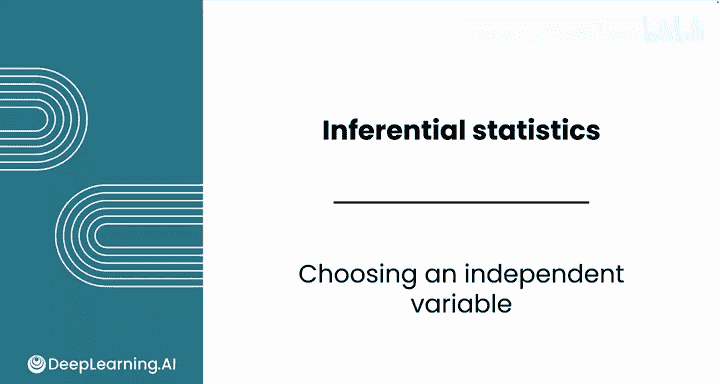
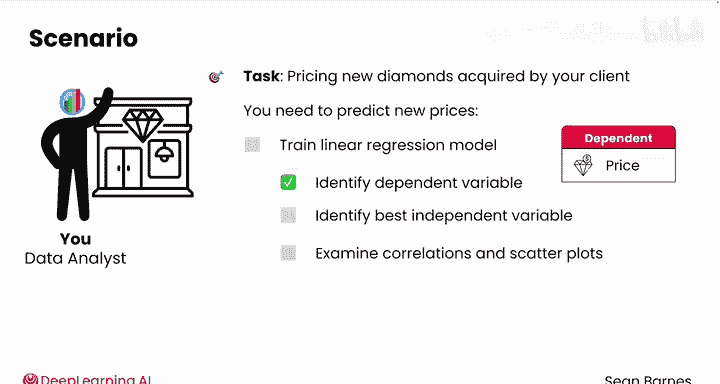
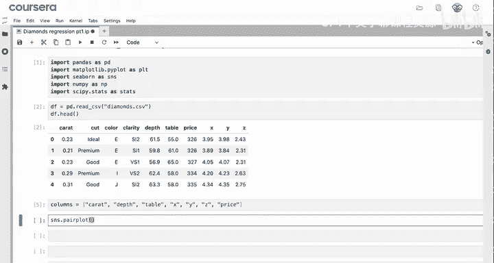
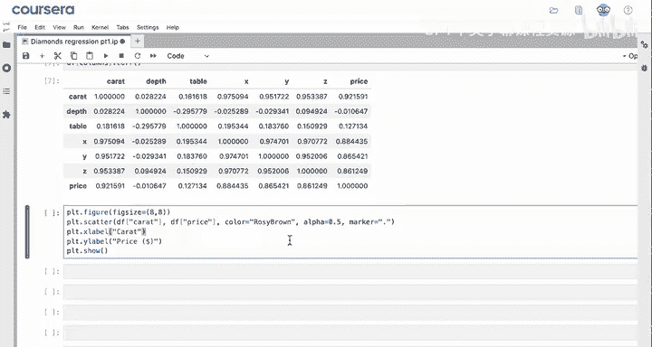
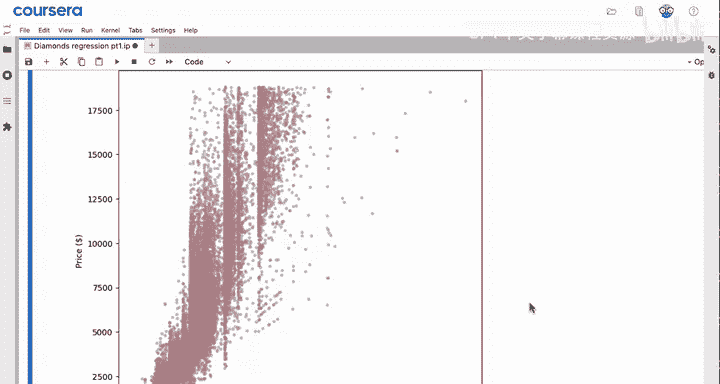
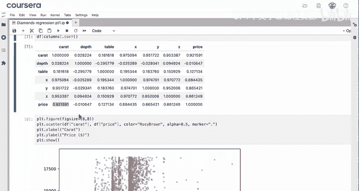
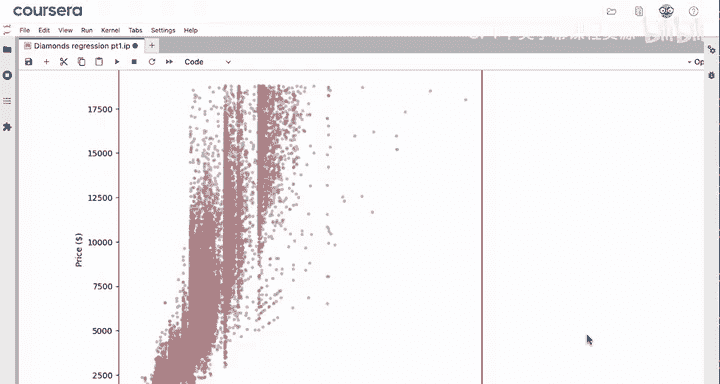
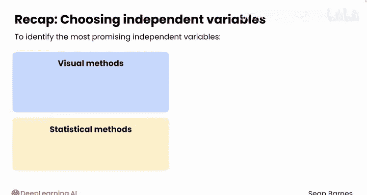

# 069：自变量选择 🎯

在本节课中，我们将学习如何为线性回归模型选择最佳的自变量。我们将通过分析钻石数据集，使用可视化和统计方法来确定哪个特征最能预测钻石价格。

---

## 概述

上一节我们介绍了线性回归模型的训练和预测过程。本节中，我们将利用Python代码，为钻石定价问题选择最合适的自变量。我们的目标是预测新钻石的价格，因此需要找到与价格关联性最强的特征。

---

## 加载数据与模块

首先，我们需要加载必要的Python模块并读取数据。

```python
import pandas as pd
import matplotlib.pyplot as plt
import seaborn as sns
import scipy.stats as stats

df = pd.read_csv('diamonds.csv')
```





以下是数据预览，用于识别所有数值型列作为潜在的自变量。

```python
df.head()
```

---

## 识别数值型特征

目前，我们只关注数值型数据。分类数据的处理方法将在后续课程中介绍。

创建一个包含所有数值型列的列表，包括价格列。

```python
numeric_columns = ['carat', 'depth', 'table', 'x', 'y', 'z', 'price']
```



价格是我们的因变量，但为了分析各特征与价格的关系，我们需要将其包含在分析中。

---

## 可视化特征关系

使用散点图矩阵初步观察各特征与价格的关系。

```python
sns.pairplot(df[numeric_columns])
plt.show()
```

从散点图矩阵中，我们可以观察到以下情况：
*   `depth` 和 `table` 与价格的关系不明显。
*   `carat`、`x`、`y` 和 `z` 似乎与价格存在正相关关系，即随着这些值的增加，价格也倾向于增加。

---

## 量化相关性

为了更精确地评估，我们计算相关系数矩阵。

```python
correlation_matrix = df[numeric_columns].corr()
print(correlation_matrix)
```

相关系数矩阵是对称的。我们重点关注矩阵最后一行（价格行）的数值。
*   `x`、`y`、`z` 与价格有较强的相关性。
*   `carat`（克拉重量）与价格的相关性最强，相关系数约为0.92。



这意味着，钻石的克拉重量可以解释其价格约92%的变异性。

---

## 深入分析最佳特征



为了更详细地观察`carat`与`price`的关系，我们绘制散点图。



```python
plt.figure(figsize=(10, 6))
plt.scatter(df['carat'], df['price'], alpha=0.5, marker='.', color='rosybrown')
plt.xlabel('Carat')
plt.ylabel('Price')
plt.title('Relationship between Carat and Price')
plt.show()
```

从散点图可以清晰看出，随着克拉重量的增加，价格显著上升。

现在思考一个问题：这种关系是线性的还是非线性的？

实际上，这种关系更接近非线性。一条曲线会比一条直线更好地拟合这些数据点。尽管如此，由于两者之间的线性相关性很强，线性回归模型仍然可以提供一个相当准确的初步预测。当然，我们未来也可以使用更复杂的方法来提升模型精度。

---





## 总结

本节课中，我们一起学习了如何为简单线性回归模型选择自变量。
1.  我们结合使用了可视化方法（散点图矩阵）和统计方法（相关系数矩阵）来评估各个自变量。
2.  我们确定了`carat`是与钻石价格相关性最强的特征，因此将其选为构建模型的最佳自变量。
3.  我们还了解到，即使关系呈现一定的非线性，强线性相关性也使得线性回归成为一个良好的建模起点。

在下一讲中，我们将运行回归模型并解读初步结果。