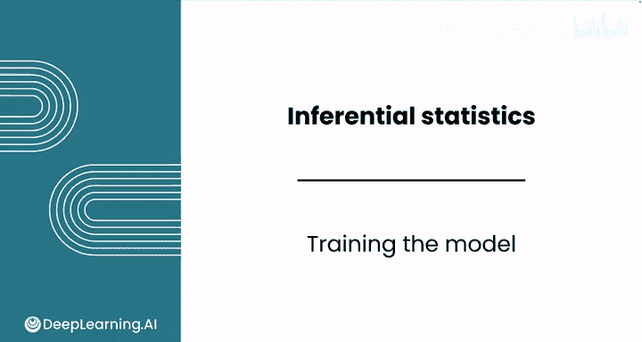
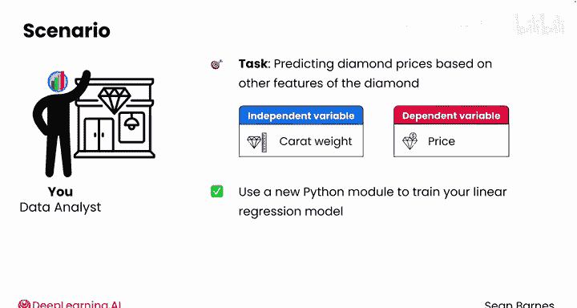
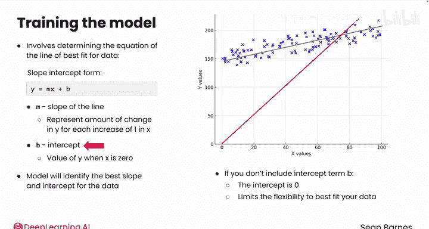
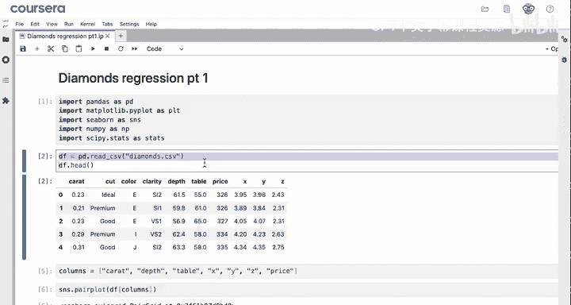
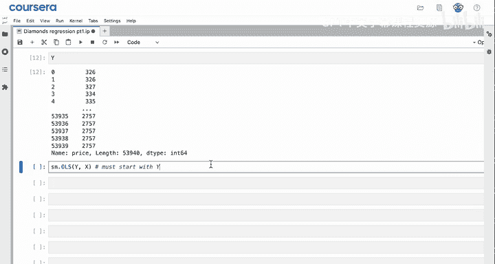
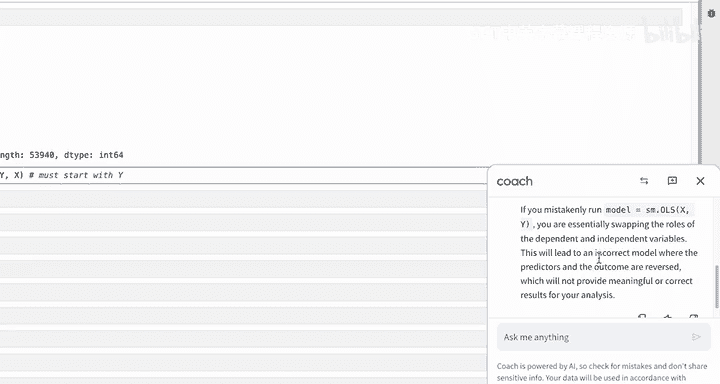
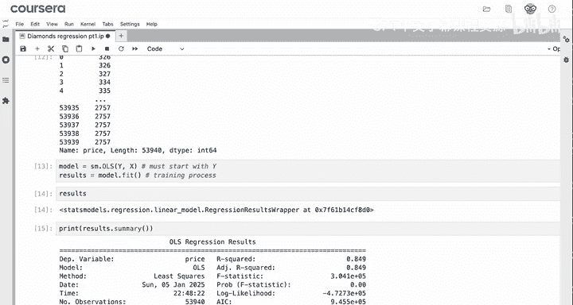
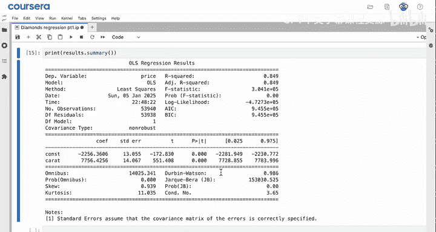
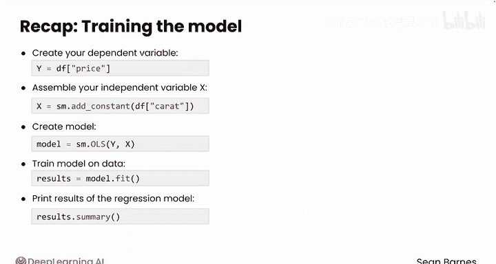

# 070：Python数据分析（第3课）｜模型训练 🎯



在本节课中，我们将学习如何使用Python的statsmodels库来训练一个线性回归模型。我们将以预测钻石价格为例，使用克拉重量作为第一个自变量，逐步完成模型的构建与训练过程。

---

## 概述 📋

上一节我们确定了线性回归模型的因变量（价格）和自变量（克拉重量）。本节中，我们将开始模型的训练。训练过程的核心是找到数据的最佳拟合直线方程，即确定斜率（M）和截距（B）。

---

## 模型训练的核心概念

线性回归模型的目标是找到一条直线，使其最接近地拟合数据点。这条直线的方程通常表示为：



**y = Mx + B**

其中：
*   **y** 是因变量（我们想要预测的值，例如钻石价格）。
*   **x** 是自变量（用于预测的特征，例如克拉重量）。
*   **M** 是直线的斜率，表示x每增加1个单位，y的平均变化量。
*   **B** 是截距，表示当x为0时y的值。

模型训练就是利用历史数据计算出最合适的M和B值的过程。

---

## 为什么需要截距（B）？

截距项为模型提供了灵活性。假设我们有一组数据，其最佳拟合线可能不经过原点(0,0)。如果强制模型没有截距（即B=0），拟合线就必须穿过原点，这通常会严重降低模型对数据的拟合精度。因此，保留截距项对于获得准确的预测模型至关重要。

---

## 训练步骤详解



以下是使用statsmodels库训练线性回归模型的具体步骤。



### 1. 导入必要的库

首先，需要导入用于统计建模的`statsmodels`库。

```python
import statsmodels.api as sm
```

`statsmodels.api`常被简写为`sm`。

### 2. 准备变量

接下来，需要设置因变量Y和自变量X。

*   **Y（因变量）**：直接使用数据框中的价格列。
*   **X（自变量）**：不能仅仅使用克拉重量列。`statsmodels`通过为X数据框中的每一列计算一个系数来工作。为了确保模型能同时计算出斜率(M)和截距(B)的系数，我们需要为截距添加一个常数列。



```python
Y = df['price']
X = df['carat']
X = sm.add_constant(X)  # 添加常数列以计算截距
```

执行`sm.add_constant(X)`后，X数据框将包含两列：一列是值全为1的`const`（常数项），另一列是`carat`。这样，模型就能分别为它们估计系数（对应B和M）。

### 3. 创建并拟合模型

现在，可以使用普通最小二乘法（OLS）来创建和训练模型。

```python
model = sm.OLS(Y, X)  # 创建OLS模型，注意先Y后X的顺序
results = model.fit()  # 拟合模型，计算系数
```

**重要提示**：`sm.OLS()`函数的参数顺序必须是`(Y, X)`，即先因变量后自变量。如果顺序颠倒，将导致模型错误，因为输入的意义被反转了。`model.fit()`方法执行实际的训练过程，利用数据计算出最佳的M和B值。





### 4. 查看模型结果

训练完成后，可以查看模型的详细摘要。

```python
print(results.summary())
```

直接打印`results`对象只会得到一个包装器信息。调用`.summary()`方法会输出一个包含大量信息的表格，如R平方值、系数（const和carat对应的值）等，这些是评估模型性能的关键指标。

---

## 步骤回顾总结

本节课中我们一起学习了线性回归模型的训练流程：

1.  **准备数据**：将因变量Y定义为价格列，将自变量X定义为克拉重量列，并使用`sm.add_constant()`为其添加常数列。
2.  **创建模型**：使用`sm.OLS(Y, X)`函数创建一个普通最小二乘回归模型对象。
3.  **训练模型**：调用`model.fit()`方法，让模型基于数据计算出最佳拟合直线的斜率(M)和截距(B)。
4.  **查看结果**：通过`results.summary()`输出训练结果的详细摘要，其中包含了模型的核心参数。





做得很好！你已经成功创建并拟合了你的第一个回归模型。在下一节课中，我们将学习如何解读结果摘要中的关键输出，例如R平方和系数，以评估模型的有效性。