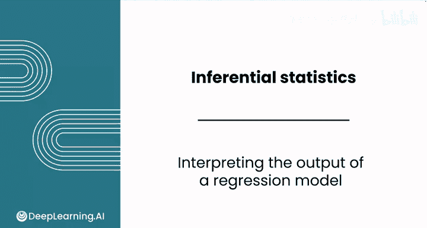
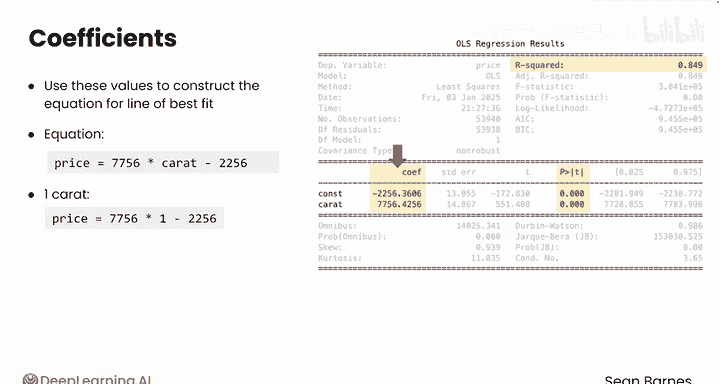
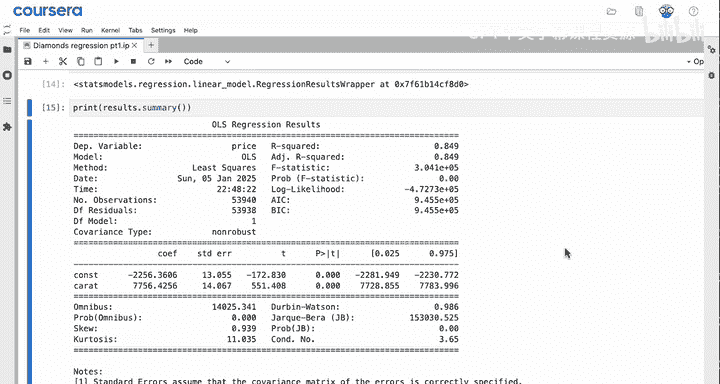
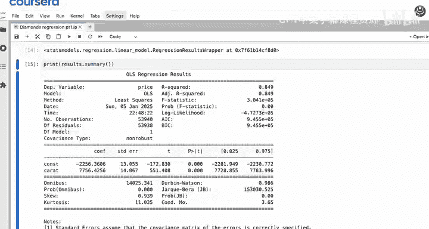
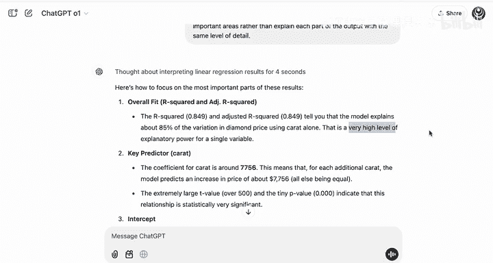
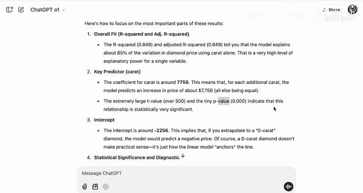
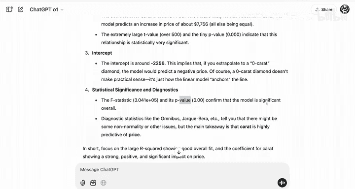
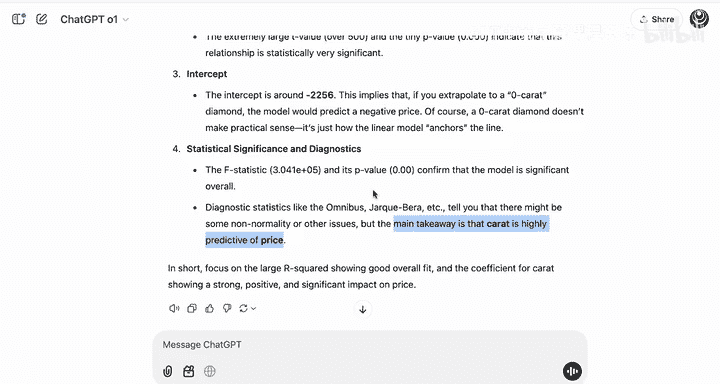

# 071：回归模型输出解读

在本节课中，我们将学习如何解读线性回归模型的输出结果。理解这些输出是评估模型有效性和理解变量间关系的关键。

---

## 🎯 模型输出概述

训练完线性回归模型后，需要解读其输出。这些信息有助于评估自变量对因变量行为的建模效果。

以下是上一视频中用于预测钻石价格的回归模型输出截图，该模型使用克拉数作为预测变量。

你并不需要关注所有信息，注意力应集中在几个关键点上。

---

## 🔑 关键输出指标解读

上一节我们介绍了回归模型输出的存在，本节中我们来看看需要关注的具体指标。

以下是需要关注的三个核心部分：

1.  **R平方值**
2.  系数（包括常量和自变量系数）的 **P值**
3.  系数本身的 **数值**

---

### 📈 1. R平方值

R平方衡量的是因变量的变异中，可由自变量预测的比例。

本质上，R平方告诉你克拉数预测价格的可靠程度。如果我只告诉你一颗钻石的克拉数，你能多准确地预测其价格？

R平方值通常在0到1之间。值越高，说明自变量对因变量变异的解释能力越强。虽然存在一些细微差别，但通常是越高越好。

本例中的R平方值为 **0.849**，这个值相当高。

你可以将此结果解释为：克拉数解释了价格变异的 **84.9%**。

---

### 🧪 2. 系数的P值

在继续解读之前，先看看与每个系数相关的P值。它们告诉你系数是否具有统计显著性。

解读这些P值的方法与其他假设检验相同。

*   **零假设**：回归系数等于0。记住，斜率和截距都是系数。所以，默认状态是系数对因变量没有影响。
*   **备择假设**：回归系数不等于0。你试图为这个结果寻找证据，因为你想证明自变量确实会影响因变量。

因此，如果你的数据提供了足够的证据来拒绝零假设，你就找到了模型中一个重要的特征。

与任何假设检验一样，你需要选择一个你认可的置信水平。95%的置信度（α = 0.05）是常见的标准。

*   如果一个系数的P值 **高于** α，意味着该自变量不能很好地预测因变量。你就不应继续用它进行解读和预测。
*   如果P值 **低于** 0.05，那么你可以拒绝零假设，得出结论认为该自变量能很好地预测因变量。

在本例中，两个系数的P值都接近0，远低于0.05，因此它们具有统计显著性。这个模型能有效预测钻石价格。

---

### ➕ 3. 系数值

既然已经验证了统计显著性，现在可以看看系数的值了：常量是 **2256**，克拉数的系数是 **7756**。

你可以用这些值来构建最佳拟合线的方程。记住，这正是线性回归的最终目的。

该方程如下：
**price = 7756 × carat + 2256**

因此：
*   一颗1克拉的钻石价格约为 `7756 × 1 + 2256 = 10012` 美元。
*   一颗2克拉的钻石价格约为 `7756 × 2 + 2256 = 17768` 美元。

无需手动计算，稍后你将看到如何使用 `statsmodels` 一次性预测许多钻石的价格。

---

## 🤖 利用大语言模型辅助解读

顺便提一下，大语言模型非常擅长从这些复杂的模型摘要中提取关键信息。你可以使用像ChatGPT这样的应用来帮助你分析结果。

事实上，我们可以使用一个具有强大推理能力的开源模型。记住，你可能可以使用更新的模型。

**注意**：务必确保你没有向大语言模型分享任何私有或专有的模型结果。

你可以通过赋予模型角色和任务来使用它。例如，可以使用如下提示词：

> “你是一位擅长用简单方式解释复杂概念的专家统计学家。我是一位正在开发线性回归模型以根据钻石克拉数预测其价格的同事。请帮我解读训练模型的结果，指出最重要的部分，而不是以同等详细程度解释输出的每个部分。”

然后，截取结果图并粘贴进去。

模型首先解释了模型的R平方，指出该模型仅用克拉数就解释了约85%的钻石价格变异，并说明这对于单一变量来说是非常高的解释力。

它同时强调，克拉数是关键预测变量，系数约为7756。这意味着每增加一克拉，模型预测价格将增加约7756美元。P值极小，表明该系数具有统计显著性。

它还强调了称为 **F统计量** 的指标及其关联的P值。该P值也非常小，并指出这证实了模型整体上是显著的。

它也提到了其他一些诊断统计量，但强调主要结论是：克拉数对价格具有很强的预测能力。

当你开始向回归模型中添加更多变量，并以高度严谨的态度分析输出时，大语言模型可以成为解读过程中极佳的思考伙伴。

---

## ✅ 总结

做得很棒！你刚刚解读了Python中线性回归模型的结果。

你使用了 **R平方值**、**P值** 和 **系数** 来对你的模型做出有意义的结论。

请跟随我进入本课的最后一个视频，学习如何使用你的模型进行预测。