# 072：Python数据分析（第3课）｜预测分析 🎯

## 概述

在本节课中，我们将学习如何使用线性回归模型进行预测分析。我们将从理解预测的基本概念开始，逐步学习如何用代码实现单个值和多个值的预测，并讨论模型预测结果的合理性评估。

---

## 预测分析的基本概念

上一节我们介绍了如何解读R平方和系数，本节中我们来看看如何利用这些结果进行预测。

预测的本质是使用拟合好的线性回归模型，为新的输入值（例如钻石克拉数）估算对应的输出值（例如钻石价格）。在散点图上，这相当于在最佳拟合线上找到对应X坐标的Y坐标值。

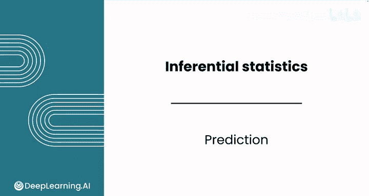

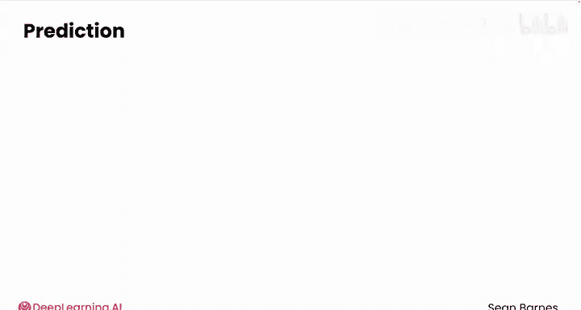

例如，要预测一颗1.5克拉钻石的价格，我们首先在X轴上找到1.5的位置，垂直向上找到最佳拟合线（红色线）的交点，再从该交点水平向左读取Y轴上的价格值，估算价格约为9000美元。

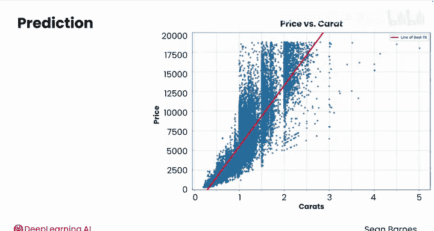


---

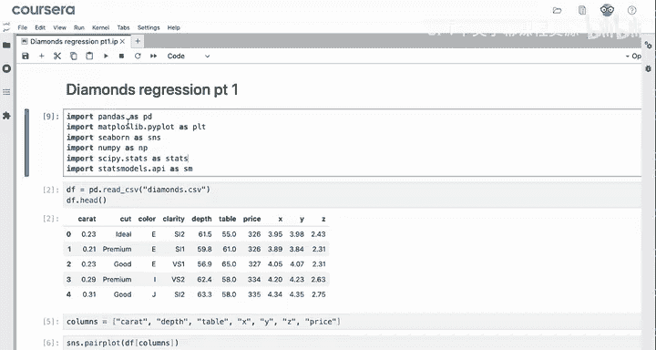

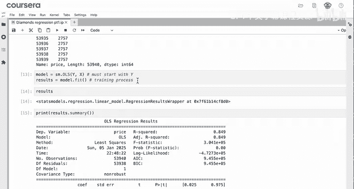

## 代码实现：单值预测

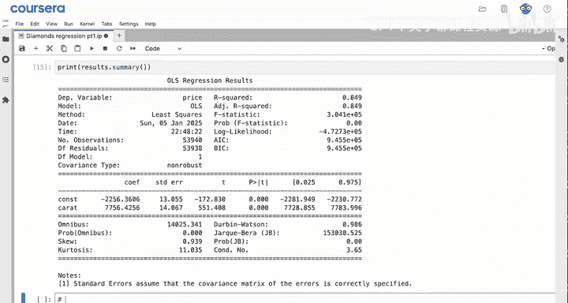

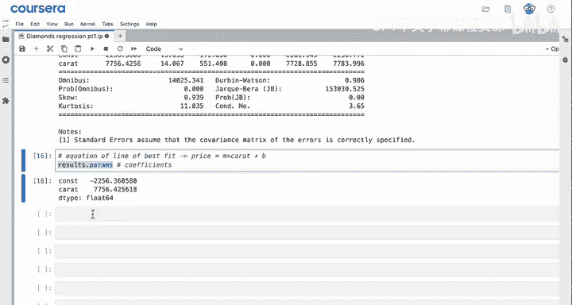

我们已经完成了数据导入、加载以及使用克拉数预测价格的线性回归模型拟合。

模型系数可用于构建最佳拟合线的方程：**`y = mx + b`** 或 **`价格 = m * 克拉数 + b`**。系数存储在 `results.params` 中（`params` 代表参数）。

以下是获取并使用系数进行预测的步骤：

1.  **访问模型系数**：`results.params` 是一个Pandas Series对象，可以通过索引访问其值。
    *   `results.params[‘Carat’]` 给出斜率 **`m`**。
    *   `results.params[‘const’]` 给出截距 **`b`**。


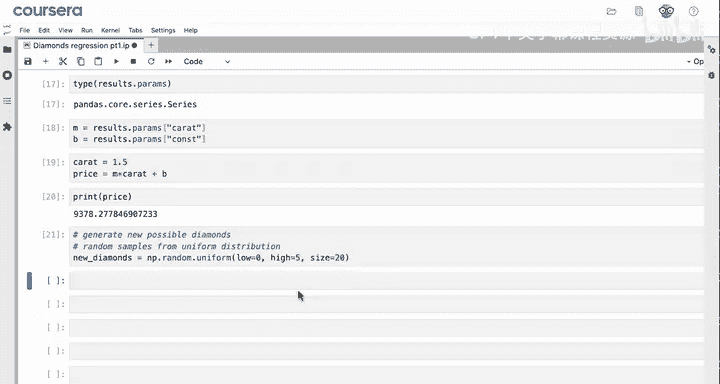

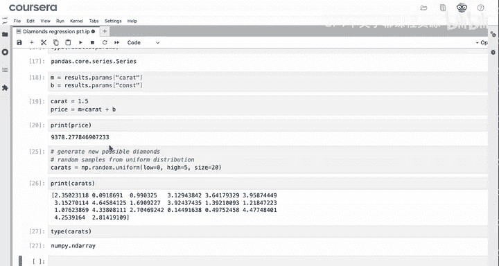

2.  **进行预测**：给定一个新的克拉值（例如1.5），将其赋值给变量 `carat`，然后使用方程计算预测价格。
    ```python
    carat = 1.5
    price = results.params[‘Carat’] * carat + results.params[‘const’]
    ```
    模型预测这颗1.5克拉的钻石价值约为9378美元。

---

## 代码实现：多值预测

为了同时预测多个值，我们可以对整个序列进行向量化运算。

首先，我们可以使用模拟方法生成一些新的钻石克拉数据来测试模型。以下是生成随机样本的方法：

```python
import numpy as np
carrots = np.random.uniform(low=0, high=5, size=20)
```
这段代码使用均匀分布，在0到5之间（原始数据的克拉范围）生成20个随机值，模拟20颗钻石的克拉数。`carrots` 变量是一个NumPy数组。

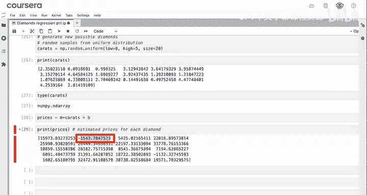


现在，将相同的预测方程应用于整个 `carrots` 数组，而不是单个值：

```python
prices = results.params[‘Carat’] * carrots + results.params[‘const’]
print(prices)
```

输出结果是每颗钻石的估计价格。


---

## 评估预测结果的合理性

观察这些预测价格，判断它们是否合理至关重要。

例如，第一颗2.35克拉钻石的预测价格为15973美元，这看起来合理，因为2.3克拉的钻石确实很大。然而，我们也看到了一个约为-1500美元的负值预测，这对应一颗0.09克拉的钻石。显然，钻石不可能有负价格。

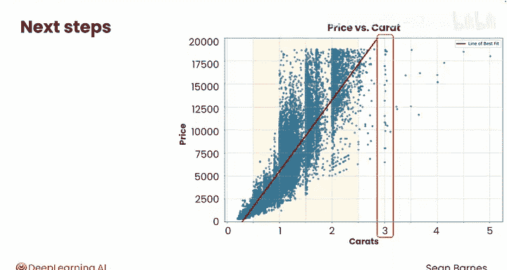

回顾最佳拟合线图，可以发现大部分数据点集中在0.5到2.5克拉之间。模型在这个数据密集区域预测效果最好。对于克拉数达到3的钻石，实际价格分布非常分散，模型的预测效果不佳。

了解模型的局限性后，我们可以调整模拟范围，使其只生成0.5到2.5克拉之间的钻石数据。这样，我们就在模型表现最好的范围内进行预测和应用。


---

## 总结与后续步骤

本节课中我们一起学习了如何利用线性回归模型预测新数据点。

以下是核心要点总结：
*   使用 `results.params[‘Carat’]` 和 `results.params[‘const’]` 访问计算出的 **`m`** 和 **`b`** 值。
*   对于单个新值（如1.5克拉），使用方程 **`m * carat + b`** 进行预测。
*   通过将公式中的单个值替换为一个序列（Series/Array），可以一次性预测多个值，得到一个预测价格的NumPy数组。
*   必须了解模型预期的输出类型，审查其输出结果，并判断这些结果是否合乎逻辑。

在本课程中，你已经深入学习了线性回归：它的概念原理、如何训练模型以及如何使用Python代码进行预测。

接下来，你将完成本课的练习作业和实验。在实验环节，你将开发一个新模型来预测伦敦的房价。完成作业和实验后，我们将在下一课中见面，学习如何开发包含多个变量的线性回归模型。

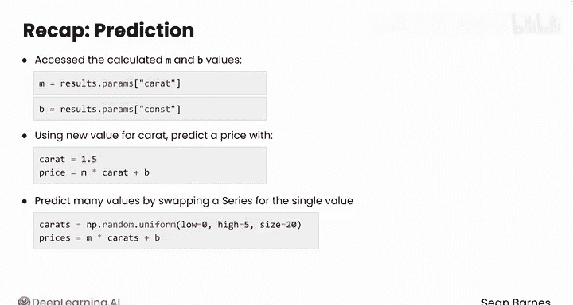

