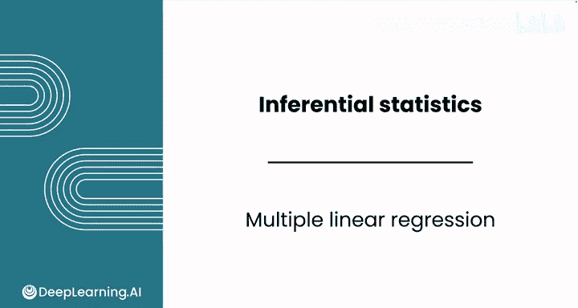
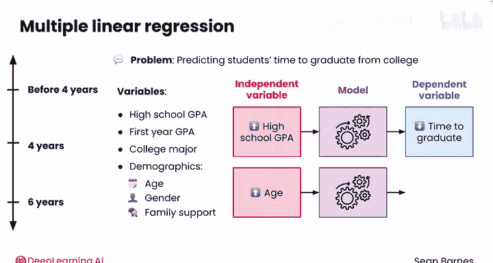
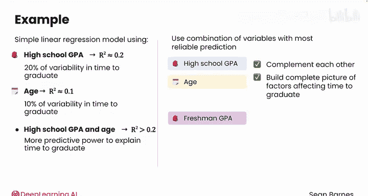
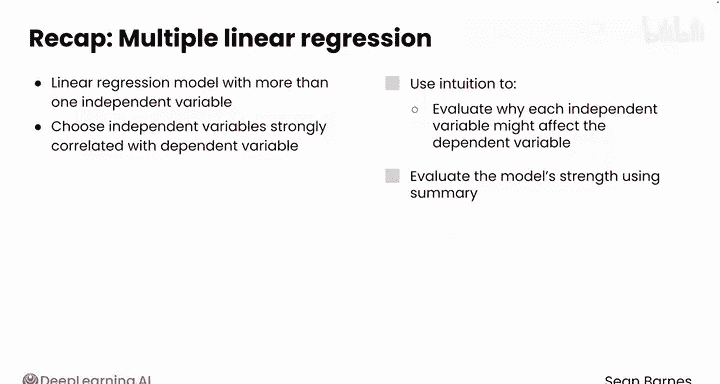

# 073：多元线性回归 📊

在本节课中，我们将要学习如何将线性回归模型从单一自变量扩展到多个自变量，即多元线性回归。我们将探讨为何使用多个变量能提升模型的预测能力，并通过一个预测大学毕业时间的实例来理解其应用。

## 概述

线性回归是建模两个变量之间关系的优秀技术。你也可以将模型扩展到单个自变量之外，创建多元线性回归模型。

上一节我们介绍了简单线性回归，它作为起点和推断分析很有用。你可以选择一个强预测因子来建立一个好的基线模型。例如，在上节课中我们看到，克拉数预测了钻石价格约85%的变异性。

然而，对于许多问题，使用多个自变量可以显著提高模型的预测能力。你难道不想做得比85%更好吗？

## 设计多元回归模型

本节中，我们来看看如何为实际问题选择自变量。考虑预测大学生的毕业时间。一个人可能提前毕业，可能在传统的四年制时间点之前，也可能按时在四年毕业，或者可能需要更多学期，比如长达六年（这是分析中常见的截止点）。

许多大学有兴趣了解哪些因素能预测一个人的毕业时间。识别可能花费更长时间毕业的学生有助于提供早期支持，而识别可能提前毕业的学生则有助于课程容量规划。

你认为可以使用一个人的哪些变量来帮助预测其毕业时间？有很多选择，但可能会想到的几个是：高中GPA、第一年GPA、大学专业以及年龄、性别和家庭支持等个人属性。

### 评估自变量

以下是评估自变量与因变量关系的一些思考：

*   **考虑高中GPA**：随着高中GPA的提高，你预计毕业时间会如何变化？平均而言，它应该下降，因为学生更有可能在课程学习中取得成功。这个变量似乎很大程度上捕捉了学生的学术能力。
*   **考虑自变量年龄**：年龄如何影响一个人的毕业时间？更高的年龄可能预示着更长的毕业时间，因为年龄较大的学生通常需要平衡工作、家庭和学校的多重责任。这种关系似乎更多是关于个人的生活状况，而非学术能力。

这两个变量都可以帮助你预测毕业时间，而且它们似乎捕捉了个人可能花费更多或更少时间毕业的不同根本原因：学术能力与个人状况。

### 组合变量的力量

想象你创建了一个使用高中GPA预测毕业时间的简单线性回归模型。该模型的R平方可能在0.2左右，因此它解释了毕业时间约20%的变异性。你也可以创建一个使用年龄的简单线性回归模型，其R平方可能为0.1，解释了约10%的变异性。

或者，你可以创建一个多元线性回归模型，将毕业时间预测为高中GPA和年龄的函数。你希望新模型中的R平方值发生什么变化？当结合这两个变量时，你希望看到R平方值高于0.2。如果这两个变量确实衡量了影响毕业时间的两个不同根本原因，那么当同时考虑这两个因素时，你的模型将具有更强的预测能力来解释毕业时间。

你可以进一步扩展这个模型，以包含更多变量，如第一年GPA，甚至是分类变量如性别。通常，你会希望使用最能可靠预测因变量的变量组合。高中GPA和年龄相互补充得很好，因为它们有助于更完整地构建影响毕业时间的不同因素图景。

将第一年GPA添加到此模型中可能不会带来巨大改进，因为它可能解释了与高中GPA相同的部分毕业时间变异，但你仍然应该尝试。试验不同的变量组合，甚至可能是重叠的变量，以找出最有效的方法。

## 总结

本节课中我们一起学习了如何创建包含多个自变量的线性回归模型。这种技术称为多元线性回归。与简单线性回归模型一样，你需要选择与因变量强相关的自变量。运用你的直觉来评估每个自变量为何可能显著影响因变量。直觉是一个有用的指导，但你最终需要使用模型摘要来评估模型的强度。请记住，分析的最佳方法是将你的直觉与数据驱动的见解结合起来。

现在你已经了解了如何设计多元线性回归模型，请跟随我到下一个视频，看看代码的实际应用。