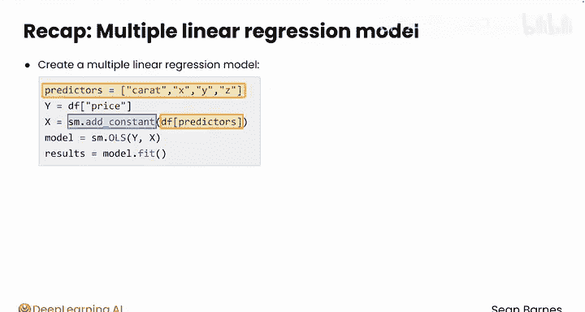
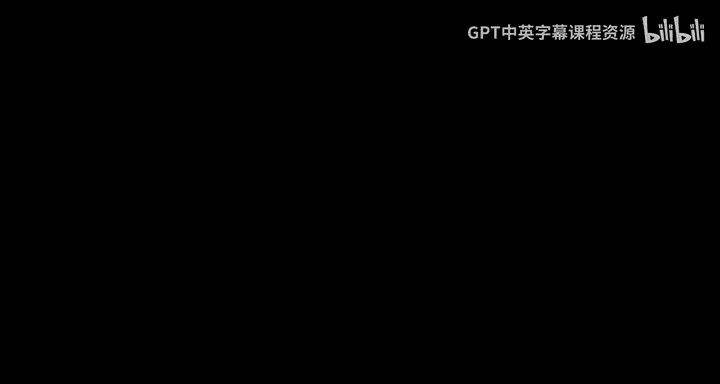

# 074：多元线性回归模型训练 🚀

在本节课中，我们将学习如何将简单的线性回归模型扩展为多元线性回归模型。我们将使用多个自变量来预测钻石价格，并通过代码实现这一过程。

---

## 概述

你已经了解了如何使用线性回归模型。之前，我们开发了一个仅根据钻石克拉数预测其价格的模型。该模型的R平方值约为0.85，表明克拉数可以解释价格约85%的变异性。然而，这个模型的准确度仍有提升空间。客户反馈需要更精确的模型。我们手头还有其他潜在的自变量，如尺寸（X, Y, Z）、切工和颜色，这些特征可能从不同方面影响价格，从而帮助我们提高模型的准确性。

本节我们将从添加钻石的长度（X）这一特征开始，构建一个多元回归模型。

---

## 从简单回归到多元回归

上一节我们介绍了如何使用单一变量（克拉数）进行预测。本节中，我们来看看如何将模型扩展为包含多个预测变量。

假设我们想在模型中添加钻石的尺寸。其中，X代表钻石面朝上时的长度。现在，我们的模型将估计三个系数，而不再是两个。模型公式将从 `价格 = m * 克拉数 + B` 变为包含多个变量的形式。

让我们使用M1和M2作为系数符号，模型公式可能类似于：
**价格 = M1 * 克拉数 + M2 * X + B**
你的模型将计算M1、M2和B的值。

---

## 代码实现步骤

以下是构建多元线性回归模型的具体步骤。我们将基于之前的简单线性回归代码进行修改。

首先，回顾一下之前的步骤：你已经导入了必要的模块，加载了数据，并拟合了仅使用克拉数预测价格的线性回归模型。

1.  **修改预测变量列表**：在简单线性回归中，`X` 只包含“克拉数”一列。现在，我们需要将其改为一个预测变量列表。
    ```python
    # 定义预测变量列表
    predictors = ['carat', 'x']
    X = df[predictors]
    ```
    这段代码将选择数据框中‘carat’和‘x’这两列作为自变量。

2.  **添加常数项**：与简单回归一样，我们需要使用 `sm.add_constant` 为模型添加截距项。
    ```python
    X = sm.add_constant(X)
    ```
    现在，你的自变量数据框 `X` 将包含三列：常数项、克拉数和X。

3.  **拟合模型与查看结果**：使用 `sm.OLS` 拟合模型并打印摘要，代码与之前相同。
    ```python
    model = sm.OLS(y, X)
    results = model.fit()
    print(results.summary())
    ```
    `statsmodels` 会为列表中的每一个自变量（包括常数项）生成一个系数。

---

## 模型结果分析

运行上述代码后，你的回归模型得到了小幅改进，R平方值提升了约0.5个百分点。这表明，在克拉数的基础上增加X特征，确实能稍微更好地预测钻石价格。

查看三个系数的P值，它们都具有统计显著性。
*   克拉数的系数现在约为 **10130**（以科学计数法显示），高于之前的简单模型。
*   X的系数为 **-127**。
*   截距项的系数也下降至 **-1738**。

在下一节视频中，你将学习如何更深入地解释这些系数的含义。

---

## 使用模型进行预测

你可以使用与之前相同的逻辑来预测新钻石的价格，只需在公式中加入新的变量。

例如，查看索引为2107的钻石。它的克拉数为1.5，X为7.13毫米，真实价格为8580美元。

以下是预测其价格的步骤：

1.  保存特征值。
    ```python
    carat_value = 1.5
    x_value = 7.13
    ```
2.  根据模型结果获取系数。
    ```python
    M1 = results.params['carat']
    M2 = results.params['x']
    B = results.params['const']
    ```
3.  更新价格预测公式。
    ```python
    predicted_price = M1 * carat_value + M2 * x_value + B
    ```
    运行此代码，你得到的预测价格约为9605美元。

---

## 尝试添加更多变量

根据R平方值，模型仅略有改善。你可以尝试将更多变量（如Y和Z）添加到预测变量列表中，然后再次运行相同的代码。

以下是需要更新的代码部分：
```python
predictors = ['carat', 'x', 'y', 'z'] # 将y和z加入列表
X = df[predictors]
X = sm.add_constant(X)
# ... 后续拟合和摘要代码不变
```
运行后，你会发现R平方值仅提高了0.1%，改善微乎其微。尽管这些新变量的系数P值仍接近0，具有显著性，但对于之前例子中的那颗钻石，预测价格变为约9521美元，准确度并未提升。

请不要气馁。构建回归模型是一个迭代过程，需要通过大量实验才能找到真正提升模型准确性的方法。

---

## 总结



本节课中，我们一起学习了如何创建多元线性回归模型。

*   **核心方法**：创建多元线性回归模型的代码与创建简单模型几乎相同。唯一区别在于，你需要创建一个预测变量列表，而不是使用单个变量。
    ```python
    predictors = [‘carat‘, ‘x‘, ‘y‘] # 示例列表
    X = df[predictors]
    X = sm.add_constant(X)
    ```
*   **结果解读**：在模型结果摘要中，每个自变量都会有一个P值和一个系数。你可以使用P值来判断，在模型存在其他变量的情况下，该变量是否仍是显著的预测因子。
*   **进行预测**：然后，你可以使用包含多个自变量及其对应系数的方程来预测新值。



**解读多元线性回归模型需要考虑变量在模型中的上下文关系。** 在接下来的视频中，我们将学习如何进行负责任的、细致的模型解读。