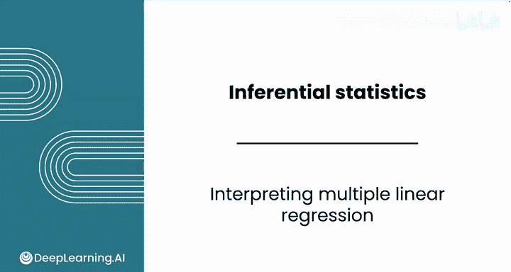
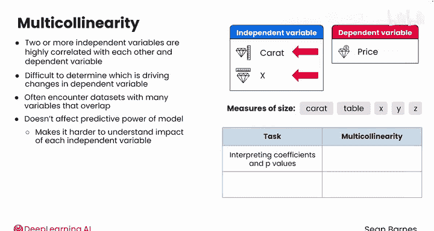

# 075：Python数据分析（第3课）｜多元回归结果解读 📊

在本节课中，我们将学习如何解读多元线性回归模型的结果。我们将重点关注R平方值、P值、系数的含义，并探讨多重共线性这一常见问题及其影响。

---

## 多元回归模型解读概述 📈

上一节我们介绍了如何构建多元线性回归模型。本节中，我们来看看如何解读模型输出结果。

向模型添加更多变量时，解读需要更加谨慎。在之前的视频中，我们构建了一个多元线性回归模型，基于克拉重量（carat）、X、Y和Z尺寸预测钻石价格，得到了如下结果摘要。

R平方值为0.854，相比仅使用克拉重量的简单模型仅有轻微提升。P值接近0表明每个预测变量都是显著的。

解读多元线性回归模型时，必须在模型的整体背景下得出结论。例如，此处的R平方值反映了整个模型的预测能力，而不仅仅是克拉重量一个变量。模型可以使用这些变量解释约85.4%的价格变动，但无法得出每个变量对解释力各自贡献多少的结论。

P值和系数应在模型背景下考虑。

---

## 系数与P值的解读 🔍

以下是解读模型系数和P值的关键点：

**克拉重量（carat）的解读**
对于克拉重量，其接近0的P值表明它与价格存在非零关系。更具体地说，如果所有其他变量（X、Y、Z）保持不变，克拉重量的变化仍会影响钻石价格。因此，如果两颗钻石尺寸相同，重量（克拉）更高的那颗价格会更贵。

克拉重量的系数表明，在其他所有变量保持不变的情况下，重量每增加1克拉，钻石价格预计增加10230美元。

模型的系数有助于理解各变量对价格影响的大小，但难以解释其影响价格的原因。

---

## 多重共线性现象 🔄

例如，在早期视频中调查数据集关系时，我们看到了X轴为x尺寸、Y轴为价格的类似图表。你看到的是正相关还是负相关关系？这是正相关关系，因为x增加，价格也上升。

然而，模型为x计算出了一个负系数。模型计算表明，x每增加一个单位，价格下降884美元。这个系数与我们对x和价格关系的直觉不匹配。

这种不匹配的发生，是因为克拉重量和x都与因变量价格高度相关，并且彼此之间也高度相关。这种现象称为多重共线性。当克拉重量和x一同变动时，模型很难厘清究竟是哪一个在推动价格上涨。因此，模型使用两个变量共同捕捉对因变量的整体影响。

在实践中，这可能表现为一个变量具有正系数，而另一个具有负系数。

---

## 多重共线性的定义与影响 ⚠️

当两个或更多自变量彼此高度相关，并且也与因变量高度相关时，就会发生多重共线性。例如，考虑钻石数据集中的克拉重量和X尺寸，它们高度相关。钻石越重，通常尺寸也越大。

当两个变量高度相关时，模型很难确定究竟是哪个变量在驱动因变量（价格）的变化。这颗钻石更贵是因为它更重，还是因为它更大？

多重共线性很常见，因为经常会遇到许多变量在解释内容上存在重叠的数据集。例如，钻石数据集包含许多衡量钻石重量或尺寸的指标，包括克拉重量、台面、X、Y、Z等，这些指标都彼此相关。

它通常不会影响模型的整体预测能力，但会使理解每个自变量的个体影响变得更加困难。因此，在解读系数和P值时，多重共线性很重要。如果是在预测新的数据点，则影响不大。

---

## 识别与处理多重共线性 🛠️

在回归结果表中，如果statsmodels怀疑模型中存在多重共线性，通常会给出警告，但多重共线性也可能在没有此警告的情况下发生。

以下是处理多重共线性的方法：

**处理选项**
一种选择是移除高度相关的自变量，只保留其中一个。也可以采用更复杂的解决方案，例如创建这些多个变量的组合特征。这些解决方案超出了本课程的范围，但需要知道的是，你有很多选项来解决这个问题。

---

## 总结与下一步 🎯

本节课中，我们一起学习了如何解读多元回归模型的结果。我们理解了R平方值、P值和系数的含义，并深入探讨了多重共线性现象及其对模型解释的影响。

当多元线性回归模型未能显著提升R平方值时，可以尝试添加分类变量。请跟随我到下一个视频，学习将分类变量纳入回归模型的关键技术。