# 076：分类数据编码 📊

在本节课中，我们将学习如何将分类变量（如文本类别）转换为数值形式，以便将其纳入线性回归模型进行分析。分类变量是数据分析中常见的数据类型，但统计模型通常只接受数值输入。我们将通过一个钻石数据集的实例，详细介绍编码过程。

## 概述

线性回归模型要求所有预测变量都是数值型的。然而，数据集中的分类变量（例如钻石的颜色、产品的品牌）包含的是非数值信息。为了在模型中使用这些变量，我们必须对它们进行“编码”，即将其转换为数值格式。本节将介绍使用Pandas库的`get_dummies`函数进行“独热编码”的方法。

## 分类变量编码的必要性

上一节我们介绍了多元线性回归模型。本节中我们来看看如何处理分类变量。

你可以将分类变量加入模型以提高其性能。但是，这些变量需要一些额外的预处理步骤。你一直在使用的用于创建线性回归模型的`statsmodels`库的`OLS`函数不接受非数值变量。因此，为了将分类变量用作预测变量，你需要将其转换为数字。

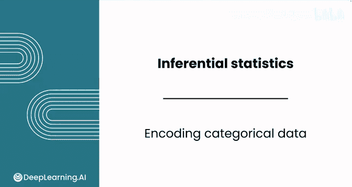

## 实例：钻石颜色编码

让我们通过使用钻石数据集中的“颜色”特征来逐步讲解一个例子。该特征包含从D到J的值。D代表无色钻石，这是最佳等级，钻石从D到J颜色逐渐变黄。

在你的数据中，可能有10颗钻石具有这些颜色值。将这些类别编码为数值最直接的方法是使用一个名为`get_dummies`的Pandas函数。该函数将创建新列，每个类别对应一列。如果钻石不是该颜色，则在该列中分配0；如果是该颜色，则分配1。

因此，对于第一行，你会在“颜色_H”列中得到1，在其他所有列中得到0。最后一个复杂之处是，请注意没有“颜色_D”列。因此，第二行只有0。

这种省略一个可能类别的技术可以去除冗余信息。如果你知道一颗钻石不是任何其他颜色，你就不需要说它是颜色D。如果你知道一颗钻石是任何其他颜色，你就知道它不是颜色D。你必须完成此步骤以避免模型拟合时出现问题。

## 在模型中加入颜色变量

假设在本笔记本中，你已经导入了模块，将数据读入变量`df`，并基于之前的变量开发了一个预测钻石价格的多元线性回归模型。现在，你希望根据客户的要求进一步提高其准确性。

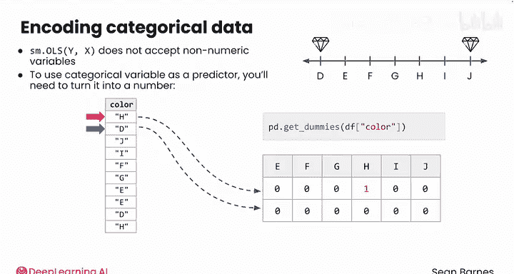

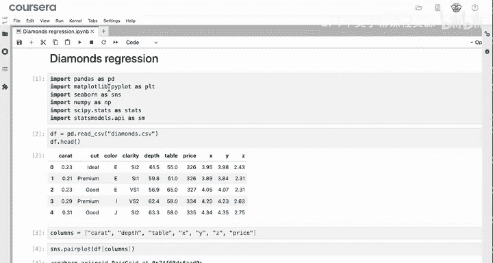

“颜色”似乎是一个有用的潜在自变量，因为它可能比像X、Y和Z这样的变量提供更多的附加预测能力，而这些变量可能与“克拉”重量冗余。你已经看到，此数据集中的独特颜色是从D到J，以字母表示。

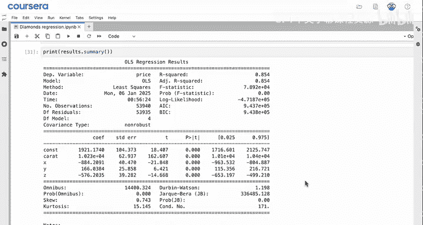

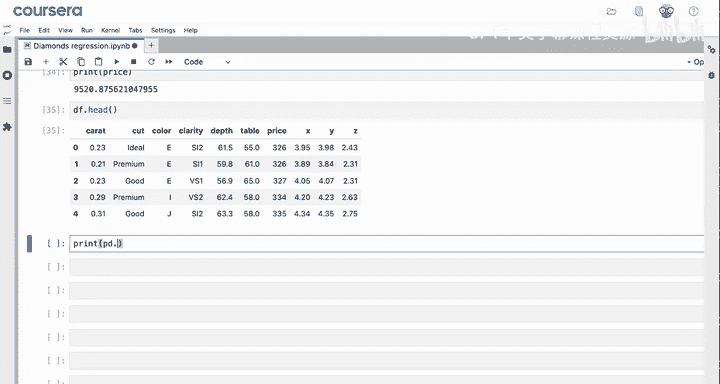

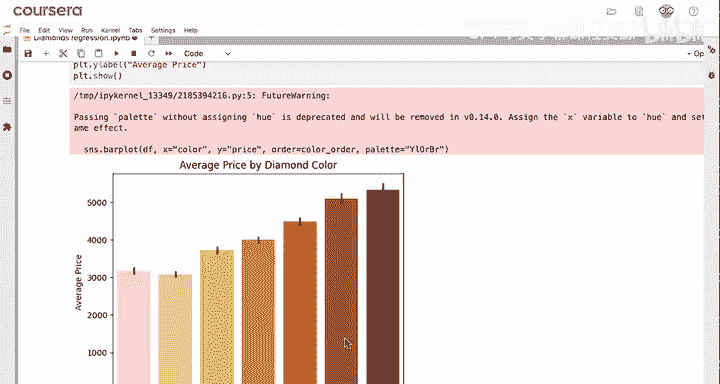

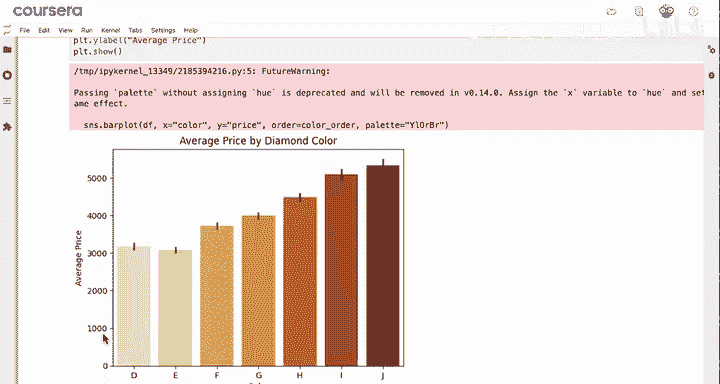

一个好的做法是使用Seaborn库的条形图来显示颜色和价格之间的关系。在X轴上，你有钻石的颜色；在Y轴上，有其平均价格。你可以忽略之前见过的未来警告。

仅看此图，在没有其他信息的情况下，颜色D和E的钻石价格似乎非常相似。然后价格开始上涨，一直增加到J。根据你对颜色的了解，这似乎不正确。为什么完美的无色钻石会比偏黄的钻石价值更低？你需要进一步调查。

要将颜色变量添加到回归模型中，首先将其添加到预测变量列表中。然后，你需要使用`pd.get_dummies`函数。

以下是使用`get_dummies`函数的关键步骤：

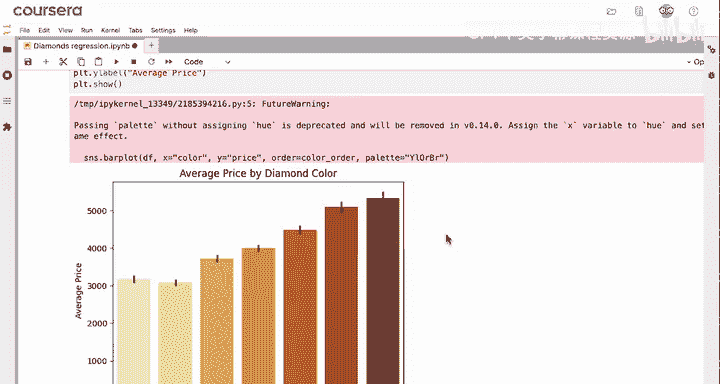

1.  **指定要编码的列**：使用`columns`参数列出你想要转换为虚拟变量的列名。
2.  **删除第一列以避免冗余**：设置`drop_first=True`参数。这是必要步骤，可以防止“虚拟变量陷阱”。
3.  **确保输出为数值类型**：设置`dtype=int`参数，确保输出是整数（0或1）而不是布尔值。

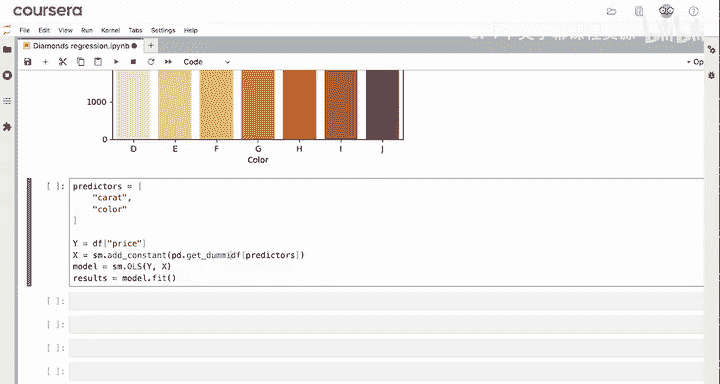

核心的编码公式如下：
```python
encoded_predictors = pd.get_dummies(df[predictors], columns=[‘color’], drop_first=True, dtype=int)
```

第一个钻石是颜色E，因为该列的值为1。第二个也是E，第五个是J。请注意，没有D列，因为第一个类别被删除了。因此，颜色为D的钻石的每一列都将是0。

## 处理布尔值输出与模型拟合

注意，这些值最初都是布尔类型。下一步你应该尝试拟合模型。但运行模型时，你会得到错误。事实证明，`statsmodels`的`OLS`只适用于数值数据。这正是你最初处理虚拟变量的原因。

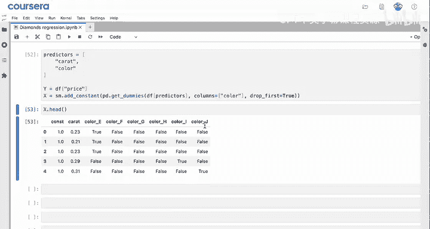

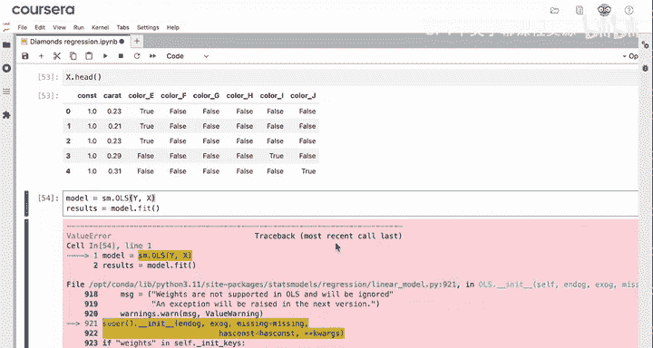

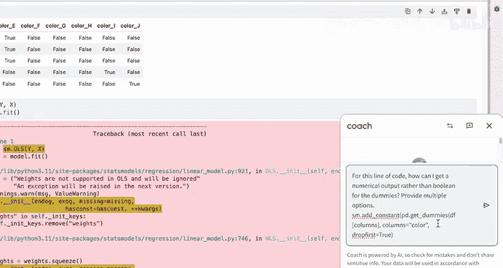

让我们向大语言模型寻求此任务的帮助。对于这行代码，如何获得虚拟变量的数值输出而不是布尔值？它提供了多个选项。

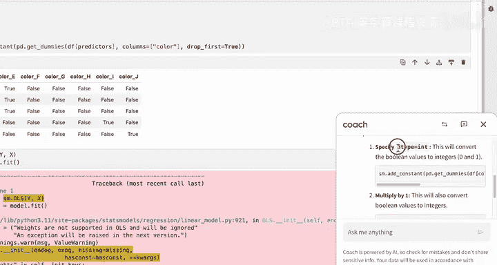

大语言模型给了你几个选择。首先，它告诉您可以在`pd.get_dummies`函数中指定`dtype=int`。让我们使用第一个选项。

进行更改并再次运行该代码，你现在有了数字，这正是你需要的。作为人类阅读起来也更容易一些。

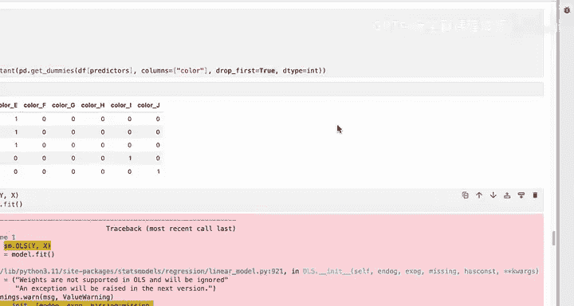

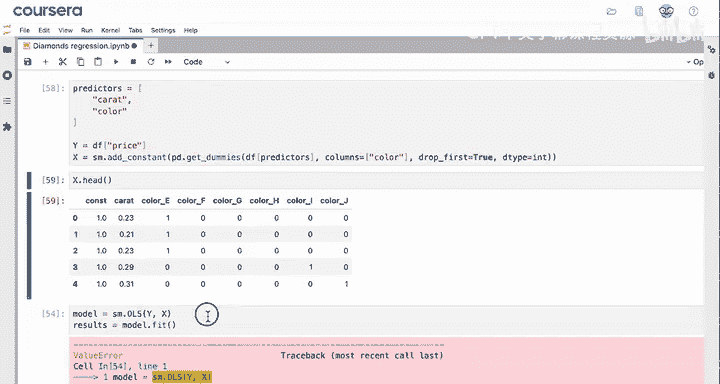

## 总结

本节课中我们一起学习了分类数据编码的核心方法。

总结一下，你使用`pd.get_dummies`函数对分类数据进行编码。你使用了三个关键参数来使数据适合回归分析：
*   `columns`参数指定你想要编码的列。
*   `drop_first=True`参数用于删除冗余数据。请记住，此步骤是必要的。
*   最后，`dtype=int`参数确保在结果数据框中得到数字而不是布尔值。

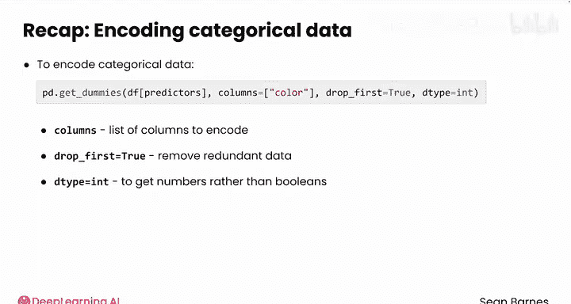

现在你已经设置好了分类数据，完成了将其添加到回归模型所需的大部分工作。请跟随下一节视频来训练你的新模型。