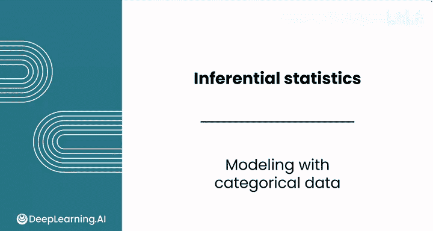
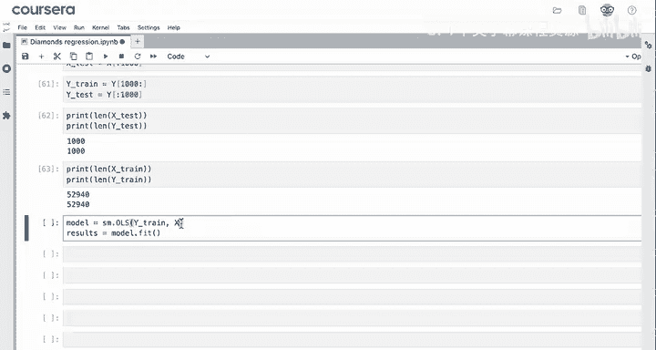
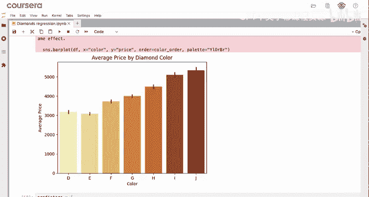
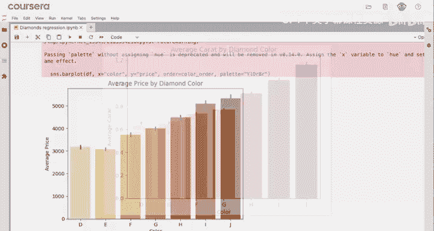
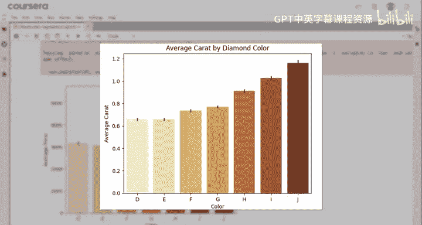
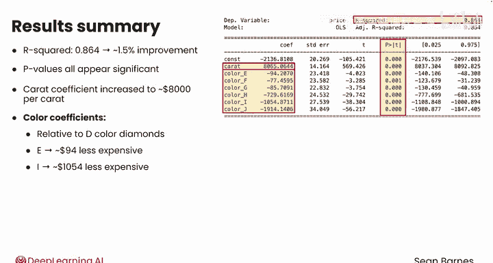
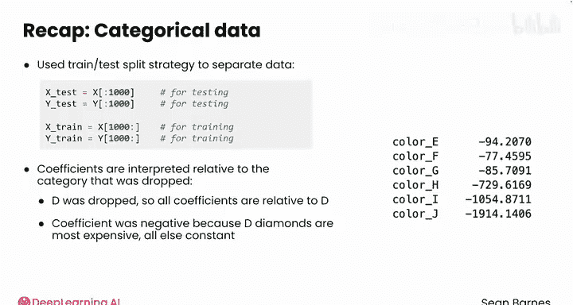

# 077：类别数据建模 📊

在本节课中，我们将学习如何将编码后的类别数据（哑变量）作为预测因子纳入线性回归模型，并解释模型结果。我们将使用钻石数据集，重点关注颜色这一类别变量。

---

## 概述

上一节我们介绍了如何使用 `pd.get_dummies` 将类别变量（如钻石颜色）转换为哑变量。本节中，我们将把这些哑变量加入线性回归模型，进行训练与测试数据分割，并深入解读模型系数。

## 构建模型



在将颜色编码为哑变量后，数据框现在包含了“克拉”和代表各个颜色等级的哑变量列。现在可以构建线性回归模型。

为了评估模型在新数据上的表现，通常需要将数据分割为训练集和测试集。

以下是数据分割步骤：



1.  **设定测试集大小**：例如，预留1000颗钻石的数据作为测试集。
2.  **分割特征数据 (X)**：
    *   `X_test`：数据框的前1000行。
    *   `X_train`：数据框从第1000行开始到末尾的所有行。
3.  **分割目标数据 (Y，即价格)**：
    *   `y_test`：价格列的前1000个值。
    *   `y_train`：价格列从第1000个值开始到末尾的所有值。

**关键点**：必须确保 `X` 和 `y` 的行是对齐的，即 `X_test` 和 `y_test` 对应同一批钻石，`X_train` 和 `y_train` 对应另一批钻石。

```python
# 假设 df 是包含特征（包括哑变量）的数据框，y 是价格列
X_test = df.iloc[:1000]   # 前1000行作为测试特征
X_train = df.iloc[1000:]  # 第1000行之后作为训练特征

y_test = y.iloc[:1000]    # 前1000个价格作为测试目标
y_train = y.iloc[1000:]   # 第1000个价格之后作为训练目标
```

分割后，`X_test` 和 `y_test` 的长度都应是1000，`X_train` 和 `y_train` 的长度应大致相同（约53000）。

## 训练模型与评估

使用与之前相同的代码拟合模型，只需将数据替换为训练集。

```python
from sklearn.linear_model import LinearRegression

model = LinearRegression()
model.fit(X_train, y_train)  # 使用训练数据拟合模型
```

查看模型的 R² 值，发现相比仅使用“克拉”作为特征的模型，新模型的解释力提升了约1.5%。检查每个系数的 P 值，它们都显示为显著，因此可以继续解读系数。

## 解读模型系数

模型的系数揭示了有趣的信息。

*   **克拉系数**：现在约为 **8000美元/克拉**（在其他条件不变的情况下）。这意味着，在控制颜色等因素后，每增加一克拉，钻石价格平均上涨约8000美元。







*   **颜色哑变量系数**：解读这些系数需要特别注意。每个颜色的系数是相对于被**丢弃（Dropped）** 的基准类别而言的。在创建哑变量时，我们设置了 `drop_first=True`，因此颜色“D”被作为基准类别，没有出现在特征中。

以下是颜色系数的解读方式：

*   系数为负值，意味着该颜色等级的钻石平均价格**低于**基准类别（D色）钻石。
*   例如：
    *   E色钻石的系数约为 **-94美元**。这意味着，在克拉数相同的情况下，E色钻石的平均价格比D色钻石低约94美元。
    *   I色钻石的系数约为 **-1054美元**。这意味着，在克拉数相同的情况下，I色钻石的平均价格比D色钻石低约1054美元。

## 发现数据中的洞察

这个结果帮助我们解释了一个最初看似矛盾的数据模式。

回顾之前颜色与价格的条形图，I色和J色钻石的平均价格似乎更高，这容易让人误以为颜色越黄（等级越低）越值钱。

然而，回归分析结合另一个事实（颜色越黄，钻石克拉数往往越大）揭示了真相：



1.  颜色等级较低（如I、J色）的钻石，其**平均克拉数更大**。
2.  克拉数是价格的主要驱动因素。
3.  因此，I、J色钻石的平均价格更高，主要是**因为它们的克拉数更大，而非颜色本身**。

对于两颗克拉数完全相同的钻石，一颗是D色，一颗是J色，D色钻石的价值会更高。回归模型通过控制变量（克拉数），帮助我们剥离了颜色对价格的直接影响，从而发现了这一深层关系。

## 总结

本节课中我们一起学习了：



1.  **训练-测试分割**：我们使用切片操作将数据分割为训练集和测试集，这是一种评估模型泛化能力的标准做法。
2.  **模型训练**：我们使用包含类别哑变量的特征训练了线性回归模型，并观察到模型性能的提升。
3.  **系数解读**：我们学会了如何解读哑变量的系数——它们总是相对于被丢弃的基准类别而言的。在本例中，所有颜色系数均为负，表明在控制克拉数后，D色钻石是最昂贵的。
4.  **数据洞察**：模型结果帮助我们纠正了一个初步的误解，揭示了“低颜色等级钻石价格更高”的现象主要是由其更大的尺寸（克拉数）驱动的，而非颜色本身。

通过引入类别变量，我们不仅改进了模型，还获得了对数据更深刻、有时是反直觉的理解。在下一节中，我们将使用这个改进后的模型来预测新钻石的价格。