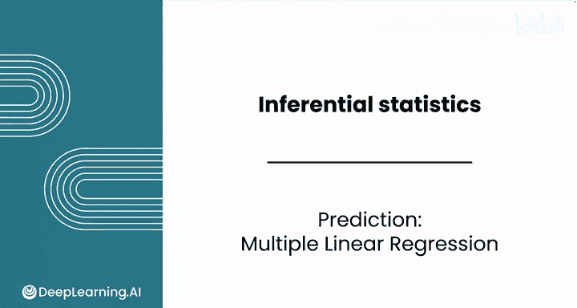
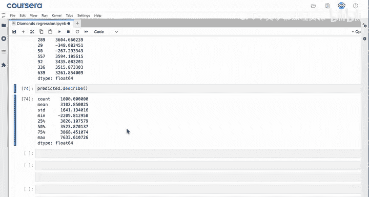
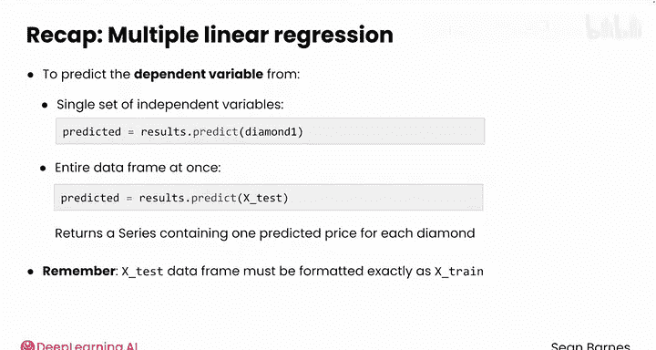

# 078：多元回归预测 📊

在本节课中，我们将学习如何使用训练好的多元线性回归模型，对新的数据点进行预测。我们将从单个数据点的预测开始，然后扩展到对整个测试数据集进行批量预测，并讨论预测过程中需要注意的关键事项。

---

## 模型预测概述

上一节我们介绍了如何构建一个使用克拉重量和颜色来预测钻石价格的多元线性回归模型。本节中，我们来看看如何使用这个训练好的模型进行实际预测。

一旦你开发出一个改进的模型，就可以用它来预测新数据点的因变量。

让我们从上次停止的地方继续。你已经导入了必要的模块，读取了数据，并使用克拉重量和颜色作为自变量，以钻石价格为因变量，建立了一个线性回归模型。你使用 `pd.get_dummies()` 对颜色变量进行了编码，并预留了1000行数据存储在变量 `X_test` 中用于测试。

---

## 预测单个钻石价格

现在，你可以使用 `results.predict()` 方法来预测一颗新钻石的价格。

以下是具体步骤：



首先，查看 `X_test` 变量中的第一颗钻石。使用 `X_test.iloc[0]` 将其保存到一个新变量 `diamond_1` 中并查看。

```python
diamond_1 = X_test.iloc[0]
print(diamond_1)
```

你能看出这是一颗什么样的钻石吗？


这是一颗0.23克拉、E色的钻石。它非常小，颜色很纯净，但并非最纯净的等级。

接着，使用模型对这颗钻石进行预测：

```python
predicted_price = results.predict(diamond_1)
print(predicted_price)
```

你得到的预测价格是负364美元。这是一个非常低的价格。请记住，这个模型在处理非常小的钻石时表现有些挣扎。因此，尽管整体上这是一个优秀的模型，但对于像这样的小钻石，其价格会被低估。

为了验证，查看 `y_test.iloc[0]` 中这颗钻石的真实价格：

```python
actual_price = y_test.iloc[0]
print(actual_price)
```

真实价格是326美元。因此，对于价值数万美元的钻石而言，模型的预测误差大约为600美元。这个误差不算大，但对于这颗特定的钻石来说，是一个相当显著的误差。你将在接下来的视频中进一步评估模型的准确性。

---

## 批量预测多个钻石价格

你也可以一次性为所有1000颗测试钻石预测价格。

以下是具体操作：

```python
predicted = results.predict(X_test)
```

就这样简单。现在，让我们查看一下 `predicted` 变量。

你期望它是什么类型的数据？它是一个 `Series` 对象，即一列预测出的价格值。

如果你抽样查看10行数据，可以看到模型预测出的各种价格：

```python
print(predicted.sample(10))
```

在这里，你可以看到一颗钻石的预测价格大约在4000美元左右，另一颗大约在3600美元，同时你还会看到几个负的预测值，很可能又是针对非常小的钻石。

你还可以使用 `predicted.describe()` 来了解更多关于这个序列的信息：

```python
print(predicted.describe())
```

如预期所示，共有1000个值，平均价格约为3100美元，预测出的最高钻石价格大约在7600美元左右。

---

## 预测方法总结与关键点

回顾一下，你可以使用 `model.predict()` 来预测单个自变量集合（如 `X_test` 数据框中的一行）对应的因变量。或者，你也可以对整个数据框（如整个 `X_test`）使用 `model.predict()` 进行批量预测，之后你将得到一个包含每颗钻石预测价格的序列。

请记住，使这一切正常工作的关键是，你的 `X_test` 数据框的格式必须与用于训练模型的数据（在本例中是 `X_train`）**完全一致**。





如果不一致，当你进行预测时，可能会得到一些意想不到的结果，或者 `statsmodels` 可能会生成错误。


你在前面已经看到，你的模型对于某些值的预测效果并不理想。在下一个视频中，我们将一起探索在创建多元线性回归模型后，如何评估其性能。

---

## 本节课总结

在本节课中，我们一起学习了如何使用训练好的多元线性回归模型进行预测。我们掌握了如何对单个数据点进行预测，也学会了如何对整个测试集进行批量预测。最重要的是，我们理解了确保预测数据格式与训练数据格式一致是获得准确预测结果的关键。在下一课，我们将深入探讨如何评估模型的整体性能。