# 079：多元线性回归模型评估 📊

在本节课中，我们将学习如何评估一个已构建的多元线性回归模型。我们将超越简单的R平方值，探索通过比较预测值与实际值、可视化分析以及计算误差指标来全面理解模型性能的方法。

## 概述

上一节我们介绍了如何构建多元线性回归模型。本节中，我们来看看如何评估这个模型的性能。评估不仅限于解读结果摘要，还需要使用其他工具来理解模型的预测效果。

## 模型评估的核心方法

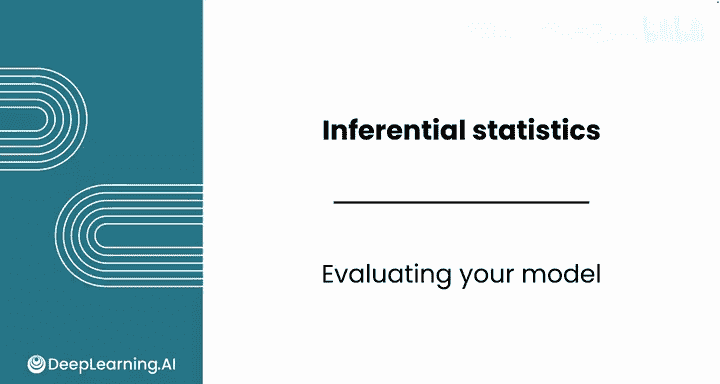

评估模型时，需要考虑R平方以外的指标。一个常见的技术是将模型的预测值与实际值进行比较，这样可以观察模型与现实情况的偏差。

以下是评估模型的主要步骤：

1.  **比较预测值与实际值**：通过可视化或计算相关性来评估。
2.  **计算残差**：理解每个预测的误差大小。
3.  **计算误差指标**：如平均绝对误差，量化模型的整体误差水平。

## 1. 可视化预测值与实际值

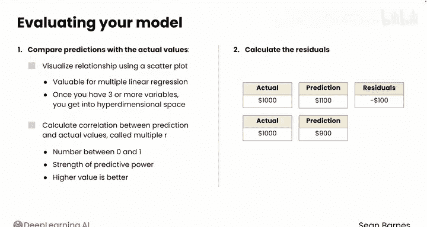

对于多元线性回归，由于涉及多个自变量，无法简单地通过自变量与因变量的散点图来评估模型拟合度。当变量达到3个、4个、5个或更多时，我们就进入了超维空间。

因此，一个有效的方法是绘制**预测值**与**实际值**的散点图。

**代码示例：创建散点图**
```python
# 假设 model 是已训练好的模型，X_test 和 y_test 是测试集
y_pred = model.predict(X_test)
y_actual = y_test

# 使用 seaborn 绘制带回归线的散点图
import seaborn as sns
sns.regplot(x=y_pred, y=y_actual, line_kws={'color': 'black'})
```
在这个散点图中，X轴是预测价格，Y轴是实际价格。在理想情况下，预测值与实际值应呈完美正相关，即所有点都应落在 `y = x` 这条直线上。

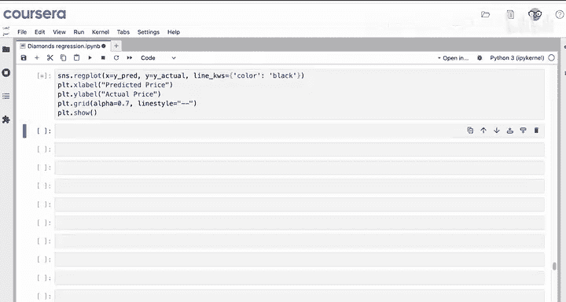

**代码示例：添加理想参考线**
```python
import matplotlib.pyplot as plt
# 在现有图形上添加 y=x 的红色虚线
plt.plot([y_actual.min(), y_actual.max()], [y_actual.min(), y_actual.max()], 'r--')
plt.show()
```
通过观察散点图，我们可以判断预测值与实际值的线性关系以及是否存在系统性偏差（例如，模型是否持续高估或低估某些价格区间的钻石）。

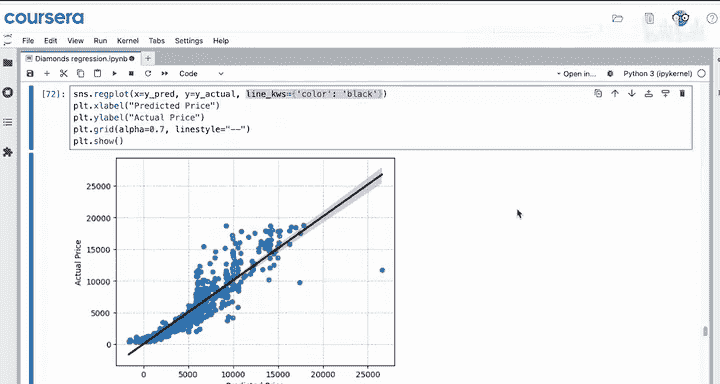

## 2. 计算多重相关系数

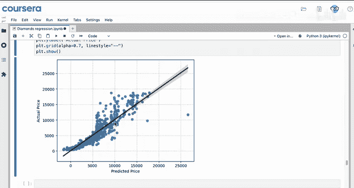

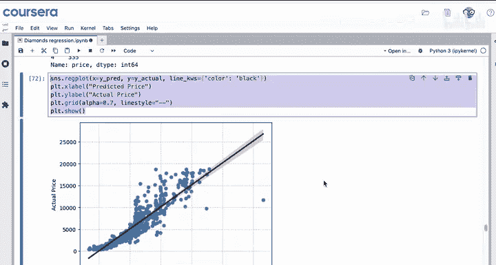

除了可视化，我们还可以量化预测值与实际值的相关性，这个指标称为**多重R**。

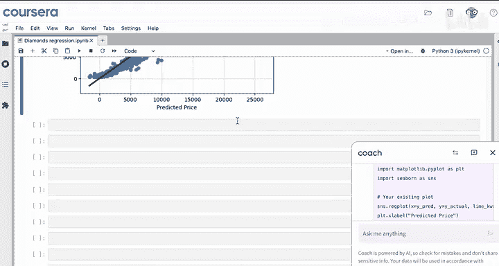

**公式与代码**
多重R是预测值与实际值之间的相关系数，其值在0到1之间，值越高表示模型的预测能力越强。
```python
multiple_r = y_pred.corr(y_actual)
print(f"多重R (预测值与实际值的相关系数): {multiple_r}")
```
如果得到的值接近0.93，则表明尽管可能存在非线性关系，但预测值与实际值高度相关。

## 3. 计算残差与平均绝对误差

**残差**是模型评估的关键概念，它表示实际值与预测值之间的差异。

**公式**
`残差 = 实际值 - 预测值`

*   如果实际价格为1000美元，模型预测为1100美元，则残差为 `1000 - 1100 = -100` 美元（负值表示模型高估）。
*   如果实际价格为1000美元，模型预测为900美元，则残差为 `1000 - 900 = +100` 美元（正值表示模型低估）。

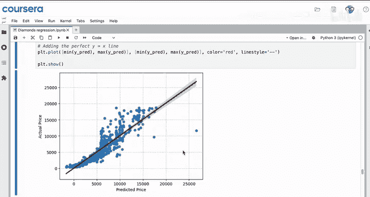

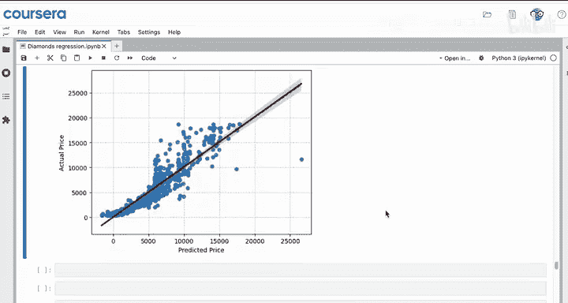

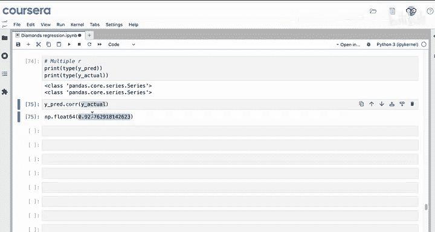

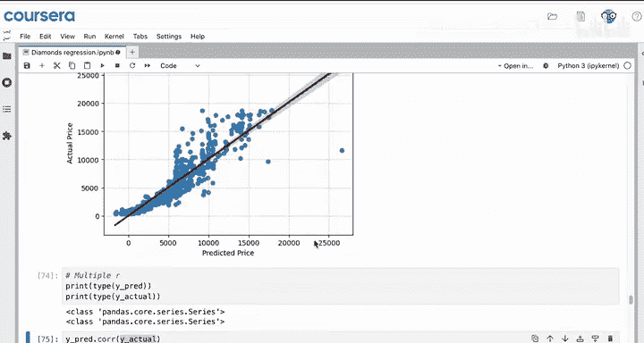

可以将残差理解为模型需要调整其预测以使其正确的量。

**代码示例：计算残差与MAE**
```python
# 计算残差
residuals = y_actual - y_pred

# 计算平均绝对误差
import numpy as np
mae = np.mean(np.abs(residuals))
print(f"平均绝对误差为: {mae} 美元")
```
**平均绝对误差**是所有残差绝对值的平均值。它的单位与原始数据相同（本例中为美元），因此非常易于解释。例如，MAE为992美元意味着模型的预测平均偏离实际价格约992美元。这个误差是否可接受，取决于具体的业务场景和需求。

## 总结

本节课中我们一起学习了多元线性回归模型的评估方法。我们首先通过绘制预测值与实际值的散点图并进行比较来直观评估模型。然后，我们计算了多重R来量化预测的准确性。最后，我们深入计算了残差和平均绝对误差，以理解模型预测误差的大小和分布。

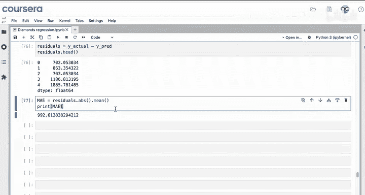

评估模型的残差、绘制残差图并计算误差指标，能为你提供更多关于模型是否足够有用的洞察。在接下来的课程中，我们将学习如何与大型语言模型协作，以进一步改进模型。