# 080：使用LLM迭代模型 🚀

在本节课中，我们将学习如何利用大型语言模型（LLM）作为思考伙伴，来迭代和改进线性回归模型。我们将通过一个预测钻石价格的多元线性回归模型案例，演示如何向LLM提供上下文、获取改进建议、实施代码修改并评估结果。

---

## 概述

开发线性回归模型时，你可以随时向LLM寻求输入，以迭代和改进模型。本节将使用ChatGPT-4作为示例，展示如何通过提供数据集和模型摘要等上下文信息，获取具体的模型优化建议，并实施这些建议来提升模型性能。

---

## 向LLM提供上下文并获取建议

上一节我们介绍了线性回归模型的基础。本节中，我们来看看如何向LLM描述问题以获取改进建议。

首先，需要向模型清晰说明你正在解决的问题。就像与同事协作一样，提供足够的背景信息。

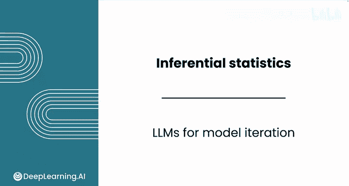

以下是提供给LLM的提示示例：

> “我创建了一个多元线性回归模型，使用克拉重量和颜色来预测钻石价格。数据集是钻石数据。我使用`pd.get_dummies`对颜色进行了编码。这是回归摘要表的截图。请提供三个改进模型的简单建议，并解释每个建议背后的理由。”

请注意，此提示意图是同时向模型提供数据集和摘要表的截图。因此，你需要先截图摘要表，并上传数据集文件。


模型给出了三个建议：

1.  **包含交互项**：建议添加克拉重量与颜色的交互项，因为价格与克拉的关系可能取决于钻石颜色。
2.  **检查多重共线性**：建议检查预测变量之间是否存在高度相关性。
3.  **考虑变换或非线性关系**：指出克拉与价格的关系可能不是严格的线性关系，可以尝试添加多项式项（如克拉的平方）或对数变换来捕捉潜在的非线性。

最后一个建议尤其值得关注，因为从残差图和预测值与实际值的关系图中，你已经观察到似乎存在某种非线性关系。因此，可以尝试为克拉变量添加一个多项式项，例如克拉的平方。

---

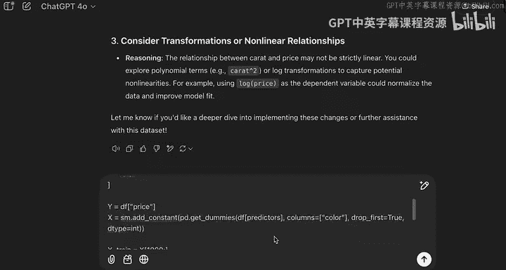

## 根据LLM建议修改模型代码

在获得了初步建议后，下一步是根据建议修改模型。这里我们聚焦于实施“添加克拉平方项”的建议。

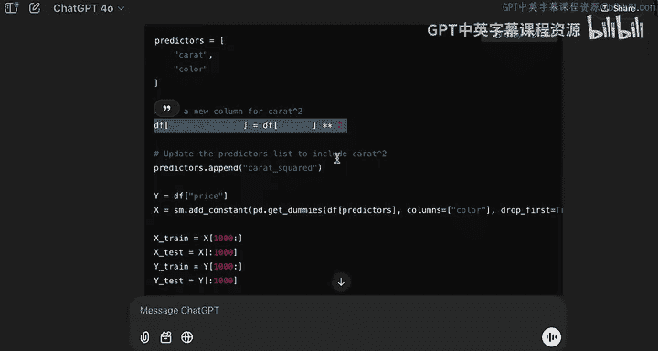

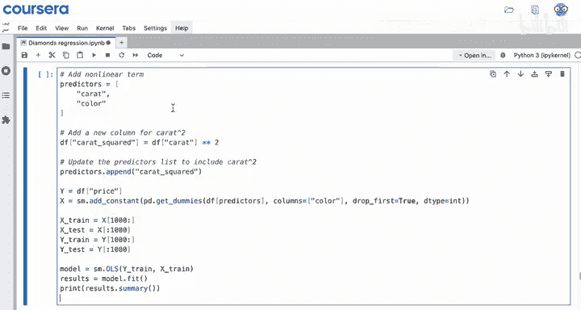

你可以向LLM提出后续提示，请求具体的代码修改帮助：

> “以下是我的模型代码。请帮我修改它，在模型中包含`carat_squared`（克拉的平方），而不仅仅是`carat`。同时，请提供用于创建X和Y以及拟合模型的代码。”


LLM推荐的修改相对直接：在数据框中新建一个`carat_squared`列，然后照常运行回归。你可以复制提供的代码并尝试实现。


观察新的回归摘要表，R平方值从之前的0.864略微提升到0.867，改善幅度有限。你可能因此产生疑问：克拉和克拉平方项似乎都基于同一个变量，它们是否会解释重叠的信息？

你可以直接向LLM提问：“在X数据框中同时包含`carat`和`carat_squared`是否可以？”

LLM的回答是肯定的：同时包含原始变量及其平方项是完全可接受的，且通常是必要的。这允许模型同时解释克拉与价格之间的线性和非线性关系。

---

## 分析改进效果并寻求进一步解释

由于模型改进效果不显著，我们需要深入分析原因，并寻求LLM的进一步指导。

你可以继续追问：“这种方法没有显著改善我的模型，你能帮忙解释一下原因吗？因为R平方只提高了零点几个百分点。”

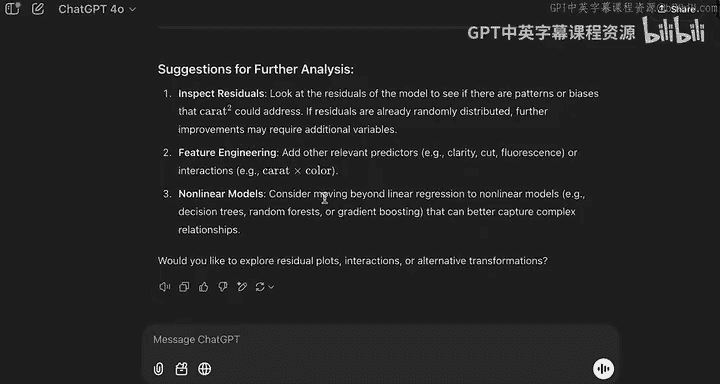

LLM基本同意你的观察，即平方项只捕捉了价格方差中很小的一部分额外信息。它随后给出了一些可能的原因：

以下是LLM分析的可能原因：
*   非线性关系可能很微弱或有限，因此`carat_squared`项可能不是捕捉该行为的最佳方式。
*   克拉本身已经是一个强预测因子，其变形可能无法提供额外价值。
*   模型可能通过纳入其他尚未包含的预测变量（如切工、净度等）获得更大收益。


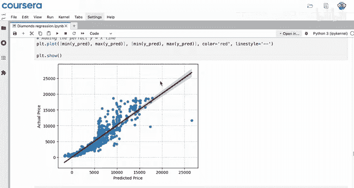

最后，LLM给出了一些进一步分析的建议，包括检查残差、进行更多特征工程，或探索线性回归之外的非线性模型。

为了进一步调查，你可以将之前模型的预测值与实际值关系图截图分享给LLM，并请求解读。


基于这张图，LLM可能会建议对数据进行变换。从图中看，预测值先是迅速增加，然后趋于平缓，与实际值的分布有所不同。

LLM返回了几种建议的变换方案：

以下是LLM建议的数据变换方法：
1.  **对因变量（价格）进行对数变换**：`log(price)`。
2.  **对自变量（克拉）进行对数变换**：`log(carat)`。
3.  其他建议，包括尝试更高阶的多项式项。

LLM解释了下一步操作：首先对价格和/或克拉应用对数变换，并愿意帮助你实现这些变换。

对数函数 `y = log(x)` 的图像在x值较小时y增长迅速，在x值较大时y增长趋于平缓。这与预测价格的分布有相似之处。因此，LLM建议同时添加价格和克拉的对数项。

---

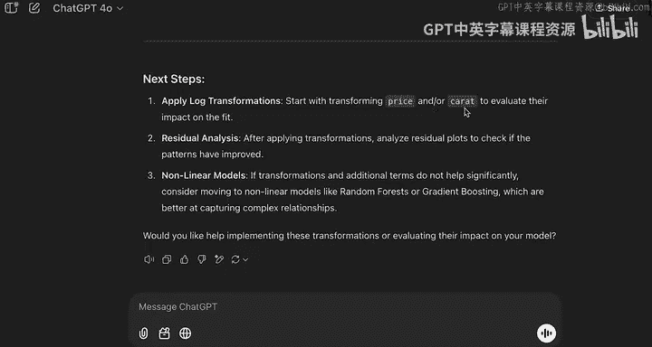

## 实施对数变换并评估结果

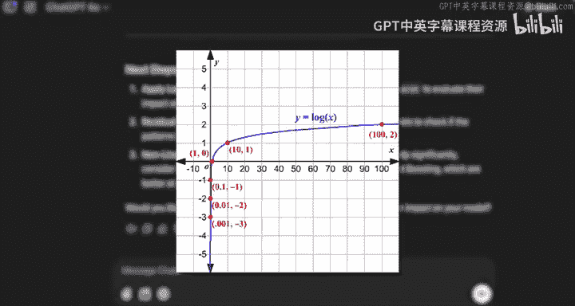

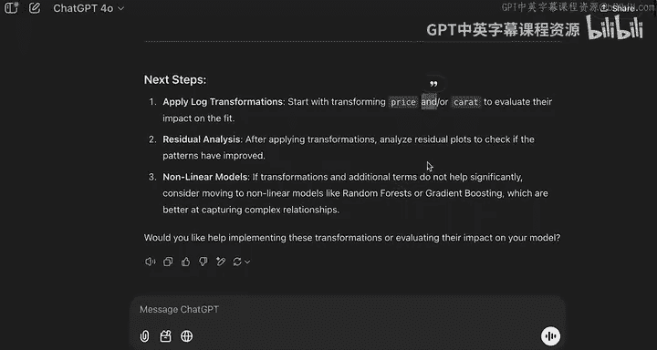

现在，让我们请求LLM提供实施对数变换的具体代码。

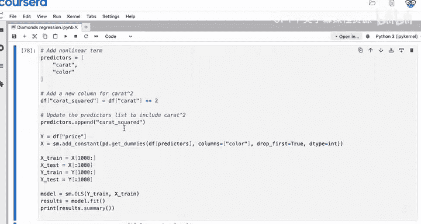

提示：“修改这段代码，使其包含`log(price)`和`log(carat)`，但不包含`carat_squared`。”


修改看起来相对简单。核心是用`np.log()`函数分别处理价格和克拉列，而不是创建`carat_squared`列。

虽然对数变换在理解上可能有挑战，但我们可以先继续实施，看其是否有效。以下是修改后的代码关键部分：

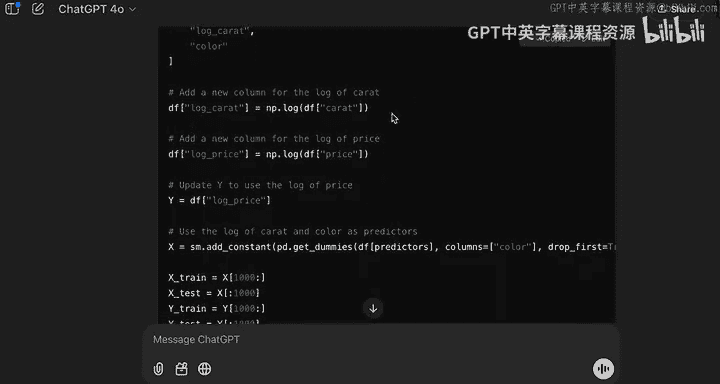

```python
import numpy as np
# 假设 df 是包含‘price’和‘carat’列的数据框
df[‘log_price‘] = np.log(df[‘price‘])
df[‘log_carat‘] = np.log(df[‘carat‘])
# 然后使用这些新列作为特征和目标变量进行回归
```


这次变换产生了显著影响。R平方值达到了0.945，相比之前提升了近10个百分点，这是一个巨大的改进。

快速绘制预测值与实际值的关系图，可以看到两者之间的关系变得更加线性。但请注意，这里的预测值和实际值都是针对`log(price)`的，即数值6、7、8、9代表的是价格的对数值，而非原始线性价格。

此时，模型引入了新的变换，增加了复杂性，可能会影响模型的可解释性。虽然指标显示模型在改进，但由于复杂度增加，我们需要更谨慎。

---

## 总结

本节课中，我们一起学习了如何将LLM作为思考伙伴，贯穿线性回归模型开发的迭代过程。

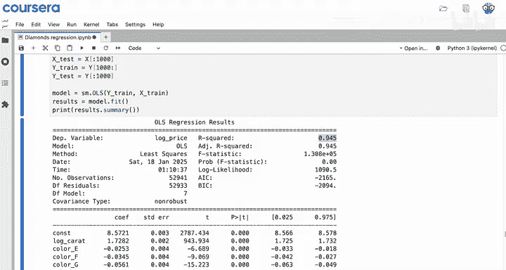

我们从向LLM提供清晰的上下文开始，获取了改进模型的初步建议。随后，我们根据建议实施了代码修改（如添加多项式项、进行对数变换），并持续与LLM互动，分析改进效果、寻求原因解释和进一步优化方向。

关键收获是：LLM能够提供有价值的思路和具体的代码帮助，但最终对模型变换的理解、结果的评估以及是否采用这些复杂方法，仍需结合领域知识、与同事讨论或进一步研究来做出明智决策。

现在你已经体验了从变量选择到评估的端到端建模流程，下一节课我们将回顾这些步骤如何整合在一起，形成完整的数据分析工作流。