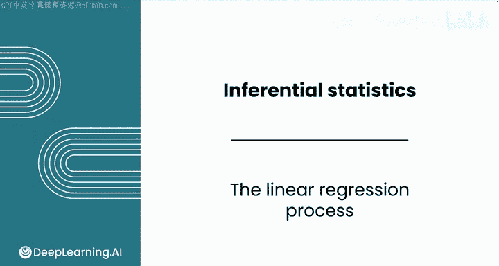
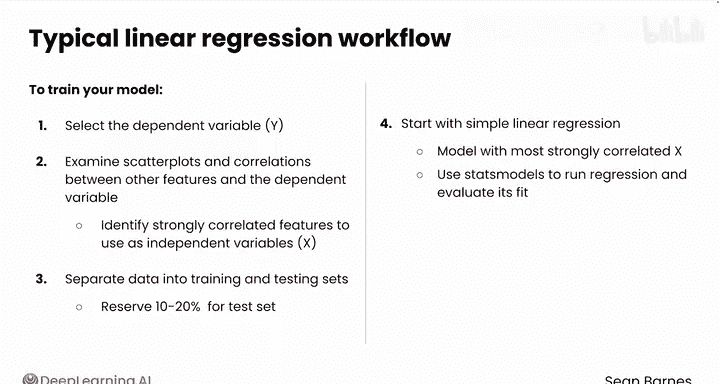
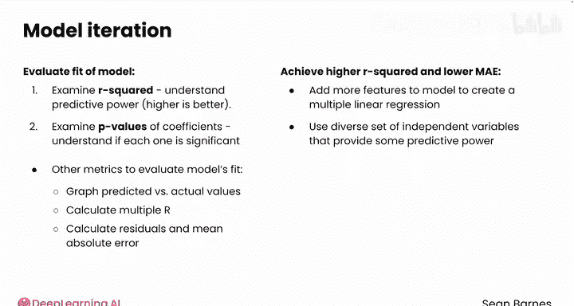
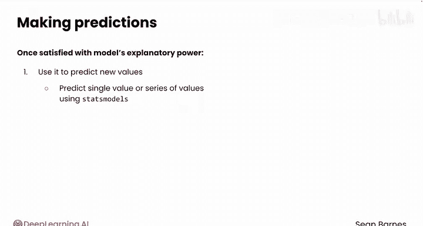

# 081：线性回归全流程 📊

在本节课中，我们将系统性地回顾构建多元线性回归模型的完整流程。我们将从模型构建的两个主要步骤——训练与预测——出发，梳理从数据准备、模型建立、评估到最终应用的每一个环节。

---

## 概述

线性回归分析包含两个核心阶段：**训练**（构建模型）与**预测**（使用模型进行预测）。此外，模型评估也是不可或缺的一步。本节将带您纵览线性回归的端到端工作流程。

---

## 模型训练流程

上一节我们介绍了线性回归的基本概念，本节中我们来看看构建一个模型的具体步骤。

以下是训练线性回归模型的典型步骤：

1.  **选择因变量**：首先，确定您希望预测的目标特征，即因变量（Y）。
2.  **探索特征与因变量的关系**：通过散点图和相关系数，检查数据集中其他特征与因变量之间的关系。识别出与因变量强相关的特征，作为备选的自变量（X）。
3.  **划分数据集**：将数据分为训练集和测试集。通常，预留一小部分数据（例如10%或20%）作为测试集，用于后续的模型评估。其余数据用于训练模型。
4.  **建立初始简单线性回归模型**：从一个自变量开始建模，通常选择与因变量相关性最强的那个。使用 `statsmodels` 库运行回归分析并评估其拟合度。
5.  **进入迭代建模过程**：此时，您已经建立了第一个模型，接下来将进入一个迭代优化流程。

---

## 模型评估与迭代

在建立了初始模型后，我们需要评估其表现，并据此进行优化。

以下是评估模型并指导下一步行动的关键方法：

*   **评估模型拟合优度**：使用 **R平方**（R-squared）来衡量模型的预测能力。通常，R平方值越高越好。其公式可表示为模型解释的方差占总方差的比例。
*   **检查系数显著性**：检查各自变量系数的 **P值**，以判断每个特征对预测的贡献是否显著。如果显著，则可以进一步解释该特征的影响。
*   **使用其他评估指标**：可以绘制预测值与实际值的对比图，并计算**多重R**（预测值与实际值之间的相关系数）。此外，计算**残差**（实际值与预测值之差），并进而计算**平均绝对误差**等指标。这些指标有助于指导后续优化或向利益相关方汇报。
*   **优化模型**：为了获得更高的R平方和更低的平均绝对误差，可以向模型中添加更多特征，构建**多元线性回归模型**。应选择一组能够提供额外预测力的、多样化的自变量，同时需注意可能存在的**多重共线性**问题（即变量间的解释能力重叠）。

---

## 模型预测与应用

当您对模型的R平方和解释能力感到满意后，就可以用它来预测新数据了。

您已经学习了如何使用 `statsmodels` 来预测单个值或一系列值。预测的基本形式是利用回归方程：
`Y_pred = β0 + β1*X1 + β2*X2 + ... + βn*Xn`

---

## 总结与展望

本节课中，我们一起系统回顾了线性回归从数据准备、模型训练、评估优化到最终预测的全流程。线性回归是一种功能强大的技术。

您可以通过接下来的阅读材料，了解更多关于线性变换和交互特征的知识，这些高级技巧能让您对数据中更复杂的关系进行建模。

接下来，您将完成本模块的计分作业和计分实验。在计分实验中，您将运用本模块学到的推断方法来预测车辆的碳排放量。

完成后，请跟随我进入本课程的最后一个模块：时间序列分析。