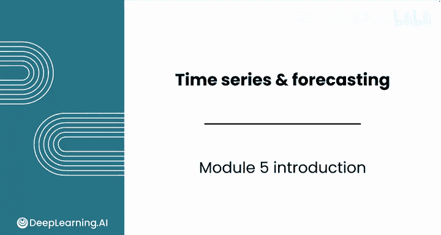
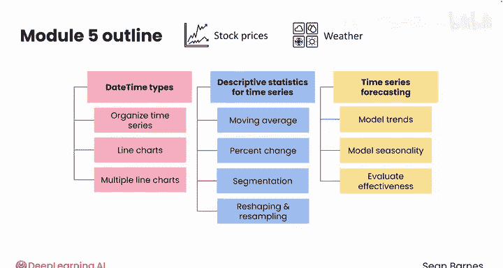

# 082：时间序列与预测简介 📊

在本节课中，我们将要学习时间序列数据分析的基础知识。时间序列数据与横截面数据不同，它需要独特的技术和方法。我们将使用Python中的pandas、matplotlib、Seaborn和statsmodels等工具，但分析思路将截然不同。通过本模块的学习，你将掌握分析和可视化时间序列数据的关键技术，并能够对未来进行预测。

---

## 模块5：时间序列与预测简介 📈

上一节我们介绍了本课程的整体结构，本节中我们来看看模块5的具体内容。时间序列数据在许多领域都有广泛应用，例如股票市场和气象数据。掌握时间序列分析技术，能够帮助我们理解数据中的趋势和季节性变化。

### 时间序列数据的独特性

与横截面数据相比，时间序列数据具有时间维度，这使得分析方法有所不同。尽管我们仍然会使用熟悉的工具，如`pandas`、`matplotlib`、`Seaborn`和`statsmodels`，但处理数据的思路将发生显著变化。

以下是本模块的三个核心课程安排：

1.  **第一课：Python中的日期时间类型与折线图**
    你将学习如何在Python中处理datetime类型，组织时间序列数据，并使用格式良好的单线图和多线图进行数据可视化。

2.  **第二课：时间序列的描述性统计**
    本节重点介绍时间序列分析的描述性统计方法。你将学习编写移动平均和百分比变化等强大技术，探索数据分段，并掌握数据重塑和重采样技术。

3.  **第三课：使用线性回归进行时间序列预测**
    在最后一课中，你将应用线性回归进行时间序列预测。学习如何对数据中的趋势和季节性进行建模，并评估你的时间序列模型的效果。

### 学习目标与实践数据

通过本模块的学习，你将能够自信地处理、可视化和预测时间序列数据。我们将使用真实的股票市场和气象数据作为实践案例，帮助你深入理解趋势和季节性，并尝试预测时间序列的未来走势。

---

## 总结

本节课中我们一起学习了Python数据分析第三课的模块5——时间序列与预测的简介。我们了解了时间序列数据的独特性，预览了本模块将涵盖的三个核心课程：日期时间处理与可视化、描述性统计分析以及线性回归预测。掌握这些技术后，你将具备分析和预测时间序列数据的能力。

接下来，请跟随我进入第一课，开始探索日期时间类型和折线图。我们课堂上见。