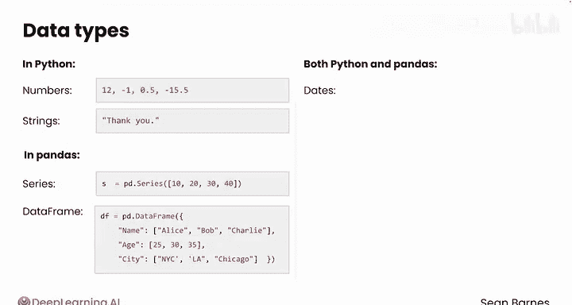
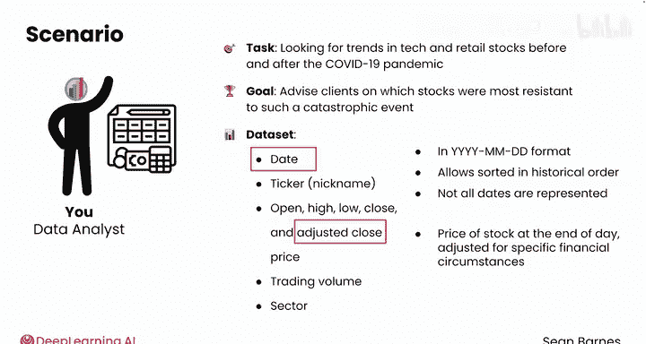
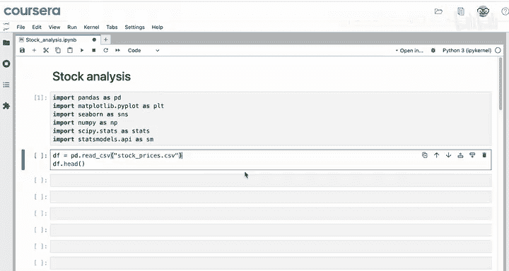
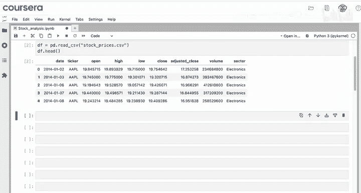
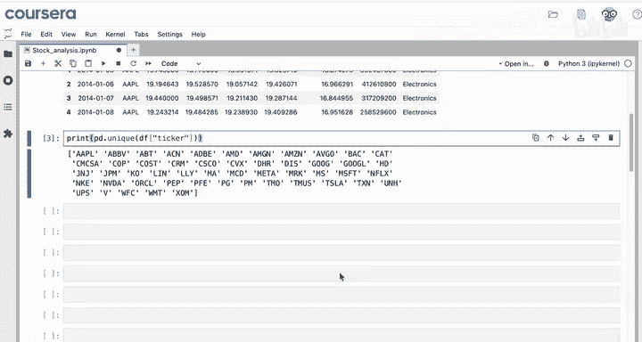
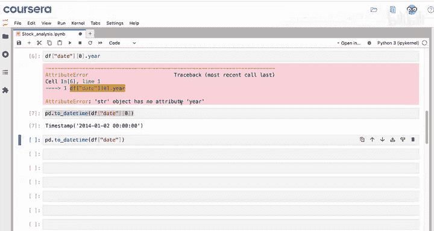
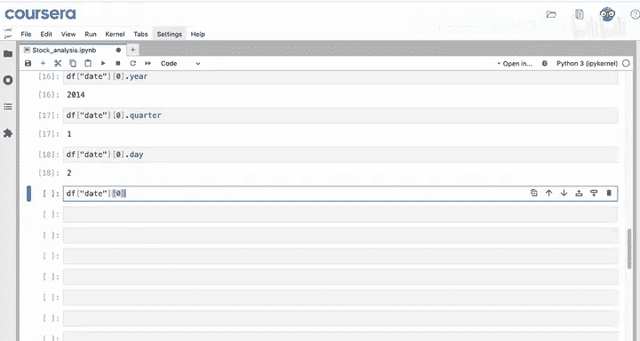
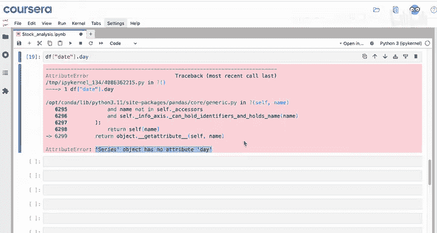
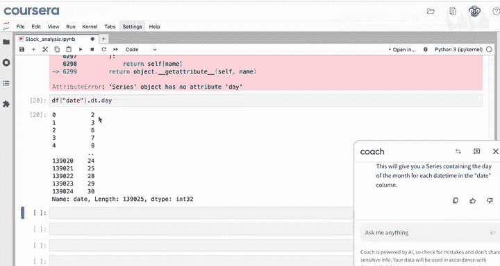
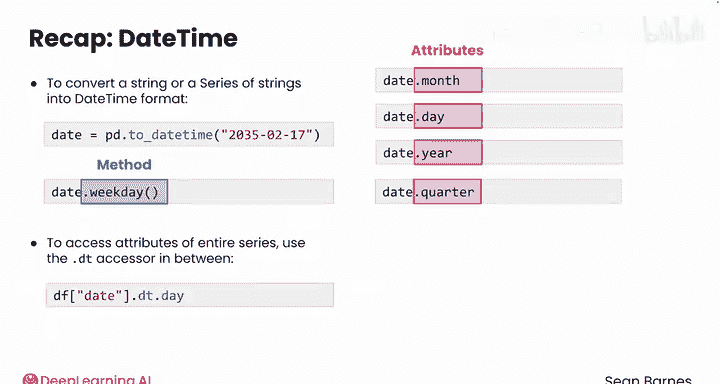

# 083：Python数据分析（第3课）｜Python for Data Analytics
## 课程编号：P83 - 日期时间处理 📅

在本节课中，我们将要学习如何在Python和pandas中处理日期和时间数据。日期数据在数据分析中非常常见，例如分析股票价格趋势、用户行为日志等。我们将学习如何将文本格式的日期转换为专门的`datetime`类型，并利用其属性进行高效分析。

---

### 日期的重要性与数据类型

我们生活中总有重要的日期。例如，2016年11月2日，我挚爱的家乡棒球队芝加哥小熊队赢得了世界大赛冠军，那次胜利终结了长达108年的冠军荒。日期对我们而言是特殊的，在代码中，它们也需要一种特殊的数据类型。

你已经接触过许多数据类型，例如数字和字符串在Python中的表示方式，以及pandas如何通过Series和DataFrame在行和列中存储数据。在Python和pandas中，日期拥有其专属的数据类型：`datetime`类型。

---

### 数据分析场景：股票价格趋势

假设你正在为一家财务规划机构工作，被要求分析一段时间内的股票价格趋势。你正在研究新冠疫情前后科技股和零售股的趋势。该机构希望根据你的分析，为客户建议哪些股票最能抵御此类灾难性事件。

你正在处理一个新的数据集，其特征包括：`date`（日期）、`ticker`（公司股票代码）、开盘价、最高价、最低价、收盘价、调整后收盘价、交易量以及股票所属板块。你尤其关注调整后收盘价，它是经过特定财务情况调整后的当日收盘价。

CSV文件中的日期以“年月日”格式存储，这是行业标准。这种格式允许日期按历史顺序排序。你还会注意到数据中并非包含所有日期，周末和美国银行假日未被包含。

---

### 数据导入与初步观察

首先，在一个新的notebook中导入必要的模块，然后将数据从`stock_prices.csv`读入变量`df`。你的notebook文件`stock_price_analysis`和`stock_prices.csv`文件需存放在同一目录下。

记住，在Coursera环境中你无需进行文件管理，但像这样导入数据的前提是你的文件存储在一起。

查看前五行数据。数据包含`date`、`ticker`（股票名称）、开盘价等特征。每一行代表某只股票在特定一天的观测记录。数据似乎已按某种方式排序，因为这五行数据都是AAPL（苹果公司）。使用`pd.unique()`查看数据中所有股票代码（即公司）的列表。

你得到了苹果、亚马逊、谷歌、网飞和特斯拉，以及一些你可能不太熟悉的公司，例如埃克森美孚的股票代码。股票代码是按字母顺序排序的，这解释了为什么使用`df.head()`时只看到了苹果股票。

使用`df.dtypes`检查数据框的数据类型。看起来`date`列是`object`类型。你之前学过，`object`本质上意味着文本。所以目前你的日期是以文本形式存储的，这并不理想。

如果你通过选择列然后选择该列的第一个值来选取第一个日期，你会得到一个字符串。因为它不是一个特殊的日期类型，你无法直接获取年份等信息，只会得到一个错误。

---

### 将字符串转换为日期时间

你可以使用`pd.to_datetime()`函数将`datetime`列从字符串转换为`datetime`类型。在你想转换为`datetime`的值上调用此函数。

你可以在数据框的第一个日期（即2014年1月2日）上操作，也可以选择整个列，在一次操作中将所有日期更改为`datetime`。

但有一个问题：如果直接运行该代码，你会得到一个新的Series，但这个命令实际上并没有修改你原始的数据框。`df[‘date’][0]`的类型仍然是字符串。你需要将这个结果保存回`date`列，用新的`datetime`覆盖旧的字符串。

现在，如果你再次查看`df.dtypes`，你的`date`列是`datetime64`类型。很好，这里的`ns`代表纳秒。你只存储日期，不存储时间，但这种日期类型可以精确到纳秒级存储时间。

---

### 日期时间操作与属性访问

现在，因为这些值是`datetime`类型，你可以对它们进行很酷的日期相关操作。例如，你可以查找星期几，在本例中是`3`。那么，这是星期几呢？你可以询问你的LLM：“如果`df[‘date’][0].weekday()`的输出是3，那么是星期几？”

它会告诉你，星期一对应`0`，星期日对应`6`。所以，如果代码返回`3`，则对应星期四。

你也可以使用属性直接访问日期的不同部分。例如，`.year`只获取年份，`.quarter`给你季度（一年中的第一季度是`1`），`.day`获取日，等等。

还有一点需要注意：当你尝试在像整个`date`列这样的Series上访问`.day`属性时，会发生什么？你会得到一个错误：“Series object has no attribute day”。这很奇怪，因为你知道日期是`datetime`类型。

你可以询问你的LLM：“如果我遇到这种类型的错误，如何修复？`date`列中的值是`datetime`类型。”然后粘贴错误信息。它会告诉你，你试图直接在Series上访问`.day`属性，这行不通。相反，你需要使用`.dt`访问器来访问日期时间属性。所以看起来你需要在访问`.day`属性之前添加这个`.dt`。

尝试一下代码，看起来它起作用了。你没有得到错误，并且天数符合你的预期。你看到第二天、第三天、第六天、第七天、第八天，一直到月底的第30天。

---

### 核心概念总结

快速回顾一下，你可以使用`pd.to_datetime()`将字符串或字符串系列转换为特殊的`datetime`格式。然后，你可以使用像`.weekday()`这样的方法和像`.month`、`.day`、`.year`甚至`.quarter`这样的属性来获取每个日期的信息。

如果你试图访问整个Series（如数据框中的列）的属性，你需要在中间使用`.dt`访问器，就像你在代码行`df[‘date’].dt.day`中所做的那样。

一旦你将日期转换为正确的`datetime`类型，你就可以将它们用作数据框的索引，以替换默认的整数索引。

---

### 课程总结

本节课中，我们一起学习了日期时间处理的基础知识。我们了解了为什么日期需要特殊的数据类型，并通过一个股票价格分析的实例，实践了如何将文本格式的日期转换为pandas的`datetime`类型。我们学习了使用`pd.to_datetime()`进行转换，以及如何使用`.dt`访问器和相关属性（如`.year`、`.month`、`.day`）来提取日期信息。掌握这些技能是进行时间序列分析的重要第一步。