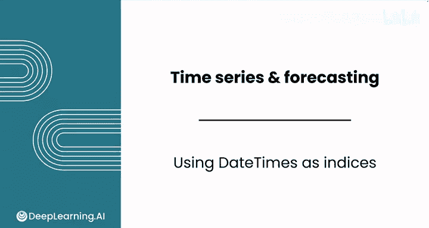
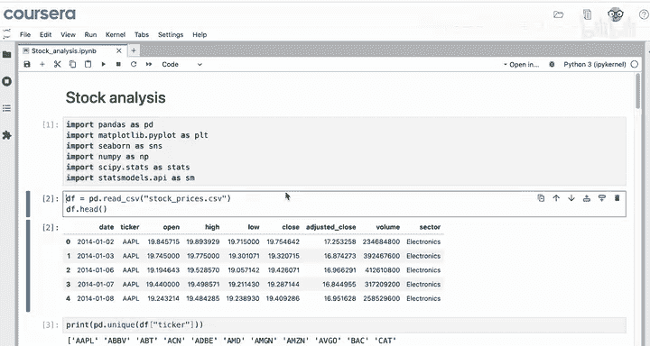
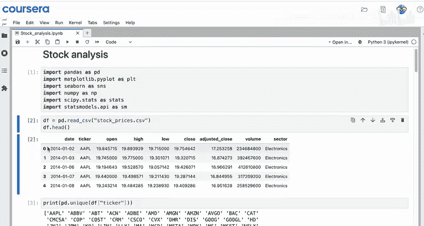
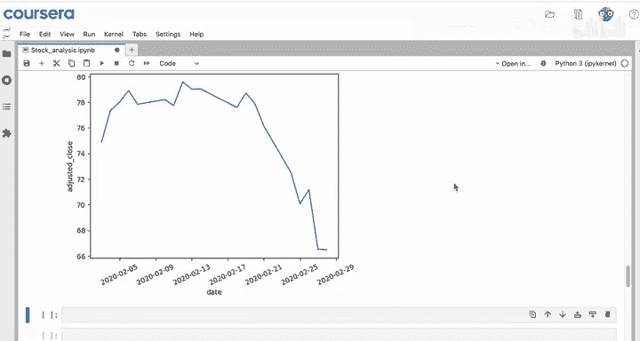
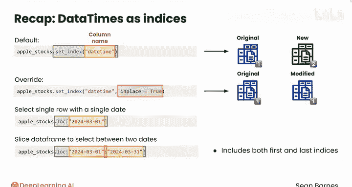

# 084：日期时间索引应用 📅



在本节课中，我们将学习如何利用日期数据的自然顺序来组织数据，具体来说，是将数据框的索引设置为日期时间列，从而创建时间序列数据。我们将通过实际操作，掌握设置索引、基于日期选择数据以及进行时间切片的方法。

---

上一节我们介绍了如何创建和操作日期时间数据，本节中我们来看看如何将这些日期时间数据设置为数据框的索引，以充分利用其内在的时间顺序。

具体而言，你可能希望将数据框的索引设置为你刚刚创建的日期时间列。快速回顾一下，你已经导入了所有必要的模块，并将股票危机数据读取到了一个名为 `df` 的数据框中。

你的首要任务是分析苹果公司股票随时间变化的趋势，以了解该股票在疫情期间受到的影响。目前，你的数据使用的是数值索引，但为了创建真正的时间序列，你需要将索引设置为日期。

以下是具体步骤：





首先，从数据框中筛选出仅包含苹果公司股票价格的数据。

```python
apple_stocks = df[df[‘ticker’] == ‘AAPL’]
```

使用 `value_counts` 方法确认筛选结果正确。

```python
apple_stocks[‘ticker’].value_counts()
```

很好，数据全部是苹果公司的，并且包含了2726天的股票数据。

现在，将 `date` 列设置为索引。

```python
apple_stocks.set_index(‘date’, inplace=True)
```

`set_index` 方法以列名作为参数，这里我们选择 `date` 列。之前学过，默认情况下 `set_index` 会创建一个新的数据框。如果你想改变这一默认行为，可以使用命名参数 `inplace=True`。这个参数允许 `set_index` 直接修改原始数据框，而不是先创建一个修改后的副本。

现在查看 `apple_stocks` 的头部，新的索引就是这些日期时间，并且 `date` 列已从数据框的列中移除。这非常有用，因为现在你可以基于这些日期来选择特定的数据或对数据框进行切片。

例如，如果你想获取2020年2月3日（疫情开始显著影响市场前的第一个星期一）的数据作为基准，可以这样做：

```python
apple_stocks.loc[‘2020-02-03’]
```

你可以使用 `datetime` 对象，但使用字符串更简短。如果可行，不必害怕“偷懒”。记住，`.loc` 允许你基于自定义索引选择行。这个命令会给出该日期的所有信息：当然是苹果股票，调整后的收盘价略低于77美元。

你现在也可以使用这些日期来切片数据。例如，如果你想选择一个月的数据来观察疫情发展期间的影响，可以从之前的数据开始，但现在使用切片操作符 `:`。

```python
feb_2020_data = apple_stocks.loc[‘2020-02-01’:‘2020-02-28’]
```

2020年是闰年，所以没有2月29日。查看结果，这是一个数据框。请注意，这个切片包含了最后一个值（2月28日）。



现在，你可以检查苹果股票价格在2020年2月整个月内的表现。你可以使用 `seaborn` 的 `lineplot`，然后选择 `adjusted_close` 列来查看趋势图。哇，二月下旬有一个相当大的跌幅。另外，你可能还想调整X轴刻度的旋转角度，这样图表看起来会更清晰。我们将在下一个视频中进一步完善这个图表。

---

为了总结刚刚学到的工具，你看到了 `set_index` 方法可以用来将日期时间设置为索引，从而创建时间序列。`set_index` 以列名作为参数。默认情况下，这个方法会创建一个全新的数据框，而不是修改旧的。`inplace=True` 这个命名参数覆盖了默认行为，意味着 `set_index` 方法将直接修改数据框，而不是先创建副本。许多 `pandas` 方法都有可选的 `inplace` 命名参数，你可以随时向你的LLM查询你正在使用的命令是否有此选项。

你还使用了 `.loc` 来基于日期时间索引选择行。你可以用单个日期选择单行，也可以使用冒号 `:` 对数据框进行切片，以选择两个日期之间的范围。使用 `.loc` 进行切片时，会包含你选择的第一个和最后一个索引。

---

现在你正在使用日期时间作为索引，这意味着你正在处理一个真正的时间序列。请跟随我进入下一个视频，学习如何在Python中可视化时间序列数据，我们下个视频见。



---

本节课中我们一起学习了如何将日期时间列设置为数据框的索引，从而创建时间序列。我们掌握了使用 `set_index` 方法（配合 `inplace=True` 参数）直接修改数据框，以及使用 `.loc` 通过日期字符串或日期范围来选择和切片数据的技巧。这些是进行时间序列分析的基础步骤。