# 085：Python数据分析（第3课）｜折线图绘制

在本节课中，我们将学习如何使用Python绘制折线图，以可视化时间序列数据。我们将从基础图表开始，逐步调整其外观，并学习如何在同一图表中绘制多个数据序列。


## 概述

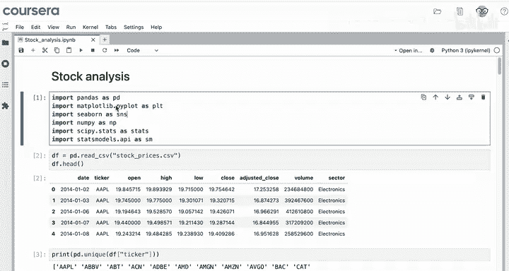

在之前的模块中，你已经学习了如何进行大量的横截面分析。那么，对于时间序列数据，你的选择是什么？你可以从可视化开始。

## 数据准备与基础绘图

首先，我们回顾一下基本步骤：导入必要的模块，并将数据集读取到变量`DF`中。

```python
import pandas as pd
import seaborn as sns
import matplotlib.pyplot as plt

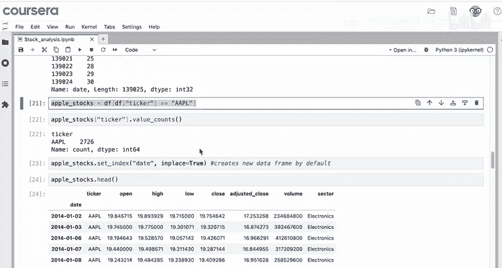

# 假设DF是已读取的包含股票数据的DataFrame
```

接着，我们创建一个子数据集来专注于苹果公司的股票数据。我们将索引设置为日期时间格式，以创建时间序列。最后，我们绘制调整后收盘价的折线图。

```python
# 创建苹果股票的子数据集
apple_df = DF[DF[‘symbol‘] == ‘AAPL‘].copy()
# 将日期列设置为索引
apple_df.set_index(‘date‘, inplace=True)
# 确保索引是datetime类型
apple_df.index = pd.to_datetime(apple_df.index)

# 绘制2020年2月的调整后收盘价折线图
feb_2020_data = apple_df[‘2020-02‘]
sns.lineplot(data=feb_2020_data)
plt.title(‘Adjusted Close Price for Apple Stocks in February 2020‘)
plt.show()
```

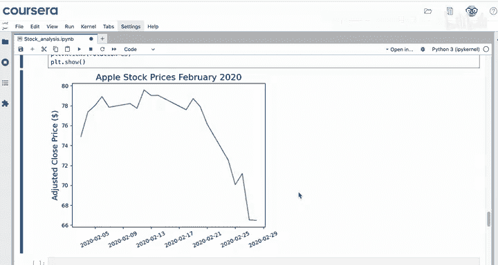

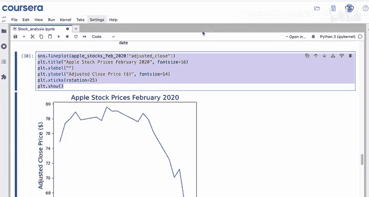

## 调整图表外观

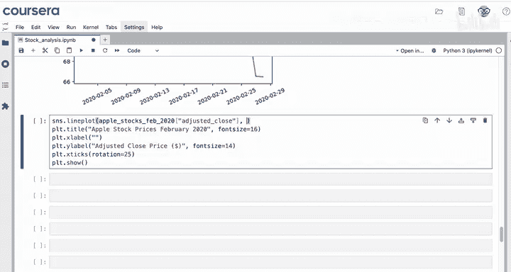

现在我们已经有了一个基础的折线图，接下来可以调整它的外观。添加Y轴标签和标题，并使用更大的字体以提高可读性。

```python
sns.lineplot(data=feb_2020_data)
plt.ylabel(‘Adjusted Close Price ($)‘)
plt.title(‘Apple Stock Price: February 2020‘, fontsize=14)
plt.show()
```

X轴上的值显然是日期，因此可以暂时不添加X轴标题。我们将在下一个视频中学习如何进一步格式化坐标轴。

我们也可以调整线条的外观，使用`sns.lineplot`的参数，如线条样式、颜色、线宽等。由于我们想重点关注新冠疫情消息爆发的二月，可以使用红色和虚线样式。

```python
sns.lineplot(data=feb_2020_data, color=‘red‘, linestyle=‘--‘, linewidth=2)
plt.ylabel(‘Adjusted Close Price ($)‘)
plt.title(‘Apple Stock Price: February 2020‘, fontsize=14)
plt.show()
```

## 在同一图表中绘制多个序列

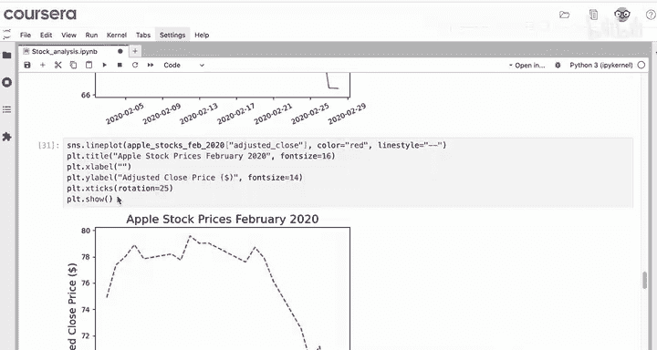

创建了美观的图表后，你可能希望在同一图表上绘制多个序列。目前我们只关注2020年2月，但通过加入一月和三月的序列，可以为分析提供更多背景信息。

以下是添加这些线条到同一图表的步骤。首先，选择一月份的数据。

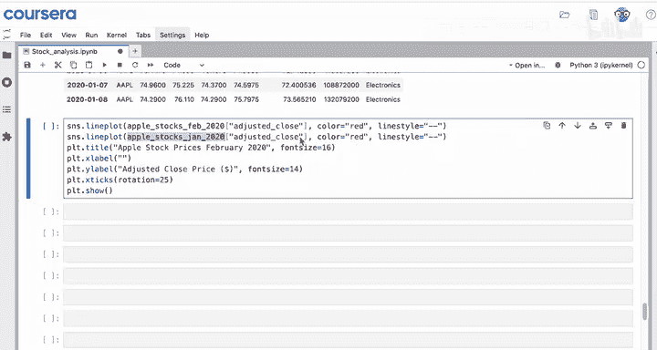

```python
# 选择2020年1月的数据（包含边界日期）
jan_2020_data = apple_df[‘2020-01-01‘:‘2020-01-31‘]
```

然后，复制之前图表的代码，将标题改为“January through February 2020”，并添加另一个`sns.lineplot`调用来绘制一月的数据。

```python
# 绘制二月数据
sns.lineplot(data=feb_2020_data, color=‘red‘, linestyle=‘--‘, linewidth=2, label=‘February‘)
# 绘制一月数据
sns.lineplot(data=jan_2020_data, color=‘black‘, linewidth=2, label=‘January‘)

plt.ylabel(‘Adjusted Close Price ($)‘)
plt.title(‘Apple Stock Price: January through February 2020‘, fontsize=14)
plt.legend()
plt.show()
```

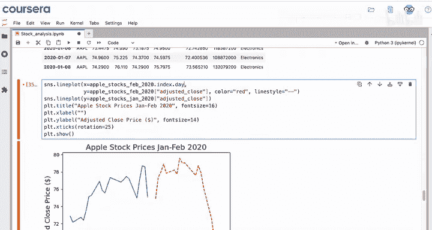

这个图表有什么问题？它的行为符合预期，因为你调用的是序列，X轴是日期，而这些日期并不匹配。但如果我们能更直接地比较每个月的行为，岂不是更好？这意味着X轴需要有相同的值。

调整后收盘价是Y值。那么X值应该设置为什么？我们可以使用索引中的“日”。记住，索引是一个时间序列，所以我们可以取过滤后的数据框的索引的“日”部分。

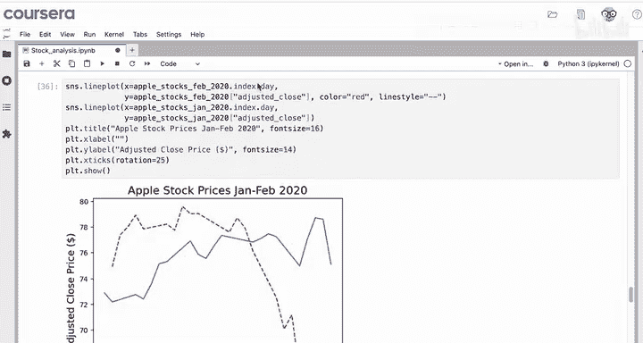

```python
# 获取每个数据点的月份中的日期
x_vals_feb = feb_2020_data.index.day
x_vals_jan = jan_2020_data.index.day
```

现在，更新两个序列的X值。也许一月的线可以用实心黑线表示。

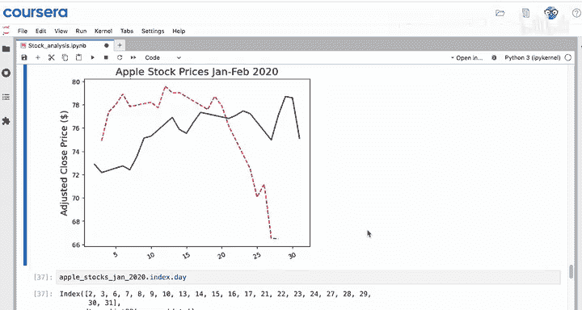

```python
sns.lineplot(x=x_vals_feb, y=feb_2020_data.values, color=‘red‘, linestyle=‘--‘, linewidth=2, label=‘February‘)
sns.lineplot(x=x_vals_jan, y=jan_2020_data.values, color=‘black‘, linewidth=2, label=‘January‘)

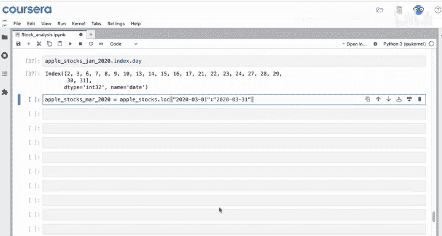

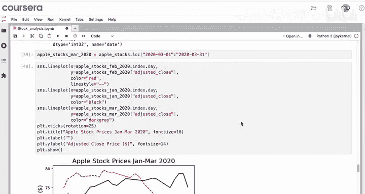

plt.xlabel(‘Day of Month‘)
plt.ylabel(‘Adjusted Close Price ($)‘)
plt.title(‘Apple Stock Price: January and February 2020‘, fontsize=14)
plt.legend()
plt.show()
```

接下来，我们可以添加三月份的序列。选择数据，并使用深灰色线条。

```python
# 选择2020年3月的数据
mar_2020_data = apple_df[‘2020-03‘]
x_vals_mar = mar_2020_data.index.day

sns.lineplot(x=x_vals_feb, y=feb_2020_data.values, color=‘red‘, linestyle=‘--‘, linewidth=2, label=‘February‘)
sns.lineplot(x=x_vals_jan, y=jan_2020_data.values, color=‘black‘, linewidth=2, label=‘January‘)
sns.lineplot(x=x_vals_mar, y=mar_2020_data.values, color=‘darkgray‘, linewidth=2, label=‘March‘)

plt.xlabel(‘Day of Month‘)
plt.ylabel(‘Adjusted Close Price ($)‘)
plt.title(‘Apple Stock Price: Q1 2020‘, fontsize=14)
plt.legend()
plt.show()
```

再次强调，我们想在分析中突出二月，所以其他线条可以用更柔和的颜色绘制。最后，更新图表标题。从图中可以看出，二月出现了急剧下跌，但与2020年三月相比，这算不了什么。也许我们应该调整图表颜色来反映这一点。

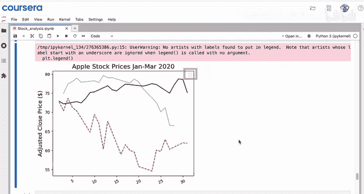

最后，仅凭观察此图，你的客户将无法分辨每条线代表哪个月份。如果你尝试使用`plt.legend()`，可能会得到一个微小的空框，这不是我们需要的。为什么不问问你的大语言模型如何为每个月在图例中添加标签呢？

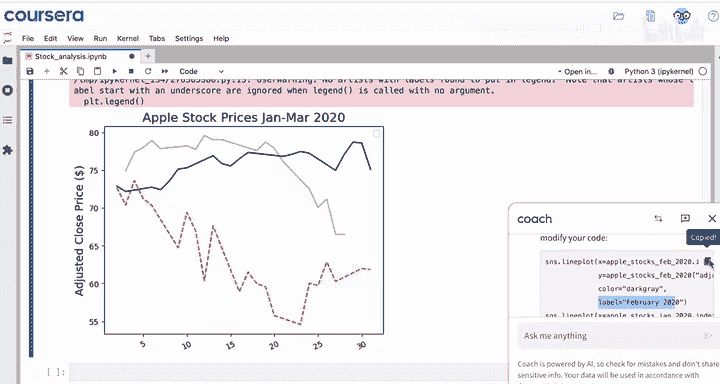

以下是添加自定义图例标签的代码：

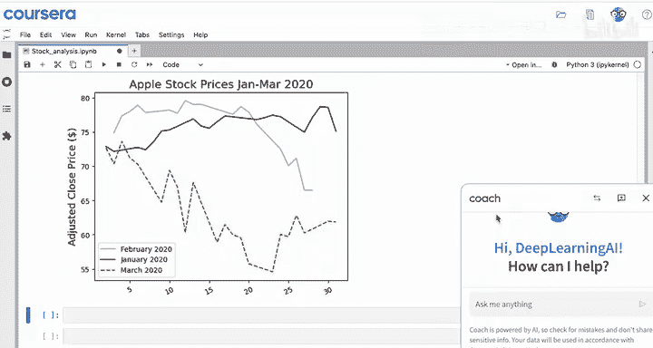

```python
# 使用label参数为每条线指定标签
sns.lineplot(x=x_vals_feb, y=feb_2020_data.values, color=‘red‘, linestyle=‘--‘, linewidth=2, label=‘Feb‘)
sns.lineplot(x=x_vals_jan, y=jan_2020_data.values, color=‘black‘, linewidth=2, label=‘Jan‘)
sns.lineplot(x=x_vals_mar, y=mar_2020_data.values, color=‘darkgray‘, linewidth=2, label=‘Mar‘)

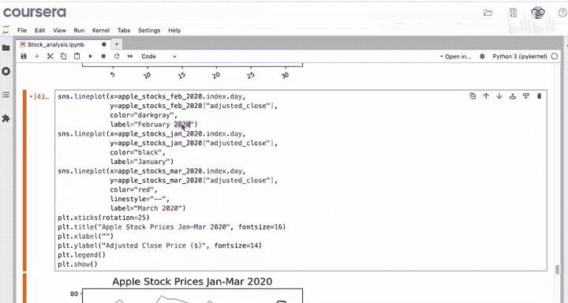

plt.xlabel(‘Day of Month‘)
plt.ylabel(‘Adjusted Close Price ($)‘)
plt.title(‘Apple Stock Price: Q1 2020‘, fontsize=14)
plt.legend(title=‘Month‘)
plt.show()
```

图例位置良好，你可能唯一想做的就是去掉图例标题中的年份，因为年份已经在主标题中了。

```python
plt.legend(title=‘Month‘)
```

## 总结

本节课中，我们一起学习了以下内容：

*   你了解到可以使用`sns.lineplot`函数创建时间序列数据的折线图。
*   你可以直接绘制一个数据序列，也可以使用`x`和`y`命名参数来更精确地控制数据。
*   你看到如果索引是日期时间类型，可以使用`df.index.day`等方法，在X轴上绘制不同的值（如月份中的日期）。
*   你还学习了可以在调用`plt.legend()`之前，使用`label`命名参数为每条线添加标签。

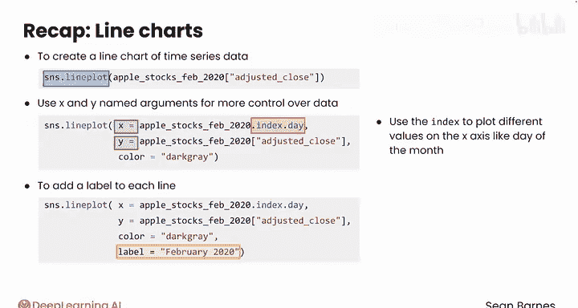

折线图是可视化时间序列数据的首选工具。然而，格式化日期可能有点棘手。请跟随我进入下一个视频，看看如何处理这个任务。