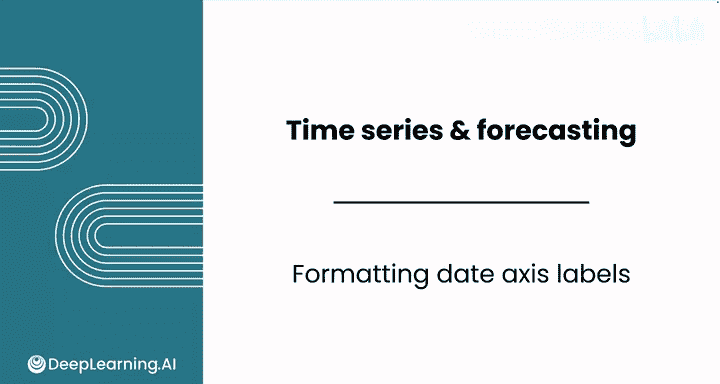
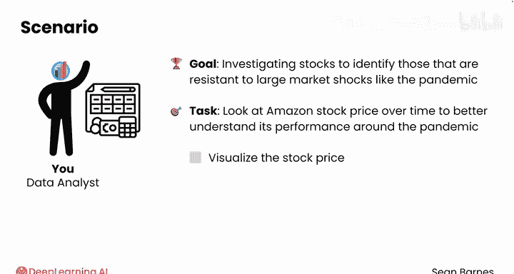
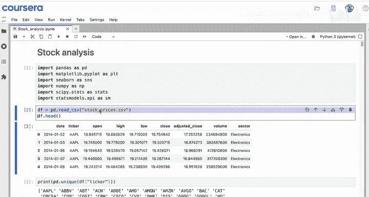
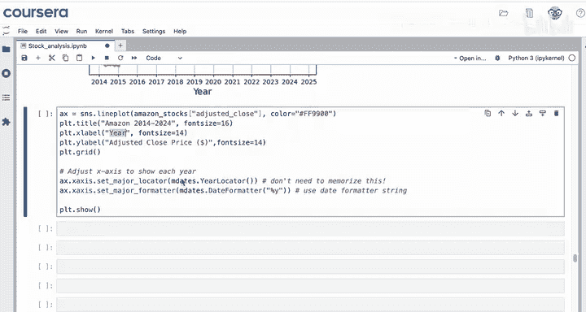
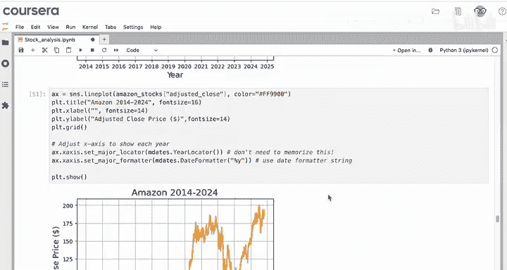
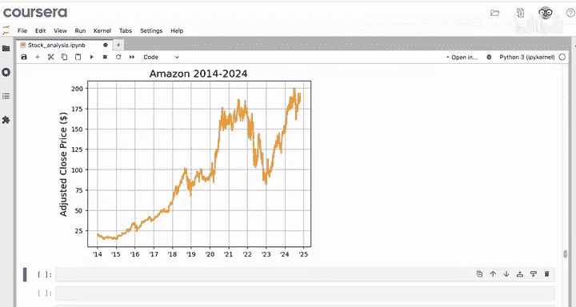
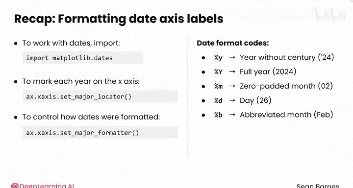

# 086：日期轴标签格式化



在本节课中，我们将学习如何在时间序列可视化中正确且美观地格式化日期轴。日期是时间序列图表中的关键元素，Matplotlib库提供了强大的工具来帮助我们精确控制日期在坐标轴上的显示方式。

## 概述：为何需要格式化日期轴？

在时间序列可视化中，日期是核心维度。一个清晰易读的日期轴能帮助我们更好地理解数据随时间变化的趋势和模式。Matplotlib内置的日期处理工具使我们能够轻松调整刻度位置和标签格式，而无需从零开始编写复杂代码。



## 数据准备与初步绘图

上一节我们介绍了数据导入和基本设置，本节中我们来看看如何为亚马逊股票价格数据创建时间序列图。

首先，我们需要导入必要的模块并准备好数据集。假设数据已加载到变量 `df` 中。由于我们处理的是新的股票数据集，需要重新设置日期时间索引。



**核心概念**：我们的数据框包含多个股票在多个日期的信息，因此需要先筛选出亚马逊的股票数据，然后将索引设置为日期时间。

以下是数据准备的步骤：

1.  使用筛选条件选择出亚马逊的股票数据。
2.  使用 `set_index` 方法，将“日期”列设置为索引，并指定 `inplace=True` 或覆盖原变量以保存更改。

```python
# 筛选亚马逊股票数据
amazon_stocks = df[df[‘stock_symbol’] == ‘AMZN’]
# 将日期列设置为索引
amazon_stocks.set_index(‘date’, inplace=True)
```

现在，我们得到了一个亚马逊股票的时间序列数据框。

## 创建基础时间序列图

首先，我们为调整后的收盘价创建一个简单的折线图。

```python
import seaborn as sns
import matplotlib.pyplot as plt

sns.lineplot(data=amazon_stocks, x=amazon_stocks.index, y=‘adjusted_close’)
plt.show()
```

从图中可以看出，价格总体呈上升趋势，但在2022年初有一次急剧下跌。这张图没有提供下跌原因的任何额外信息，但可以看出在2020年，股价从新冠疫情引发的市场冲击中迅速反弹。

## 美化图表：添加标题、网格和品牌色

为了让图表更专业，我们为其添加标题、网格线，并将线条颜色改为亚马逊的品牌亮橙色（十六进制代码 `#FF9900`）。

```python
sns.lineplot(data=amazon_stocks, x=amazon_stocks.index, y=‘adjusted_close’, color=‘#FF9900’)
plt.title(‘Amazon Stock Price Over Time’)
plt.grid(True)
plt.show()
```

## 格式化日期轴：调整刻度位置

在使用折线图时，我们经常需要调整X轴（日期轴）的显示方式，使图表更易于阅读。例如，我们可能希望X轴上显示每一年，而不是隔年显示。

日期是一种复杂的数据类型，Matplotlib提供了有用的日期工具，我们可以直接导入使用。通常我们使用别名 `mdates`。

**核心概念**：为了在创建图表后修改坐标轴，我们需要先将绘图对象保存到一个变量（如 `ax`）中。

以下是调整X轴以显示每年刻度的步骤：

1.  导入 `mdates` 模块。
2.  将绘图保存到变量 `ax`。
3.  使用 `ax.xaxis.set_major_locator(mdates.YearLocator())` 设置主要刻度定位器为每年。

```python
import matplotlib.dates as mdates

ax = plt.gca() # 获取当前坐标轴
ax.xaxis.set_major_locator(mdates.YearLocator())
plt.show()
```

运行代码后，X轴现在会显示每一年。同时，网格线也相应地为每一年进行了更新。这使得对比2020年初和2021年初的数据变得非常容易。

## 格式化日期轴：调整标签格式

接下来，我们可能希望只显示年份的后两位数字（如’14‘, ’15‘），使标签更紧凑易读。我们可以复制并修改之前的代码。

**核心概念**：使用 `set_major_formatter` 方法来控制主要刻度标签的格式，而不是它们的位置。

以下是调整年份显示格式的步骤：





1.  使用 `ax.xaxis.set_major_formatter(mdates.DateFormatter(‘%y’))`。这里的 `%y` 是一个日期格式代码，表示两位数的年份。
2.  此时可以移除X轴的标签，因为日期本身已经很清晰。

```python
ax.xaxis.set_major_formatter(mdates.DateFormatter(‘%y’))
plt.xlabel(‘’) # 移除X轴标签
plt.show()
```

运行后，可以看到 `%y` 给出了年份的后两位数字。最后，我们可以在格式字符串开头添加一个撇号，以符合某些书写习惯。



```python
ax.xaxis.set_major_formatter(mdates.DateFormatter(“’%y”))
plt.show()
```

现在，我们得到了一个清晰的图表，X轴上每年都有刻度，并且年份以易读的两位数字加撇号的形式显示。

## 更多日期格式选项

总结一下，为了处理日期轴，我们导入了 `matplotlib.dates`。我们使用 `set_major_locator` 函数配合 `mdates.YearLocator()` 在X轴上标记每一年，并使用 `set_major_formatter` 来控制该轴上日期的显示格式。

你不需要记住所有命令，只需知道有这些工具可以微调你的图表格式即可。

之前我们使用了带有百分号的日期格式化字符串。`%y` 是显示不带世纪的年份的日期代码，而开头的单引号用于直接添加撇号字符。

你还有其他选项，例如：
*   `%Y`：显示带世纪的年份（如 2020）。
*   `%m`：将月份显示为零填充的数字（01-12）。
*   `%d`：显示日期。
*   `%b`：显示月份的缩写名称（如 Jan）。

你也可以将这些代码组合在一起。例如，使用 `%b %y` 在X轴上同时显示月份和年份。

在可视化中格式化日期时，你拥有很多可用的选项，并且可以随时向AI助手寻求帮助。



## 总结

本节课中，我们一起学习了如何为时间序列图格式化日期轴。我们掌握了使用 `mdates.YearLocator()` 设置年度刻度，以及使用 `mdates.DateFormatter()` 和格式代码（如 `%y`）来自定义日期标签显示的方法。这些技能能显著提升时间序列图表的可读性和专业性。

接下来，你将完成本课的练习作业和实践实验室。在实践实验室中，你将探索澳大利亚政府发布的航班延误数据集。我们下节课“时间序列的描述性统计”再见。