# 087：移动平均线

在本节课中，我们将学习时间序列分析中的一个核心工具——移动平均线。我们将了解它的作用，并通过分析亚马逊股票的交易量数据，掌握如何在Python中计算和可视化移动平均线，从而更好地识别数据中的趋势。

---

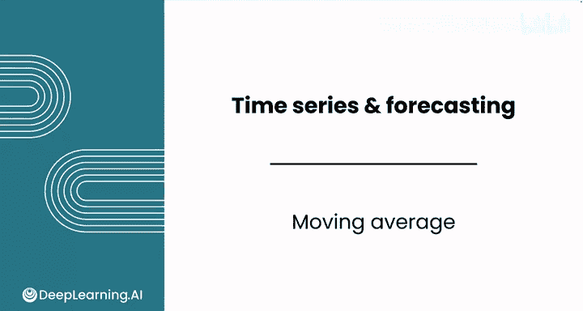

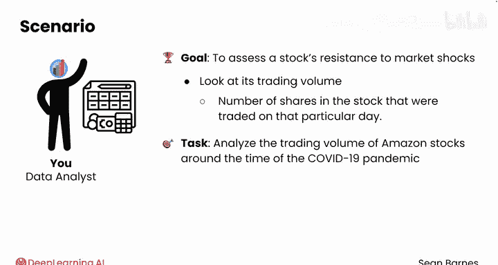

时间序列的核心分析工具之一是**移动平均线**。移动平均线有助于平滑嘈杂的数据，帮助你更好地理解趋势、季节性和周期性。

评估股票对市场冲击（如疫情）抵抗力的另一种方法是观察其**交易量**。交易量是指在特定日期交易的股票数量。

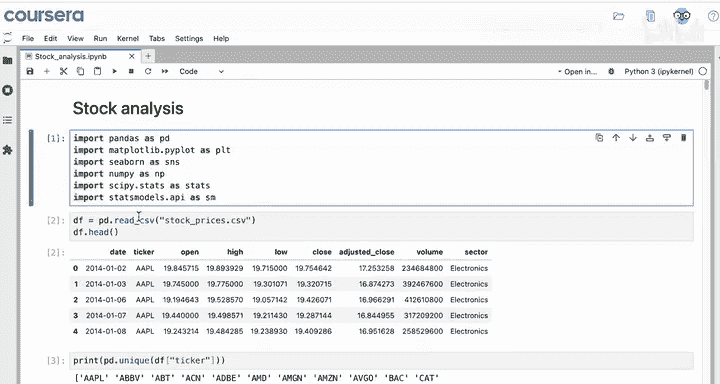

我们将分析新冠疫情前后亚马逊股票的交易量，以了解该特定股票的投资者的行为。

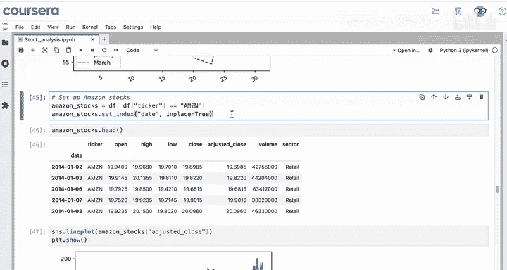

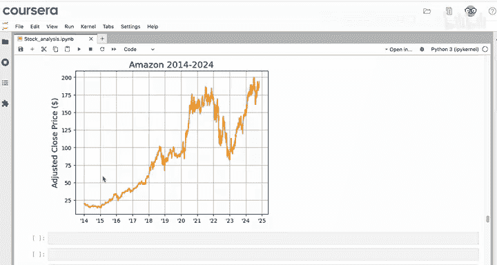

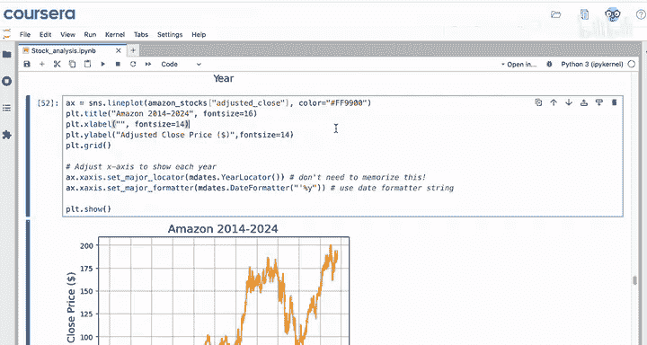

---

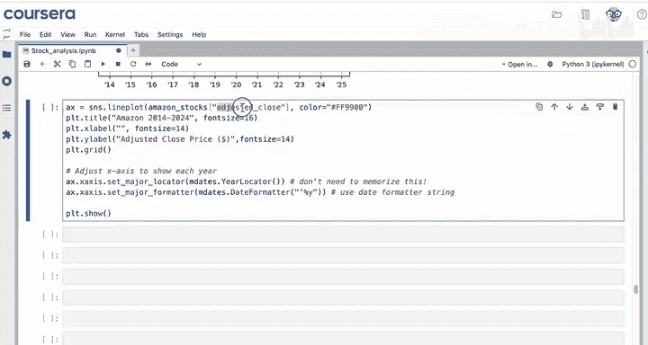

上一节我们介绍了移动平均线的概念，本节中我们来看看如何获取并初步观察数据。

首先，需要导入模块，将数据集读入变量 `df`，然后选择亚马逊股票数据，并将索引设置为日期时间以创建时间序列。最后，绘制调整后收盘价的折线图。

要获取交易量数据而非调整后收盘价，需要做哪些更改？

只需将此处选择的列更改为 `volume`，然后更新Y轴标题即可。

---

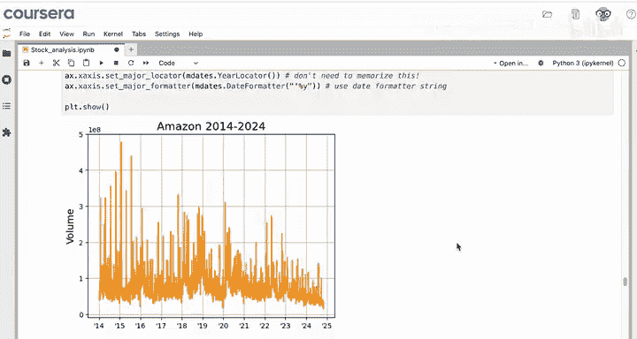

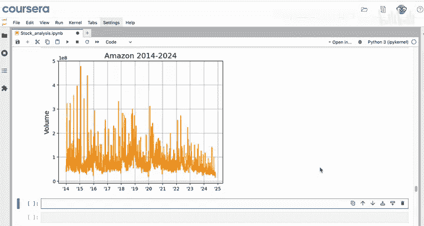

现在，我们可以立即看出这张图比调整后收盘价的图要“嘈杂”得多。整体趋势似乎是向下的，但不太明显。数据中也有很多峰值。

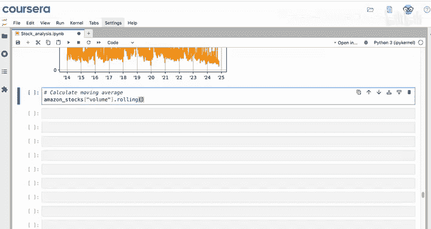

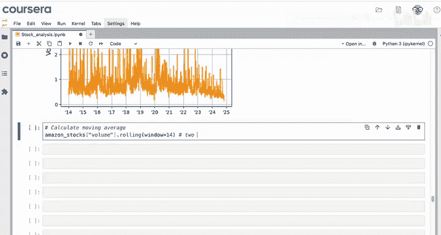

为了平滑这个时间序列中的噪声，我们可以计算交易量的移动平均线。记住，移动平均线可以平滑数据，帮助你减少这些峰值的影响。

以下是计算移动平均线的步骤：

1.  **选择目标列**：从你感兴趣的数据列开始，例如亚马逊股票的交易量 `amazon_stocks['volume']`。
2.  **应用滚动方法**：使用 `.rolling()` 方法。`rolling` 代表滚动平均，是移动平均的另一种说法。`.rolling()` 会创建具有特定窗口长度的数据子集。使用命名参数 `window=某个数字`。例如，如果你的每个观测值代表一天，你可能想计算14天（即两周）的平均值。
3.  **应用聚合函数**：仅使用 `.rolling()` 不会得到任何平均值，它只是将数据行分组（类似于 `groupby`）。你需要对数据应用某种聚合函数，如 `mean` 或 `sum`，才能看到结果。

例如，你可以使用 `.mean()` 计算简单移动平均。与pandas中的许多方法一样，此命令不会直接将新列添加到数据集中，它只会生成一个新的Series。因此，你需要将其保存到一个变量中，例如 `amazon_volume_14_day`。

现在，如果你查看前14个值，会看到什么？前13个单元格是空的，因为还没有14天的数据来计算平均值。在此之后，你会得到第一个移动平均值。

---

上一节我们计算了移动平均线，本节中我们将其可视化，并与原始数据进行比较。

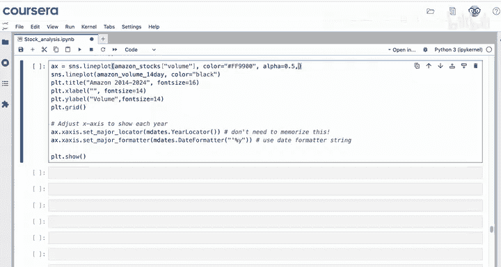

你可以将此列绘制在折线图中。沿用之前的绘图代码，因为你可以将此线覆盖在原始数据上绘制。

使用 `sns.lineplot()`，这次使用 `amazon_volume_14_day` 变量，并选择 `color='black'` 以示区分。你可能还想通过设置 `alpha=0.5` 和 `linestyle=':'`（创建虚线）来弱化原始时间序列的显示。

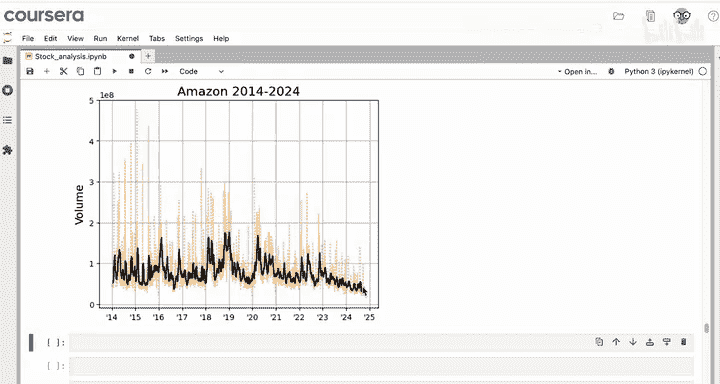

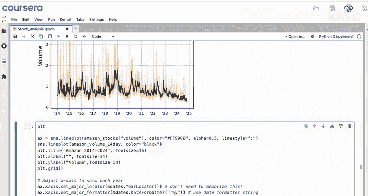

可以看到，这条折线图平滑得多，峰值更少，但数据中仍有一些噪声。同时注意到数据点太多，很难分辨出移动平均线。

你可以使用 `xlim` 来显示更多数据，或者创建一个更大的图形。让我们创建一个更大的图形，可以使用 `figsize=(12, 6)` 来创建一个更宽的图表。

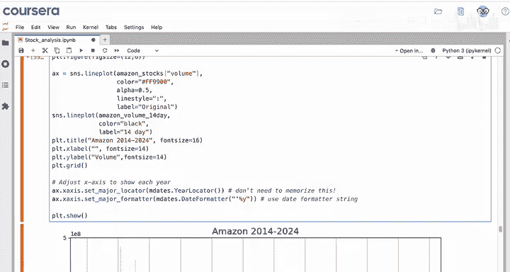

最后，可以像上一课那样，为每个序列添加图例。在 `sns.lineplot()` 中使用 `label` 命名参数，为原始数据和“14日滚动平均”设置标签。

---

仔细观察原始数据，你会发现每年通常有大约5到6个峰值，这可能包括季度财报或其他定期的季度事件。

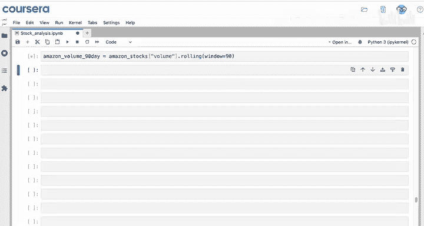

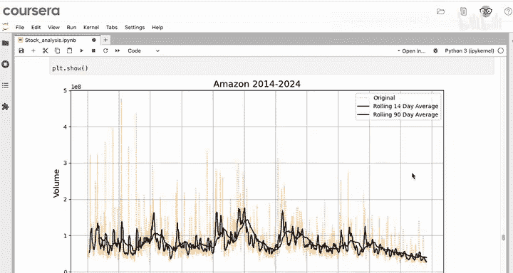

为了进一步平滑这些峰值并提炼趋势，你可以创建一个90天（约三个月）的移动平均线。

创建一个变量 `amazon_volume_90_day`，并借用之前的相同绘图代码，这次设置 `window=90`。将其添加到你的图表中，使用 `color='blue'`，以便比较。

可以看到，与14日移动平均线相比，90日移动平均线平滑得多。你还可以看到，90日平均线在某种程度上滞后于14日平均线，因为它需要更长的时间来反映原始时间序列的行为。

现在，你可以移除14日平均线，并将90日平均线设为黑色以突出显示。因为它是对数据更易解释的表示，你真正开始提炼出时间序列数据的趋势，而没有被所有分散注意力的噪声干扰。

这类长期的移动平均线常用于股价和交易量分析，因为日与日之间的波动通常很大。

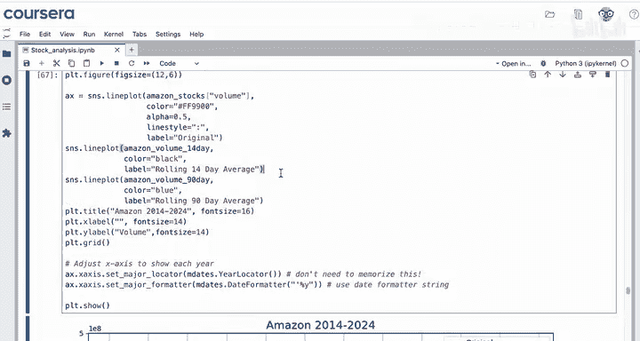

可以看到，亚马逊股票的交易量在2020年初显著增加，然后在接下来的一年半里逐渐减少。你可以将这些见解带回给你的客户，以便他们更好地理解亚马逊股票的交易行为。

---

本节课中我们一起学习了如何创建移动平均线。

首先，选择要为其创建移动平均线的列，例如交易量列。然后，使用 `.rolling()` 方法并指定 `window` 参数的数字（我们看到了适用于平滑每日观测值的14日和90日平均线）。最后，需要应用一个聚合函数。对于移动平均线，你会想使用 `.mean()`，但也可以使用不同的聚合函数，如中位数 `.median()`。然后，你可以使用 `sns.lineplot()` 将新生成的序列绘制在折线图中。

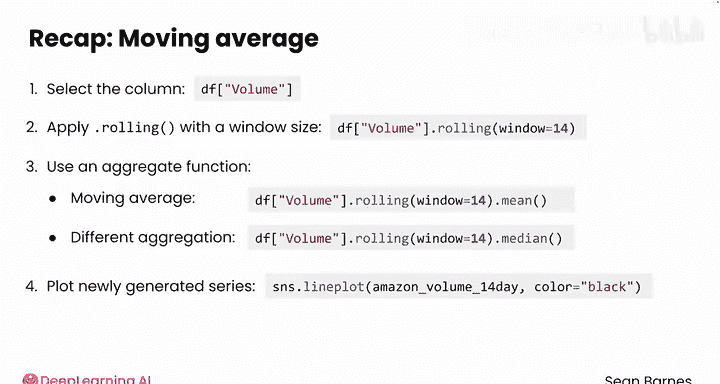

移动平均线是平滑嘈杂时间序列数据的绝佳工具。与电子表格相比，在Python中实现起来相当快捷。

在接下来的视频中，我们将学习如何计算百分比变化，以识别数据中的急剧峰值和下跌。