# 088：时间序列分析之百分比变化 📊

在本节课中，我们将要学习如何分析时间序列数据中的百分比变化。这是一种强大的工具，可以帮助我们识别当前时期与前一时期相比的变化情况。我们将以亚马逊股票价格数据为例，找出那些价格跌幅超过5%的日期，从而分析历史上对亚马逊股价冲击最大的市场事件。

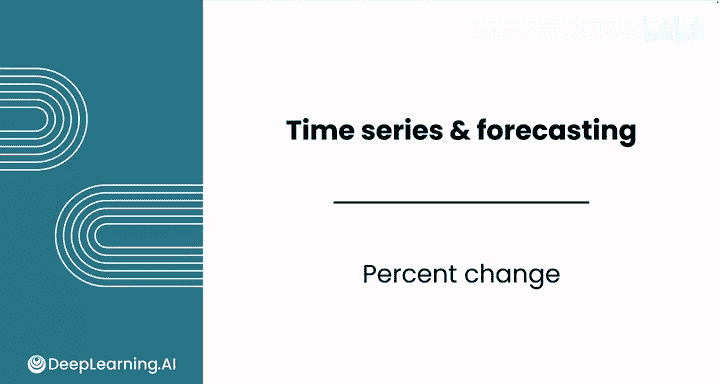

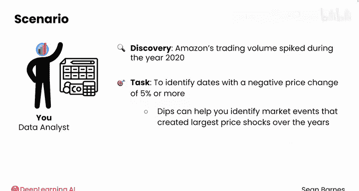

上一节我们介绍了如何导入数据并创建时间序列。本节中我们来看看如何计算和分析百分比变化。

## 计算百分比变化

首先，我们关注的是调整后的收盘价。百分比变化可以告诉我们股票价格相较于前一天是上涨还是下跌。

以下是计算步骤：

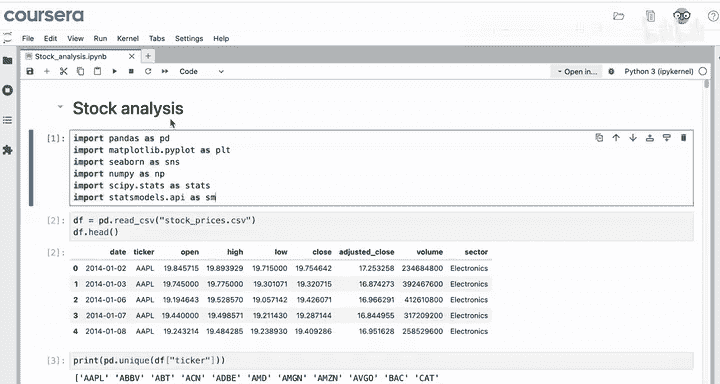

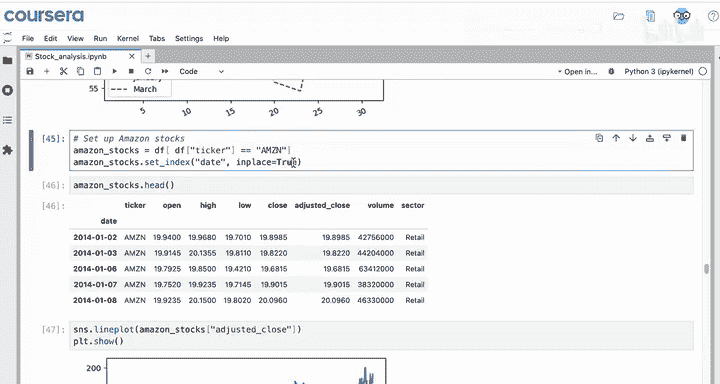

1.  选择包含调整后收盘价的列。
2.  使用 `.pct_change()` 方法计算百分比变化。
3.  将结果保存到一个变量中。

对应的代码如下：
```python
amazon_close_pct_change = df['Adj Close'].pct_change()
```

计算后，我们预期只有第一个单元格是空的，因为第一天没有前一天的股价可供比较。从第二天开始，我们会看到一系列代表每日价格变化比例的数字。

需要注意的是，`.pct_change()` 方法计算的是**比例变化**，而非百分比。例如，结果 `-0.0038` 表示下跌了 `0.38%`。为了得到真正的百分比，需要将结果乘以100。但在后续分析中，我们通常保留原始的比例形式，因为这样更方便计算。

## 可视化百分比变化

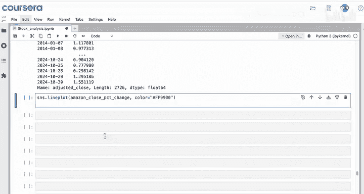

百分比变化本身也是一个时间序列，因此我们可以像绘制其他数据一样将其可视化。

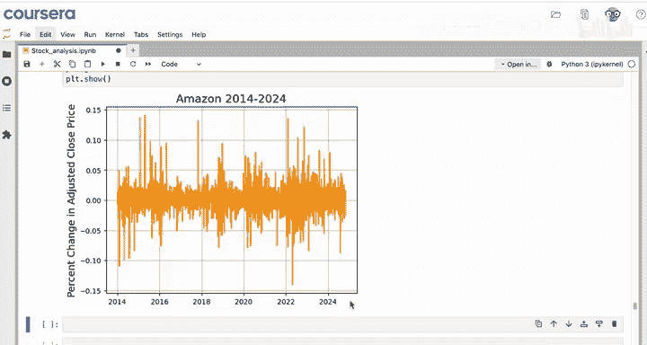

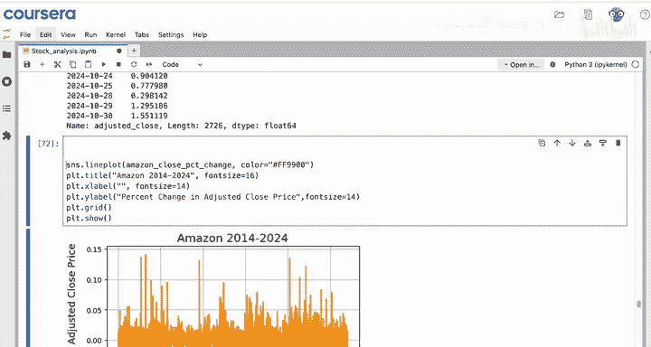

以下是绘制百分比变化折线图的步骤：

1.  使用 `sns.lineplot()` 绘制折线图。
2.  为图表添加合适的标签。
3.  可以自定义线条颜色以增强可读性。

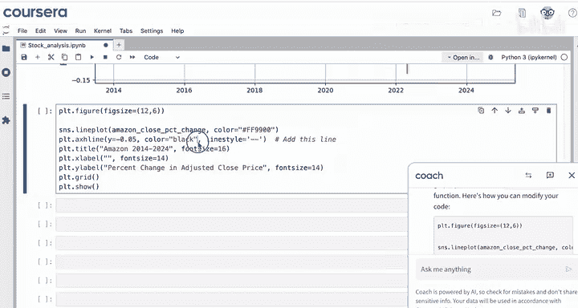

通过观察图表，我们发现百分比变化围绕零值上下波动，其中正负方向的尖峰代表了较大的单日价格变动。

为了更好地识别特定阈值（如跌幅超过5%）的日期，我们可以在图表中添加水平参考线。

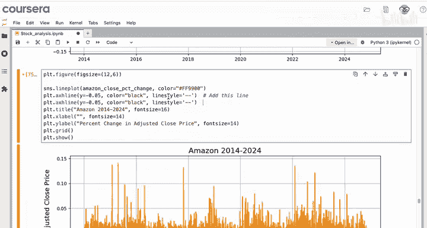

例如，添加一条位于 `y = -0.05` 的水平线，可以清晰标出价格下跌5%的临界点。我们还可以添加一条位于 `y = 0` 的实线，用以区分价格上涨和下跌的区域。

## 筛选与分析特定变化

可视化之后，我们可以进一步筛选数据，获取那些跌幅超过5%的具体日期列表。

筛选一个序列的方法与筛选数据框中的列非常相似。以下是具体操作：

1.  使用条件语句筛选出百分比变化小于 `-0.05` 的数据点。
2.  使用 `.count()` 方法统计满足条件的日期数量。
3.  计算这些“大跌”日期占总交易日的比例。

对应的代码如下：
```python
dips = amazon_close_pct_change[amazon_close_pct_change < -0.05]
dip_count = dips.count()
dip_proportion = dip_count / len(amazon_stocks_df)
```

通过分析，我们发现在过去大约十年间，亚马逊股价单日跌幅超过5%的情况只发生了44次，占总交易日的比例仅为1.6%，属于相对罕见的事件。我们可以通过 `dips.index` 获取这些具体日期的列表，以便深入研究每次大跌背后的市场原因。例如，数据表明其中三次重大下跌恰好发生在2020年3月美国疫情初期。

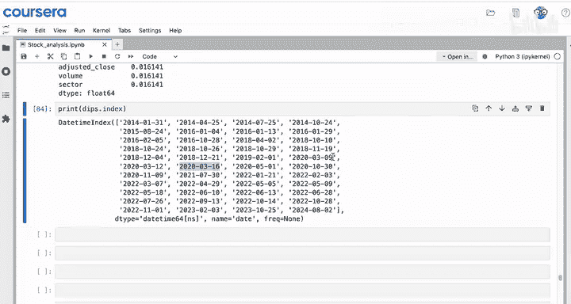

## 总结

本节课中我们一起学习了时间序列分析中的百分比变化。

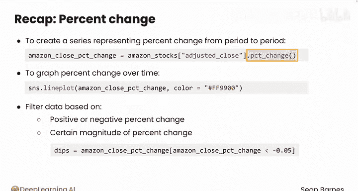

我们使用 `.pct_change()` 方法创建了一个表示逐期百分比变化的新序列。我们不仅学会了如何绘制百分比变化随时间推移的走势图，还掌握了如何根据变化的正负或特定幅度（例如，调整后收盘价较前一日下跌超过5%的日子）来筛选数据。

一旦掌握了移动平均线和百分比变化的应用，你可能会有兴趣对数据进行分段，以更好地理解各个子集。请跟随我到下一个视频，看看具体如何操作。