# 089：时间序列分群分析 📊

在本节课中，我们将学习如何对时间序列数据进行分群分析。我们将探索如何根据日期索引的属性（如月份）对数据进行分组，并通过可视化来识别数据中的季节性模式。

---

## 概述

时间序列数据包含丰富的信息，通过分群分析，我们可以从不同维度（如月份、季度）观察数据的模式和趋势。本节我们将以Netflix股票数据为例，学习如何按月份分组，分析交易量的季节性变化，并理解这些变化与公司季度财报发布的关系。

上一节我们介绍了如何导入和查看数据，本节中我们来看看如何对时间序列进行分组和聚合分析。

---

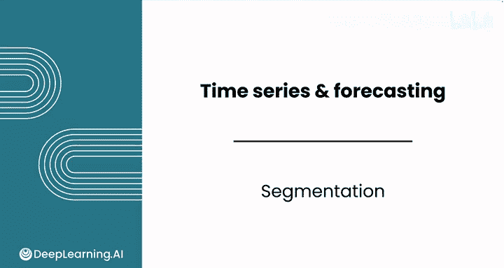

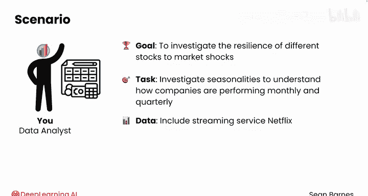

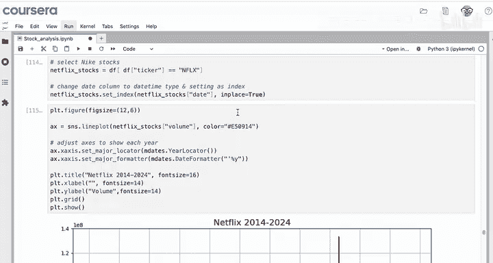

## 数据准备与初步观察

首先，我们从数据集中选取Netflix的股票数据，并将日期列设置为索引。

```python
# 选取Netflix股票数据并设置日期索引
netflix_stocks = df[df['Ticker'] == 'NFLX']
netflix_stocks.set_index('Date', inplace=True)
```

接着，我们绘制交易量的折线图以观察整体趋势。

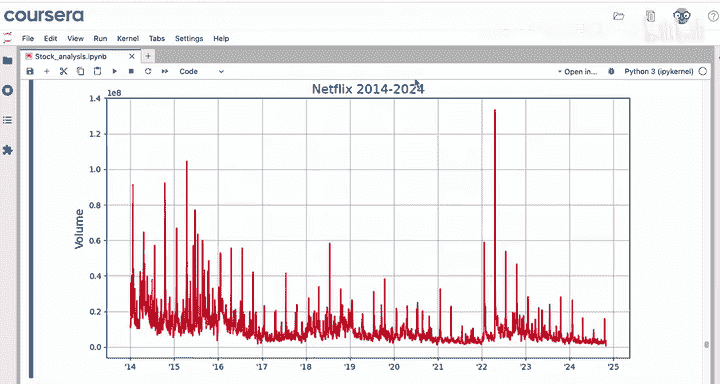

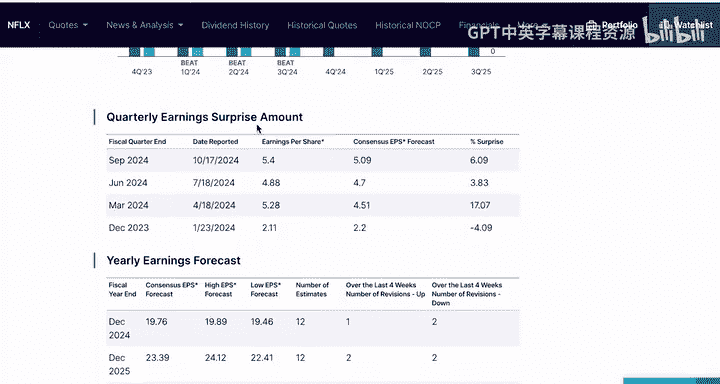

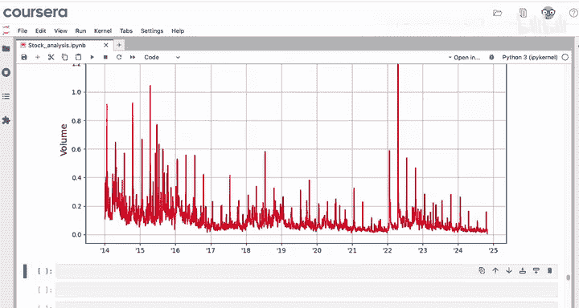

```python
# 绘制交易量折线图
netflix_stocks['Volume'].plot()
```

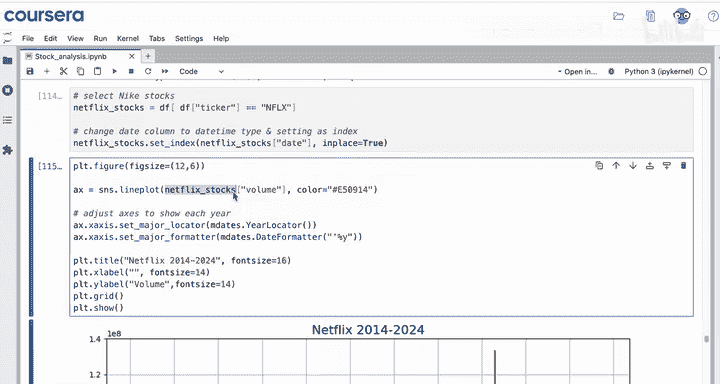

从图中可以观察到，数据中大约每年出现四次显著的交易量峰值，这是一个值得关注的稳定模式。

---

## 按月份分组分析

日期索引允许我们访问其各个组成部分，例如年份、月份或季度。

```python
# 从日期索引中提取月份
netflix_stocks.index.month
```

为了方便后续分析，我们可以将月份信息添加为数据框的一个新列。

```python
# 将月份添加为新列
netflix_stocks['month'] = netflix_stocks.index.month
```

以下是按月份对数据进行分组并计算平均交易量的步骤：

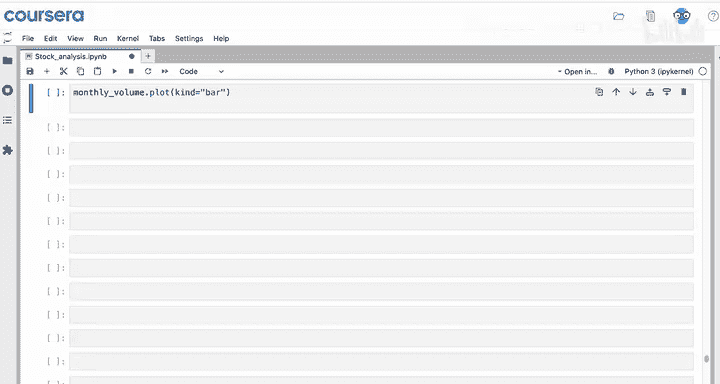

1.  使用 `groupby` 方法按月份分组。
2.  选择 `Volume` 列。
3.  应用 `.mean()` 函数计算每个月的平均交易量。

```python
# 按月份分组并计算平均交易量
monthly_volume = netflix_stocks.groupby('month')['Volume'].mean()
```

为了更直观地展示结果，我们可以使用条形图进行可视化。

```python
# 绘制平均月交易量条形图
monthly_volume.plot(kind='bar')
```

分析显示，Netflix发布季度财报的月份（一月、四月、七月、十月）的交易量明显高于其他月份，峰值大约高出30%至50%。

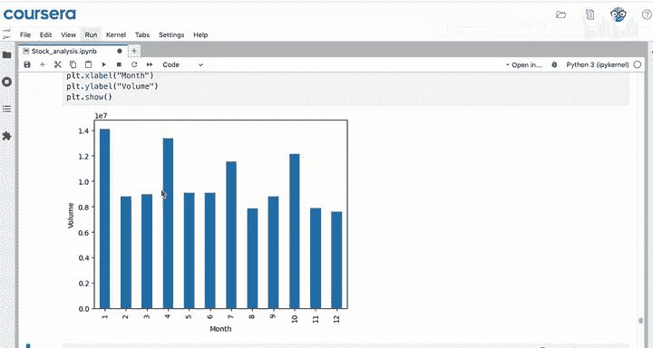

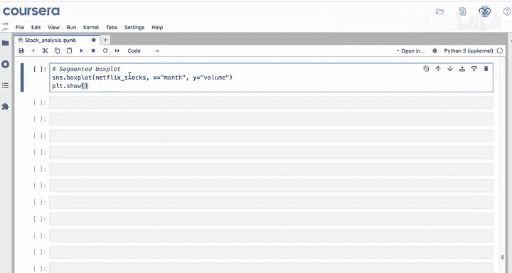

---

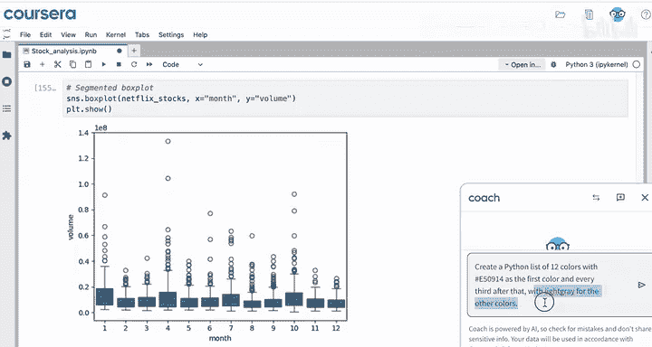

## 使用箱线图深入分析分布

为了更细致地了解每个月份交易量的分布情况（包括中位数、四分位距和异常值），我们可以使用箱线图。

以下是使用Seaborn库绘制箱线图的步骤：

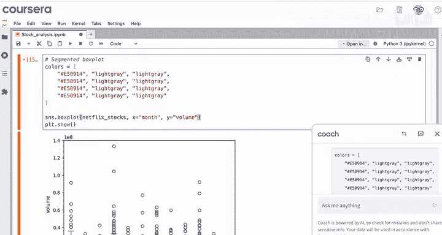

1.  指定 `x` 轴为月份，`y` 轴为交易量。
2.  通过调色板参数为不同月份应用颜色，以突出显示财报发布月。

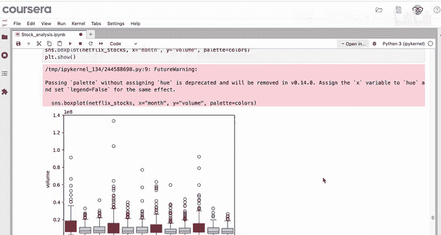

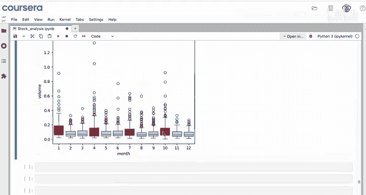

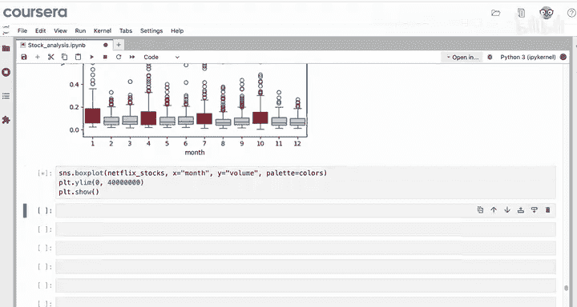

```python
import seaborn as sns

# 定义颜色列表，财报发布月为红色，其他月为浅灰色
colors = ['red', 'lightgray', 'lightgray'] * 4

# 绘制箱线图
sns.boxplot(x=netflix_stocks['month'], y=netflix_stocks['Volume'], palette=colors)
plt.ylim(0, 4e7)  # 调整y轴范围以聚焦主要数据分布
```

通过箱线图可以确认，财报发布月的交易量中位数和变异性（四分位距更宽）都高于其他月份，这与平均值的观察结果一致。

---

## 总结

本节课中我们一起学习了时间序列分群分析的核心方法：

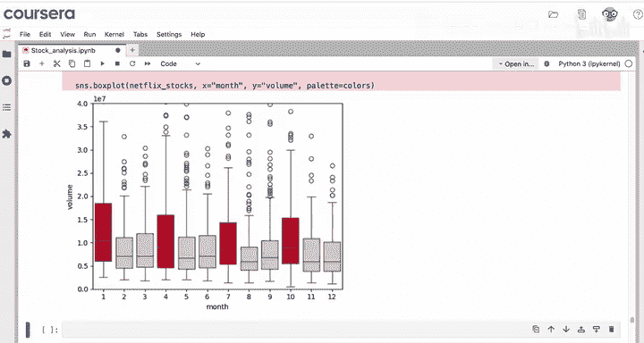

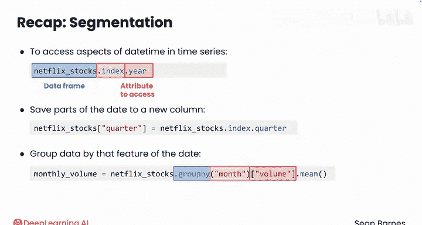

*   **提取日期属性**：可以通过 `DataFrame.index.month`、`.year`、`.quarter` 等方式访问日期索引的不同部分。
*   **创建分组列**：可以将日期属性（如季度）保存为新列，便于后续分组操作。
*   **分组与聚合**：使用 `.groupby()` 方法按特定特征（如月份）分组，然后结合 `.mean()`、`.describe()` 等函数进行聚合分析。
*   **可视化模式**：通过条形图和箱线图等可视化工具，可以清晰地揭示数据中的季节性模式和分布差异。

对时间序列进行分群是一种强大的策略，它能帮助我们从单一时间线中提取出多个有意义的子序列进行分析。在接下来的课程中，我们将学习如何重塑时间序列数据以进行更复杂的绘图。