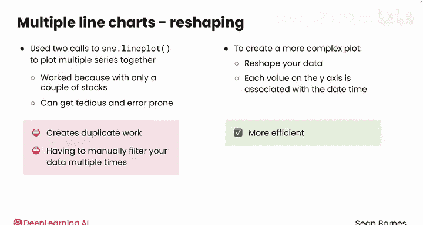
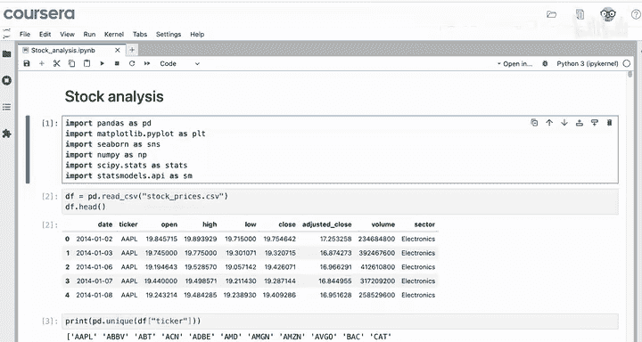
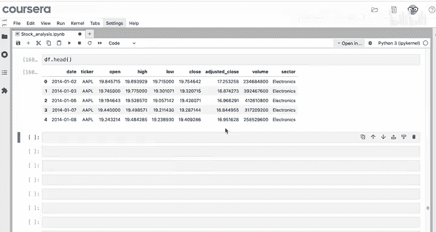
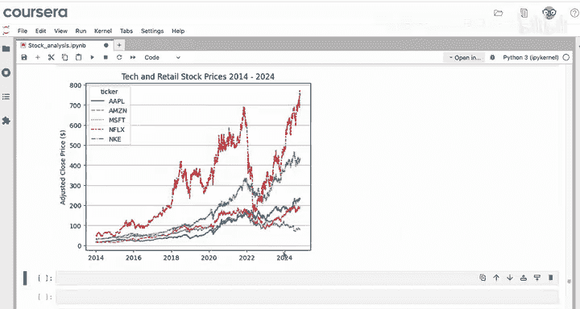
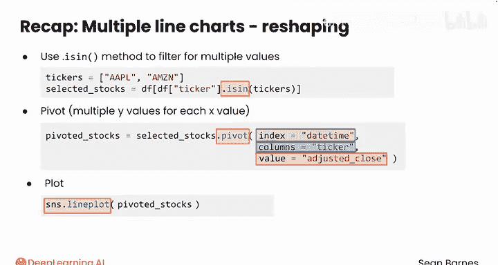

# 090：Python数据分析 第3课 - 多折线图重构 📊

在本节课中，我们将要学习如何通过重塑数据格式，来高效地绘制包含多个数据序列的折线图。核心在于将数据转换为适合绘图的结构，而非专注于复杂的绘图方法本身。


---

## 概述

绘制数据时，主要的困难往往在于将数据整理成适合绘图的格式，而不是指定具体的绘图方法。本节我们将探讨一些常见的数据重塑操作。

上一节我们介绍了基本的折线图绘制，本节中我们来看看如何将多个数据序列整合到一张图中。

## 数据重塑的必要性

在之前的课程中，我们通过两次独立的 `sns.lineplot` 调用来绘制多个股票序列。这种方法在只处理少数几只股票时可行，但手动筛选股票并分别绘制会变得繁琐且容易出错。

然而，要创建更复杂的图表，有时需要重塑数据。具体来说，需要将数据排列成：每个要绘制在Y轴上的值，都与一个唯一的X值（如日期时间）相关联。

虽然有时可以通过多次调用 `sns.lineplot` 来创建复杂图表，但这会产生大量重复工作，例如需要多次手动筛选数据。

一旦掌握了数据重塑，绘图效率将大大提高。

## 实例：比较苹果与亚马逊的股价



例如，假设你想比较苹果和亚马逊的调整后收盘价，以了解每只股票对新冠疫情的反应。你希望用多条线绘制每只股票的调整后收盘价。

但是，如果查看原始数据框，数据尚未设置妥当。仅查看 `datetime`、`ticker` 和 `adjusted_close` 列，你会发现每个唯一的日期对应两行数据，即 `datetime` 是重复的，而苹果和亚马逊的 `adjusted_close` 出现在不同的行中。

为了正确绘图，需要以某种方式重塑数据，使得每个唯一的日期时间仅对应一行，而该行中的列分别是苹果和亚马逊的调整后收盘价。

以下是实现此目标的关键步骤：

1.  **导入模块并读取数据**：首先，导入必要的模块并将数据读入变量 `df`。
2.  **筛选多个股票代码**：从原始数据框中筛选出我们感兴趣的股票（例如苹果和亚马逊）。
3.  **数据透视**：将筛选后的数据重塑为每个日期一行、每只股票一列的格式。

## 步骤详解

### 1. 筛选多个股票代码

回顾一下，之前我们使用类似 `df[df.ticker == 'AAPL']` 的代码来筛选单一股票代码。要筛选多个股票代码，一个有用的方法是 `isin()` 方法。

以下是具体操作：

```python
# 创建感兴趣的股票代码列表
tickers = ['AAPL', 'AMZN']

# 从数据框中选择 ticker 列值在列表中的行
selected_stocks = df[df['ticker'].isin(tickers)]
```





操作成功后，可以检查 `selected_stocks` 中唯一的股票代码来确认：

```python
selected_stocks['ticker'].unique()
```

预期结果应仅为 `['AAPL', 'AMZN']`。

### 2. 数据透视

筛选出这两只股票后，还需要一步来设置数据：即数据透视。

我们理想的数据格式是：列包括 `datetime`、`AAPL`、`AMZN`。每一行对应一个日期，例如 2018年8月2日，苹果的价格是100，亚马逊的价格是85。

这种格式非常适合在同一图表上绘制两条线，因为每个X值（日期）对应两个Y值（两只股票的价格）。

为了以这种方式重塑数据，需要使用 `pivot` 方法。`pivot` 与数据透视表（pivot table）略有不同：数据透视表会汇总数据，而 `pivot` 方法则是在行、列和值之间重新组织数据，而不进行汇总。不过，两种方法的参数名称是相同的。

使用方法如下：

```python
# 使用 pivot 方法重塑数据
# index: 设置为日期列（作为X轴）
# columns: 设置为股票代码列（每个代码将成为一列）
# values: 设置为要绘制的值，即调整后收盘价
pivoted_stocks = selected_stocks.pivot(index='datetime', columns='ticker', values='adjusted_close')

# 查看重塑后的数据前几行
pivoted_stocks.head()
```

现在，数据就变成了我们想要的格式。对于每个日期，都可以绘制苹果和亚马逊的调整后收盘价。

### 3. 绘制多折线图

数据重塑完成后，绘图就变得非常简单：

```python
import seaborn as sns
import matplotlib.pyplot as plt

sns.lineplot(data=pivoted_stocks)
plt.show()
```

你将得到一张漂亮的双股票价格折线图。注意，Seaborn 自动为每条线赋予了独特的颜色和样式以帮助区分。

从图中可以看到，两只股票在前几年都在上涨，但后来开始分化。苹果股价在2022年的跌幅没有亚马逊那么大。

此后，你可以继续为图表添加坐标轴标签、注释等元素进行完善。

## 扩展至更多股票

数据重塑的优势在于其可扩展性。例如，如果你想绘制五只股票而不是两只，只需将股票代码添加到列表中并重新运行代码即可。



以下是添加微软、网飞和耐克后的效果示例（代码逻辑相同，仅 `tickers` 列表变化）：

```python
tickers = ['AAPL', 'AMZN', 'MSFT', 'NFLX', 'NKE']
selected_stocks = df[df['ticker'].isin(tickers)]
pivoted_stocks = selected_stocks.pivot(index='datetime', columns='ticker', values='adjusted_close')

sns.lineplot(data=pivoted_stocks)
plt.show()
```

## 总结



本节课中我们一起学习了如何为绘制多序列折线图而重塑数据：

*   我们使用 `isin()` 方法来筛选数据框中某一列的多个值。该方法检查特定值是否在你指定的列表中。
*   我们使用 `pivot` 方法，以 `datetime` 为索引、`ticker` 为列、`adjusted_close` 为值来重塑数据，目标是实现每个X值对应多个Y值。
*   一旦数据重塑完成，就可以使用 `sns.lineplot()` 轻松获得美观的图表，并可继续使用 Matplotlib 进行精细调整。

优秀的数据重塑工作使得在单一图表中绘制多个序列成为可能。除了重塑数据，经常还需要对数据进行重采样（降低或增加其频率）。请跟随我到下一个视频继续学习。