# 091：Python数据分析 第3课 - 重采样技术 📊

在本节课中，我们将要学习时间序列数据中的重采样技术。重采样是调整数据频率的强大工具，无论是将高频数据聚合为低频，还是通过插值增加数据频率。掌握这项技术能帮助你更好地分析和理解时间序列数据。

---

## 概述

有时，你会发现时间序列数据的采样频率过高，例如每分钟的股票价格。有时，数据又不够频繁。通过重采样，你可以改变时间序列的频率。之前我们学习了如何从日期中提取信息（如季度或月份）并存入新列，这种方法适用于数据分割，但并未改变数据的频率。要获得更聚合或更细化的时间段，你需要对数据进行重采样。

---

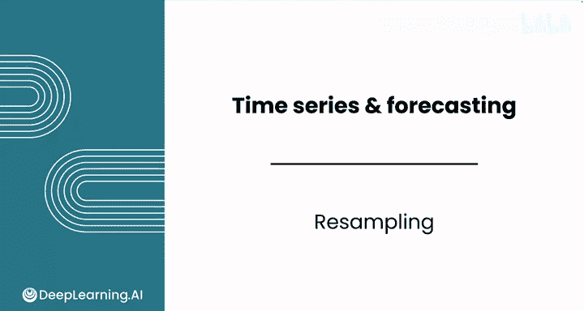

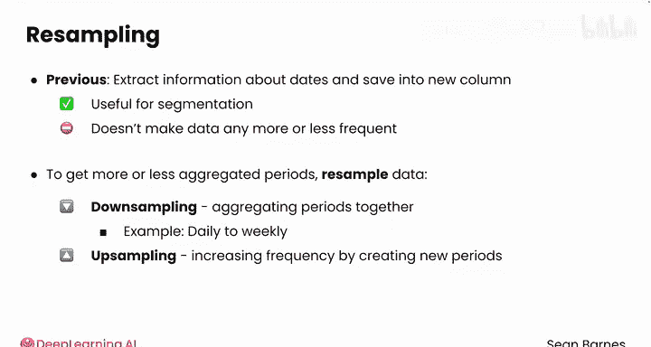

## 什么是重采样？ 🔄

重采样主要分为两种：**降采样**和**升采样**。

**降采样**涉及将多个时间段聚合在一起，通常通过计算均值来实现。例如，你可以将每日股票价格数据降采样为每周数据，方法是计算每周的平均股价。其核心思想是：

`低频数据 = 聚合函数(高频数据)`

**升采样**则涉及增加数据的频率，通过在现有时间段之间创建新的时间段来实现。这种技术不太常用，但你需要了解这个术语。

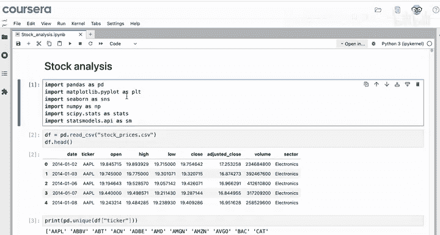

---

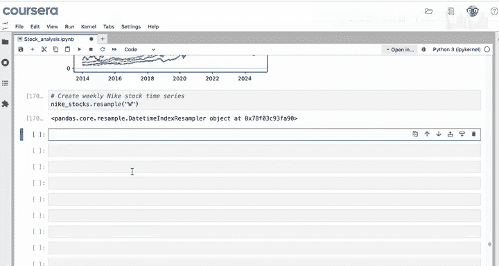

## 实践：降采样操作

上一节我们介绍了重采样的基本概念，本节中我们来看看如何在Pandas中执行降采样。

假设你已经导入模块并将数据集读入变量 `df`。现在，你想创建一个每周的耐克股票时间序列，而不是每日的，以平滑时间序列中的一些噪声。

你会使用 `resample()` 方法，并指定频率参数，例如 `'W'` 代表每周。但请注意，`resample()` 本身只是一个中间步骤。在执行某种聚合操作（如计算均值）之前，你无法看到命令的结果。

以下是初始尝试的代码：

```python
nike_weekly = df.resample('W').mean()
```

运行这行代码会产生一个错误。错误信息底部显示：`TypeError: ag function failed. How mean De type object`。这表明 `mean()` 聚合函数被应用到了对象类型（通常是字符串）的数据上，而 `mean()` 只能用于数值数据。

---

## 错误排查与解决

为了解决这个错误，我们需要确保只对数值列进行平均计算。以下是两种解决方法：

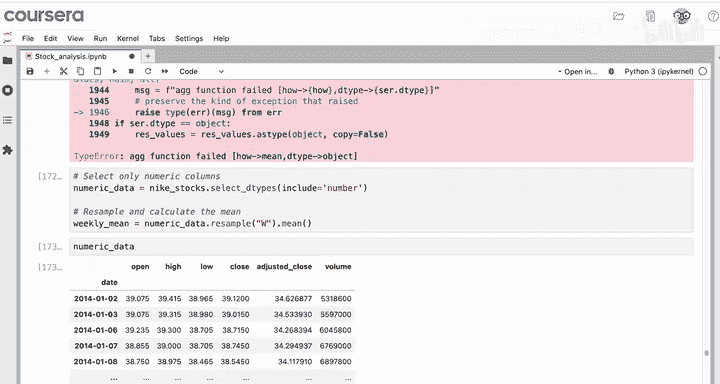

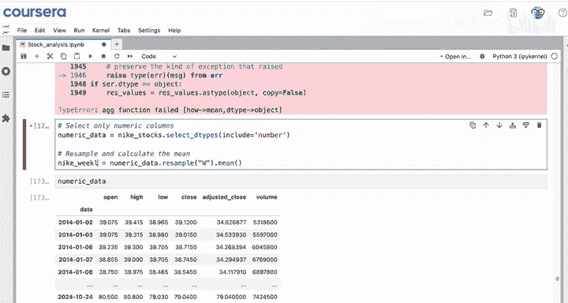

**方法一：选择数值列**
使用 `select_dtypes()` 方法仅选择数值类型的列，然后再进行重采样和平均计算。

```python
numeric_df = df.select_dtypes(include='number')
nike_weekly = numeric_df.resample('W').mean()
```

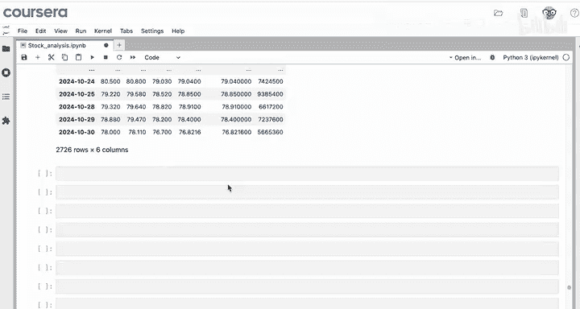

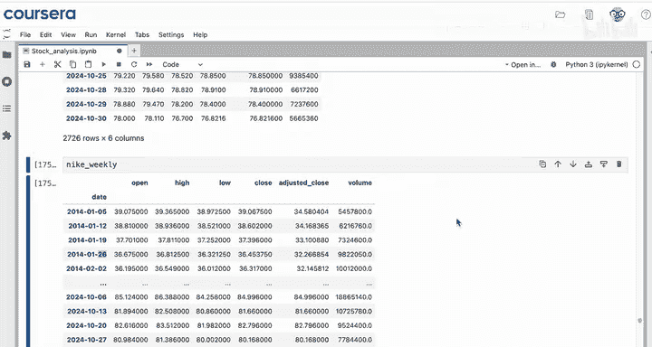

**方法二：使用其他聚合函数**
如果你需要在分析中包含分类数据，可以使用像 `first()` 这样的聚合函数，它只取每个时间段内的第一个值，这样就能处理非数值列。

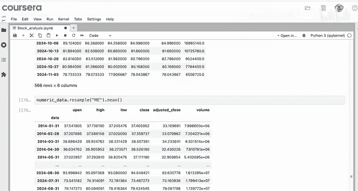

```python
nike_weekly = df.resample('W').first()
```

---

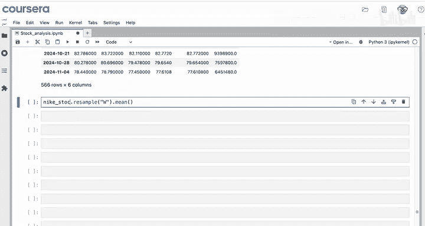

## 其他重采样频率选项

Pandas的重采样功能非常灵活，提供了多种频率选项。以下是部分常用选项：

*   `'D'`： 每日
*   `'W'`： 每周（默认周日结束）
*   `'W-MON'`： 每周一
*   `'ME'`： 每月末

你可以根据具体需求探索不同的频率参数。

---

## 总结

本节课中我们一起学习了时间序列的重采样技术。你学会了如何使用 `resample()` 方法对数据进行降采样，其中 `'W'` 参数表示按周重采样，此外还有 `'D'`（每日）、`'ME'`（月末）和 `'W-MON'`（每周一）等多种选项。你了解到使用 `mean()` 进行重采样只适用于数值列，可以通过 `select_dtypes()` 选择数值列来计算均值，或者在分析中需要分类数据时，使用 `first()` 等其他聚合函数。现在，你已经能够根据需要调整数据的频率了。

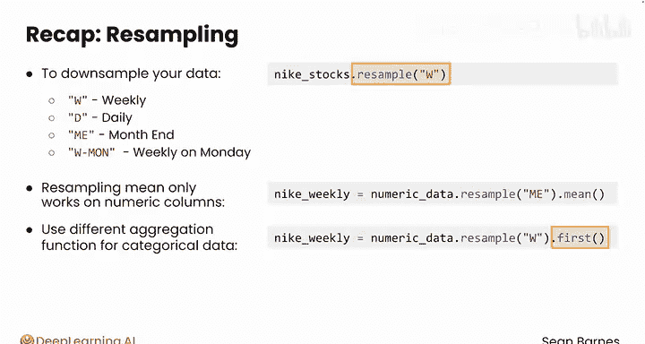

接下来，你将完成练习作业和实践实验室。在实践实验室中，将继续使用澳大利亚航班延误数据。完成后，请跟随我进入本模块的下一课，也是最后一课：使用线性回归进行时间序列预测。