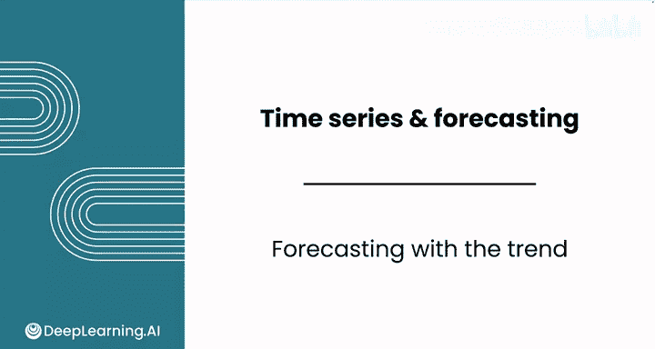
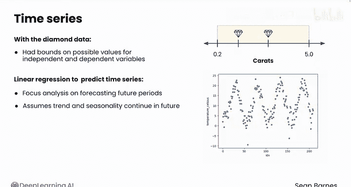
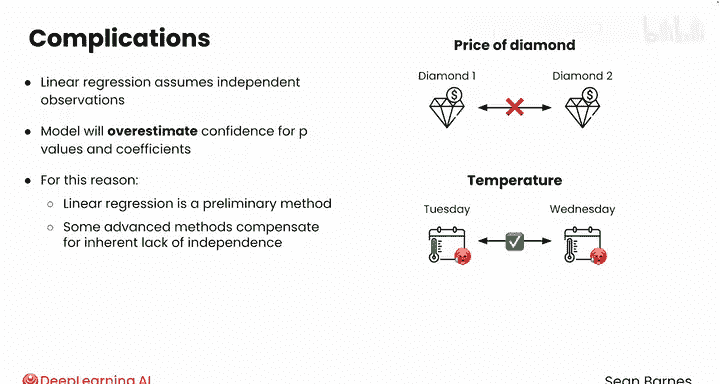
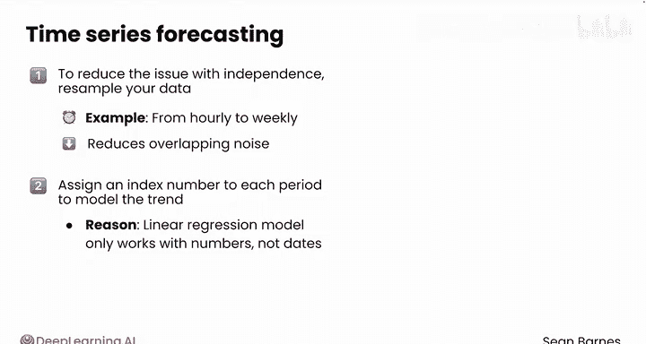
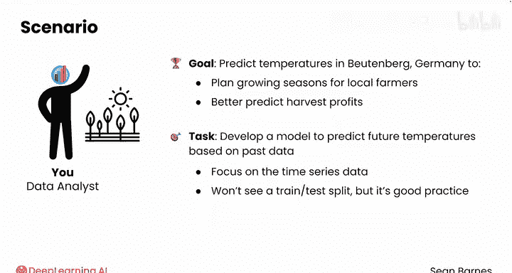
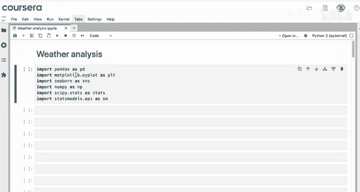
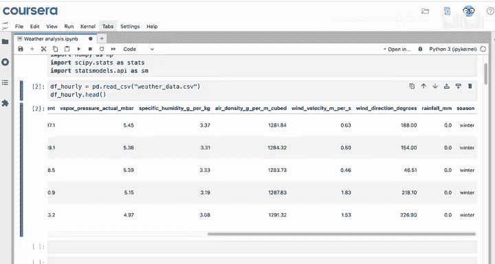
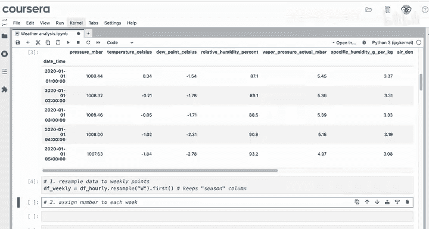
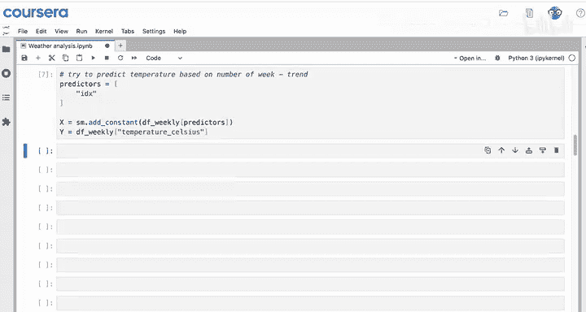
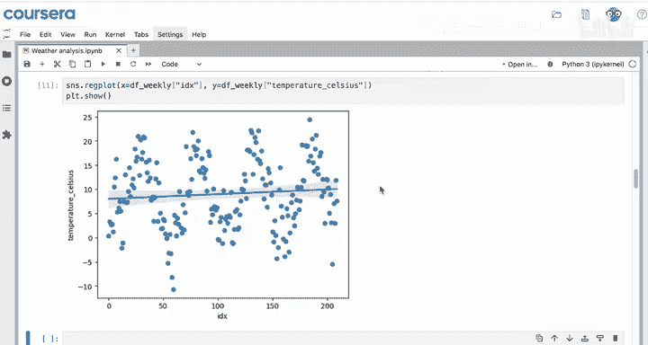

# 092：Python数据分析（第3课）｜ 趋势预测 📈

## 概述



在本节课中，我们将学习如何使用线性回归模型来预测时间序列数据的趋势。我们将从一个简单的单变量模型开始，了解其基本原理、应用步骤以及在实际数据分析中需要注意的问题。

---

## 线性回归与时间序列

上一节我们介绍了线性回归在截面数据中的应用。本节中我们来看看线性回归如何应用于时间序列数据。

线性回归不仅适用于截面数据，也是分析时间序列数据的有用技术。你可以使用一个简单的线性回归模型（即只有一个自变量的模型）来预测时间序列数据的趋势。

在之前使用钻石数据的课程中，自变量（克拉数）和因变量（价格）的取值范围是明确的。在使用克拉数预测价格的简单线性回归案例中，克拉数大致在0.2到5之间。通常，新钻石的克拉数预期会落在这个范围内。

当使用线性回归预测时间序列时，分析的重点通常是预测未来时期。例如，如果你拥有2020年1月1日至2024年1月1日的数据，你通常感兴趣的是预测2024年或更晚的时间。你的模型假设趋势和季节性在未来会持续，但预测得越远，不确定性往往越大。条件会发生变化，微小的不确定性或误差可能在多年间累积。



影响你时间序列建模的一个复杂因素是，线性回归通常假设观测值是独立的。例如，假设一颗钻石的价格不影响另一颗的价格是合理的。然而，某一天的温度与它前后几天的温度高度相关。如果周二是炎热的，周三很可能也是炎热的。不必过于担心这个问题的技术细节。这对你分析的影响是，模型会高估P值和系数的置信度。在解释结果时需要谨慎。因此，用于时间序列预测的线性回归通常是一种初步方法。一些更高级的方法可以弥补时间序列数据中这种固有的非独立性。

当你在代码中进行时间序列预测时，需要考虑两个额外的步骤。首先，为了帮助减少独立性问题，你可以对数据进行重采样，例如，从每小时观测值重采样为每周观测值。重采样减少了模型必须处理的重复噪音量。然后，为每个时期分配一个索引编号，以便你能够对趋势建模。这是因为你的线性回归模型只处理数字，而不是日期。

假设你正在与一家农业咨询公司合作，预测德国的天气模式。你的公司希望预测德国博伊滕堡的温度，以便为当地农民规划种植季节并更好地预测收获利润。你被要求开发一个模型，根据过去的数据预测未来的温度。

为了简化，让你专注于时间序列数据，这里不会展示训练测试集划分，但通常最好使用一个。

---

## 数据准备与探索

以下是开始建模前的准备工作。

首先，导入所需的库，加载数据并查看。



```python
import pandas as pd
import statsmodels.api as sm
```



记住，这行代码能运行是因为天气数据CSV文件与你的笔记本在同一文件夹中。这些数据是德国博伊滕堡的每小时天气数据。注意这个包含日期和小时的日期列。除了你试图预测的温度（摄氏度）外，你还有许多其他可用的特征，包括气压、露点等，你还有一个季节列。

为了使这些数据成为时间序列，将索引设置为日期时间列。确保进行原地操作。

```python
df = pd.read_csv('weather_data.csv')
df['date'] = pd.to_datetime(df['date'])
df.set_index('date', inplace=True)
```

最后，在创建线性回归模型之前，还有两个准备步骤。

首先，你需要将数据重采样为每周数据点。重采样可以减少数据中的随机噪音。使用`.resample('W')`方法来实现。由于你想保留季节列供以后使用，可以使用`.first()`聚合函数，而不是`.mean()`。





```python
df_weekly = df.resample('W').first()
```



其次，你需要为每一周分配一个数字，因为日期时间是其自身的类型，不是数字，但你的线性回归模型需要一个普通数字。添加一个新列`idx`（索引），使用`range`函数，该函数从0到数据框的长度（即行数）生成数字。

```python
df_weekly['idx'] = range(len(df_weekly))
```

然后再次查看`df_weekly`。现在你有了这个索引列，它从0、1、2、3开始，一直向上递增。

---



## 建立简单线性回归模型

现在你可以开始设置回归预测变量了。从一个简单的线性回归开始，即一个自变量。使用一个只包含一个项目`['idx']`的列表。因此，你将尝试根据周数来预测温度。之后，你可以添加到这个列表中，并保持其他代码不变。

这个线性回归模型将尝试预测数据的趋势。记住，线性回归只是估计最佳拟合线。如果温度总体在上升，那么较晚的周将具有较高的温度。如果温度在下降，那么较晚的周或较高的索引将具有较低的温度。

代码与之前处理截面数据时相同：`X`等于使用`sm.add_constant`选择预测变量列（目前只有一列），`Y`将是温度（摄氏度）。

```python
X = sm.add_constant(df_weekly[['idx']])
y = df_weekly['temperature_c']
model = sm.OLS(y, X).fit()
```

你现在已经设置了回归，现在可以运行回归了。

---

## 解释模型结果

记住，你正在解释趋势。首先，R平方值非常低，只有0.007。换句话说，周数只能解释约0.7%的温度变异性。这并不多。



检查索引系数的P值。它是0.22，远高于任何合理的alpha阈值，如0.05或0.01。那么这个P值告诉你什么？**周数对整体温度没有显著影响**。

目前，你只有从2020年到2023年的三年数据，模型没有足够的证据来预测未来的温度。如果你看一下周数与温度的散点图，你会发现这种关系是非常非线性的。你试图在这里拟合一条直线，但直线不能很好地模拟这些数据。这是一个潜在的线索，表明你需要更多的数据或一个更复杂的模型。

因此，在你的模型中添加季节性将真正帮助你更准确地预测温度。顺便说一下，当你使用最少的变量工作时，在初始模型中发现无效应是常见的。你应该继续改进你的模型。

---

## 总结



本节课中，我们一起学习了如何使用简单线性回归来模拟时间序列的趋势。我们了解了将线性回归应用于时间序列数据时的基本步骤、潜在问题（如观测值非独立性）以及如何通过重采样和创建索引来准备数据。我们还运行了一个简单的模型并解释了其结果，认识到仅用趋势项可能不足以捕捉数据的全部模式。

在下一节视频中，我们将学习如何向你的时间序列预测模型中添加季节性因素，以构建更强大、更准确的预测模型。