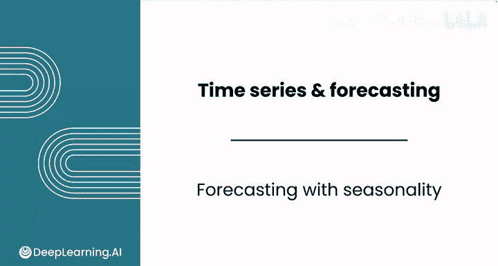
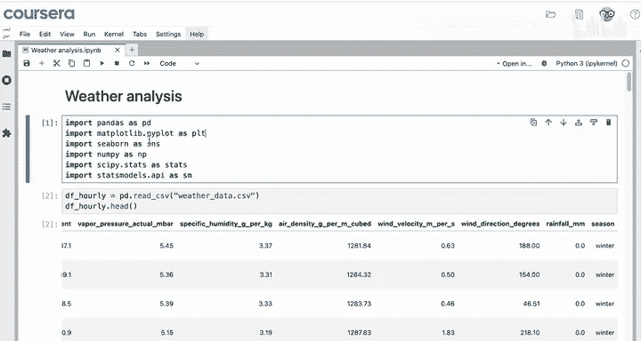
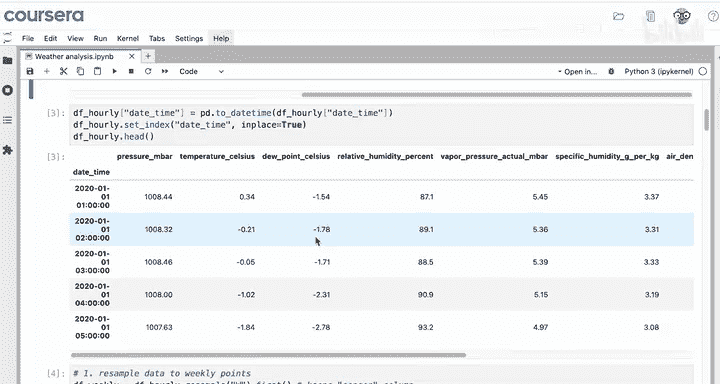
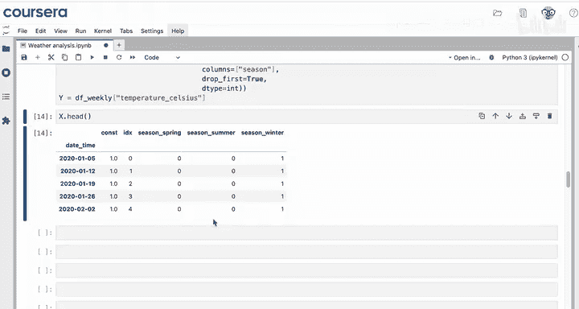
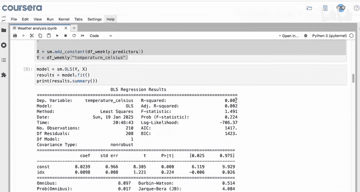
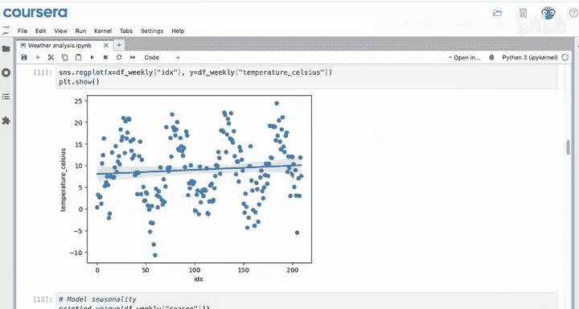
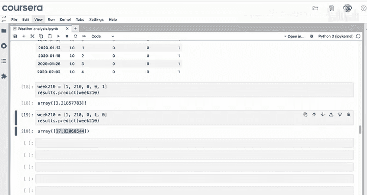
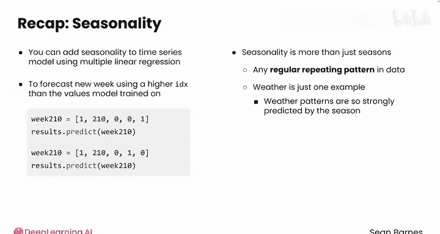

# 093：Python数据分析 第3课 - 季节性预测 🌡️📈

## 概述

在本节课中，我们将要学习如何为时间序列数据建立季节性预测模型。我们将从简单的线性回归模型出发，扩展到包含季节性因素的多重线性回归模型，并使用德国博尔滕堡的温度数据作为案例进行实践。

---

## 从趋势到季节性

上一节我们介绍了如何使用简单线性回归为时间序列的趋势建立预测模型。本节中我们来看看如何扩展模型，以加入季节性因素。

回顾一下，我们正在为一家咨询公司预测德国博尔滕堡的温度。之前我们已经完成了数据导入、将时间序列设置为索引、将数据降采样为周度数据，并添加了一个索引列。我们观察到数据中存在明显的季节性：夏季温度飙升，冬季温度下降。仅用一条直线拟合这些数据效果不佳。

因此，下一步是建模季节性。







---

## 识别与准备季节性数据

观察数据中的“季节”列，它包含四个类别。

以下是识别季节类别的代码：

```python
df['season'].unique()
```

为了在回归模型中使用这个分类变量，需要将其转换为数值形式。我们将“季节”添加到预测变量列表中。

对于分类数据，需要使用 `pd.get_dummies` 来获取数值，而不是字符串。

以下是创建虚拟变量的代码：

```python
X = pd.get_dummies(df_predictors, columns=['season'], drop_first=True, dtype=int)
```

参数说明：
*   `df_predictors`：你的预测变量DataFrame。
*   `columns=['season']`：需要创建虚拟变量的列。
*   `drop_first=True`：省略一个季节类别作为基准。
*   `dtype=int`：生成整数而非布尔值。

你不需要记住所有参数，可以随时查阅之前的笔记或咨询大语言模型。

最后，像之前一样使用 `sm.add_constant`，以便模型可以估计截距。

查看 `X.head()`，格式符合预期：包含常数项、代表周数的索引列以及三个季节的虚拟变量。

被省略的季节是秋季。这有助于解释，因为秋季既非夏季极端也非冬季极端，有助于从基准温度进行解释。

---

## 运行回归并解读结果

回归设置完毕，没有错误，可以运行。

现在得到了一些有趣的结果。模型的 R 平方值为 **0.575**，这意味着目前可以解释约58%的温度变化。这是模型的整体解释力。

之前仅包含趋势的模型 R 平方为 **0.007**。因此，同时建模趋势和季节性的回归模型比仅建模趋势的模型能预测更多的温度变化。这很合理，因为从图中可以看出，温度随季节的变化远大于随周数的变化。





你可能还想理解系数。



索引（趋势）的系数仍然不显著。模型仍然没有足够的数据来识别显著的趋势。

回顾一下，被省略的基准季节是秋季。因此，其他季节的系数都是与秋季类别相比较的结果。

春季、夏季和冬季这三个季节的系数都非常显著。

*   与秋季相比，夏季月份平均使温度**增加 8 度**。
*   与秋季相比，冬季月份平均使温度**降低 6.5 度**。
*   同时，春季月份比秋季**低 2.2 度**。

---

## 进行未来预测

既然已经训练了一个具有显著系数的模型，就可以开始进行预测了。

如果你想预测未来的一周，可以查看数据的末尾。最高的索引是 209，因此现在可以预测第 210 周（数据中的下一周，即2024年第二周）的温度。

查看 `X.head()`，你需要一个类似这样的值列表来预测第210周：一个包含常数项1、周数210、春季为0、夏季为0、冬季为1的列表。

使用 `results.predict()` 对第210周进行预测，得到温度约为 **3.3 摄氏度**（约38华氏度）。

那么，如果这一周是夏季，预测温度会是多少？

夏季应该比冬季增加好几度。也许你会预期高出约14.5度（8 + 6.5）。这正是你看到的：如果这周是夏季，预测温度约为 **17.8 摄氏度**。

虽然我们知道这一周不是夏季，但这个假设展示了模型的季节性成分在预测温度时发挥了巨大作用，尤其是与趋势成分相比。

---

## 总结

本节课中我们一起学习了如何为时间序列模型添加季节性。

我们了解到，即使趋势不显著，仍然可以使用多重线性回归来建模数据中的季节性。我们还学习了如何使用比模型训练数据更高的索引值来预测新的一周。由于预测的本质是处理原始数据之外的值，因此需要仔细解释结果。





请记住，季节性不仅仅是“季节”，它指的是数据中任何有规律的重复模式。天气数据只是一个说明性的例子，你可以理解为什么这些模式被称为“季节性”，因为天气模式与季节密切相关。

在时间序列中建模季节性是一项出色的工作。你已经开发了一个基于历史数据预测天气模式的复杂模型。

请继续学习下一个视频，以更好地理解线性回归误差指标如何应用于时间序列预测。