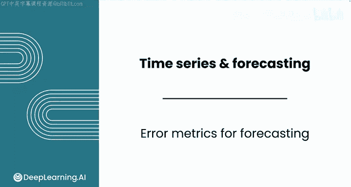
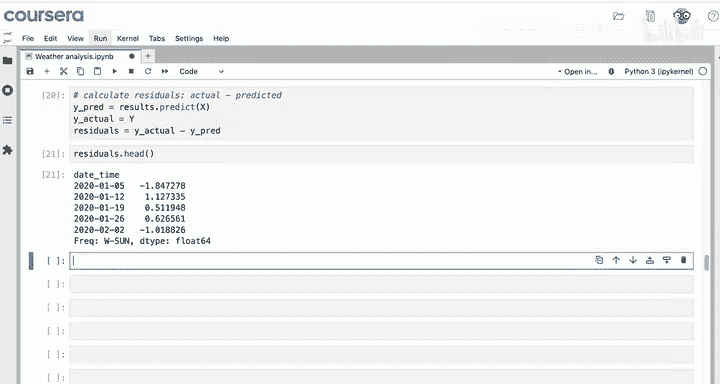
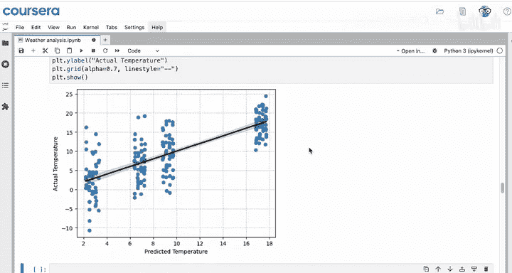
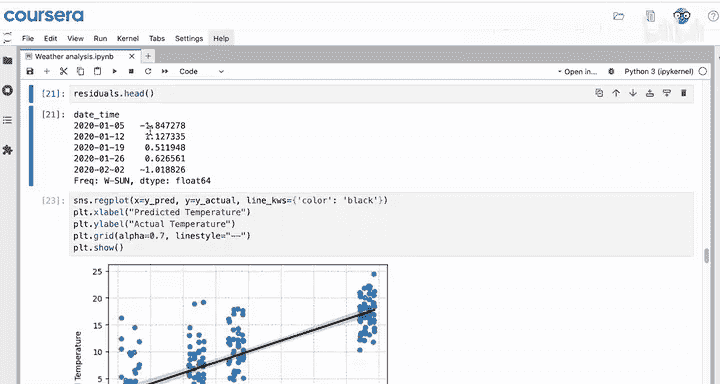
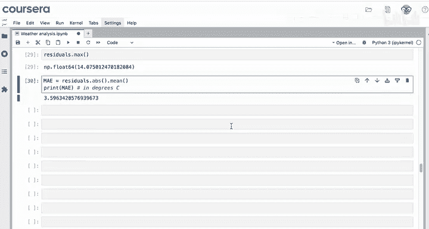
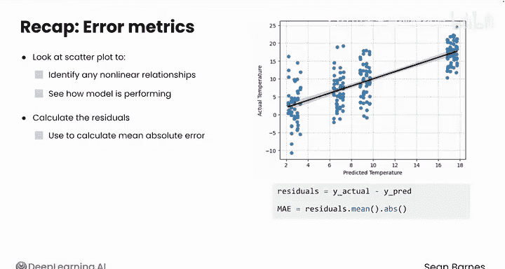

# 094：Python数据分析（第3课）｜预测误差指标

在本节课中，我们将学习如何评估时间序列线性回归模型的性能。我们将使用与横截面数据相同的误差指标，并探讨在时间序列背景下如何解读这些指标。

---

## 🔍 回顾与准备

上一节我们介绍了如何构建时间序列回归模型。本节中，我们来看看如何评估该模型的预测准确性。

首先，我们正在为德国博伊登堡的气温进行预测。此前，我们已经完成了数据导入、降采样为周度数据，并构建了一个多元线性回归模型来预测气温。

与计算钻石价格残差的方法类似，我们也可以计算时间序列预测的残差。残差定义为实际值（此处为气温）减去预测值。

**残差公式**：
`residuals = y_actual - y_predicted`

残差揭示了模型预测值与真实值之间的差异。

---

## 📈 计算与可视化残差





以下是获取预测气温（y_pred）的步骤。实际气温为 y，残差则为实际气温减去预测气温。

与之前一样，我们可以查看预测值与实际值的散点图。图中显示出四个不同的簇，可能对应四个不同的季节。


中间温度对应春季和秋季，秋季温度略高。较高温度对应夏季，较低温度对应冬季。为图表添加颜色编码会更好，这可以借助你的LLM工具来完成。

理想情况下，我们希望看到预测值与实际值之间存在线性关系，即一种一一对应的相关性。正如之前所见，季节性（而非趋势）在此数据中承担了主要的预测工作。

---

## 🔎 分析残差

我们可以查看残差的头部数据，以了解模型各个预测的偏差程度。





```python
# 示例：查看残差头部
print(residuals.head())
```

第一个预测看起来相当接近，偏差约为1.8度。在2020年的第一周，实际气温比预测气温高出不到2度。

如果你对数据集中的最大误差感到好奇，也可以查看最大值。


在本例中，存在一个偏差约14度的预测。它可能接近零，但数据显示有一周的气温预测偏差了约14度。

---

## 📊 计算平均绝对误差

使用与横截面数据完全相同的代码，我们可以计算模型的平均绝对误差。

**平均绝对误差公式**：
`MAE = (1/n) * Σ|y_actual - y_predicted|`

平均绝对误差的单位与数据单位相同，此处为摄氏度。计算结果显示，模型平均偏差约为3.6摄氏度。

对于“今天是否需要穿毛衣”这类问题，这个误差或许可以接受。但对于农业或科学应用，可能解释力不足。

---





## 🎯 总结与回顾

本节课中我们一起学习了如何评估时间序列回归模型。

以下是评估步骤总结：
1.  首先，查看实际值与预测值的散点图，以识别线性关系并评估模型性能。
2.  接着，计算残差。
3.  最后，利用残差计算平均绝对误差。平均绝对误差告诉你模型预测平均偏差多少，无论误差是正还是负。

现在，你已经开发出一个具有一定解释力的模型。你可以将此模型带回给客户，作为讨论的起点，或者运用之前模块中的迭代过程来改进它。例如，通过添加更多特征作为预测变量，或在LLM中探索更多选项。

现在，你已经能够熟练地使用多元线性回归来预测时间序列数据并正确解读结果。

---

## 🚀 后续课程预告

本课即将结束，课程也接近尾声。接下来，你将完成本模块的评分作业和实验。

在评分实验中，你将分析珊瑚礁数据，以帮助海洋保护团队。

最后，你将完成本课程的顶点练习。你将扮演一名数据分析师，与一家新的金融科技初创公司合作。你的目标是创建一个预测模型来估算贷款利率。你将综合运用本课程中学到的所有知识，包括数据操作、描述性统计、可视化和推断统计，来完成一项全面、严谨的分析。

完成评分作业、实验以及顶点练习后，我将在最后一个视频中与你讨论作为数据分析师的后续步骤。继续努力，期待在完成这些任务后与你再见！