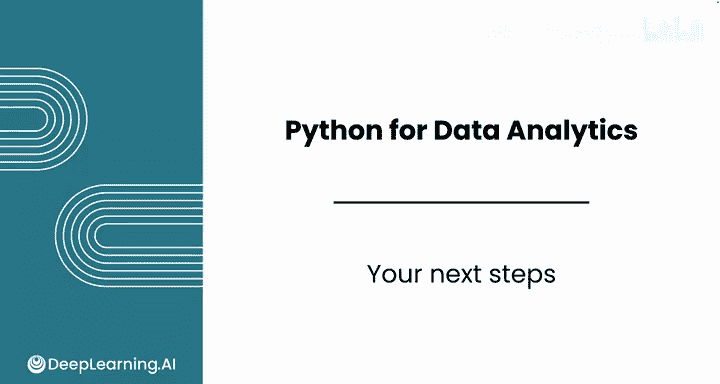

# 095：Python数据分析（第3课）｜Python for Data Analytics  
课程编号：P95：94_你的下一步计划  

## 📚 概述  

在本节课中，我们将总结你在数据分析课程中取得的成就，并展望接下来的学习方向。你已经掌握了Python编程和数据分析的核心技能，现在可以开始探索更高级的数据处理技术。  

---

## 🎉 课程完成祝贺  

祝贺你完成顶点项目和本课程。  

你在编程和数据分析方面取得了惊人的进步。  

你学习了Python函数、数据类型以及许多高级数据分析师常用的技术。  

你分析了各种真实世界的数据，从公共图书馆收入和餐厅评分，到贷款利率、珊瑚礁指标和钻石价格。  

你已经准备好进行大规模的自定义分析，并且还有很多可以学习的内容。  

即使在这个领域工作多年，每天仍然有新的知识可以学习。  

---

## 🔄 过渡到下一阶段  

上一节我们总结了你在本课程中的成就，本节中我们来看看接下来的学习计划。  

我希望你能加入本系列的下一个课程：使用SQL和Python进行数据处理。  

到目前为止，在本专业课程中，你主要处理的是干净、整洁的数据。😊  

  

但现实世界中的数据通常是混乱的。  

---

## 📊 下一课程内容  

你将学习如何收集、存储和处理数据，为分析做准备。  

以下是下一课程的核心学习内容：  

*   你将实现多种数据收集方法，包括网络爬虫和使用API。  
*   你还将学习SQL语言，用于与数据库通信，编写查询以进行排序、筛选、聚合等操作。  
*   你还将学习使用SQL和Python进行数据验证的高级技术。  

---

## 🎯 课程目标  

这门课程将教你从众多真实世界的数据源中收集数据，并将其转化为像你目前所处理的那些一样美观和干净的数据集。  

---

## ✅ 总结  

本节课中我们一起回顾了你在Python数据分析课程中的学习成果，并介绍了后续课程“使用SQL和Python进行数据处理”的核心内容。  

再次祝贺你完成本课程，我们下一门课再见。😊