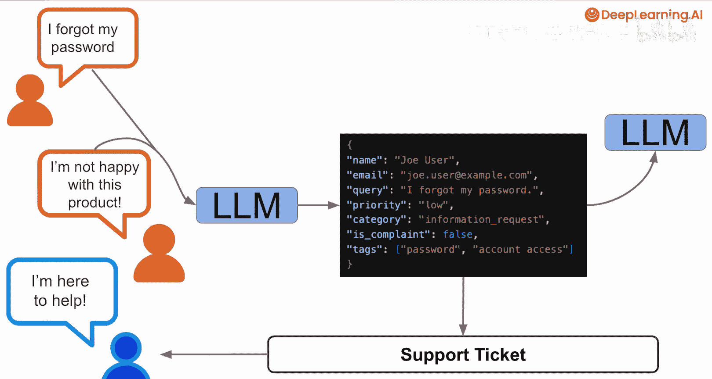
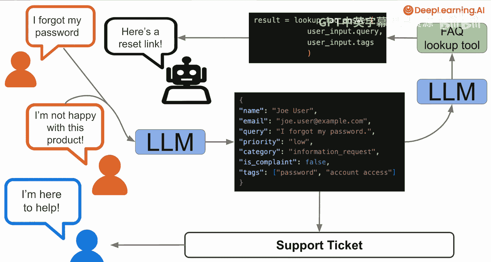
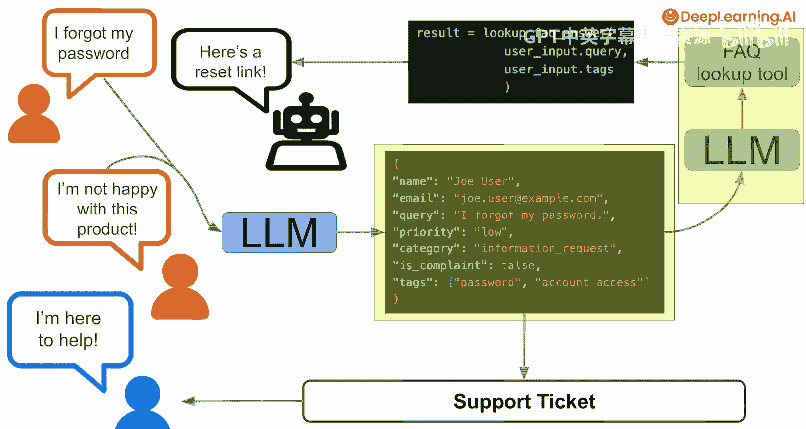

# 001：欢迎来到LLM工作流的Pydantic课程 🎉

在本课程中，我们将学习如何使用Python的Pydantic包，来让大型语言模型（LLM）生成结构化的输出。这意味着，我们可以精确地控制LLM输出数据的格式。

## 概述

通常，LLM生成的是自由格式的文本。这在某些场景下非常有用，例如总结一篇文章或构思一个新菜谱。然而，当我们将LLM集成到一个更大的软件系统中时，情况就不同了。这类系统通常包含多个组件，我们需要以一种可预测的方式，将LLM生成的数据传递给下一个组件。这时，Pydantic和结构化输出就能发挥巨大作用。

## 结构化输出的重要性

为了理解结构化输出的价值，让我们设想一个客户支持应用的场景。

用户可能会提交一个请求，例如“我忘记了密码”，或者一个投诉，例如“我对购买的产品不满意”。我们可以将这个客户查询传递给一个LLM，并让它生成一个结构化的响应。

这个响应可能包含以下字段：
*   用户信息（如姓名、邮箱）
*   请求的文本内容
*   优先级
*   类别
*   其他信息（例如，这是否是一个投诉，以及相关的标签或关键词）

然后，你的系统可以根据这个结构化的响应来决定下一步做什么。

*   如果是一个紧急问题，你可能会创建一个支持工单，并将其转给人工客服进行跟进。
*   对于“我忘记了密码”这类简单请求，你可能会将这个结构化响应传递给另一个LLM智能体。该智能体可以调用一个工具（例如一个函数），去查找能帮助用户的常见问题解答（FAQ）。

无论是让LLM创建一个具有特定字段和内容的结构化响应以生成支持工单，还是让LLM提供调用工具和查找FAQ所需的参数，你都会对每个LLM响应的外观和应包含的数据类型有非常精确的期望。

## 本课程目标

在本课程中，你将学习使用Pydantic的不同方法，以确保LLM能精确地提供你所需的数据。

换句话说，你将学会验证从LLM获得的响应数据。在此过程中，你还将掌握数据验证技能，这些技能可以帮助你处理任何软件系统中的各种数据，包括：
*   系统的人工输入
*   外部API和数据源
*   系统中需要在组件间传递的任何数据

事实上，Pydantic在LLM兴起之前就已存在，并且是目前最流行的数据验证框架之一。Pydantic每月下载量超过3亿次，这不仅使其成为最受欢迎的数据验证框架，也是整个Python生态中最受欢迎的包之一。这是因为数据验证是任何软件应用的核心。

## 总结

在接下来的课程中，你将学习如何使用Pydantic从LLM获取结构化输出。同时，你也将构建起一套数据验证技能，这套技能可以应用于任何需要在组件间传递数据的软件应用中。

现在，让我们进入下一个视频，开始学习吧。