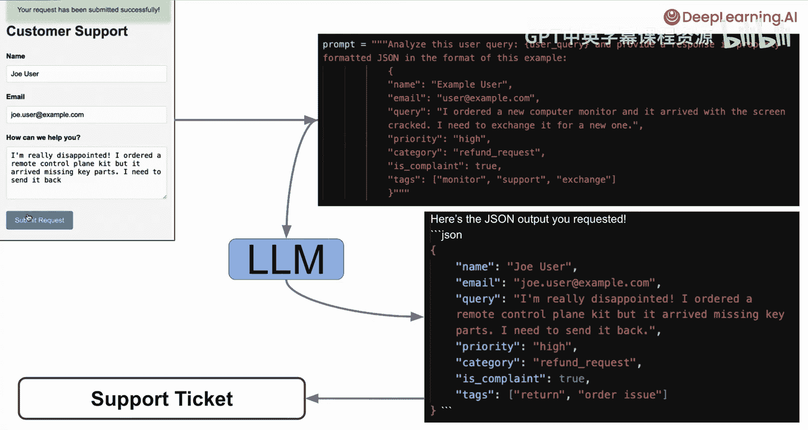
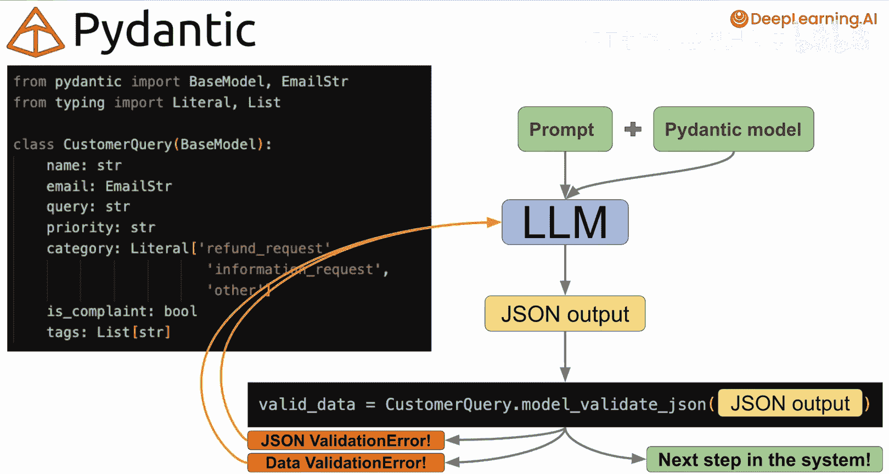
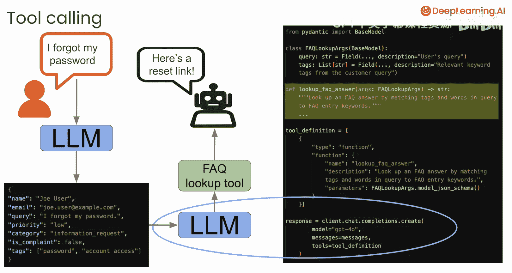
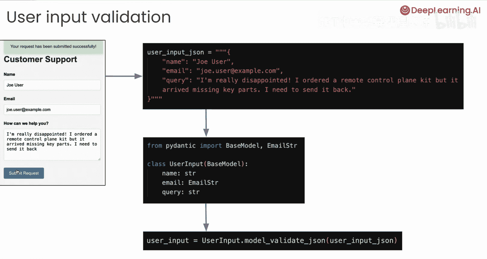

# 002：课程介绍 🎯

在本课程中，我们将学习如何使用 Pydantic 从大型语言模型获取结构化输出。我们将构建一个客户支持系统，并探索如何确保 LLM 的响应符合我们预期的格式和数据要求。

---

## 获取结构化输出的简单方法

上一节我们介绍了课程目标，本节中我们来看看获取结构化输出的最直接方法。

最简单的方式是在提示词中明确要求 LLM 以特定格式返回响应。一种非常常见的方法是要求响应采用 JavaScript 对象表示法格式。

如果你还不熟悉 JSON 格式，无需担心。本课程将涵盖处理 LLM 的 JSON 响应所需的所有知识。

在本课程中，我们将构建一个客户支持系统。为了理解其工作原理，可以想象一个系统：用户填写一个包含姓名、邮箱和请求的表单。

例如，用户 Joe 订购了一个遥控飞机套件，但发现到货时缺少零件，现在希望退货。

你可以构建一个如下所示的提示词，要求 LLM 分析用户查询。在花括号中，你将用户输入传递到提示词中，然后要求 LLM 以 JSON 格式响应，并遵循示例结构。

示例结构包含你希望填充的所有字段，例如来自用户输入的姓名、邮箱和查询，以及优先级类别、是否为投诉和一些标签。这只是一个你可能要求返回的假设性字段集合。你可以要求任何你想要的 JSON 结构。

然后，你将这个提示词传递给 LLM。在这种情况下，你希望得到的响应如下所示：姓名、邮箱和查询字段包含用户输入，然后优先级类别被标记为投诉，标签也根据用户输入填充完毕。

JSON 结构类似于 Python 字典，使用花括号开头和结尾，内部采用键值对格式。

在这个提示词中，你只是说：“这是用户的输入，我希望你以完全相同的格式提供响应，包括姓名、邮箱、查询等字段。” 然后，利用这个结构化输出，你可以在系统中自动创建支持工单，或决定是否调用工具以及下一步做什么。

事实证明，当你要求 LLM 返回这样的结构化响应时，在许多情况下，它可以做得相当接近，但并不总是完美的。

---

## 简单方法的局限性

上一节我们介绍了直接提示的方法，本节中我们来看看这种方法可能遇到的问题。

例如，LLM 可能在响应中添加额外的文本，比如“这是您请求的 JSON 输出”。或者，它可能添加其他格式，例如三个反引号的 Markdown 格式，这在要求 JSON 的 LLM 响应中非常常见。

除此之外，它可能不会提供你期望的所有字段，或者可能以不可用的方式格式化字段，例如邮箱格式错误。

正是这种响应格式的不可预测性，使得很难直接依赖 LLM 来提供结构化输出。而这就是 Pydantic 发挥作用的地方。



---

## Pydantic 的解决方案

使用 Pydantic，你可以定义数据模型，以指定你期望的数据结构和类型。在 Python 中，为我们刚才查看的请求定义一个 Pydantic 数据模型如下所示：

```python
from pydantic import BaseModel, EmailStr
from typing import List, Literal

class CustomerQuery(BaseModel):
    name: str
    email: EmailStr
    query: str
    priority: str
    category: Literal["refund request", "information request", "other"]
    is_complaint: bool
    tags: List[str]
```

使用这样的 Pydantic 模型，你既定义了字段名称，也定义了模型中每个字段的数据类型。

在这里，`name`、`query` 和 `priority` 被定义为字符串。`email` 字段被定义为特殊的 Pydantic 数据类型 `EmailStr`，它要求特定的邮箱格式。`category` 字段被定义为字面量类型，只能取几个特定值之一，在本例中是“退款请求”、“信息请求”或“其他”。`is_complaint` 是一个布尔值，只能是真或假。`tags` 被定义为一个字符串列表。

然后，你可以使用这个 Pydantic 数据模型来验证从 LLM 收到的响应，以确保它符合你的期望。

---

## 使用 Pydantic 的两种方法

在本课程中，你将学习使用 Pydantic 数据模型从 LLM 获取结构化输出的两种方法。

第一种，也许是最简单的方法，就是提示 LLM 提供结构化输出，在提示词中给出你希望的结构示例，然后获取 LLM 的响应（你希望它是 JSON 格式），并尝试用它来创建你的数据模型实例。

以下是使用 LLM 响应作为输入的关键代码行：

```python
validated_data = CustomerQuery.model_validate_json(llm_response)
```

如果 LLM 响应包含额外的意外文本或格式，或者 JSON 本身格式不正确，那么这一步将因验证错误而失败，让你知道 JSON 输入存在问题。

另一方面，如果 JSON 格式有效，但 JSON 中包含的数据与你的模型不匹配，那么这一步将因验证错误而失败，让你知道你的模型期望与输入的 JSON 之间存在不匹配。

如果 `model_validate_json` 步骤成功，这背后实际上发生了两个步骤：首先解析 JSON，然后使用它来创建你的 Pydantic 数据模型实例。如果所有这些都运行无误，那么你就在使用经过验证的数据，并可以准备将这些数据传递给你系统中的下一个组件。

但是，如果 LLM 响应的验证失败，你可以简单地捕获该验证错误，并在后续请求中将其传回给 LLM，要求它纠正导致错误的问题。这通常效果很好。如果一开始没有得到好的结果，你甚至可以运行多个错误捕获和纠正循环。

然而，事实证明，现在有一种更可靠的方法，可以与许多当前的 LLM API 和智能体框架一起使用。那就是将你的 Pydantic 数据模型作为初始请求的一部分传递给 LLM。这样，你就在 API 调用中精确表达了你的需求，并且可以更可靠地以你期望的格式获取所需的数据。

在某些情况下，当你在 API 调用中传递 Pydantic 模型时，幕后发生的是：这种提示、重试和验证逻辑正在自动为你处理。在其他情况下，LLM 提供商使用一种称为“约束生成”的方法来确保你每次都能获得有效的 JSON。在课程中，你将有机会使用采用这两种方法的框架。

---



## Pydantic 在工具调用中的应用

Pydantic 在 LLM 工作流中的另一个重要用例是工具调用。

例如，对于之前我们看到的用户查询“我忘记了密码”，你可以将该输入传递给 LLM，并让它提供一个如下所示的结构化 JSON 响应。

然后，你可能希望将该 JSON 传递给另一个 LLM，并给予它根据用户查询调用工具的选项。

在这种情况下，你可能希望 LLM 调用一个 FAQ 查找工具。你可以将其视为你在代码中定义的另一个 Python 函数，它可以返回适当的响应，例如密码重置链接和一些用户说明。

Pydantic 在这种工具调用中发挥作用的方式是：你首先定义一个 Pydantic 数据模型，以指定该函数调用的参数。

以下是定义一个名为 `FAQLookupArgs` 的 Pydantic 模型的示例：

```python
class FAQLookupArgs(BaseModel):
    user_query: str
    tags: List[str]
```

然后，你定义你的 `lookup_faq_answer` 函数，它接受这些 `FAQLookupArgs` 作为输入。这只是一个普通的 Python 函数，通过将查询中的标签和关键词与 FAQ 条目关键词进行匹配来查找 FAQ 答案。

然后，你可以在 LLM API 调用中定义一个可用的工具。至少对于 OpenAI 的 API 调用，它看起来是这样的：你指定一个函数类型，然后提供函数名称、功能描述以及它接受的输入参数。这正是你的 Pydantic 数据模型发挥作用的地方。

通过从你的 Pydantic 模型传入 `model_json_schema`，你就是在明确告诉 LLM 你的函数工具接受什么类型的输入参数。

有了这个，你就可以进行如下所示的 API 调用，在 `tools` 参数中传递你的工具定义。这告诉 LLM，如果提示中的消息表明这是好的下一步，它可以选择使用该工具。

如果 LLM 决定调用该工具，那么它将返回调用该函数所需的参数。然后，你可以使用你的 `FAQLookupArgs` Pydantic 模型来验证 LLM 提供的参数确实是函数所期望的。

然后，你可以使用这些参数调用该函数，并将结果传递给你系统中的下一步，或传回给 LLM 以完成响应的其余部分。

---

## 课程路径与起点

在本课程中，你将学习这些不同的方法，以 JSON 响应或调用函数的参数的形式从 LLM 获取结构化输出，并且你将使用 Pydantic 数据模型来完成这些。

但在深入验证 LLM 响应之前，为了开始学习，我们将首先了解 Pydantic 模型本身的基础知识。为此，我们将首先放大你将构建的这个客户支持系统的用户输入部分。

在下一课中，你将首先学习如何处理以 Python 字典或 JSON 字符串形式到达的用户输入。你将定义一个 Pydantic 数据模型来验证你的用户输入是否是你期望的格式，并且包含你期望的数据。

开始时，你将只定义 `name` 和 `query` 字段为字符串，并定义一个 `email` 字段为 `EmailStr`。

然后，你将使用包含用户输入的 Python 字典或 JSON 字符串来创建你的用户输入数据模型的实例。通过这个，你将了解 Pydantic 数据模型的工作原理，以及如何在本例中使用它们来验证用户输入数据。



正如我之前所说，本课程的最终目标是使用 Pydantic 从 LLM 获取经过验证的结构化输出。但在达到那个目标之前，我将在下一课中与你见面，探讨 Pydantic 数据模型的基础知识。

---

## 总结



本节课中我们一起学习了从 LLM 获取结构化输出的挑战，以及 Pydantic 如何通过定义严格的数据模型来解决这些问题。我们介绍了两种核心方法：先获取响应再验证，以及将模型定义直接集成到 API 调用中。我们还预览了 Pydantic 在工具调用中的应用。下一课，我们将从 Pydantic 模型的基础知识开始，为后续的 LLM 集成打下坚实的基础。