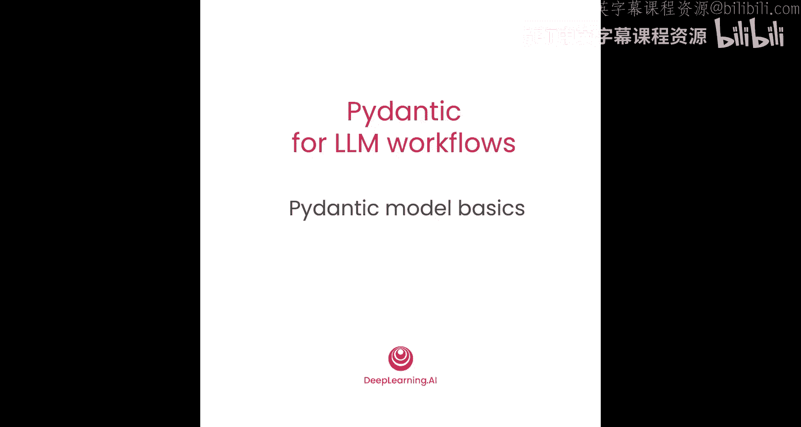
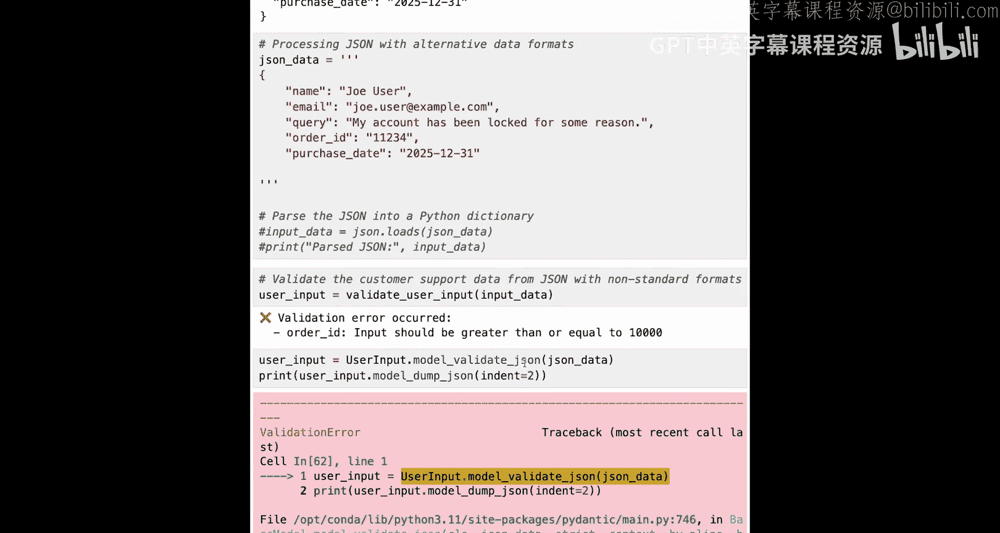

# 003：Pydantic 模型基础 🧱



在本节课中，我们将学习 Pydantic 数据模型的基础知识，即如何创建它们以及它们如何工作。我们将以验证用户输入为背景进行学习，沿用之前讨论的客户支持系统场景：用户首先填写包含姓名、邮箱和请求内容的表单，然后系统的第一步是验证用户输入是否符合预期，例如邮箱格式是否正确。让我们看看这是如何实现的。


## 导入与基础模型定义


首先，我们需要导入必要的模块。从 Pydantic 导入 `BaseModel`，它是创建任何 Pydantic 数据模型的起点。`BaseModel` 内置了各种数据验证功能，我们可以在此基础上自定义数据模型。同时，我们导入 `ValidationError` 来捕获错误，导入 `EmailStr` 作为模型中的一种数据类型，并导入 `json` 用于后续的 JSON 解析。

```python
from pydantic import BaseModel, ValidationError, EmailStr
import json
```

接下来，定义一个 Pydantic 数据模型。这里我们创建一个名为 `UserInput` 的类，它继承自 `BaseModel`。该类包含三个字段：`name`、`email` 和 `query`。其中，`name` 和 `query` 被设置为字符串类型，而 `email` 则使用了 Pydantic 的 `EmailStr` 类型。

```python
class UserInput(BaseModel):
    name: str
    email: EmailStr
    query: str
```

定义好模型后，我们可以创建一个实例。例如，设置 `name` 为 “Joe User”，`email` 为 “joeuser@example.com”，`query` 为 “I forgot my password”。然后可以将其打印出来。

```python
user_input = UserInput(name="Joe User", email="joeuser@example.com", query="I forgot my password")
print(user_input)
```

虽然打印结果看起来并不复杂，但背后发生了一件很酷的事情：当你像这样创建 Pydantic 数据模型的实例时，Pydantic 已经验证了你输入的数据是否符合模型的预期。在本例中，它验证了 `name` 是字符串，`email` 符合 `EmailStr` 格式，`query` 也是字符串。因此，这里我们处理的是有效数据。

## 处理无效数据与验证错误

现在，尝试创建另一个模型实例，其中 `email` 被设置为一个无效的邮箱地址（例如，不含“@”符号）。运行代码会发生什么？你会得到一个 `ValidationError`。错误信息会提示：“value is not a valid email address: An email address must have an at-sign”。

这表明 Pydantic 的 `EmailStr` 格式要求邮箱地址中必须包含“@”符号。尝试添加“@”符号后，可能还会收到其他错误，例如“The part after the at-sign is not valid. It should have a period”，提示“@”符号后需要有一个点号。继续修正，在点号后添加内容，最终会通过验证。

这个小实验让你体会到 Pydantic 在幕后如何检查 `email` 字段是否符合 `EmailStr` 格式的预期。它要求字符串中包含“@”符号，“@”符号后某处要有一个点号，并且点号后要有内容。这并不意味着你得到了一个真正可用的有效邮箱地址，只是说明它符合邮箱字符串格式的基本预期。

`EmailStr` 是 Pydantic 内置的数据类型，但你也可以为模型中的任何特定字段定义自己的字符串模式或其他特定数据类型。

## 创建验证函数

与其像我们刚才测试 `EmailStr` 那样直接遇到验证错误，更好的做法是创建一个函数来优雅地处理验证过程。

以下是一个名为 `validate_user_input` 的函数，它接收一个 Python 字典作为输入数据，并尝试将其解析到 `UserInput` 模型中。如果成功，则打印“Valid user input created”并输出模型的 JSON 表示；如果出现问题，则捕获错误并打印错误内容。这更接近于你在软件应用程序中的实际做法：尝试创建模型实例，如果出现问题，则捕获错误并决定下一步操作。

```python
def validate_user_input(input_data):
    try:
        user_input = UserInput(**input_data)
        print("Valid user input created")
        print(user_input.model_dump_json())
    except ValidationError as e:
        print("Validation error occurred")
        print(e)
```

现在，我们可以使用这个函数来验证输入数据。首先，定义一个包含有效数据的 Python 字典，然后调用 `validate_user_input` 函数。

```python
input_data = {"name": "Joe User", "email": "joeuser@example.com", "query": "I forgot my password"}
validate_user_input(input_data)
```

运行后，会显示“Valid user input created”并打印模型内容。接着，可以尝试其他版本的输入数据。例如，一个只包含 `name` 和 `email` 但没有 `query` 字段的字典。运行后会得到一个验证错误：“query field required”。这表明，当像上面那样定义 Pydantic 数据模型时，每个字段默认都是必需的。

## 定义可选字段与字段约束

当然，你也可以包含可选字段。接下来，我们将进一步定制模型。

首先，进行更多导入：从 Pydantic 导入 `Field`，从 `typing` 导入 `Optional`，从 `datetime` 导入 `date`。

```python
from pydantic import Field
from typing import Optional
from datetime import date
```

现在，定义一个新版本的 `UserInput` 模型。它包含之前相同的三个字段，但新增了两个可选字段：`order_id` 和 `purchase_date`。

*   `order_id` 被定义为可选的整数类型。使用 `Field` 对象可以为其添加更多自定义和定义。这里，我们设置默认值为 `None`，添加描述“5-digit order number, cannot start with 0”，并设置约束规则：必须是大于 10000 且小于等于 99999 的整数。这强制执行了“5位数订单号且不能以0开头”的规则。
*   `purchase_date` 是另一个可选字段，类型为 `datetime.date` 对象，默认值也为 `None`。

```python
class UserInput(BaseModel):
    name: str
    email: EmailStr
    query: str
    order_id: Optional[int] = Field(default=None, description="5-digit order number, cannot start with 0", gt=10000, le=99999)
    purchase_date: Optional[date] = None
```

定义好新模型后，可以用一些新的输入数据来测试。使用与最初完全相同的输入数据（不包含可选字段），通过新的 `UserInput` 模型运行 `validate_user_input` 函数。运行后没有问题，有效用户输入被创建，`order_id` 和 `purchase_date` 显示为 `null`（在 JSON 表示中）。需要注意的是，`null` 是模型内容的 JSON 表示形式。如果直接打印模型实例本身，你会看到 `order_id` 和 `purchase_date` 实际上是 Python 的 `None`。

## 探索模型特性：额外字段与类型强制转换

现在，可以进一步探索这个新模型。

首先，尝试包含所有五个字段的输入数据，其中 `order_id` 和 `purchase_date` 是有效值。运行后，会得到包含所有五个字段的有效用户输入。

接着，看看当输入数据包含一些预期之外的额外字段时会发生什么。例如，在数据中添加 `system_message` 和 `iteration` 字段。运行后，Pydantic 会直接忽略这些额外字段，仍然创建有效用户输入。这是 Pydantic 的一个特性，也是人们使用 Pydantic 的常见方式：你的系统中可能以 Python 字典或 JSON 数据的形式接收包含大量字段的数据，其中一些你关心，一些你不关心。你可以定义一个 Pydantic 数据模型来获取并验证你关心的字段，而忽略你不关心的字段。

另一个需要注意的点是，在 JSON 输出中，`purchase_date` 被打印为日期的字符串表示形式，这与你输入的 `datetime` 对象看起来不同。这是因为 JSON 表示与 Python 表示之间的差异。如果你打印模型实例本身，会发现 `purchase_date` 仍然是一个 `datetime` 对象。

更有趣的是，如果你在输入数据中直接使用日期的字符串表示形式（例如 `”2023-10-26″`），Pydantic 也能正确处理，它会自动将该字符串转换为 `date` 对象。这被称为**数据类型强制转换**。Pydantic 会自动对某些数据类型的特定格式进行这种转换。例如，你也可以将 `order_id` 以字符串形式输入（如 `”12345″`），Pydantic 会自动将其转换为整数。

数据类型强制转换是 Pydantic 的一个特性，它允许你对输入格式更加灵活。当然，如果你希望对特定字段接受的数据格式非常严格，也可以选择关闭类型强制转换。

需要注意的是，强制转换并非双向都行。例如，整数可以从字符串强制转换而来，但字符串不会从整数强制转换而来。如果你在定义为字符串的 `name` 字段中输入整数 `99999`，将会得到一个验证错误：“Input should be a valid string”。

## 处理 JSON 字符串输入

接下来，我们将向验证 LLM 输出的方向迈进一步，从 JSON 数据开始。

首先，定义一个包含模型字段的 JSON 字符串，然后将其解析为 Python 字典。

```python
json_data = ‘{“name”: “Joe User”, “email”: “joeuser@example.com”, “query”: “I forgot my password”}’
input_data = json.loads(json_data)
print(input_data)
```

解析后，你可以对得到的 Python 字典运行 `validate_user_input` 函数，并看到有效用户输入被创建。

当我们后续处理 LLM 响应时，将从 LLM 获取字符串形式的数据，并用它来填充 Pydantic 数据模型。你可以尝试不同的 JSON 输入数据。例如，包含以 0 开头的 `order_id` 的数据。回想一下，`order_id` 的规则是不能以 0 开头。你可以先将 JSON 解析为 Python 字典（这一步本身没问题，因为它是有效的 JSON），但当你尝试用这些数据填充 `UserInput` 模型实例时，会遇到验证错误：“order_id should be greater than or equal to 10000”。

因此，当你从 JSON 字符串开始时，验证过程分为两步：首先解析 JSON，然后用 JSON 内容填充数据模型。在实际操作中，更便捷的方法是使用 Pydantic 内置的 `model_validate_json` 方法。

```python
json_data = ‘{“name”: “Joe User”, “email”: “joeuser@example.com”, “query”: “I forgot my password”, “order_id”: 01234}’ # 注意：以0开头
try:
    user_input = UserInput.model_validate_json(json_data)
except ValidationError as e:
    print(e)
```

运行上述代码，你会因为 `order_id` 字段的问题而得到一个验证错误。但背后发生的过程正是那两步：首先解析 JSON，然后用 JSON 内容填充数据模型。

你还可以测试 JSON 本身无效的情况（例如缺少括号）。这时，运行 `model_validate_json` 会得到另一种类型的验证错误，提示 JSON 解析失败。因此，根据问题是出在 JSON 输入本身，还是出在 JSON 包含的数据上，你会得到不同类型的验证错误。而这正是我们下一步的方向：使用 Pydantic 的 `model_validate_json` 方法来验证从 LLM 返回的响应。

## 总结



本节课中，我们一起学习了 Pydantic 数据模型的基础知识。


你看到了如何通过定义一个继承自 `BaseModel` 的类来创建数据模型，以及如何为该类定义字段和数据类型。我们还探讨了如何使用 Python 字典或 JSON 数据作为输入来填充数据模型的实例，如何处理验证错误，如何定义可选字段和添加字段约束，以及 Pydantic 的一些重要特性，如忽略额外字段和数据类型强制转换。


在下一课中，你将运用这些技能来验证从 LLM 返回的响应输出。我们下一课见。