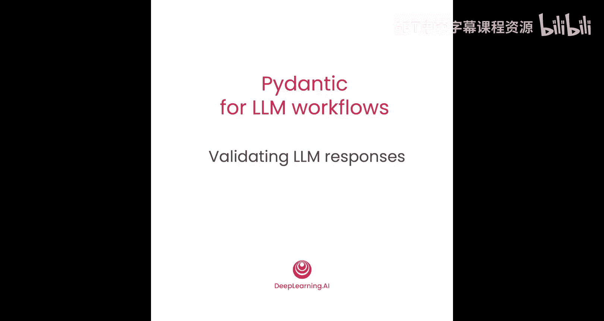
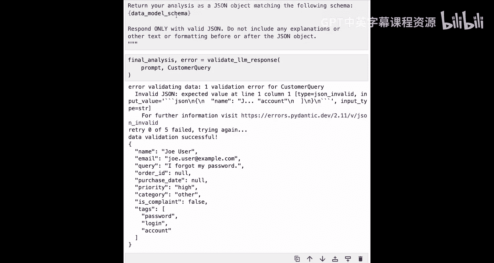

# 004：验证LLM响应 🧪



在本节课中，我们将学习如何提示大型语言模型（LLM）以JSON格式返回结构化响应，并使用Pydantic数据模型来验证该JSON是否完全符合我们的需求。我们将看到，通过要求LLM提供我们所需的结构，通常可以接近目标。然后，我们可以利用Pydantic捕获任何验证错误，并将其反馈给LLM，从而创建一个反馈循环。这样，即使LLM的初始响应存在问题，我们最终也能引导LLM纠正错误，并精确地获得所需内容。这是一种传统的、通过重试反馈循环来获取结构化输出的方法。

## 概述

我们将从构建一个简单的反馈机制开始。虽然之后会介绍更优雅的方法，但亲手构建一次有助于理解那些更高级方法在幕后自动为我们处理了哪些工作。

现在，让我们开始编写代码。

## 导入与初始化


首先，导入必要的库。大部分内容与上一课相同，但额外从`typing`模块导入了`List`和`Literal`，用于定义新的Pydantic数据模型。然后，设置OpenAI客户端。


```python
from typing import List, Literal
from pydantic import BaseModel, ValidationError
import openai

# 初始化OpenAI客户端
client = openai.OpenAI()
```

## 定义数据模型

接下来，设置一些示例用户输入数据。这里有一个包含所有字段的JSON对象，注意`order_id`和`purchase_date`在JSON中定义为`null`，它们将在模型中读取为默认值`None`。

```python
user_input_json = {
    "customer_name": "John Doe",
    "customer_email": "john@example.com",
    "order_id": None,
    "purchase_date": None,
    "query_text": "I haven't received my refund yet."
}
```

然后，定义与上一课相同的用户输入模型。

```python
class UserInput(BaseModel):
    customer_name: str
    customer_email: str
    order_id: str | None = None
    purchase_date: str | None = None
    query_text: str
```

使用`model_validate_json`方法，基于JSON数据创建一个`UserInput`模型的实例。

```python
user_input = UserInput.model_validate_json(user_input_json)
```

现在，定义一个新的Pydantic模型`CustomerQuery`。它继承自`UserInput`，因此拥有`UserInput`的所有字段，并额外添加了四个字段。

```python
class CustomerQuery(UserInput):
    priority: str
    category: Literal["refund request", "information request", "other"]
    is_complaint: bool
    tags: List[str]
```

以下是新增字段的说明：
*   `priority`：一个字符串，表示优先级（低/中/高）。
*   `category`：一个字面量类型，必须是`"refund request"`、`"information request"`或`"other"`三者之一。
*   `is_complaint`：一个布尔值，表示是否为投诉。
*   `tags`：一个字符串列表。

## 构建提示词与调用LLM

接下来，构建一个提示词来引导LLM生成结构化响应。首先，定义一个期望的响应结构示例。

```python
example_structure = {
    "priority": "high",
    "category": "refund request",
    "is_complaint": True,
    "tags": ["refund", "delayed"]
}
```

然后，构造完整的提示词。提示词要求LLM分析用户查询，并以指定的JSON结构返回分析结果，且只返回有效的JSON，不包含任何其他解释或文本。

```python
prompt = f"""
Please analyze this user query: {user_input.model_dump_json()}.
Return your analysis as a JSON object matching this exact structure and data types: {example_structure}.
Respond only with valid JSON. Do not include any other explanations or text formatting before or after the JSON object.
"""
print(prompt)
```

定义一个函数来调用LLM。

```python
def call_llm(prompt_text: str, model: str = "gpt-4") -> str:
    response = client.chat.completions.create(
        model=model,
        messages=[{"role": "user", "content": prompt_text}]
    )
    return response.choices[0].message.content
```

尝试调用LLM并查看其响应。

```python
llm_response = call_llm(prompt)
print(llm_response)
```

我们可能会得到一个接近预期的响应，但请注意，响应内容可能在JSON字符串外部包含了一些额外的格式（如Markdown标记），这会导致问题。

## 验证响应与处理错误

现在，尝试使用`model_validate_json`方法验证LLM的响应，看是否能成功创建`CustomerQuery`模型的实例。

```python
try:
    validated_data = CustomerQuery.model_validate_json(llm_response)
    print("Validation successful:", validated_data)
except ValidationError as e:
    print("Validation error occurred:", e)
```

很可能会遇到验证错误。错误信息会明确指出问题所在，例如JSON格式无效。

为了更优雅地处理错误，我们定义一个函数来捕获验证错误。该函数尝试验证响应，如果成功则返回验证后的数据和`None`，如果失败则返回`None`和错误信息。

```python
def validate_response(model, response_text):
    try:
        validated_data = model.model_validate_json(response_text)
        return validated_data, None
    except ValidationError as e:
        error_msg = str(e).split('\n')[-2]  # 获取错误信息的核心部分
        return None, error_msg

validated_data, error = validate_response(CustomerQuery, llm_response)
if error:
    print("Validation error:", error)
```

## 创建重试反馈循环

捕获到错误后，我们可以构建一个新的提示词，将错误信息反馈给LLM，要求它修正错误。

定义一个函数来创建重试提示词。该函数接收原始提示词、LLM的原始响应和验证错误信息，然后构造一个请求LLM修复错误的提示词。

```python
def create_retry_prompt(original_prompt, original_response, error_message):
    retry_prompt = f"""
This is a request to fix an error in the structure of an LLM response.
Here's the original prompt: {original_prompt}
Here's the original LLM response: {original_response}
Here's the error message generated when trying to parse this into the model: {error_message}
Compare the error message and the LLM response to identify what needs to be fixed or removed in the LLM response to resolve this error.
Again, respond only with valid JSON. Do not include any explanations or other text or formatting before or after the JSON string.
"""
    return retry_prompt

retry_prompt = create_retry_prompt(prompt, llm_response, error)
print(retry_prompt)
```

现在，使用这个新的重试提示词再次调用LLM。

```python
retry_response = call_llm(retry_prompt)
print(retry_response)
```

再次尝试验证这个新的响应。

```python
validated_data, error = validate_response(CustomerQuery, retry_response)
if error:
    print("Validation error on retry:", error)
```

有时，我们可能会遇到新的验证错误，例如`category`字段的值不在允许的范围内（`"refund request"`、`"information request"`、`"other"`）。这是因为在最初的示例中，我们只提供了`"refund request"`，LLM可能不知道其他选项。这表明我们的初始设置并非万无一失。

我们可以再次使用`create_retry_prompt`函数，基于新的错误创建第二轮重试提示词。

```python
second_retry_prompt = create_retry_prompt(retry_prompt, retry_response, error)
second_retry_response = call_llm(second_retry_prompt)
print(second_retry_response)
```

这个过程可能会变得有些繁琐。本节课的目的之一就是让你亲身体验从LLM获取精确格式的结构化响应所面临的挑战，以及由此产生的一些常见问题。

## 构建完整的重试系统

接下来，我们将构建一个完整的重试系统。该系统会发送初始提示词，如果JSON或数据模型填充出现问题，则捕获验证错误，构建重试提示词，并重复此过程，直到获得有效响应或达到重试次数上限。

以下是`validate_llm_response`函数的实现。它接收提示词、数据模型、重试次数和LLM模型作为参数，并尝试在指定次数内获取有效响应。

```python
def validate_llm_response(prompt_text, data_model, max_retries=5, llm_model="gpt-4"):
    response = call_llm(prompt_text, llm_model)
    for attempt in range(max_retries):
        validated_data, error = validate_response(data_model, response)
        if error is None:
            print(f"Attempt {attempt}: Success!")
            return validated_data
        else:
            print(f"Attempt {attempt} failed. Error: {error}")
            retry_prompt = create_retry_prompt(prompt_text, response, error)
            response = call_llm(retry_prompt, llm_model)
    print(f"Failed after {max_retries} retries.")
    return None
```

现在，使用最初的提示词和`CustomerQuery`模型来尝试这个函数。

```python
final_result = validate_llm_response(prompt, CustomerQuery)
if final_result:
    print("Final validated data:", final_result)
```

运行多次后，你会发现结果并不稳定。有时需要三次失败尝试，有时两次，有时甚至在五次尝试后仍无法获得有效数据。这正说明了这种系统的脆弱性。我们当前的设置方式确实容易遇到这些错误和重试请求。当然，有方法可以优化初始提示词以提高成功率。

但你现在所经历的，正是那些在后台为你处理所有重试逻辑的库内部发生的事情。在下一课中，我们将尝试使用这些库。

## 使用Pydantic模型模式优化提示词

在进入下一课之前，我想展示一个使用Pydantic模型的小技巧，它可以帮助你构建更好的提示词，特别是在设置类似我们刚才构建的重试反馈循环时。

这个技巧就是打印出Pydantic模型的JSON模式。

```python
print(CustomerQuery.model_json_schema())
```

你会看到，即使是一个相对简单的模型，其JSON模式看起来也相当复杂。虽然对人来说解析起来有点困难，但这正是能让LLM更清楚地了解你在结构化响应中期望内容的东西。

因此，与其像我们在课程开头的提示词中那样提供一个示例，不如提供你的Pydantic数据模型的模式。这通常能让你更快地从LLM获得所需的结构化响应。

回顾一下，我们最初构建的提示词是这样的：

```python
# 原始提示词示例
prompt_with_example = f"""
Please analyze this user query: {user_input.model_dump_json()}.
Return your analysis as a JSON object matching this exact structure and data types: {example_structure}.
Respond only with valid JSON...
"""
```

一个更好的起点是提供如下提示词，其中传入你定义的模型模式（即那个长长的JSON模式），它精确描述了你的模型期望什么。

```python
model_schema = CustomerQuery.model_json_schema()
prompt_with_schema = f"""
Please analyze this user query: {user_input.model_dump_json()}.
Return your analysis as a JSON object that strictly adheres to the following JSON Schema: {model_schema}.
Respond only with valid JSON. Do not include any other explanations or text formatting before or after the JSON object.
"""
```

当你创建这样的提示词时，你向LLM提供了关于你期望响应的更好指令。

现在，在你的`validate_llm_response`函数中尝试这个新的提示词。



```python
final_result_schema = validate_llm_response(prompt_with_schema, CustomerQuery)
if final_result_schema:
    print("Final validated data using schema:", final_result_schema)
```

在这种情况下，可能仍然会遇到一次JSON无效的问题，但在此之后，一次重试就能让你获得有效数据。这再次展示了幕后发生的事情：正如你将在下一课看到的，当你可以在API调用中直接传递Pydantic数据模型时，通常发生的情况就是从你的模型中提取数据模式，并将其用作提示LLM的一部分。

## 总结


在本节课中，我们一起学习了如何通过构建反馈循环来验证和修正LLM的结构化响应。我们首先尝试直接验证LLM的JSON输出，并处理了常见的格式错误和字段值错误。接着，我们构建了一个完整的重试系统来自动化这个过程。最后，我们探索了使用Pydantic模型的JSON模式作为提示词的一部分，以更清晰地向LLM传达我们的需求，这通常能提高首次尝试的成功率。


事实证明，这种提取Pydantic模型的JSON模式、用它构建提示词、然后处理验证并在反馈循环中重试的机制，正是某些允许你在API调用中直接传递Pydantic数据模型的框架在幕后工作的原理。在下一课中，我们将直接研究这些框架，看看如何通过传递Pydantic模型来更优雅地获取所需结构。