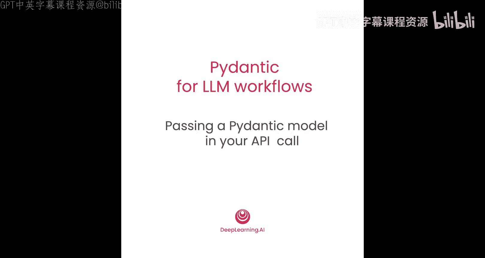
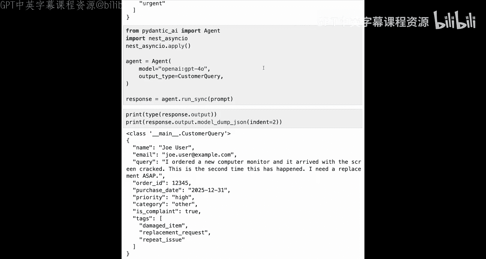

# 005：在API调用中传递Pydantic模型 🚀



在本节课中，我们将学习如何将Pydantic数据模型直接用于调用大语言模型（LLM）提供商的API。你将看到，与上一课中需要构建错误处理和重试逻辑相比，这种方法能让你以更简洁、更可靠的方式获得结构化的响应。

我们将通过多个不同的框架和LLM提供商来实践这一方法。通过亲身体验，你会发现，无论使用哪个LLM提供商或哪个智能体框架，使用Pydantic数据模型来获取所需响应结构的方式本质上都是相同的。现在，让我们进入实践环节，看看具体如何操作。


## 准备工作与模型定义

首先，我们需要导入必要的库。这里我们使用 `instructor` 库，它可以作为多个不同LLM提供商API调用的包装器，帮助我们在API调用中使用Pydantic数据模型来获取结构化响应。

`instructor` 的工作原理与上一课的方法非常相似：你传入Pydantic数据模型，`instructor` 会提取JSON模型模式，并据此构建提示词。如果响应有任何问题，它会执行一系列重试，以获取你期望的响应。本节课我们将首先结合Anthropic的模型来使用它。

接下来，我们可以定义Pydantic数据模型。这些模型与上一课中使用的相同。


```python
from pydantic import BaseModel
from typing import List

class UserInput(BaseModel):
    query: str
    user_id: str
    timestamp: str

class CustomerQuery(UserInput):
    sentiment: str
    categories: List[str]
    priority: str
    tags: List[str]
```

定义好模型后，我们可以创建一些示例用户输入数据。

```python
example_input = {
    "query": "我的订单还没到，已经延迟两天了。",
    "user_id": "user_12345",
    "timestamp": "2023-10-27T14:30:00Z"
}
```

我们可以使用模型的 `model_validate_json` 方法来验证这个输入。

```python
validated_input = UserInput.model_validate_json(example_input)
```

然后，我们可以构建一个简单的提示词。

```python
prompt = f"分析以下客户查询：{validated_input.query}，并提供结构化响应。"
```

## 使用Instructor与Anthropic获取结构化响应

现在，我们可以设置LLM调用。这里我们结合使用 `instructor` 和 Anthropic 来创建一个客户端，在请求响应时传入我们的提示词以及期望的响应格式模型（即 `CustomerQuery` 模型）。

```python
import instructor
from anthropic import Anthropic

# 创建客户端
client = instructor.from_anthropic(Anthropic())

# 发起调用
response = client.messages.create(
    model="claude-3-opus-20240229",
    messages=[{"role": "user", "content": prompt}],
    response_model=CustomerQuery
)
```

查看返回的结果。

```python
print(type(response))
print(response)
```

在这种情况下，你得到的是一个 `CustomerQuery` 数据模型的实例。`instructor` 包已经为你完成了LLM调用、必要的重试以及数据验证，并返回了一个填充好数据的有效数据模型实例。这意味着你不再需要额外的验证步骤。

## 直接使用OpenAI API

除了使用 `instructor`，你也可以直接通过API调用OpenAI来实现类似功能。

首先，创建OpenAI客户端并调用其测试版API，将响应格式指定为你的数据模型。

```python
from openai import OpenAI

client = OpenAI()

completion = client.beta.chat.completions.parse(
    model="gpt-4-turbo-preview",
    messages=[{"role": "user", "content": prompt}],
    response_format=CustomerQuery
)

response_content = completion.choices[0].message.content
print(type(response_content))
print(response_content)
```

运行后，你会发现返回的是一个字符串，就像普通的LLM响应一样。这个字符串的格式近似于你的数据模型的表示形式。

与使用 `instructor` 和 Anthropic 不同，这里你没有直接得到一个已验证的数据模型实例，而是得到了一个JSON字符串。OpenAI在幕后执行了一种称为“约束生成”的技术，因为你指定了期望JSON格式的响应，所以响应的生成方式保证了返回的是有效的JSON。

但这并不保证它一定是你的数据模型的有效实例。接下来，你可以尝试使用 `model_validate_json` 方法从这个响应内容创建 `CustomerQuery` 数据模型的实例。

```python
try:
    validated_response = CustomerQuery.model_validate_json(response_content)
    print(validated_response)
except Exception as e:
    print(f"验证失败: {e}")
```

在这个例子中，它成功了。你得到了有效数据，并且在填充数据模型时没有遇到任何验证错误。但这比直接获取有效模型实例多了一个步骤。

## 使用OpenAI的Responses API

OpenAI还提供了另一个版本的API，即Responses API。你可以传入一个名为 `text_format` 的参数，并将你的Pydantic数据模型放入其中。

```python
from openai.types.chat import ChatCompletion

response = client.responses.create(
    model="gpt-4-turbo-preview",
    input=[{"role": "user", "content": prompt}],
    text_format={"type": "object", "schema": CustomerQuery.model_json_schema()}
)

print(type(response))
```

查看返回的响应结构，你会发现它本身就是一个Pydantic模型。你的 `CustomerQuery` 模型实例被嵌套在OpenAI返回的另一个Pydantic模型内部。

为了更清楚地查看继承结构，我们可以定义一个简单的函数。

```python
def print_mro(obj):
    print([cls.__name__ for cls in obj.__class__.__mro__])

print_mro(response)
```

运行后，你会看到在顶层是一个嵌套结构，层层解包到底部，最终会找到一个Pydantic的BaseModel。这表明，从OpenAI返回的响应本身就是一个Pydantic模型。

在使用OpenAI的Responses API时，你感兴趣的内容位于 `response.output_parsed` 内部。

```python
if hasattr(response, 'output_parsed'):
    final_output = response.output_parsed
    print(type(final_output))
    print(final_output)
```

在这里，你可以看到 `CustomerQuery` 数据模型的一个实例。这意味着API返回了有效数据，你不再需要进行验证。OpenAI处理了初始JSON的构建（通过约束生成）并为你填充了数据模型，在将结果交还给你之前处理了所有验证。

## 使用PydanticAI智能体框架

最后，我们来看看PydanticAI。这是一个由Pydantic团队构建的智能体框架。你可以像这样创建一个智能体，并将你的数据模型作为输出类型传入。

```python
import asyncio
from pydantic_ai import Agent
from pydantic_ai.models.gemini import GeminiModel

# 创建智能体
agent = Agent(
    model=GeminiModel('gemini-1.5-pro'),
    result_type=CustomerQuery
)

async def run_agent():
    result = await agent.run(prompt)
    return result

# 在Jupyter notebook环境中运行异步函数
response = asyncio.run(run_agent())
print(response.output)
```

同样，在 `response.output` 中，你得到了 `CustomerQuery` 数据模型的一个实例，有效数据直接包含在响应中。

你可以轻松地切换到另一个模型提供商，例如OpenAI。

```python
from pydantic_ai.models.openai import OpenAIModel

agent_openai = Agent(
    model=OpenAIModel('gpt-4-turbo-preview'),
    result_type=CustomerQuery
)

async def run_agent_openai():
    result = await agent_openai.run(prompt)
    return result

response_openai = asyncio.run(run_agent_openai())
print(response_openai.output)
```



这同样成功了。你只需要更改模型字符串，就可以调用不同的LLM提供商。

## 总结

在本节课中，我们学习了如何将Pydantic数据模型直接用于调用不同LLM提供商和智能体框架的API。我们已经看到，这是从LLM获取结构化输出和已验证数据的有效方法，比上一课处理起来省事得多。

你接触了多种方法：
*   使用 `instructor` 库作为包装器。
*   直接使用OpenAI API并手动验证JSON。
*   使用OpenAI的Responses API直接获取Pydantic模型实例。
*   使用PydanticAI智能体框架。

这些方法的核心思想是一致的：利用Pydantic模型来定义和约束LLM的输出结构，从而简化开发流程，提高代码的可靠性。正如我们所发现的，在LLM工作流中，Pydantic模型无处不在。


接下来，我们将探讨工具调用（Tool Calling），这是Pydantic模型在LLM工作流中的另一个重要用例。在下节课中，你将在工具的定义中使用Pydantic模型，并将这些工具传递给LLM。这将使LLM能够返回调用工具（如函数或API）所需的精确参数。我们下节课见。