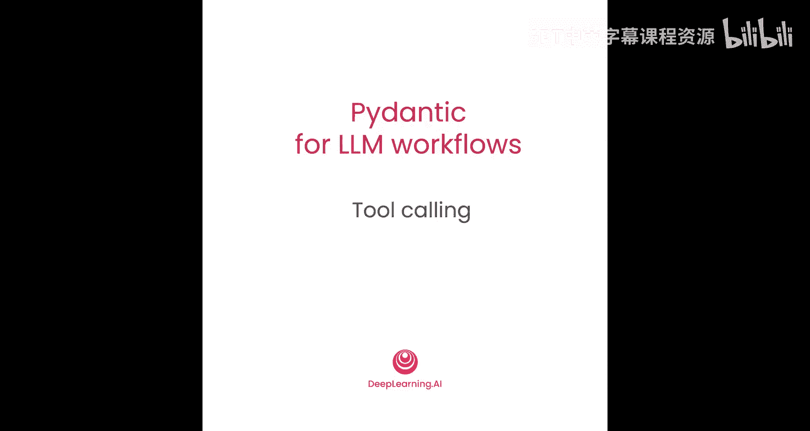
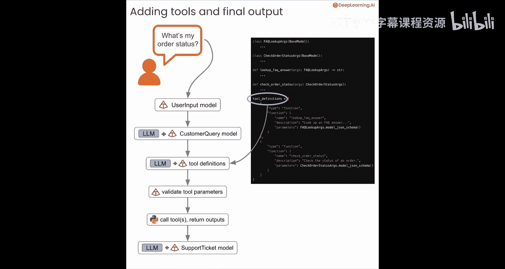
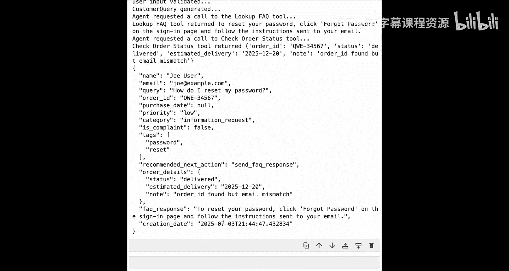

# 006：在API调用中传递Pydantic模型 🛠️



## 概述


在本节课中，我们将学习如何将之前学到的“使用Pydantic数据模型从LLM获取结构化响应”的知识，与一项新能力相结合：在工具定义中使用Pydantic模型，并将其传递给LLM API调用。在LLM工作流中使用Pydantic主要有两大场景：结构化响应和工具调用。本节课的目标就是结合这两者，在你的应用程序中实现可靠的结构化工具调用。


## 整体流程概览

本节课代码较多，我们先从宏观上了解整个流程，这有助于后续理解。

起点与之前相同：获取包含姓名、邮箱和消息（例如“我的订单状态如何？”）的用户输入。

1.  首先，使用你的用户输入数据模型来验证该输入。
2.  接着，将验证后的用户输入传递给一个LLM调用，要求LLM返回一个有效的`CustomerQuery`模型实例。
3.  然后，将这个实例传递给另一个LLM API调用，并附带一些工具定义。
4.  最后，整合所有信息，生成一个最终的`SupportTicket`输出。

以下是实现此流程的代码步骤概览：

*   定义两个新的Pydantic数据模型：`FAQLookupArgs`和`CheckOrderStatusArgs`。它们定义了工具调用所需的参数。
*   定义两个新函数：`lookup_faq_answer`（接收`FAQLookupArgs`）和`check_order_status`（接收`CheckOrderStatusArgs`）。
*   创建工具定义，其中包含工具名称（即Python函数）、描述和参数。对于参数，你将传入上述Pydantic数据模型的JSON模式。
*   将这些工具定义传递给API调用，让LLM知道有哪些工具可用。LLM的任务是判断是否需要调用工具，并返回工具调用所需的参数。
*   使用为`FAQLookupArgs`或`CheckOrderStatusArgs`定义的Pydantic数据模型，验证LLM返回的工具参数是否符合要求。
*   调用相应的工具并返回输出。
*   将所有信息（客户查询、工具输出）打包，进行最后一次LLM调用，生成最终的`SupportTicket`输出。

接下来，我们将深入代码，逐一实现这些步骤。

## 代码实现详解

本节将包含大量设置和代码。我们会快速回顾已学过的部分，并在出现新内容时详细解释。

### 导入与基础设置



首先，导入所有必要的库。这基本上整合了之前课程中的所有内容。

```python
import os
import re
from datetime import datetime
from typing import Optional, Literal
from pydantic import BaseModel, Field, field_validator
from pydantic_ai import Agent
import google.generativeai as genai
from openai import OpenAI
import instructor
from anthropic import Anthropic
```

### 定义用户输入与客户查询模型

接下来，定义你的用户输入数据模型。这次我们让`order_id`字段变得更复杂一些。

`order_id`原本是整数，现在将改为可选的字符串字段，默认值为`None`。其描述指明新格式为：三个大写字母，一个短横线，然后是五个数字。

这个例子很有趣，因为在实际应用中，你经常会遇到这种验证逻辑不简单的字段。这正是需要使用Pydantic的`field_validator`工具的地方。

通过`field_validator`，你可以在`order_id`字段上设置验证器，并定义一个函数。在这个函数中，使用正则表达式来检查输入的模式是否符合预期。如果不符合，可以抛出一个`ValueError`，告知用户问题所在以及期望的格式。

这只是如何在模型内部直接处理自定义验证的一个例子。这也是对输入数据实施安全性检查的一种方式。例如，如果有输入进来，你想确保它不是某种SQL注入或其他恶意输入，就可以使用类似这样的完全自定义的验证逻辑来验证进入数据模型的所有内容。

以下是定义该模型的代码：

```python
class UserInput(BaseModel):
    name: str
    email: str
    message: str
    order_id: Optional[str] = Field(
        default=None,
        description="Order ID in the format: three capital letters, a dash, five numbers. Example: ABC-12345"
    )

    @field_validator('order_id')
    def validate_order_id(cls, v):
        if v is None:
            return v
        pattern = r'^[A-Z]{3}-\d{5}$'
        if not re.match(pattern, v):
            raise ValueError(f"Order ID '{v}' is invalid. Expected format: ABC-12345")
        return v
```

然后，像之前一样定义你的客户查询数据模型，它继承自`UserInput`并添加了四个额外字段。

```python
class CustomerQuery(UserInput):
    query_category: Literal["order_status", "product_info", "faq", "complaint", "other"]
    urgency: Literal["low", "medium", "high"]
    sentiment: Literal["positive", "neutral", "negative"]
    requires_follow_up: bool
```

### 验证输入与生成客户查询

接下来，定义`validate_user_input`函数，与之前做法相同。

```python
def validate_user_input(user_input_json: str) -> UserInput:
    try:
        user_input = UserInput.model_validate_json(user_input_json)
        return user_input
    except Exception as e:
        print(f"Validation error: {e}")
        raise
```

然后，定义`create_customer_query`函数，它接收经过验证的用户数据（JSON字符串形式），并调用LLM来填充一个`CustomerQuery`实例。这只是对之前做法的一个小调整，本质相同：调用LLM，使用用户输入来填充你的客户查询模型实例。

这里我们使用Pydantic AI框架和Google的Gemini模型。调用`agent.run`时，指定`output_type`为`CustomerQuery`。返回的`response.data`就是经过验证的`CustomerQuery`数据模型实例。

```python
def create_customer_query(validated_user_data: UserInput) -> CustomerQuery:
    agent = Agent(
        model='google-gemini-2.0-flash-exp',
        system_prompt="You are a helpful assistant that categorizes customer queries.",
    )
    user_prompt = f"""
    Please analyze the following user input and populate a CustomerQuery instance.
    User Input:
    {validated_user_data.model_dump_json()}
    """
    response = agent.run(user_prompt, output_type=CustomerQuery)
    return response.data
```

现在，可以测试一下目前的功能。

```python
user_input_json = '''
{
    "name": "John Doe",
    "email": "john@example.com",
    "message": "What's the status of my order ABC-12345?",
    "order_id": "ABC-12345"
}
'''

validated_input = validate_user_input(user_input_json)
customer_query = create_customer_query(validated_input)
print(customer_query)
```

运行后，用户输入得到验证，客户查询成功生成，并且输出了一个有效的`CustomerQuery`数据模型实例。

### 定义工具参数模型与函数

接下来，定义一些新的Pydantic模型。

首先，定义一个名为`FAQLookupArgs`的Pydantic模型，它继承自`BaseModel`，并包含`query`和`tags`两个字段。这两个字段将是稍后定义的`FAQ`查询函数所期望的参数。

```python
class FAQLookupArgs(BaseModel):
    query: str
    tags: list[str]
```

然后，定义另一个名为`CheckOrderStatusArgs`的模型，同样继承自`BaseModel`，包含`order_id`和`email`字段。`order_id`字段带有与之前相同的字段验证器。这些将是你传递给`check_order_status`函数的参数。

```python
class CheckOrderStatusArgs(BaseModel):
    order_id: str
    email: str

    @field_validator('order_id')
    def validate_order_id(cls, v):
        pattern = r'^[A-Z]{3}-\d{5}$'
        if not re.match(pattern, v):
            raise ValueError(f"Order ID '{v}' is invalid. Expected format: ABC-12345")
        return v
```

接着，定义一些模拟的数据库数据。这里只是一些可供`FAQ`查询函数或订单状态查询函数实际查找的数据。

我们有一个包含问题、答案和关键词的小型模拟FAQ数据库，以及一个包含三个不同订单（包括状态、预计送达日期、购买日期和邮箱）的小型订单数据库。你无需担心这里的细节，这只是为了完成示例。

```python
# 模拟FAQ数据库
fake_faq_db = [
    {"question": "How do I reset my password?", "answer": "Go to 'Forgot Password' on the login page.", "keywords": ["password", "reset", "login"]},
    {"question": "What is your return policy?", "answer": "You can return items within 30 days.", "keywords": ["return", "policy", "refund"]},
]

# 模拟订单数据库
fake_order_db = [
    {"order_id": "ABC-12345", "status": "shipped", "estimated_delivery": "2024-01-15", "purchase_date": "2024-01-01", "email": "john@example.com"},
    {"order_id": "XYZ-67890", "status": "processing", "estimated_delivery": "2024-01-20", "purchase_date": "2024-01-05", "email": "jane@example.com"},
]
```

然后，定义`lookup_faq_answer`函数。它接收上面创建的`FAQLookupArgs`模型实例作为输入。这个函数会遍历模拟的FAQ数据库，根据用户输入中的关键词进行搜索。如果找到答案，则返回答案；否则，返回提示信息。

```python
def lookup_faq_answer(args: FAQLookupArgs) -> str:
    for faq in fake_faq_db:
        if any(keyword in args.query.lower() for keyword in faq["keywords"]):
            return faq["answer"]
    return "Sorry, I couldn't find an FAQ answer to your question."
```

接下来，定义`check_order_status`函数。它接收`CheckOrderStatusArgs` Pydantic模型的有效实例作为输入，然后尝试使用`order_id`和`email`从那个小型模拟订单数据库中查找匹配的订单。同样，这里的细节无需担心，所有这些都是为了构建客户支持系统中工具调用的示例。

```python
def check_order_status(args: CheckOrderStatusArgs) -> dict:
    for order in fake_order_db:
        if order["order_id"] == args.order_id and order["email"] == args.email:
            return {
                "order_id": order["order_id"],
                "status": order["status"],
                "estimated_delivery": order["estimated_delivery"],
                "note": "Order and email match."
            }
    return {"order_id": args.order_id, "status": "not found", "note": "No matching order found."}
```

### 定义工具与最终输出模型

最后，我们来到了有趣的部分：定义将在API调用中传递给LLM的工具。

在这里，我们定义了第一个工具，其名称为`lookup_faq_answer`（这是如果调用该工具时将执行的函数）。该函数期望的参数是`FAQLookupArgs`。你将把这些信息传递给LLM的API调用，而你的Pydantic数据模型就在这里用于定义该工具期望的参数。

接着，为`check_order_status`定义另一个工具，其参数是`CheckOrderStatusArgs`模型的模式。

```python
tools = [
    {
        "type": "function",
        "function": {
            "name": "lookup_faq_answer",
            "description": "Look up an answer from the FAQ database based on the user's query and tags.",
            "parameters": FAQLookupArgs.model_json_schema(),
        },
    },
    {
        "type": "function",
        "function": {
            "name": "check_order_status",
            "description": "Check the status of an order using the order ID and customer email for verification.",
            "parameters": CheckOrderStatusArgs.model_json_schema(),
        },
    },
]
```

在进入LLM调用之前，作为最后一步，你还需要定义几个Pydantic模型。

这将是你的`SupportTicket`模型，即系统的最终输出。

首先，定义一个`OrderDetails`模型，它只包含状态、预计送达日期和备注等几个字段。

```python
class OrderDetails(BaseModel):
    status: str
    estimated_delivery: str
    note: str
```

然后，你将在`SupportTicket`中使用`OrderDetails`。现在，`SupportTicket`是一个继承自`CustomerQuery`的模型，因此它拥有`CustomerQuery`的所有属性，并且你添加了一些新内容：

*   `recommended_next_action`：这是一个字面量类型，包含一组可接受的值：`escalate_to_agent`、`send_faq_response`、`send_order_status`或`no_action_needed`。
*   `order_details`字段：这里你将引入`OrderDetails`模型。这是在Pydantic数据模型中使用另一个Pydantic数据模型构建字段的示例。
*   `faq_response`：用于存放查找FAQ答案后的响应。
*   `creation_date`：创建日期。

以下是定义这些模型的代码：

```python
class SupportTicket(CustomerQuery):
    recommended_next_action: Literal["escalate_to_agent", "send_faq_response", "send_order_status", "no_action_needed"]
    order_details: Optional[OrderDetails] = None
    faq_response: Optional[str] = None
    creation_date: datetime
```

### 决定下一步行动（工具调用）

现在，所有基础设施都已构建完成，可以定义你的LLM调用了。

你将定义这个`decide_next_action_with_tools`函数，它接收你的`CustomerQuery`数据模型实例作为输入。

首先，定义一个系统提示。为此，你需要先从`SupportTicket`模型中提取JSON模式，然后构建一个提示，说明你是一个有帮助的客户支持代理，你的工作是根据查询和下面期望的字段与`SupportTicket`模式来决定应为客户采取什么支持行动。

这里的思路是：用户的输入通过第一次LLM调用转换为`CustomerQuery`数据模型，然后将其传递给另一个LLM调用，以决定是调用工具还是构建不同形式的支持票证。提示说明，如果关于特定订单ID或FAQ响应的更多信息对响应用户查询有帮助，并且可以通过调用工具获得，那么就调用适当的工具来获取该信息。最后，你将`SupportTicket`模式作为期望的最终输出结构传入。

请注意，这并不是说“在响应中返回这个结构”，因为你将使用这个LLM调用来决定是否调用工具。但这有助于LLM判断工具调用是否是个好主意。

在这个例子中，你的系统提示就是上面所有这些内容。而你的用户提示则是传入的`CustomerQuery`模型的`model_dump`结果。这包含了用户输入中的所有信息，以及第一次LLM调用填充`CustomerQuery`模型时产生的额外信息。

然后，你将调用OpenAI的GPT-4，并在`tools`参数中传入那些工具定义，这让LLM知道有哪些工具可以作为下一步调用。

以下是该函数的代码：

```python
def decide_next_action_with_tools(customer_query: CustomerQuery):
    client = OpenAI(api_key=os.environ.get("OPENAI_API_KEY"))

    support_ticket_schema = SupportTicket.model_json_schema()

    system_prompt = f"""
    You are a helpful customer support agent. Your job is to determine what support action should be taken for the customer based on the query.
    Expected fields and structure are defined in the SupportTicket schema below.

    If more information on a particular order ID or FAQ response would be helpful in responding to the user query and can be obtained by calling a tool, then call the appropriate tool to get that information.

    Support Ticket Schema:
    {support_ticket_schema}
    """

    user_prompt = f"Customer Query: {customer_query.model_dump_json()}"

    response = client.chat.completions.create(
        model="gpt-4",
        messages=[
            {"role": "system", "content": system_prompt},
            {"role": "user", "content": user_prompt}
        ],
        tools=tools,
        tool_choice="auto",
    )

    message = response.choices[0].message
    tool_calls = message.tool_calls
    return message, tool_calls
```

现在，可以开始行动了。

调用`decide_next_action_with_tools`函数，传入`customer_query`。

你将得到LLM的消息响应、从该消息中提取的任何工具调用，以及输入的提示。接下来的打印语句只是打印出那些工具调用（如果LLM建议调用工具的话）。

运行后，在这种情况下，消息的`content`部分（即之前从LLM获取自由格式文本响应的位置）现在为`null`。但在下面的`tool_calls`中，你可以看到有一个调用`check_order_status`工具的指示。你可以在这里更清晰地打印出来：`tool_calls`传入了一个`order_id`和一个`email`，并希望调用`check_order_status`函数。所以，LLM在说：请使用这些参数调用`check_order_status`函数。

### 执行工具调用并获取输出

接下来，你需要设置一个函数，如果LLM确实想要调用工具，就执行工具调用。

定义一个名为`get_tool_outputs`的函数，传入来自LLM响应的`tool_calls`。然后，如果有工具调用，就根据LLM的指示调用`lookup_faq_answer`函数或`check_order_status`函数。

在工具调用的第一步，你将工具调用的函数参数传入相应的Pydantic数据模型（例如`FAQLookupArgs`），并使用`model_validate_json`方法来验证LLM传递的参数是否对该工具调用有效。因此，你的Pydantic数据模型在API调用本身中发挥了作用，作为工具定义的一部分，让LLM知道哪些参数是有效的。而当你从LLM获取参数后，首先要做的就是使用该模型来验证LLM返回的参数是否有效。



下一步是继续调用该函数，传入这些参数，并返回结果。对于`check_order_status`也是同样的操作：首先要验证LLM返回的参数是否符合模型的期望，然后调用该函数。无论哪种情况，你都将返回函数的输出。

运行这个单元格来定义`get_tool_outputs`函数，并将其用于上一次LLM响应中返回的`tool_calls`。


```python
def get_tool_outputs(tool_calls):
    tool_outputs = []
    if tool_calls:
        for tool_call in tool_calls:
            func_name = tool_call.function.name
            args = tool_call.function.arguments

            if func_name == "lookup_faq_answer":
                # 验证参数
                validated_args = FAQLookupArgs.model_validate_json(args)
                # 调用函数
                result = lookup_faq_answer(validated_args)
                tool_outputs.append({"tool": func_name, "result": result})
            elif func_name == "check_order_status":
                # 验证参数
                validated_args = CheckOrderStatusArgs.model_validate_json(args)
                # 调用