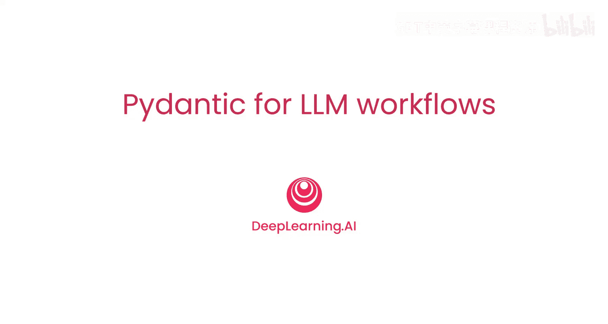

# 007：6.课程总结 🎉

在本课程中，我们学习了如何使用Pydantic为基于大语言模型（LLM）的应用程序带来结构、可靠性和数据验证能力。

## 课程回顾

上一节我们探讨了Pydantic在复杂工作流中的应用，本节我们将对整个课程内容进行总结。

恭喜你完成了本课程。你已学会如何使用Pydantic为你所有基于LLM的应用程序带来结构、可靠性和验证功能。

不仅如此，你还掌握了一些核心的数据验证技能。这些技能在你构建的任何需要将数据从一个组件传递到另一个组件的软件系统中都很有帮助。

通过本课程的学习，你已经打下了一个非常坚实的基础。

## 后续学习建议

话虽如此，Pydantic的功能远不止我们在本课程中涵盖的这些。

因此，希望你继续学习并提升你的技能。

我期待看到你构建出的作品。😊

## 总结

本节课中我们一起学习了Pydantic的核心概念及其在LLM工作流中的关键作用。我们了解了如何通过定义数据模型来确保数据的结构和类型安全，并掌握了数据验证的基本方法。这些知识为你构建更健壮、可靠的应用程序提供了重要支持。