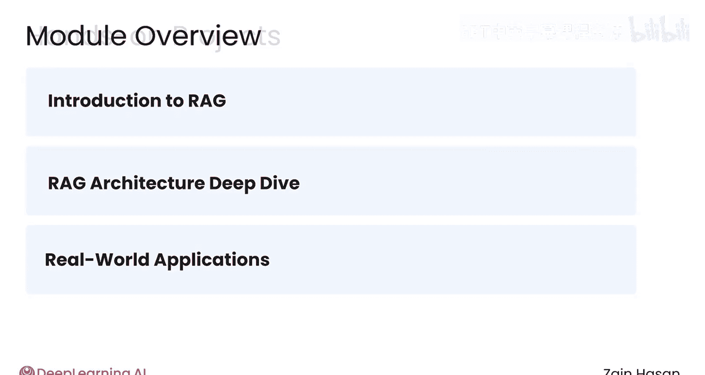
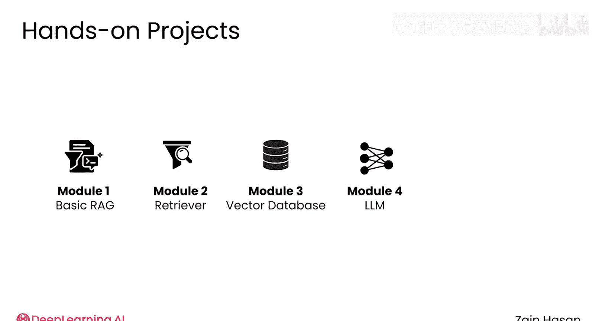

# 002：简介

在本节课中，我们将要学习检索增强生成（RAG）的基础概念，了解RAG系统的主要组成部分，并开始构建一个功能性的RAG系统。

## 模块概览 🗺️

如果你想构建一个强大的RAG系统，你需要从一个蓝图开始。在本模块中，你将学习RAG的基础概念，熟悉RAG系统的主要组件，并开始构建一个功能性的RAG系统。

以下是本模块的学习路线：

首先，你将获得关于RAG的高层次介绍，包括它是什么、为什么需要使用它，以及它如何提升大语言模型生成回答的质量。

接下来，你将更深入地了解RAG系统的架构。RAG将一个大语言模型与一个检索器配对，这个检索器可以帮助大语言模型查找相关信息，并连接到一个包含可信信息的知识库。

你将深入研究每个组件，然后了解它们如何协同工作。

RAG在多种场景下都非常有用，因此你将看到几个生产级RAG系统的示例，并开始思考如何在你自己的基于大语言模型的项目中应用RAG。

在整个模块中，你将动手实践示例代码。在模块结束时，你将完成你的第一个编程作业，实现一个简单RAG系统的部分功能。

在课程后续部分，你将在这个初始系统的基础上进行扩展，添加更复杂的功能，例如一个健壮的检索器、一个向量数据库、更复杂的大语言模型使用方式，以及多种监控和评估技术。

本模块包含许多令人兴奋的主题，它为你在整个课程中的学习设定了路线图。

让我们在下一个视频中开始学习。