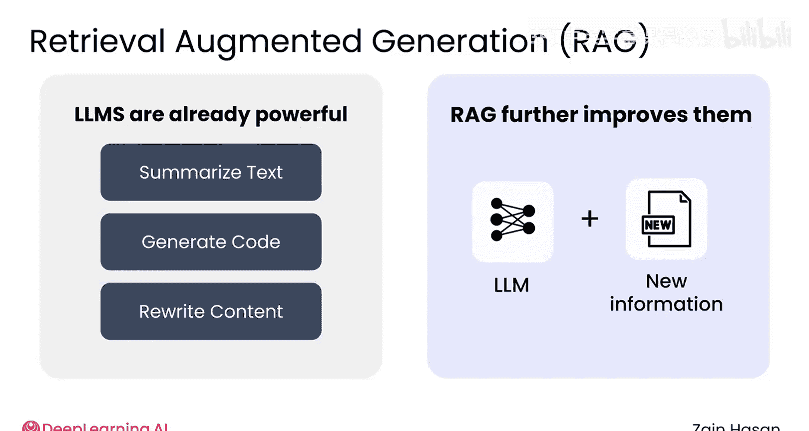
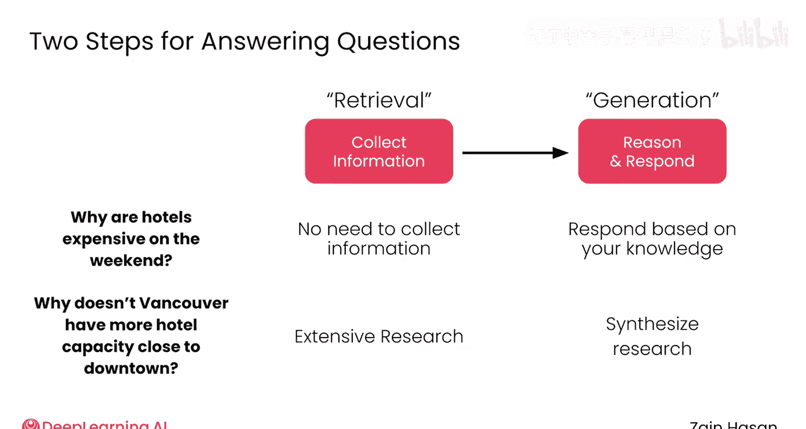
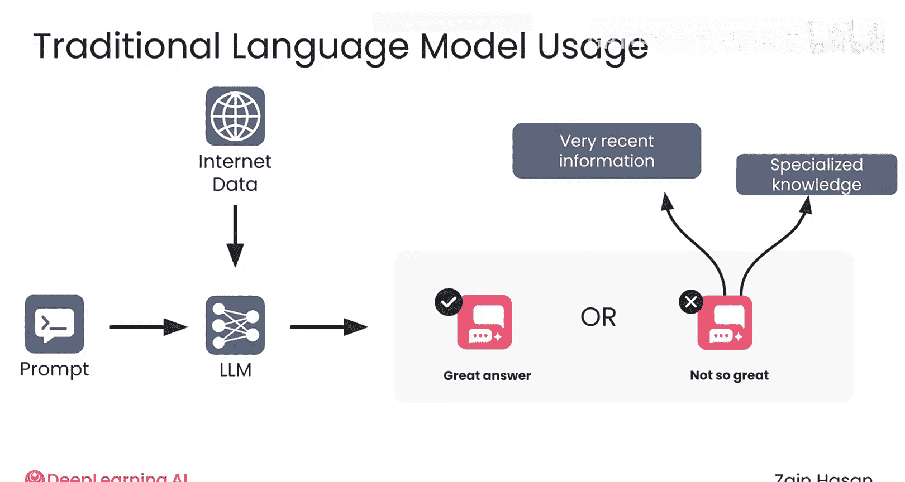
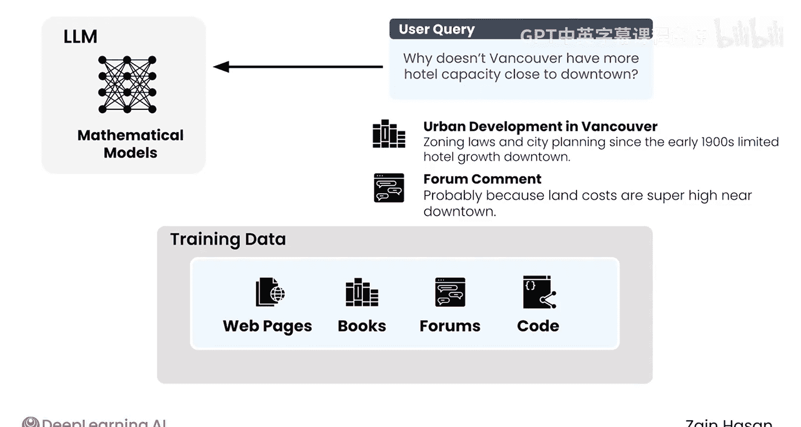
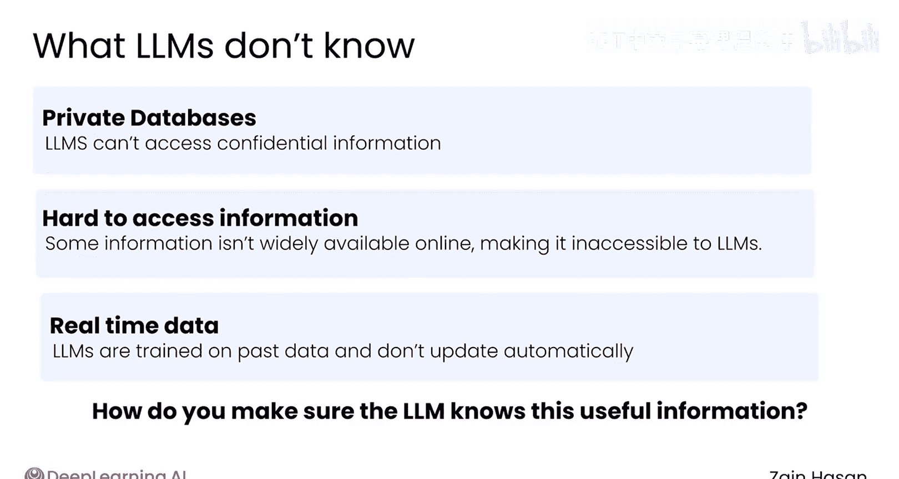
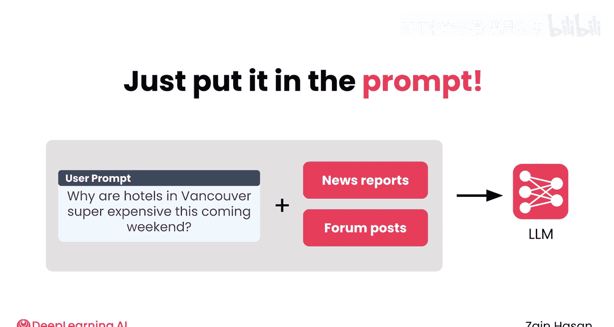
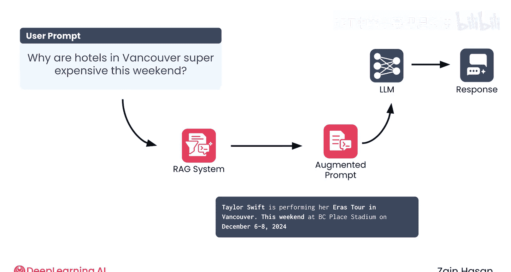
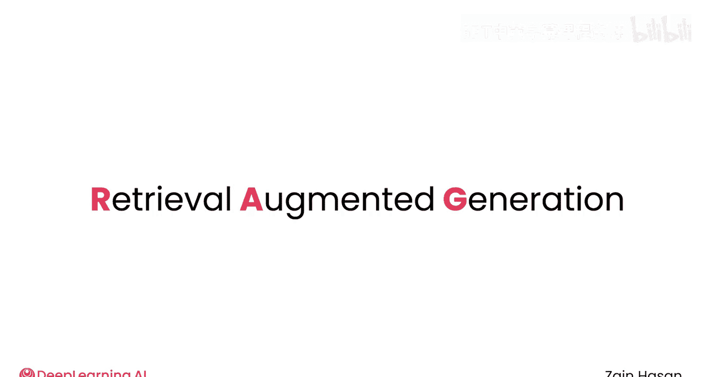

# 003：检索增强生成技术导论

## 概述

在本节课中，我们将要学习**检索增强生成 (RAG)** 的核心概念。这是一种通过为大型语言模型提供其训练数据之外的信息，来显著提升其性能的方法。我们将从人类处理问题的类比入手，逐步理解RAG的工作原理、必要性及其基本流程。

---

## 从人类思考到机器推理 🧠

人类是出色的思考工具。我们可以回答问题、总结和重写文本、对文档提供反馈、生成代码以及完成许多其他任务。就在几年前，这些任务对计算机来说似乎还遥不可及，而与一个强大的语言模型交互，感觉很像在与另一个人合作。

RAG是一种通过让大型语言模型访问其训练中未知的信息，来进一步提升其性能的方法。

为了阐明这个想法，让我们看几个例子。

假设我问你：“为什么周末酒店价格昂贵？” 你很可能可以回答这个问题。因为周末出行的人更多，所以对房间的需求竞争更激烈。

现在，假设我问你：“为什么温哥华的酒店这个周末超级贵？” 你需要更多信息才能回答这个问题。

如果你在网上搜索，你可能会发现国际巨星泰勒·斯威夫特本周末将在温哥华举办为期两晚的演唱会。有了这个额外信息，你很可能又可以回答这个问题了。

最后，假设我问你：“为什么温哥华市中心附近没有更多的酒店容量？” 要回答这个问题，你可能需要对温哥华的发展历史、城市规划等进行深入研究。换句话说，你需要访问大量专业信息。

你可以将你回答这些问题的方式视为两个阶段。首先，你收集任何必要的信息；然后，你基于这些信息进行推理，形成你的回答。

正如你在第一个问题中看到的，有时你不需要收集任何信息，基于你对世界的了解，你可以立即回答。然而，其他时候，你可能需要收集一点甚至很多信息。

在RAG中，收集有用信息的过程被称为**检索**。而基于这些信息进行推理和回答的过程被称为**生成**。

---

## 大型语言模型为何需要检索？🤖

大型语言模型从检索阶段中受益，原因基本上与你相同。在本课程中，你将了解更多关于LLM的知识。但现在，你可以把它们想象成一个通过阅读互联网上海量信息而拥有广泛常识的人。

当你向LLM提问时，它依赖这些知识来生成回答。对于许多提示，这很有效。但在其他情况下，LLM并不知道准确回答所需的信息。提示可能涉及非常近期的事件，或者它以前从未见过的某些专业信息。正如对你而言一样，期望LLM成为每个主题的专家是不合理的，而当它们能够访问更好的信息时，它们能提供更好的回答。

认识到LLM也能从检索阶段中受益，这就是RAG的核心思想。当然，LLM不是那些花大量时间在维基百科上的人；相反，它们是在从整个开放互联网获取的海量数据集上训练出来的数学模型。

在训练过程中，模型学习训练数据中包含的任何信息。当你向LLM发送提示时，你希望与你的问题相关的信息被包含在训练数据中。不幸的是，很多信息不会被包含在内。公司拥有私有数据库，有些信息是隐藏的或难以访问的，并且新闻每天都在每分钟发布。

总会有一些LLM未训练过的信息存在。那么问题来了：你如何确保LLM知道这些有用的信息？

---

## RAG的核心机制：增强提示 ✨

简单的答案是：直接把它放进提示里。RAG系统的关键思想是，你可以在将提示发送给大型语言模型之前修改它。除了用户的原始问题，你还可以添加有助于LLM回答的信息。

如果你问一个RAG系统：“为什么温哥华的酒店这个周末超级贵？”，它会首先执行一个**检索步骤**来收集相关信息。然后，语言模型会收到一个**增强的提示**，其中既包含原始问题，也包含任何检索到的信息。现在，LLM拥有了准确回答所需的信息。

当然，这些信息需要从某个地方检索出来。RAG系统中处理这个过程的组件被称为**检索器**。检索器管理着一个由可信、相关且可能是私有的信息组成的知识库。

当RAG系统收到一个提示时，检索器会从知识库中找到并检索出最相关的信息，与LLM共享。然后，模型在回答提示时使用这些检索到的信息。

“检索增强生成”这个名字，虽然有点拗口，但现在希望你能更好地理解了。你所做的，就是通过首先从知识库中检索相关信息，来改进或增强LLM生成文本的方式。

---

## 总结与展望 📚

本节课中，我们一起学习了**检索增强生成 (RAG)** 的基本原理。我们了解到，RAG通过引入一个**检索**阶段，为大型语言模型提供其训练数据之外的最新或专业知识，从而**增强**其**生成**能力，使其回答更准确、更可靠。其核心流程是：用户提问 -> 检索器从知识库查找相关信息 -> 将原始问题与检索信息结合成增强提示 -> LLM基于增强提示生成最终回答。

这是一个关于RAG如何工作的高层次描述，但有时看一些应用实例会更有帮助。因此，在下一个视频中，我将介绍一些RAG已经在实际中应用的方式。