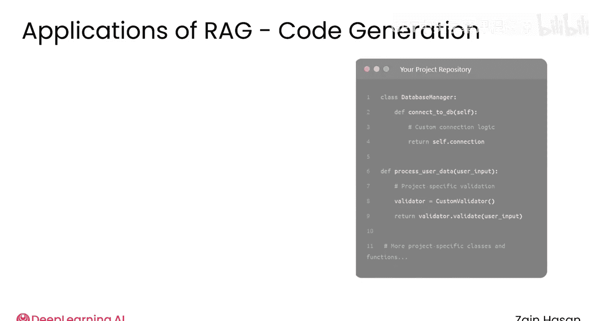
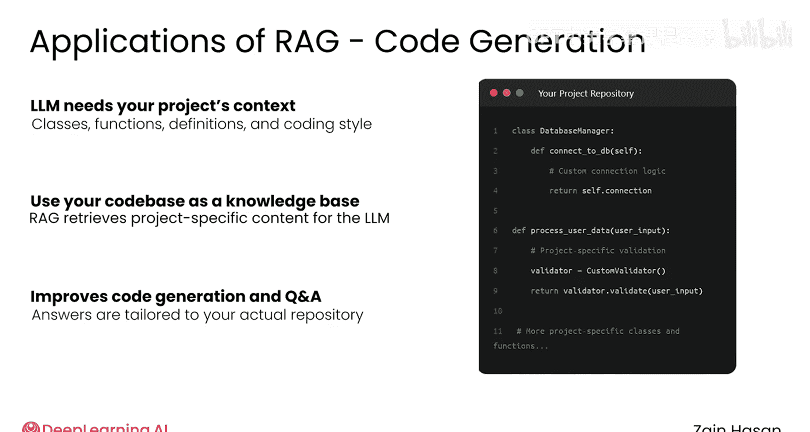
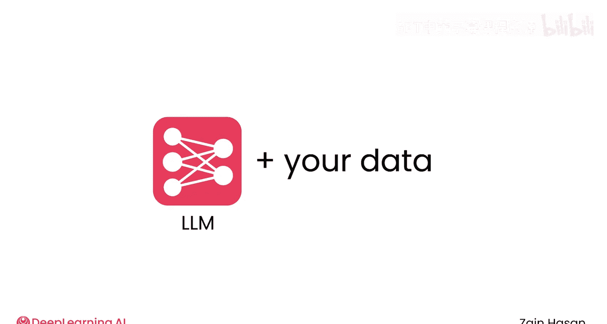

# 004：RAG的实际应用 🚀

在本节课中，我们将要学习检索增强生成（RAG）模型在现实世界中的多种应用场景。你将看到，通过将大型语言模型（LLM）与特定知识库结合，RAG能够解决许多传统LLM难以处理的问题。

正如我们所见，RAG的核心思想是将一个现成的大型语言模型（LLM）与一个知识库配对，这个知识库包含了模型在训练时可能无法获取的信息。

许多基于LLM的系统都实现了这种模式，现在让我们来探索其中的几个应用。

## 代码生成 💻

RAG的一个重要应用是代码生成。

这一点非常重要，因为虽然语言模型已经在大量代码上进行了训练（理论上包括每一个公共Git仓库），但要为特定项目生成正确的代码，需要专业化的信息。

LLM需要知道项目中的类、函数和定义，以及项目所使用的整体编码风格。构建一个以你自己的代码库作为知识库的RAG系统，可以让LLM获取这些信息。

通过从你的代码仓库中检索相关的类、定义和文件，LLM能够更好地生成代码或回答与你的项目相关的问题。

## 企业定制化聊天机器人 🏢

另一个主要应用是为单个公司定制聊天机器人。每家公司都有自己的产品、政策和沟通准则。

将这些企业文档视为知识库，可以让你以多种有用的方式部署LLM。

以下是两种典型的应用方式：

*   你可以构建一个客户服务聊天机器人，它了解你公司的产品信息、当前库存或常见的故障排除步骤。
*   你可以部署一个内部聊天机器人，它能准确回答关于公司政策的问题，或将你引导至有用的文档。

在这两种情况下，知识库都有助于将LLM的回应建立在公司特定的产品或政策基础上，并有助于减少LLM生成通用或误导性回应的情况。

## 医疗与法律领域 ⚖️

RAG在医疗和法律领域有重要应用。

在这些情况下，知识库可能包含特定案件的法律文件、最近发表的医学期刊文本等等。

在这些领域中，精确性至关重要，且存在大量专业且可能私密的信息，基于RAG的方法可能是部署一个足够准确并能使用私有信息的LLM产品的唯一途径。

## AI辅助网络搜索 🔍

另一个主要应用是AI辅助网络搜索。历史上，搜索引擎的工作方式类似于检索器。给定一个搜索查询，它们返回相关的网站。

如今，搜索引擎会提供这些搜索结果的AI摘要，以便以可快速浏览的方式呈现最有用的信息。

这些AI网络摘要基本上就是一个RAG系统，其知识库是整个互联网。

## 个性化助手 📱

虽然大规模的RAG系统功能强大，但高度个性化的系统也同样如此。

现在，在你的短信、电子邮件客户端、文字处理器、日历等应用中的个性化助手，能够帮助你发送消息、安排日程、起草文档以及完成大大小小的项目。

在每种情况下，LLM对你正在进行的项目了解得越多，它们就越能更好地支持这项工作。

在这些情况下，知识库可能相对较小，例如你的短信、联系人列表、电子邮件或一个文档文件夹。这类文档充满了重要的上下文信息，因此一个能够访问小规模个人信息的RAG系统，可以以一种与你正在做的事情高度相关的方式完成任务。

## 总结 📝

正如你所看到的，RAG模型在各种各样的情境中都具有适用性。许多公司、组织，甚至是你自己，都拥有可以用来提高LLM生成文本质量的信息集合。

每当你拥有可能未被用于训练大型语言模型的信息时，就存在构建一个有用的RAG应用的潜力。它们甚至可能让LLM在原本不可能使用的场景中得到应用。

随着你继续学习本课程，希望你能开始在你的工作和生活中发现RAG方法可能派上用场的机会。

现在，请和我一起进入下一个视频，让我们更深入地探讨RAG系统的架构。