# 005：RAG架构概览 🏗️

在本节课中，我们将要学习检索增强生成（RAG）系统的整体架构。我们将了解其核心组件如何协同工作，将一个简单的用户查询转化为一个包含外部知识的、更准确的回答。

## 标准LLM使用流程

首先，我们来看看通常如何使用一个大语言模型（LLM）。你输入一个提示（prompt）并发送给LLM。LLM处理这个提示并生成一个回复。RAG系统的用户体验与此完全相同：你提交一个提示，然后得到一个回复。

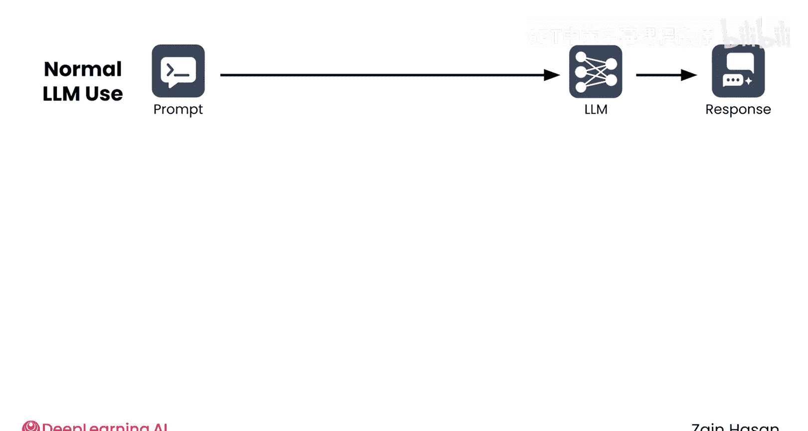


## RAG系统内部流程

然而，在系统内部，RAG包含了更多的步骤。当RAG系统收到你的提示时，它首先会将其路由到**检索器（retriever）**。检索器可以访问**知识库（knowledge base）**，这实际上就是一个包含有用文档的数据库。

检索器查询数据库，返回它认为与提示最相关的文档。

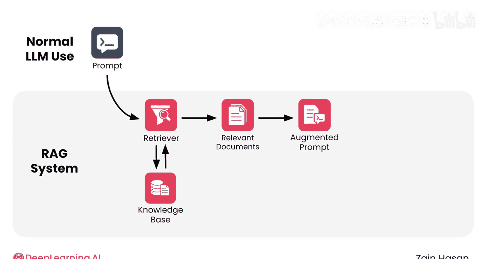

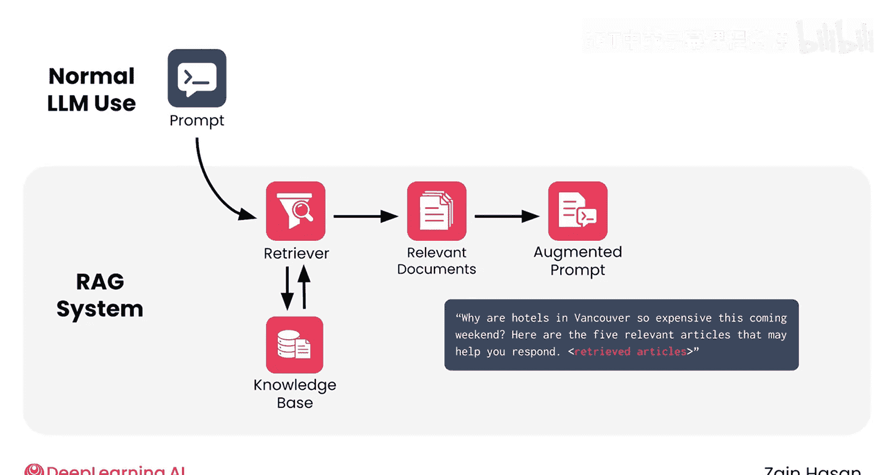

接下来，系统会创建一个**增强提示（augmented prompt）**，将相关文档中的信息整合到原始提示中。例如，一个增强提示可能是：“请回答以下问题：‘为什么温哥华的酒店这个周末这么贵？’以下是五篇可能帮助你回答的相关文章。”然后插入文章中的文本。


此时，系统的运作方式就和其他LLM一样了：增强提示被发送给LLM，LLM生成回复。LLM能够基于其训练数据中学到的知识，以及检索到的文档提供的额外上下文来做出回应。

用户体验始终如一（可能增加了一点延迟）：你输入提示，然后得到回复。然而，由于经过了检索器的辅助路径，回答的准确性、时效性和上下文相关性都更高了。

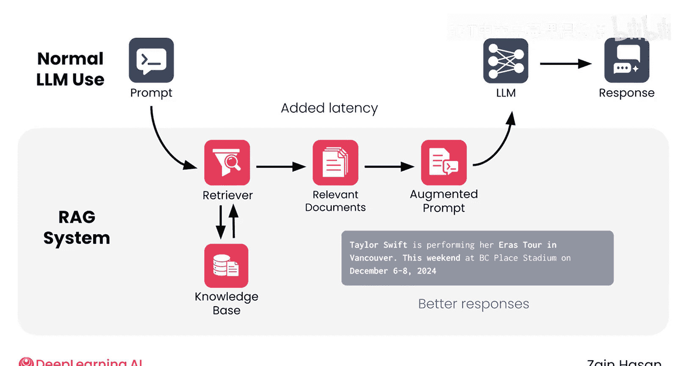


## RAG的优势

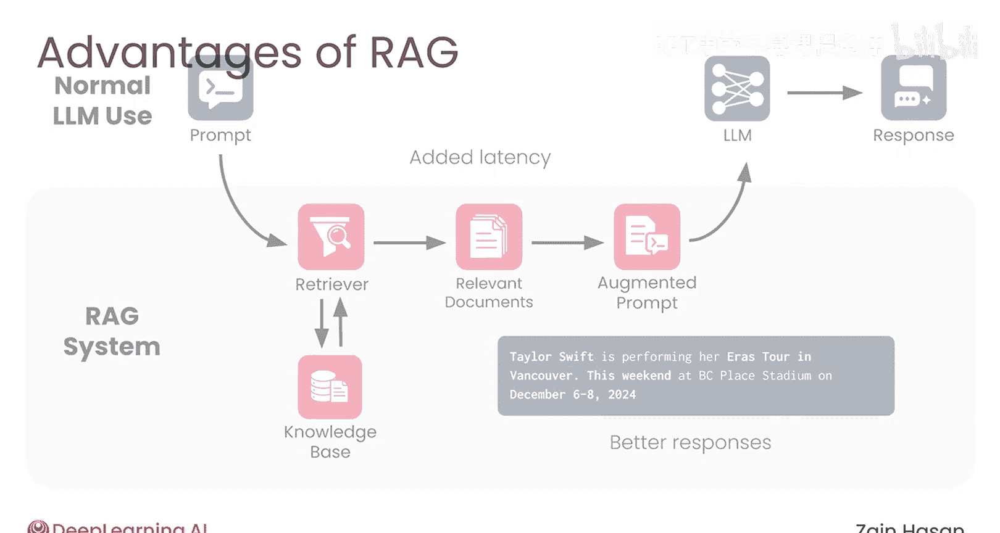

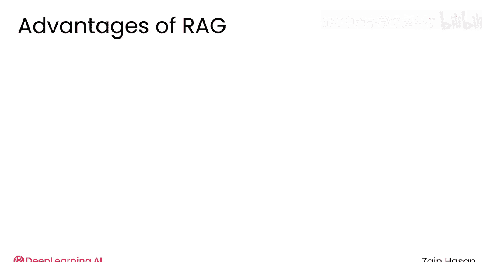

正如我们所见，直接使用LLM与使用RAG系统的主要区别在于增加了检索器。然而，这个相当直接的添加带来了许多优势。


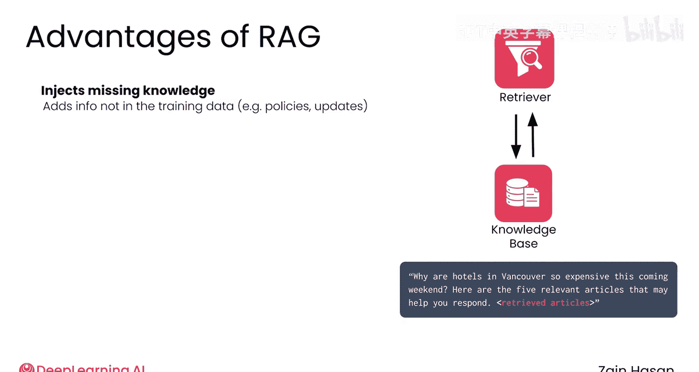

以下是RAG系统的主要优势：

*   **提供外部信息**：最重要的是，它能让LLM访问到原本无法获取的信息。无论是公司政策、个人信息还是今早的头条新闻，RAG通常是让LLM获取某些类型信息的唯一途径。
    

*   **减少幻觉**：与第一点相关，RAG减少了产生幻觉或误导性回答的可能性。这些问题通常是由于LLM对其训练数据中未包含或很少提及的主题生成回答所导致的。在提示中直接添加相关信息，可以**锚定（ground）** 语言模型的回答，使其不太可能产生通用或误导性的文本。
    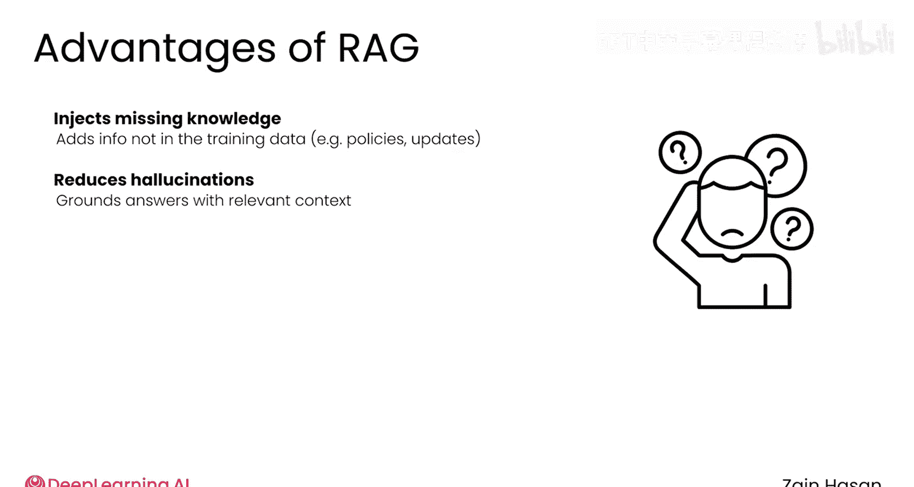


*   **易于更新信息**：RAG让LLM更容易跟上快速变化的信息。重新训练一个语言模型通常成本高昂且耗时，因此LLM难以跟上非常新的信息。然而，在RAG系统中，你可以像更新任何其他数据库中的条目一样，简单地更新知识库中的信息。一旦这些变更被索引，你的LLM就能基于新信息进行回应。
    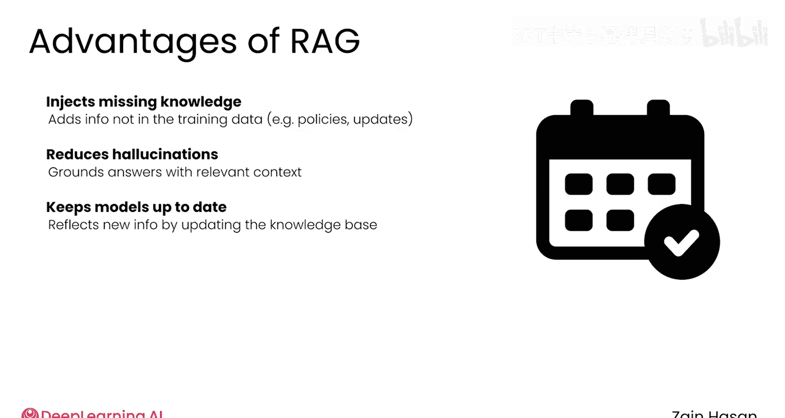

*   **改进引用能力**：RAG提高了LLM引用来源的能力。RAG系统可以将引用信息添加到增强提示中，然后LLM就可以在其最终回答中包含这些信息。这不仅锚定了回答，还使人类读者能够深入挖掘并验证生成的文本。
    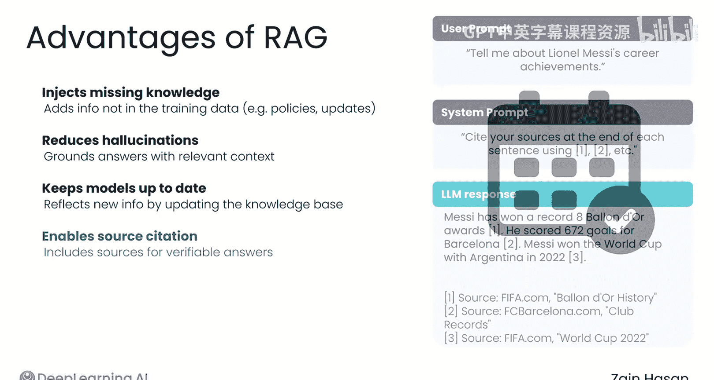

*   **专注文本生成**：最后，RAG允许LLM专注于文本生成。检索器从海量信息中筛选，找到最重要和最相关的内容，并简洁地呈现出来。LLM仍然需要写出一个好的回答，但它不再需要承担事实查找或筛选的步骤。换句话说，每个组件都被分配去完成其最擅长的领域。
    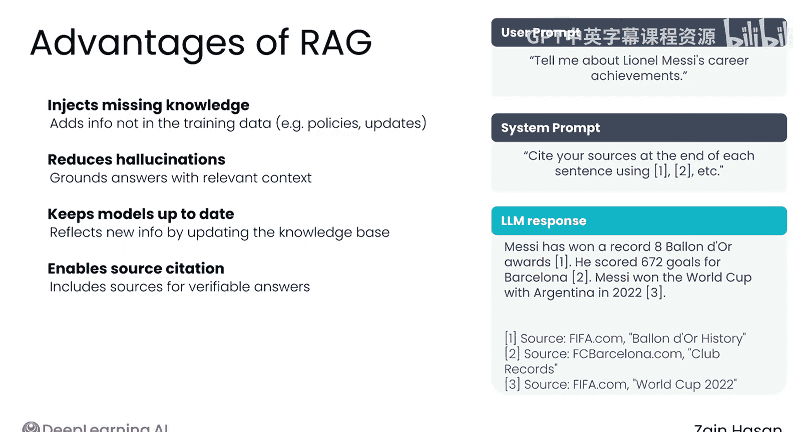
    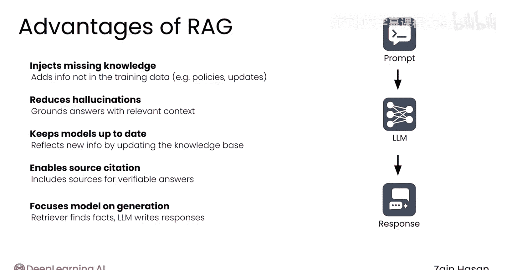


## 代码示例演示


在本课程结束时，你将深入学习如何从头构建RAG系统。但这里有一个非常简单的代码演示，展示了RAG的工作原理，其中大部分细节已被抽象化。

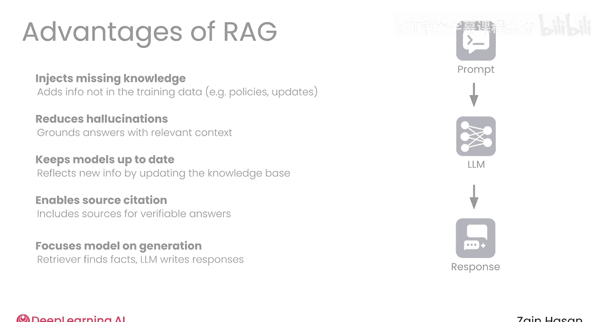


假设我们有一个`retrieve`函数和一个`generate`函数。`retrieve`函数是检索器的封装，它接受一个文本查询并从知识库返回相关文档。`generate`函数是LLM的封装，它接受一个文本提示并返回LLM的回复。

以下是核心流程的伪代码演示：


```python
# 1. 用户原始提问
prompt = “为什么温哥华的酒店这个周末这么贵？”


# 2. 直接询问LLM（无RAG）
direct_response = generate(prompt)
print(“直接LLM回答：”, direct_response) # 可能不准确或过时

# 3. 使用检索器获取相关信息
retrieved_docs = retrieve(prompt)

# 4. 构建增强提示
augmented_prompt = f”””
请回答以下问题：{prompt}
请使用以下检索到的信息来帮助你回答：
{retrieved_docs}
“””

# 5. 将增强提示发送给LLM
rag_response = generate(augmented_prompt)
print(“RAG回答：”, rag_response) # 更准确，基于最新信息
```

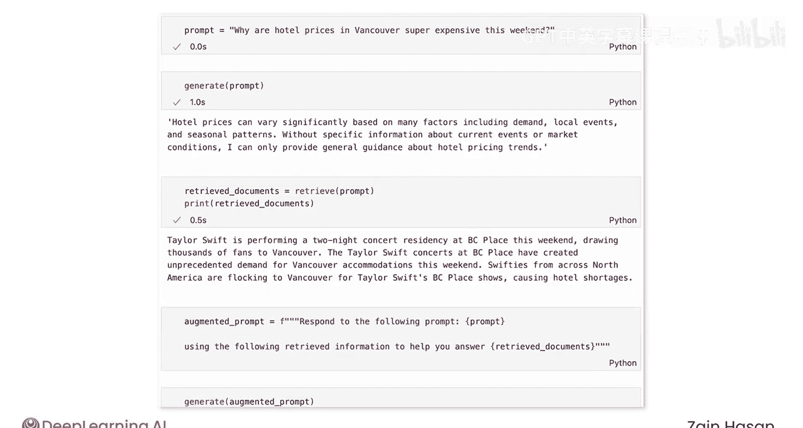

现在，LLM能够整合从知识库检索到的信息，对问题提供准确的回答。RAG的本质就是**向你的提示中添加额外的上下文，以帮助LLM更准确地回应**。


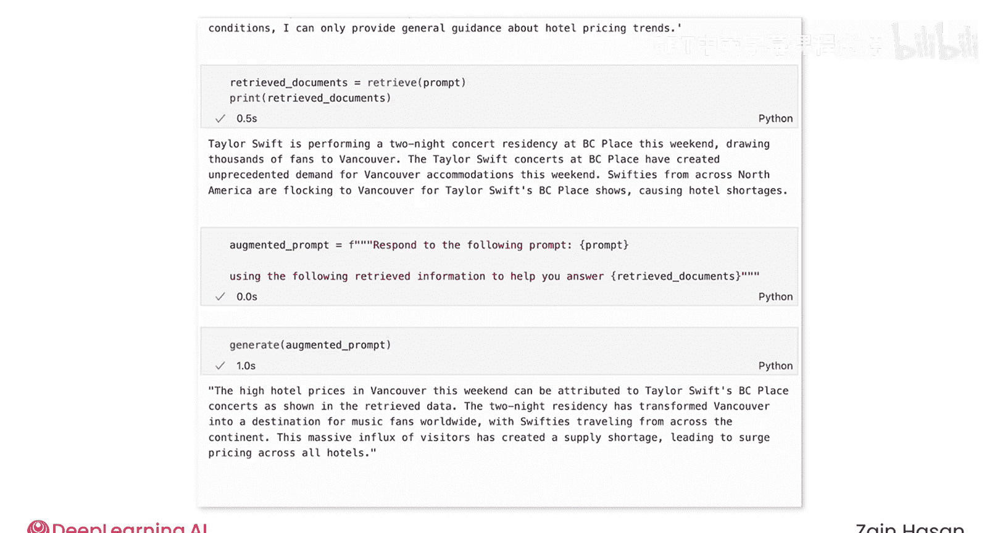

## 总结


本节课中，我们一起学习了RAG架构的概览。我们了解到，RAG通过在用户提示和LLM之间插入一个检索步骤，利用外部知识库来增强LLM的回答能力。这带来了提供外部信息、减少幻觉、易于更新、改进引用和让LLM专注生成等关键优势。RAG的核心思想可以概括为：`最终回答 = LLM(用户问题 + 检索到的相关文档)`。

这无疑是对RAG架构一个非常高层次的概述。在下一个视频中，我们将开始更详细地研究每个组件。