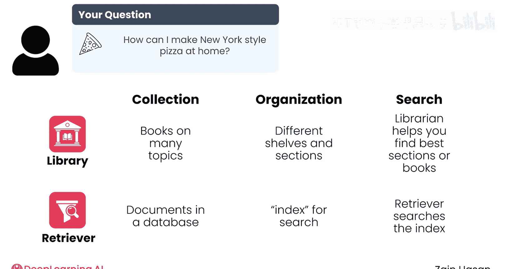
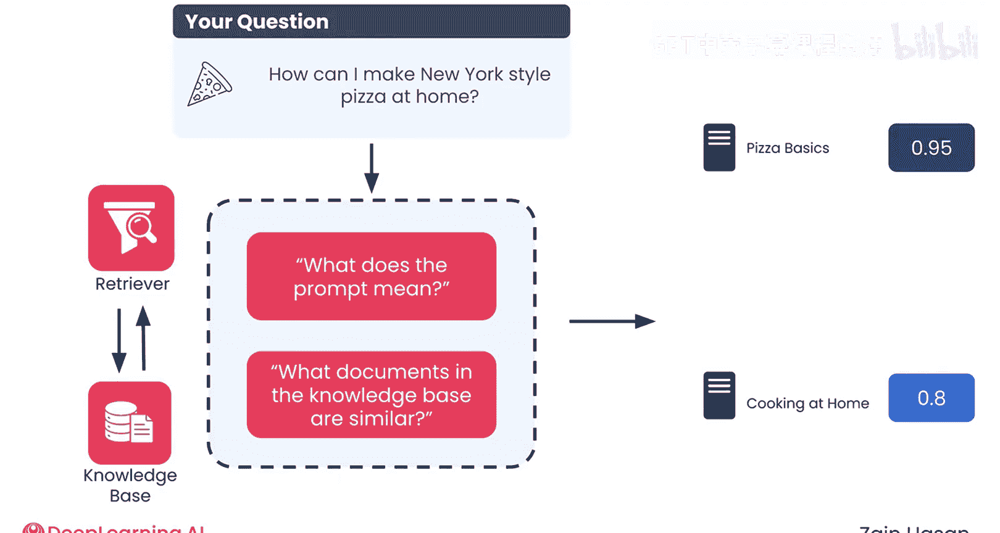
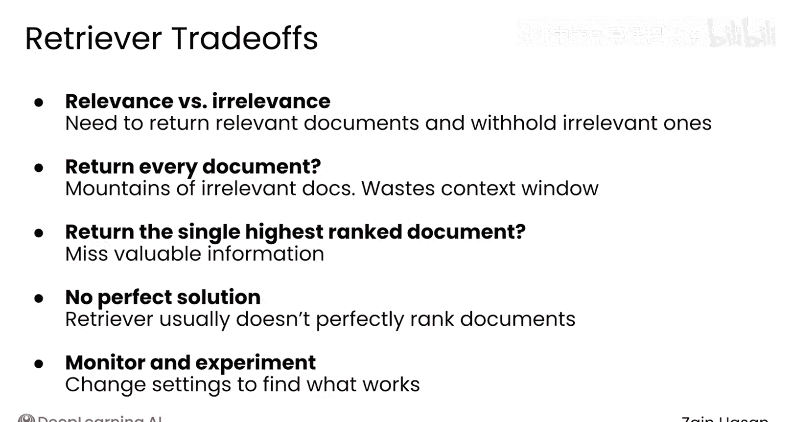
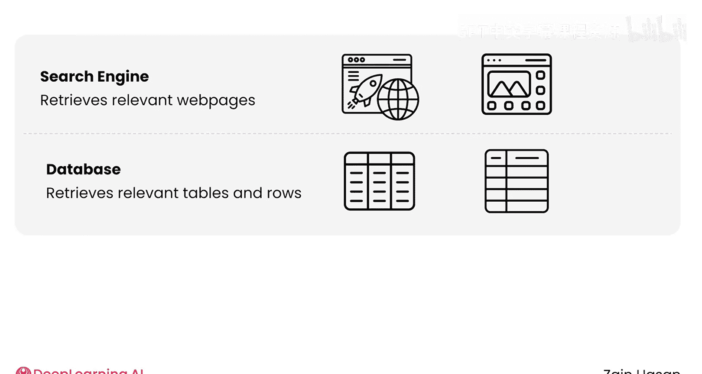
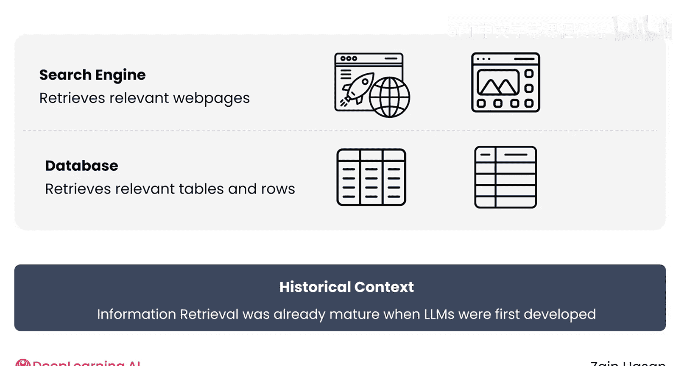
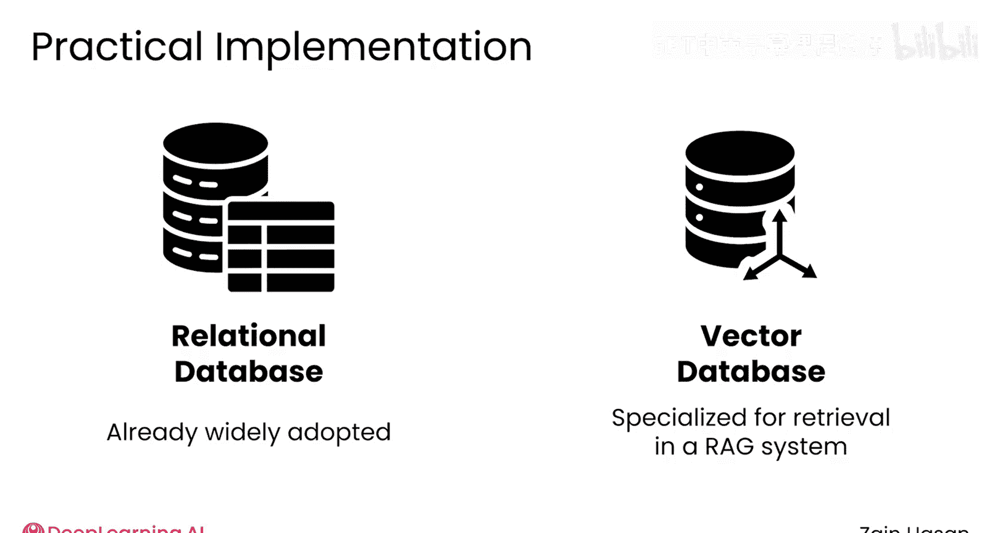

# 007：信息检索技术导论 📚

在本节课中，我们将要学习检索增强生成 (RAG) 系统中**检索器**的核心工作原理。我们将通过一个图书馆的比喻来理解其各个组件，并探讨检索器如何从知识库中找到最相关的信息提供给大语言模型。

## 检索器的目的与类比

上一节我们介绍了RAG系统的整体架构，本节中我们来看看其中的关键组件——检索器。检索器的目的很明确：它需要向大语言模型提供在模型训练时可能无法获取的有用信息。

现在，让我们通过一个类比来理解检索器是如何工作的。想象一下，你为了回答“如何在家制作纽约风格披萨？”这个问题而去图书馆查找资料。

这个图书馆拥有一个包含许多主题书籍的大型馆藏。为了帮助你浏览，书籍会根据其主题、体裁、作者等特征被分类整理在不同的区域和书架上。如果你向图书管理员提出你的问题，他们可以帮助你找到图书馆中最相关的区域，甚至是具体的书籍。

## 检索器的核心组件

检索器包含许多类似的组件。图书馆有馆藏书籍，而检索器则拥有一个由文档组成的**知识库**。检索器会为知识库中的文档创建一个**索引**，这类似于图书馆的分类系统，用于组织文档并使其易于搜索。

接下来的步骤是实际检索相关信息。在图书馆，你可以直接询问图书管理员。图书管理员能够理解你问题的含义，并知道去查找关于烹饪、意大利菜或纽约的相关区域。这种理解问题含义的能力使他们能够确定需要搜索的正确书架，并最终找到相关的书籍。

在RAG系统中，检索器执行类似的任务。它首先需要处理用户的提示，以理解其潜在含义。



```python
# 伪代码：检索器处理提示
processed_prompt = understand_prompt(user_prompt)
```

然后，它利用这种理解去搜索文档索引。

## 文档检索与排名

检索器会从知识库中返回它认为与提示最相关的文档。在完成搜索时，检索器会根据文档与提示的相关性对它们进行排名。



每个文档都会获得一个量化的相关性**数值分数**。通常，这意味着提示文本与文档文本之间某种相似性的度量。分数最高的文档将被返回。

有多种方法可以计算这些相似性分数，你将在课程后续部分了解更多。

一个设计良好的检索器当然应该返回相关文档，但它也需要**过滤掉不相关的文档**。如果你询问如何在家制作纽约风格披萨，而检索器返回了知识库中的所有文档，从技术上讲你确实拥有了每一个相关文档，但它们会被淹没在大量无关信息的海洋中。正如之前所见，这还会导致提示成本高昂，甚至完全耗尽大语言模型的上下文窗口。

另一方面，如果只检索知识库中排名最高的文档，你可能会错过排名第二、第三或第四的文档中包含的宝贵相关信息。

在理想情况下，检索器能完美地对文档进行排名，并选择恰好正确数量的文档返回。然而在实践中，检索器有时会将某些相关文档排名过低，而将某些不相关文档排名过高，这使得难以自信地决定返回多少文档。

为了优化检索器的性能，你需要长期监控它，并尝试不同的设置，这在本课程中你会广泛接触到。



## 相关技术与实现基础

值得注意的是，许多我们熟悉的软件都执行着与检索器非常相似的任务。**网络搜索引擎**检索与网络搜索相关的网页，而**关系型数据库**则检索与SQL查询匹配的行和表。



当大语言模型首次被开发时，**信息检索**这一更广泛的领域已经相当成熟。该领域的理念构成了检索器和RAG系统设计方式的基础。



理论上，在RAG系统中有很多方法可以实现检索器。由于大多数公司已经将数据存储在传统的关系型数据库中，如果能将数据保留在那里，并找到一种从该数据库检索信息来驱动RAG系统的方法，那将非常理想。

然而，在大规模应用中，虽然并非严格必需，但大多数检索器都将构建在**向量数据库**之上。这是一种专门类型的数据库，针对快速查找知识库中与提示最匹配的文档进行了优化。

在本课程中，你将学习支撑多种搜索技术的信息检索通用原理，以及通常在生产级RAG系统中用作检索器的向量数据库。

关于检索器还有很多需要学习的内容，但目前我们已经涵盖了最重要的几点。在下一节视频中，我们将一起总结本模块的内容。



## 总结

本节课中我们一起学习了RAG系统中检索器的核心机制。我们通过图书馆的比喻理解了其知识库、索引和检索过程，知道了检索器如何通过计算相似性分数来对文档进行排名和筛选。我们还了解到信息检索领域的成熟理念是RAG的基础，并且在实际应用中，向量数据库常被用作高效的检索器实现。理解这些原理是构建有效RAG系统的关键一步。